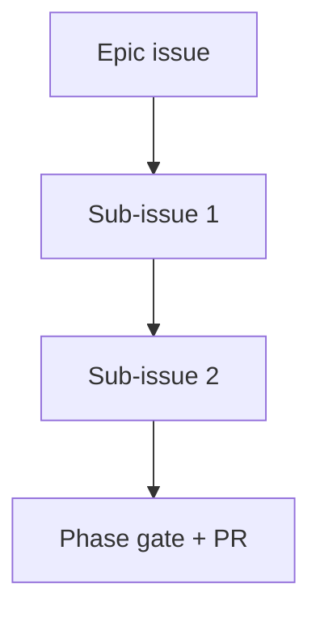
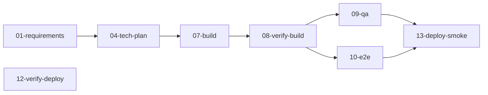

<!-- TEMPLATE: roadmap.md -->
<!-- Instructions: Replace all [bracketed placeholders] with project-specific content. -->
<!-- Remove this comment block before finalizing. -->

# Roadmap

> **Project**: [Project Name]
> **Repository**: [Repository URL]
> **Last updated**: [Date]

## Vision

[One-paragraph statement describing the long-term direction of this project. What does success
look like? What impact will the software have when fully realized?]

## Current State

[Brief assessment of where the project stands today. What works, what's incomplete, what's
experimental.]

| Area | Status | Notes |
|------|--------|-------|
| Core pipeline | [Working / Partial / Planned] | [Source: Repo or Paper] |
| Documentation | [Working / Partial / Planned] | |
| Testing | [Working / Partial / Planned] | |
| Packaging / Distribution | [Working / Partial / Planned] | |

## Phases

### Phase 1: [Name] — [Target date or milestone]

**Goal**: [What this phase achieves]

- [ ] [Deliverable 1]
- [ ] [Deliverable 2]
- [ ] [Deliverable 3]

**Success criteria**: [How to know this phase is complete]

### Phase 2: [Name] — [Target date or milestone]

**Goal**: [What this phase achieves]

- [ ] [Deliverable 1]
- [ ] [Deliverable 2]
- [ ] [Deliverable 3]

**Success criteria**: [How to know this phase is complete]

### Phase 3: [Name] — [Target date or milestone]

**Goal**: [What this phase achieves]

- [ ] [Deliverable 1]
- [ ] [Deliverable 2]
- [ ] [Deliverable 3]

**Success criteria**: [How to know this phase is complete]

## Non-Goals

Things explicitly out of scope for the foreseeable future:

- [Non-goal 1 — why it's excluded]
- [Non-goal 2 — why it's excluded]

## Dependencies & Blockers

| Dependency | Type | Status | Impact |
|------------|------|--------|--------|
| [External tool / data / approval] | Hard / Soft | [Status] | Blocks Phase [N] |

## Open Questions

Unresolved decisions that affect the roadmap:

1. [Question 1] — affects [which phase/deliverable]
2. [Question 2] — affects [which phase/deliverable]

## GitHub issue decomposition

Map milestones or workstreams to trackable issues for the project board
([project-board.md](../../../docs/project-board.md)).

| Issue ID | Title | Labels | Tasks | Depends on | Status |
|----------|-------|--------|-------|------------|--------|
| GH-[session]-0 | `[EV-NNN] Epic — [session slug]` | `evolve`, … | Phase gate | — | pending |
| GH-[session]-1 | `[EV-NNN][Fn] M[N] — [milestone name]` | … | T[N].1–T[N].n | GH-[session]-0 | pending |

Each sub-issue body should cite: feature ID, user journeys (UJ-*), test cases (TC-*), apps touched,
spec/ADR links, and definition of done.

## Dependency diagrams

### Milestone build order

### GitHub issue dependencies

### Session pipeline stages (if applicable)

## References

- [Paper §X — relevant section]
- [Repo: relevant file or directory]
- [execution-plan.md](../../../docs/execution-plan.md) — task IDs and Depends On column
