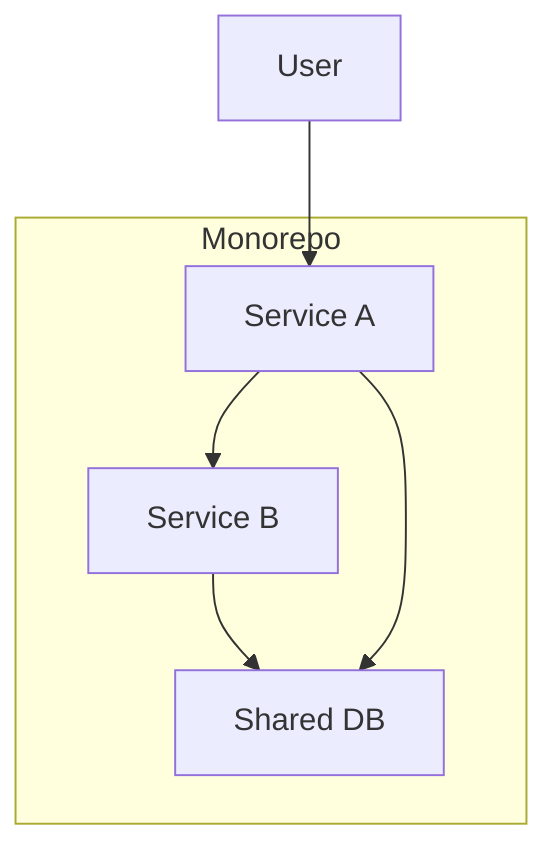
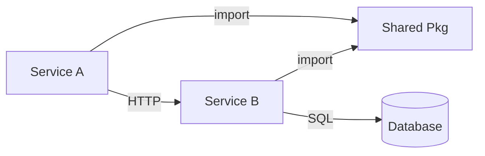
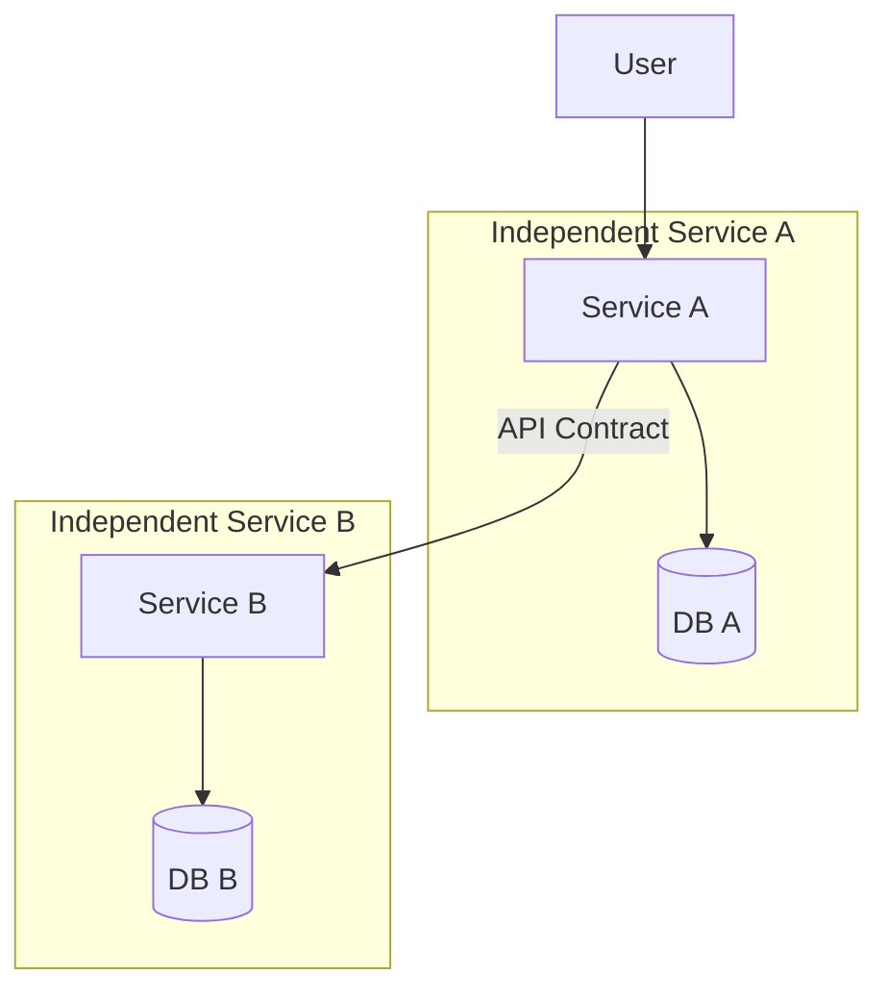

# Output Templates

Templates for each document in `specs/monorepo-decomposition/`.

## 01-executive-summary.md

```markdown
# Monorepo Decomposition: Executive Summary

> Auto-generated: YYYY-MM-DD

## Context

[One paragraph: what this monorepo is, who it serves, why decomposition is being considered.]

## Key Findings

| Finding | Impact | Evidence |
|---------|--------|----------|
| [Finding 1] | [High/Medium/Low] | [File paths or metrics] |

## Current State Snapshot

| Metric | Value |
|--------|-------|
| Total services/apps | N |
| Shared packages | N |
| Cross-service imports | N |
| Shared database tables | N |
| Tightly coupled pairs | N |

## Recommendation

[One paragraph: the recommended decomposition strategy and sequencing.]

## Proposed Extraction Order

| Priority | Service | Effort | Risk | Rationale |
|----------|---------|--------|------|-----------|
| 1 | [name] | S/M/L/XL | Low/Med/High | [one line] |
```

## 02-app-inventory.md

```markdown
# App Inventory

> Auto-generated: YYYY-MM-DD

## Services

| # | Name | Purpose | Stack | Deploy Target | Owner | Criticality | Path |
|---|------|---------|-------|---------------|-------|-------------|------|
| 1 | [name] | [one sentence] | [lang/framework] | [Render/Modal/etc] | [team] | Tier N | [repo path] |

## Service Detail: [Name]

**Purpose**: [paragraph]

**Users**: [who uses it]

**Entry points**:
- [file path]: [what it does]

**Key dependencies**:
- Internal: [services it calls]
- External: [third-party APIs]
- Shared packages: [packages/ imports]

(Repeat for each service)
```

## 03-service-profiles.md

```markdown
# Service Profiles

> Auto-generated: YYYY-MM-DD

## [Service Name]

### Overview

| Attribute | Value |
|-----------|-------|
| Path | `[repo path]` |
| Language | [lang] |
| Framework | [framework] |
| Deploy target | [platform] |
| Entry point | `[file]` |
| Lines of code | ~N |
| Direct dependencies (internal) | N services |
| Direct dependencies (external) | N packages |

### Responsibilities

1. [responsibility]

### Internal Structure

```
[tree of key directories/files]
```

### API Surface

| Method | Path | Auth | Called by |
|--------|------|------|----------|
| [GET/POST] | [path] | [type] | [callers] |

### Data Access

| Store | Tables/Keys | Access | Shared with |
|-------|-------------|--------|-------------|
| [Postgres/Redis/S3] | [names] | [R/W/RW] | [other services] |

### Configuration

| Env Var | Purpose | Shared |
|---------|---------|--------|
| [VAR] | [what] | [yes/no — which services] |

(Repeat for each service)
```

## 04-dependency-graph.md

```markdown
# Dependency Graph

> Auto-generated: YYYY-MM-DD

## Service-to-Service Dependencies

| From | To | Protocol | Purpose | Coupling |
|------|----|----------|---------|----------|
| [A] | [B] | [HTTP/import/DB] | [why] | [Loose/Moderate/Tight/Fused] |

## Shared Package Fan-Out

| Package | Consumed by | Purpose |
|---------|-------------|---------|
| [pkg] | [services] | [what] |

## Cross-Service Import Count

| Service | Imports from other services | Imported by other services |
|---------|---------------------------|---------------------------|
| [name] | N | N |

See [diagrams/dependency-graph.md](diagrams/dependency-graph.md) for visual.
```

## 05-data-ownership.md

```markdown
# Data Ownership

> Auto-generated: YYYY-MM-DD

## Databases

| Database | Type | Services Connected | Shared |
|----------|------|-------------------|--------|
| [name] | [Postgres/Redis] | [list] | [yes/no] |

## Table Ownership

| Table | Owner Service | Readers | Writers | Shared Write Risk |
|-------|--------------|---------|---------|-------------------|
| [table] | [service] | [services] | [services] | [yes/no] |

## Shared State Hotspots

[Tables or keys written by multiple services — these are decomposition blockers.]

| Hotspot | Writers | Risk | Mitigation |
|---------|---------|------|------------|
| [table/key] | [services] | [description] | [approach] |

See [diagrams/data-ownership.md](diagrams/data-ownership.md) for visual.
```

## 06-coupling-analysis.md

```markdown
# Coupling Analysis

> Auto-generated: YYYY-MM-DD

## Coupling Matrix

|  | Svc A | Svc B | Svc C | ... |
|--|-------|-------|-------|-----|
| **Svc A** | — | [score] | [score] | |
| **Svc B** | [score] | — | [score] | |

Scores: None / Loose / Moderate / Tight / Fused

## Coupling Breakdown by Dimension

### Code Coupling

| Service Pair | Cross-Imports | Shared Packages | Copy-Paste Duplicates |
|-------------|---------------|-----------------|----------------------|
| [A ↔ B] | N | [list] | [files] |

### Data Coupling

| Service Pair | Shared Tables | Shared Writers | Cross-Service Queries |
|-------------|---------------|----------------|----------------------|
| [A ↔ B] | N | [tables] | [yes/no] |

### Deploy Coupling

| Service Pair | Shared Image | Shared CI | Coordinated Deploy |
|-------------|-------------|-----------|-------------------|
| [A ↔ B] | [yes/no] | [yes/no] | [yes/no] |

## Hotspot Summary

[Top 3-5 most coupled pairs with root cause and decomposition impact.]
```

## 07-decomposition-candidates.md

```markdown
# Decomposition Candidates

> Auto-generated: YYYY-MM-DD

## Ranking

| Rank | Service | Score | Effort | Risk | Status |
|------|---------|-------|--------|------|--------|
| 1 | [name] | [N/10] | [S/M/L/XL] | [Low/Med/High] | [Recommended/Possible/Blocked] |

## Candidate Detail: [Service Name]

### Why Extract

- [Business independence reason]
- [Technical reason]
- [Team reason]

### What Changes

| Change | Description | Effort |
|--------|-------------|--------|
| [Shared DB split] | [detail] | [T-shirt] |
| [API contract creation] | [detail] | [T-shirt] |

### Prerequisites

- [ ] [prerequisite 1]

### Risks

| Risk | Likelihood | Impact | Mitigation |
|------|-----------|--------|------------|
| [risk] | [H/M/L] | [H/M/L] | [approach] |

(Repeat for each candidate)
```

## 08-recommended-boundaries.md

```markdown
# Recommended Service Boundaries

> Auto-generated: YYYY-MM-DD

## Target Architecture

[Paragraph describing the proposed post-decomposition state.]

See [diagrams/proposed-architecture.md](diagrams/proposed-architecture.md) for visual.

## Boundary Definitions

### [Service Name] (independent)

| Attribute | Value |
|-----------|-------|
| Owns | [data, domain, functionality] |
| Exposes | [APIs, events, contracts] |
| Consumes | [APIs from other services] |
| Deploy independently | [yes/no] |
| Separate repo | [yes/no/monorepo subfolder] |

### [Service Name] (stays coupled with X)

| Attribute | Value |
|-----------|-------|
| Why coupled | [reason] |
| Future split criteria | [what would need to change] |

## API Contracts Between New Boundaries

| Provider | Consumer | Contract | Format |
|----------|----------|----------|--------|
| [svc] | [svc] | [endpoint/event] | [REST/gRPC/queue] |
```

## 09-migration-sequence.md

```markdown
# Migration Sequence

> Auto-generated: YYYY-MM-DD

## Extraction Order

See [diagrams/migration-sequence.md](diagrams/migration-sequence.md) for visual.

### Phase 1: [Name] — [timeline estimate]

**Extract**: [service]
**Prerequisites**: [what must be true first]
**Steps**:
1. [step]
2. [step]

**Validation**: [how to confirm success]
**Rollback**: [how to revert if needed]

(Repeat for each phase)

## Parallel vs Sequential

| Phase | Can Parallelize With | Blocked By |
|-------|---------------------|------------|
| 1 | — | — |
| 2 | Phase 1 | [dependency] |
```

## 10-shared-code-strategy.md

```markdown
# Shared Code Strategy

> Auto-generated: YYYY-MM-DD

## Current Shared Code

| Package/Module | Path | Used By | Purpose |
|---------------|------|---------|---------|
| [pkg] | [path] | [services] | [what] |

## Strategy Per Package

| Package | Decision | Rationale |
|---------|----------|-----------|
| [pkg] | [Keep shared / Duplicate / Extract to library / Inline] | [why] |

## New Shared Libraries Needed

| Library | Purpose | Consumers | Publish Strategy |
|---------|---------|-----------|-----------------|
| [name] | [what] | [services] | [npm/pypi/internal] |
```

## 11-infrastructure-impact.md

```markdown
# Infrastructure Impact

> Auto-generated: YYYY-MM-DD

## CI/CD Changes

| Current | Proposed | Impact |
|---------|----------|--------|
| [monolithic CI] | [per-service pipelines] | [description] |

## Deployment Changes

| Service | Current Deploy | Proposed Deploy | Changes Needed |
|---------|---------------|-----------------|---------------|
| [name] | [how today] | [how after] | [what changes] |

## Networking Changes

| Change | Description | Risk |
|--------|-------------|------|
| [new service mesh] | [detail] | [level] |

## Cost Impact

| Category | Current | Projected | Delta |
|----------|---------|-----------|-------|
| [compute] | [est] | [est] | [+/-] |
```

## 12-risks-and-trade-offs.md

```markdown
# Risks and Trade-offs

> Auto-generated: YYYY-MM-DD

## Risk Register

| ID | Risk | Likelihood | Impact | Mitigation | Owner |
|----|------|-----------|--------|------------|-------|
| R1 | [description] | H/M/L | H/M/L | [approach] | [who] |

## Trade-off Decisions

| Decision | Option A | Option B | Chosen | Rationale |
|----------|----------|----------|--------|-----------|
| [topic] | [option] | [option] | [which] | [why] |

## What We Are NOT Doing (and Why)

- [Decision to not split X]: [rationale]
```

## Diagram Templates

All diagrams use Mermaid syntax. Place each in `diagrams/` as its own `.md` file.

### diagrams/current-architecture.md

```markdown
# Current Architecture

> Auto-generated: YYYY-MM-DD


```

### diagrams/dependency-graph.md

```markdown
# Service Dependency Graph

> Auto-generated: YYYY-MM-DD


```

### diagrams/proposed-architecture.md

```markdown
# Proposed Architecture

> Auto-generated: YYYY-MM-DD


```
