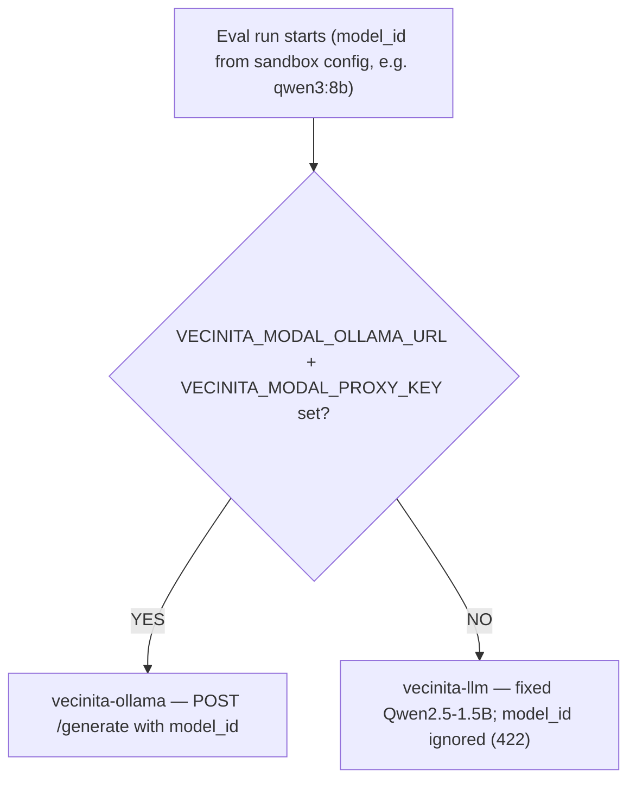

# ADR-037: Unified `vecinita-llm` Modal app (deprecate `vecinita-ollama`)

**Status:** Accepted (amended 2026-07-10 — client consolidation RD-163–RD-172 + TP-S010-17–31)  
**Stage:** 00-context + 01-requirements + 04-tech-plan (S010 / EV-011)  
**Date:** 2026-07-08  
**Supersedes in part:** ADR-009 §Ollama fallback; ADR-036 §Modal Ollama app storage

## Context

Vecinita operated **two** Modal LLM apps with split responsibilities:

| App | Engine | Role |
|-----|--------|------|
| `vecinita-llm` | vLLM | Fixed `Qwen2.5-1.5B-Instruct` for ChatRAG, ingest/retag, eval fallback |
| `vecinita-ollama` | Ollama | Arbitrary tag pull (`pull_model_job`, `stage_default_model`), playground download UI (F38), eval when `VECINITA_MODAL_OLLAMA_URL` set |

Production configured both URLs (`prod.env`). Eval routing (`eval_runtime_for_config`) preferred Ollama when the Ollama URL was set, so golden eval with `qwen3` tags hit `vecinita-ollama`, not vLLM. Operating two GPU apps increased deploy surface, secret drift risk, and cold-start debugging cost (BUG-2026-07-07, BUG-2026-07-08).

**User decision (S010):** One canonical Modal app — **`vecinita-llm`** — with vLLM as the sole inference engine. Model download/staging functions move into that app. Deprecate and de-deploy `vecinita-ollama`. Reuse the `llm-models` volume (single volume; re-stage weights). Wire all consumers to `VECINITA_MODAL_LLM_URL` only.

### Prior state (pre-ADR-037)

| App | Engine | Model | Who uses it |
|-----|--------|-------|-------------|
| `vecinita-llm` | vLLM | Fixed `Qwen2.5-1.5B-Instruct` | ChatRAG, ingest/retag, eval **fallback** |
| `vecinita-ollama` | Ollama | Any tag you pull (e.g. `qwen3:…`) | Playground download UI, eval when `VECINITA_MODAL_OLLAMA_URL` set |

**Eval routing (removed):** When `VECINITA_MODAL_OLLAMA_URL` was set, `eval_runtime_for_config()` sent sandbox `model_id` tags (e.g. `qwen3:8b`) to **`vecinita-ollama`**. Without it, eval used **`vecinita-llm`** but ignored `model_id` (fixed vLLM model). Production configured both URLs, so golden eval with qwen3 tags hit Ollama — not vLLM.

**Prior eval routing flow** (`eval_runtime_for_config` before ADR-037):

**Production impact:** With both URLs in `prod.env`, qwen3 golden eval hit **`vecinita-ollama`**
(not vLLM). BUG-2026-07-07/08 traced to CPU-only `ollama_api` with 120s function timeout and
missing `/warm` — hotfix targeted Ollama app only; **`vecinita-llm` unchanged**.

**Post-ADR-037 routing:** All eval/chat/ingest/playground traffic uses **`VECINITA_MODAL_LLM_URL`**
only; sandbox `model_id` forwarded to vLLM `/generate`; Ollama URL env deprecated (warn-only).

**Persisted pattern:** Cursor rule `.cursor/rules/unified-vecinita-llm.mdc`; standing docs reference ADR-037 for all new LLM work.

### Technical constraint (R1)

vLLM **cannot** read Ollama's internal blob store. `ollama pull` writes a proprietary layout; vLLM loads HuggingFace **safetensors** (or experimental single-file GGUF with separate HF tokenizer/config). Therefore:

- **`pull_model_job` / `stage_default_model` download HuggingFace Hub repos** (`huggingface_hub.snapshot_download`) into `llm-models`, not `ollama pull`.
- Playground **model_id tags** (e.g. `qwen2.5:1.5b-instruct`) are preserved in API/manifest; a **tag→HF repo registry** resolves the on-disk path vLLM loads.
- Quantization suffixes on Ollama-style tags (e.g. `-q4_K_M`) map to the **base instruct HF repo**; vLLM serves fp16 on T4.

### Serving constraint (R2)

vLLM loads **one active model per GPU class instance**. Switching the sandbox/eval `model_id` triggers an engine reload (~60–120s). `/warm` accepts `model_id` to fold reload into the warm-up window. ChatRAG production default remains `Qwen2.5-1.5B-Instruct` unless `VECINITA_LLM_MODEL_ID` overrides.

## Decision

1. **Single Modal app:** `vecinita-llm` (`infra/modal/llm_app.py`) is the only LLM deployable.
2. **Inference:** vLLM only (ADR-009 primary engine unchanged).
3. **Volume:** `llm-models` only; manifest at `/models/manifest.json`.
4. **Download functions (Modal):**
   - `stage_llm_weights` — existing default Qwen staging (unchanged entry point).
   - `stage_default_model` — alias staging default playground tag (`qwen2.5:1.5b-instruct`).
   - `pull_model_job(job_id, model_id)` — background HF download + manifest update + `volume.commit()`.
5. **ASGI routes on `vecinita-llm`** (proxy-auth via `X-Vecinita-Proxy-Key`):
   - Existing: `/health`, `/warm`, `/generate`, `/generate/stream`.
   - Migrated from ollama app: `GET /models/ollama`, `POST /models/ollama/pull` (path kept for API compat).
   - `/generate` accepts optional `model_id` (Ollama-style tag); vLLM loads the resolved HF path.
6. **Deprecate `vecinita-ollama`:** remove from `scripts/deploy/modal.sh`; do not deploy. Delete app on Modal after S010 deploy smoke.
7. **Env vars:** consumers use `VECINITA_MODAL_LLM_URL` + `VECINITA_MODAL_PROXY_KEY`. `VECINITA_MODAL_OLLAMA_URL` **removed** from deploy specs (deprecated; clients may log a warning if still set).
8. **Eval routing:** `eval_runtime_for_config` always uses `LlmClient` against `VECINITA_MODAL_LLM_URL`; no Ollama URL branch.

### Amendment (2026-07-10) — client consolidation (RD-163–RD-172)

Same ADR / F39 — cleanup after the unified app landed. **Do not** introduce a provider plugin system.

9. **One client surface:** Merge generate/stream/warm and list/pull behind a single `LlmClient` (shared env/auth/timeout). Rename Ollama modules/types to playground; keep `/models/ollama` path aliases.
10. **Auth consistency:** `VECINITA_MODAL_PROXY_KEY` required on `/generate`, `/generate/stream`, `/warm`, and `/models/*`. `/health` may stay open.
11. **Real streaming:** Wire vLLM token streaming into SSE; remove full-reply-then-word-chunk behavior.
12. **Shared chat template:** Centralize instruct wrapping via HF `apply_chat_template`.
13. **Catalog gate:** Only list/pull tags accepted by `resolve_hf_repo`.
14. **Engine isolation (amended TP-S010-25):** Two Modal apps — **`vecinita-llm`** (prod, pinned) and **`vecinita-llm-playground`** — sharing volume **`llm-models`**. Stronger than same-app dual class (RD-169 wording). Prod pin: `qwen2.5:1.5b-instruct` / `Qwen/Qwen2.5-1.5B-Instruct`.
15. **Env cleanup:** Drop legacy `VECINITA_MODAL_OLLAMA_URL` / `VECINITA_OLLAMA_MODEL_ID` client fallbacks after cutover; declare `shared-schemas` on `llm-client`.
16. **Build slices:** A=(1)+(4) first, then B→E per S010 routing plan (Phase 18 M77–M81).

### Amendment (2026-07-10) — 04-tech-plan implementation locks (TP-S010-17–31)

17. **Client merge:** Expand `LlmClient`; delete `OllamaModelsClient`. HTTP config resolver lives in `packages/shared-schemas`. Chat-template helper lives in `packages/llm-client`.
18. **Two-app wiring:** `VECINITA_MODAL_LLM_URL` (ChatRAG / prod) + `VECINITA_MODAL_LLM_PLAYGROUND_URL` (DM list/pull/eval sandbox). ASGI middleware enforces proxy key on all non-health routes. Real vLLM token SSE (no word-chunk fake stream). Full FE+BE rename in Slice A; path aliases retained.

## Alternatives considered

| Alternative | Why rejected |
|-------------|--------------|
| Keep both apps (`vecinita-llm` + `vecinita-ollama`) | User rejected; ops/secrets/routing complexity |
| Ollama engine inside unified app | User chose vLLM-only serving |
| `ollama pull` + vLLM serve same blobs | **Incompatible formats** — blocked |
| GGUF download + vLLM experimental GGUF loader | Experimental; multi-file GGUF unsupported; fragile on T4 |
| Two volumes under one app | User chose single `llm-models` volume |
| Same-app dual Modal class for playground | Rejected in 04-tech-plan — **two apps** chosen (TP-S010-25) |
| Provider ABC / multi-provider framework | Explicitly out of scope (RD-171) |

## Consequences

- **F38 playground download UI** unchanged at API boundary (`/internal/v1/models/ollama/*`); backend client targets `vecinita-llm`.
- **Re-stage:** operators run `modal run infra/modal/llm_app.py::stage_default_model` after deploy; existing `vecinita-models` Ollama blobs are **not** migrated (HF re-download).
- **Catalog tags** without HF mapping fail pull with explicit error until registry extended.
- **ADR-009** Ollama fallback clause is **closed** — no separate Ollama Modal app.
- **S001** GPU snapshot path on `LlmService` preserved for default model; model-switch reloads bypass snapshot until re-snapshotted.
- Tests: manifest contract moves from `ollama_app` to `llm_app`; eval routing tests drop Ollama URL branch.
- **Follow-on (RD-163–RD-172 + TP-S010-17–31):** one client + rename (Slice A / M77), then streaming/auth (M78), chat-template/catalog (M79), **two-app** engine split (M80), env cleanup (M81). Provider ABC explicitly rejected.
- Playground traffic uses `VECINITA_MODAL_LLM_PLAYGROUND_URL`; ChatRAG never points at the playground app.

## References

- ADR-009, ADR-036, ADR-035
- BUG-2026-07-07-eval-ollama-generate-404, BUG-2026-07-08-eval-ollama-generate-read-timeout
- `docs/deployment-integration.md` §vecinita-llm
- Modal vLLM guide; vLLM GGUF docs (rejected path)
- Resolution **R1** (S010 context brief): HF Hub download, single volume, vLLM-only
- RD-163–RD-172 (S010 01-requirements 2026-07-10)
- TP-S010-17–31 (S010 04-tech-plan 2026-07-10)
- Report: `docs/sessions/S010-unify-llm-service/reports/04-tech-plan-client-consolidation.md`
