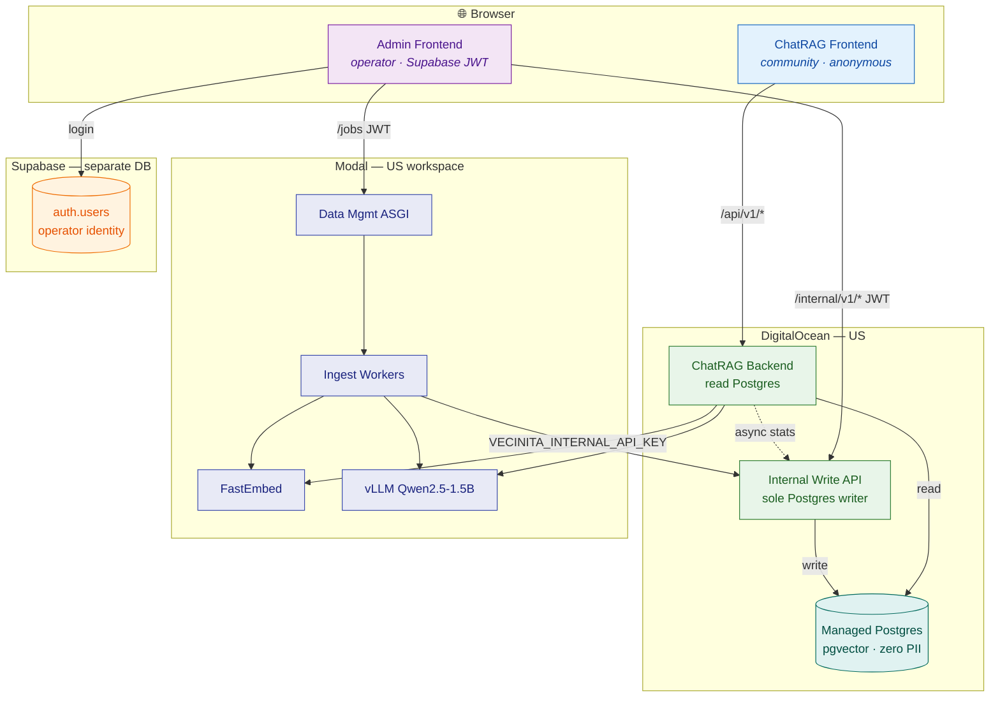

# Vecinita Architecture

> **Status:** Draft (issues #56, #92)  
> **Last updated:** 2026-07-03  
> **Canonical overview** — links live deploy state, infra specs, and ADRs without duplicating operator runbooks.

## Purpose

This document is the **single architecture overview** for Vecinita: what runs where, how environments differ, how deploy and secrets work, and known gaps. For step-by-step operator procedures see [staging-runbook.md](staging-runbook.md). For data/corpus workflows see [runbooks/corpus-operator-guide.md](runbooks/corpus-operator-guide.md).

**Related issues:** [#56](https://github.com/Math-Data-Justice-Collaborative/vecinita/issues/56) backend/hosting spec · [#58](https://github.com/Math-Data-Justice-Collaborative/vecinita/issues/58) data flow diagrams · [#92](https://github.com/Math-Data-Justice-Collaborative/vecinita/issues/92) OSCAR offload review · [#55](https://github.com/Math-Data-Justice-Collaborative/vecinita/issues/55) Brown migration questions

---

## System summary

Vecinita is a **five-application monorepo** (ADR-001) delivering:

1. **ChatRAG** — bilingual (EN/ES) community Q&A with retrieval-augmented generation
2. **Data management** — operator-driven URL ingest, corpus admin, evaluation tooling

Deployment is **hybrid**:

| Platform | Role |
|----------|------|
| **DigitalOcean App Platform** (US `nyc`) | HTTP APIs that touch Postgres, both React frontends |
| **DigitalOcean Managed Postgres** | Corpus DB + pgvector (384-dim) |
| **Modal** (US workspace `vecinita`) | GPU/CPU inference: FastEmbed, vLLM, ingest workers, data-mgmt ASGI |
| **Supabase** (separate project) | Admin operator auth only — identity **not** in corpus DB (ADR-026) |

**Critical boundary (ADR-007):** Only DO services hold `DATABASE_URL`. Modal workers persist data via the **internal write API** using `VECINITA_INTERNAL_API_KEY`.

---

## Service map

### Deploy units (8 runtime services + 2 data stores)

| # | Service | Repo path | Platform | Holds `DATABASE_URL` | Public? |
|---|---------|-----------|----------|----------------------|---------|
| 1 | ChatRAG backend | `apps/chat-rag-backend` | DO App Platform | Yes (read) | API — anonymous `/api/v1/*` |
| 2 | ChatRAG frontend | `apps/chat-rag-frontend` | DO static | No | Yes — community chat |
| 3 | Internal write API | `apps/internal-write-api` | DO App Platform | Yes (read/write) | No — JWT + service key |
| 4 | Data mgmt frontend | `apps/data-management-frontend` | DO static | No | Yes — admin UI (Supabase login) |
| 5 | Data mgmt ASGI | `apps/data-management-backend` | Modal `@asgi_app` | **No** | No — proxy auth |
| 6 | Ingest workers | Modal `@function` queue | Modal | **No** | No |
| 7 | FastEmbed | `infra/modal/embedding_app.py` | Modal CPU | No | No — service HTTP |
| 8 | vLLM (Qwen2.5-1.5B) | `infra/modal/llm_app.py` | Modal GPU T4 | No | No — service HTTP |
| — | Corpus Postgres | `apps/database` (migrations) | DO Managed Postgres | — | No |
| — | Supabase Auth | `supabase/` config | Supabase cloud | Separate DB | Admin login only |

### Shared packages (not deployables)

| Package | Purpose |
|---------|---------|
| `packages/rag` | LlamaIndex RAG orchestration |
| `packages/ingest` | Scrape/chunk helpers |
| `packages/embedding-client` | HTTP client → Modal FastEmbed |
| `packages/llm-client` | HTTP client → Modal vLLM |
| `packages/tagging` | LLM/human tag vocabulary |
| `packages/frontend-i18n` | EN/ES locale + messages |
| `packages/frontend-ui` | Shared React UI primitives |
| `packages/shared-schemas` | OpenAPI-aligned types, CORS helpers |

**Rule:** `packages/*` must not import `apps/*` (ADR-012).

### Architecture diagram (deployment topology)

Full diagram catalog and **color legend**: [data-flow.md](data-flow.md) §Diagram index.



### Diagram index (cross-reference)

| Diagram type | Topic | Location |
|--------------|-------|----------|
| Flowchart | Deployment topology (above) | this doc |
| C4 context + containers | Actors & platform split | [data-flow.md §1–2](data-flow.md#1-c4-style-system-context) |
| Sequence | Ingest, query, admin, eval | [data-flow.md §3–6](data-flow.md#3-sequence--ingest--embed--store) |
| ERD | Corpus Postgres schema | [data-flow.md §8](data-flow.md#8-entity-relationship-diagram-corpus-postgres) |
| State | Job, eval run, admin auth | [data-flow.md §9–11](data-flow.md#9-state-diagram--ingest-job-lifecycle) |
| Class | RAG types + shared schemas | [data-flow.md §12–13](data-flow.md#12-class-diagram--rag-pipeline-packages) |
| Requirement | Features → components | [data-flow.md §14](data-flow.md#14-requirement-diagram--features-to-components) |
| Journey + flowchart | UJ-001, UJ-002, UJ-026, UJ-039 | [data-flow.md §15–16](data-flow.md#15-user-journey-maps-mermaid-journey) · [user-journeys.md](user-journeys.md#visual-journey-maps) |
| Flowchart | CI/CD deploy pipeline | [data-flow.md §17](data-flow.md#17-flowchart--cicd-deploy-pipeline) |

---

## Environment matrix

| Aspect | Local | Staging | Production |
|--------|-------|---------|------------|
| **Postgres** | Docker (`infra/docker-compose.yml`) | DO Managed Postgres | DO Managed Postgres |
| **Modal workspace** | `vecinita` (or `modal serve`) | `vecinita` | `vecinita` |
| **DO apps** | Not required (uvicorn locally) | 4 DO apps (see [deploy-state.md](deploy-state.md)) | Same topology |
| **Supabase** | Local stack optional; staging project for auth | Canonical project + branching | Production auth config |
| **Corpus** | Fixtures + seeds (`data/fixtures/`) | Fixtures + pilot URLs | Ingested public URLs + seeds |
| **Secrets** | `prod.env` (gitignored) / `.env.example` | [staging-secrets-matrix.md](staging-secrets-matrix.md) | Same matrix, prod values |
| **CI deploy** | N/A | Manual + CD on `main` merge | CD after CI green |

### Live staging URLs (2026-06-26)

From [deploy-state.md](deploy-state.md):

| Service | URL |
|---------|-----|
| ChatRAG backend | `https://vecinita-chat-rag-backend-jvqso.ondigitalocean.app` |
| Internal write API | `https://vecinita-internal-write-api-icze4.ondigitalocean.app` |
| ChatRAG frontend | `https://vecinita-chat-rag-frontend-jnt8o.ondigitalocean.app` |
| Admin frontend | `https://vecinita-admin-frontend-ef4ob.ondigitalocean.app` |
| Modal embedding | `https://vecinita--vecinita-embedding-embedding-api.modal.run` |
| Modal LLM | `https://vecinita--vecinita-llm-fastapi-app.modal.run` |
| Modal data-mgmt | `https://vecinita--vecinita-data-management-fastapi-app.modal.run` |

Local bootstrap: [LOCAL_DEV.md](LOCAL_DEV.md).

---

## Secrets and configuration

### Where secrets live

| Secret | Consumers | Notes |
|--------|-----------|-------|
| `DATABASE_URL` | DO chat-rag-backend, internal-write-api | Never on Modal |
| `VECINITA_INTERNAL_API_KEY` | Modal workers, internal-write-api, DO backends | Machine credential |
| `VECINITA_MODAL_*_URL` | chat-rag-backend, internal-write-api, eval | Base URLs, no `/health` suffix |
| `MODAL_TOKEN_*` | CI/CD, local Modal CLI | GitHub secrets for deploy |
| `DIGITALOCEAN_TOKEN` | CI/CD, `do_apps.py` | App Platform deploy |
| `VITE_*` | Frontends (build-time) | Public API URLs only |
| `VITE_SUPABASE_*` | Admin frontend | Publishable key only |
| Supabase service role | Modal DM (GoTrue admin calls) | Not in browser |
| `SUPABASE_ACCESS_TOKEN` | CI `supabase config push` | Auth templates + SMTP |

Full matrix: [staging-secrets-matrix.md](staging-secrets-matrix.md).  
DO spec templates: [infra/do/](../infra/do/).  
Modal apps: [infra/modal/README.md](../infra/modal/README.md).

### Sync workflow

After Modal URL rotation or secret changes:

```bash
set -a && source prod.env && set +a
bash scripts/deploy/sync_env.sh --apply
```

See `.cursor/skills/do-secrets-sync/SKILL.md`.

---

## Database and migrations

| Item | Location |
|------|----------|
| Schema source | `apps/database/alembic/versions/` |
| Apply | `cd apps/database && uv run alembic upgrade head` |
| Seeds | `vecinita_database.seeds.load.load_corpus()` |
| pgvector | Extension enabled on DO Postgres; `vector(384)` |
| Privacy tests | `tests/privacy/` — forbidden table names |

**Alembic head (staging, 2026-06-26):** `20260526_0003` (audit, versions, serving stats).  
Eval tables added in EV-008 — check `alembic heads` before deploy.

**Forbidden in corpus DB:** `users`, `accounts`, `sessions`, `messages`, `profiles`, `invites`, `auth_*` (ADR-004). Operator identity lives in **Supabase only**; corpus may store opaque `actor_id` UUID on audit rows (ADR-026).

---

## Deploy pipeline

### CI/CD order (on merge to `main`)

See [data-flow.md §17](data-flow.md#17-flowchart--cicd-deploy-pipeline) for the flowchart.

1. **CI** — `.github/workflows/ci.yml` (lint, typecheck, tests, frontend builds)
2. **Deploy preflight** — `.github/workflows/deploy-preflight.yml` (Modal import smoke)
3. **Supabase sync** — `config push` + migrations (inside deploy-modal workflow)
4. **Modal deploy** — embedding → data-management → llm
5. **DO deploy** — internal-write-api → chat-rag-backend → frontends

`deploy_on_push` is **disabled** in DO specs; deploys are CI-gated.

### Manual staging order

See [staging-runbook.md](staging-runbook.md) §Deploy order:

1. Postgres + pgvector  
2. Alembic + seed  
3. Modal apps  
4. DO apps (secrets before first healthy deploy)  
5. Smoke: `scripts/deploy/staging_smoke.sh`, `verify_connectivity.sh`

### Health tiers

| Tier | Check |
|------|-------|
| H1 | `/health` 200 |
| H2 | DB pool + alembic head match |
| H3 | Sample RAG ask |
| H4 | CORS from frontend origin |
| H5 | Frontend bundle contains staging URLs |
| H6 | Browser auth journeys (invite accept) |

---

## Authentication model

| Surface | Auth | Notes |
|---------|------|-------|
| ChatRAG `/api/v1/*` | None (anonymous) | CORS restricted to chat frontend origin |
| Admin UI | Supabase JWT (browser session) | Invite-only registration |
| Internal write `/internal/v1/*` | Supabase JWT + role (`admin`/`viewer`) | Writes require `admin` |
| Modal → internal write | `VECINITA_INTERNAL_API_KEY` | Machine credential |
| Modal data-mgmt `/jobs` | Modal proxy auth + deploy secret | Not operator JWT |

Details: [api-contract.md](api-contract.md) §Authentication, ADR-026.

---

## Bilingual behavior

| Layer | Behavior |
|-------|----------|
| ChatRAG query | Auto-detect EN/ES from question text; respond in same language |
| ChatRAG UI | `packages/frontend-i18n`; locale in `localStorage` key `vecinita.locale` |
| Admin UI | Same i18n packages; ~120+ translated strings |
| Corpus | EN and ES fixture trees under `data/fixtures/corpus/` |
| Tags | Language-aware slugs in `tags` table |

No per-user locale persistence on server (ADR-004).

---

## Cost envelope

| Resource | Est. $/mo (pilot) |
|----------|-------------------|
| DO Managed Postgres | ~$15 |
| DO multi-app (4 services) | ~$20–27 |
| Modal GPU (vLLM T4, scale-to-zero) | ~$5–20 |
| Modal CPU (embed, scrape) | ~$2–8 |
| Supabase Pro (admin auth) | ~$25 |

**Targets:** ≤ $50/mo hard cap (ADR-004); EV-005 Supabase may raise envelope to ~$75/mo (ADR-027).  
Detail: [deployment-integration.md](deployment-integration.md) §Cost estimation.

---

## Gap analysis vs existing docs

| Topic | Covered by | Gap / action |
|-------|------------|--------------|
| Component details | [spec.md](spec.md) | Keep spec as deep reference; this doc is overview |
| Deploy URLs | [deploy-state.md](deploy-state.md) | Update when staging redeploys; drift noted there |
| DO app shapes | [infra/do/*.yaml](../infra/do/) | Placeholder SECRET types only in git |
| Operator secrets | `prod.env` (gitignored) | Never commit; use staging-secrets-matrix |
| Data workflows | **NEW** [runbooks/](runbooks/) | Dev + operator guides (#52) |
| Diagrams | [data-flow.md](data-flow.md) | Mermaid: C4, ERD, state, class, requirement, journey, sequence, flowchart |
| Hosting migration | **NEW** [hosting-migration-summary.md](hosting-migration-summary.md) | Brown / OSCAR discovery (#55, #92) |
| API schemas | [api-contract.md](api-contract.md), OpenAPI in repo | Keep in sync on route changes |
| Feature scope | [feature-list.md](feature-list.md) | F1–F37 feature IDs |
| Test acceptance | [test-plan.md](test-plan.md), [acceptance-criteria.md](acceptance-criteria.md) | — |
| ADR decisions | [adr/README.md](adr/README.md) | 35 ADRs; read before topology changes |

**Known open items (not doc gaps — product/infra decisions):**

- Budget alerts at 80%/100% of cap (T14.4)
- vLLM model/GPU sizing proof against $50 cap
- Dedicated API gateway deferred (R6)
- Multi-region / multi-machine inference out of scope (F9 = single-container multi-GPU only)

---

## References

| Document | Purpose |
|----------|---------|
| [ADR-001](adr/ADR-001-five-app-architecture.md) | Five-app monorepo |
| [ADR-004](adr/ADR-004-cost-sovereignty-zero-personal-data.md) | Zero PII, cost, sovereignty |
| [ADR-007](adr/ADR-007-modal-do-database-write-boundary.md) | Modal→DO write boundary |
| [ADR-010](adr/ADR-010-multi-app-digitalocean-topology.md) | Multi-app DO topology |
| [ADR-026](adr/ADR-026-supabase-admin-auth.md) | Admin Supabase auth |
| [deployment-integration.md](deployment-integration.md) | EV deltas, redeploy order |
| [data-management-plan.md](data-management-plan.md) | Corpus assets, schema tables |
| [data-flow.md](data-flow.md) | Mermaid diagrams |
| [hosting-migration-summary.md](hosting-migration-summary.md) | Hosting switch overview |
| [oscar-hosting-feasibility.md](oscar-hosting-feasibility.md) | OSCAR offload questions for Carlos |
