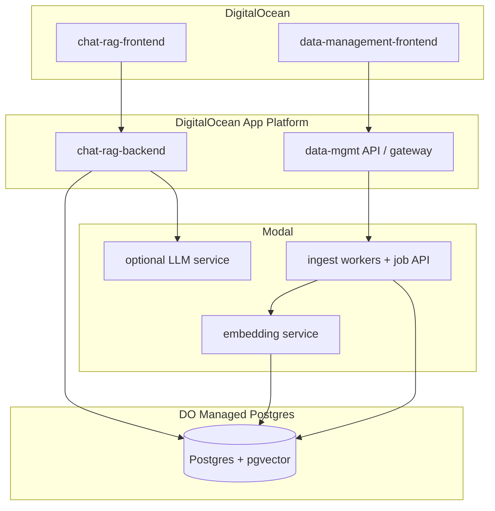
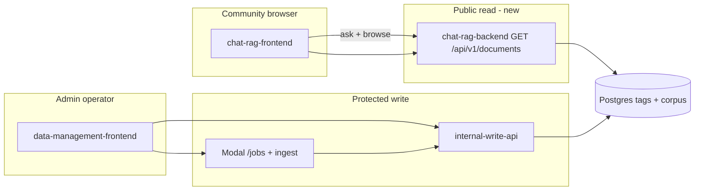
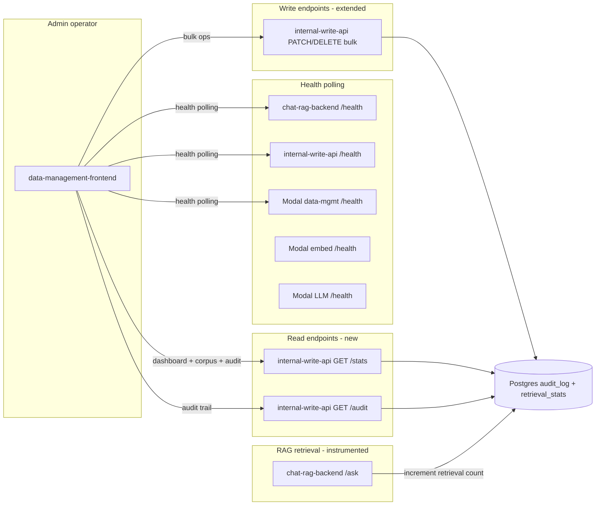

# Context Brief — Vecinita (5-app monorepo)

**Stage:** 00-context  
**Date:** 2026-05-19 (regenerated); **EV-001 delta:** 2026-05-24; **EV-002 delta:** 2026-05-26; **EV-004 delta:** 2026-06-13 (updated shared UI library scope)  
**Status:** Complete (EV-004 delta merged; §13 expanded 2026-06-13)

---

## 1. Executive Summary

Vecinita is a **fresh monorepo** on branch `fresh-start` that delivers two products: a **bilingual community Q&A RAG chatbot** (ChatRAG) and a **data management platform** (corpus ingest, jobs, admin). The user defined **five applications** — ChatRAG Backend, ChatRAG Frontend, Data Management Backend, Data Management Frontend, and Database — with deployment centered on a **hybrid of Modal and DigitalOcean** (Modal for async/GPU workers; DigitalOcean for HTTP APIs, both frontends, and managed Postgres).

The target repo currently contains only pipeline scaffolding (Cursor skills, hooks, README stub). Prior implementations live in sibling repos under `/root/GitHub/VECINA/` and a legacy worktree; the user chose **greenfield APIs** (siblings are reference only, not compatibility constraints).

**Non-functional constraints (hard):** keep **costs low**, maintain **data sovereignty** (single-region, self-hosted inference by default), and store **zero personal data** — including no admin user accounts in the application database (option B). See §2.1 and ADR-004. Downstream **01-requirements** must encode these as acceptance criteria and forbidden data fields.

---

## 2. Template Selection

| Field | Value |
|-------|--------|
| **Template ID** | `api` + `worker` (multi-app; not single monolith deploy) |
| **Confidence** | high |
| **Overridden by user** | false |
| **Service name** | `vecinita` |
| **Database** | PostgreSQL 15+ with pgvector on **DigitalOcean Managed Postgres** |
| **Vector store** | pgvector (dimension TBD in 01-requirements; siblings used 384) |

### Classification signals

| Signal | Evidence | Maps to |
|--------|----------|---------|
| HTTP chat/query API, sub-second–few-second latency | User: ChatRAG Backend; worktree `/api/v1/ask` | `api` |
| Bulk ingest, queues, retries | User: Data Management Backend; sibling Modal queues | `worker` |
| Two SPAs | User: two frontends | `api` (static hosts on DO) |
| Durable state | User: Database app | Postgres (DO), not Modal Volume |
| GPU/async optional | Hybrid deploy decision R2 | Modal worker tier |

**Not applicable:** `template-modal-job` (RFantibody GPU pipeline) — stale `.cursor/rules/` still reference it; reconcile in **03-plan-tooling**.

### Deploy targets

| Application | Primary platform | Notes |
|---------------|------------------|-------|
| ChatRAG Backend | DigitalOcean App Platform | FastAPI + RAG orchestration (LangGraph-style) |
| ChatRAG Frontend | DigitalOcean (static / App Platform) | React/Vite |
| Data Management Backend | **Modal** (workers + optional ASGI API) + DO gateway/BFF | Scrape → chunk → embed → store |
| Data Management Frontend | DigitalOcean | React/Vite admin UI |
| Database | **DigitalOcean Managed Postgres** | Migrations in `apps/database/` or `db/` |

Modal GPU tiers (if LLM/embedding on Modal): see `.cursor/skills/deployment-catalog.md` — select in **04-tech-plan** when workloads are sized.

### 2.1 Non-functional constraints (cost, sovereignty, privacy)

| Constraint | Requirement | Design implication |
|------------|-------------|-------------------|
| **Cost** | **≤ $25/mo target**, **≤ $50/mo hard cap** | Consolidate DO deployables (avoid 5 always-on App Platform apps); Modal scale-to-zero; self-hosted LLM/embed; cost estimate in 04-tech-plan |
| **Data sovereignty** | **US-only** regions (DO + Modal) | `nyc1` / `sfo3` (or equivalent); no default foreign SaaS LLM; external APIs need documented exception |
| **Zero personal data (B)** | No PII for visitors **or operators** in Vecinita DB | No Supabase Auth, no user/admin tables, no chat logs, no invite-by-email; stateless chat; admin APIs via platform secrets/network only |

**What the database may store:** public corpus (documents, chunks, vectors), scrape job metadata (URLs, status), operational config — **not** identities, sessions, or message history.

**ADR:** [ADR-004](adr/ADR-004-cost-sovereignty-zero-personal-data.md)

---

## 3. Resolution Log

| ID | Category | Issue | Resolution |
|----|----------|-------|------------|
| R1 | Decision | Monorepo structure | **Five apps** in `vecinita` monorepo — see ADR-001 |
| R2 | Decision | Deployment platform | **Hybrid Modal + DigitalOcean** — see ADR-002 |
| R3 | Decision | Sibling repo constraints | **Greenfield APIs** — siblings reference only — see ADR-003 |
| R4 | Decision | Database hosting | **DigitalOcean Managed Postgres + pgvector**; Database app = schema/migrations/seeds — see ADR-005 |
| R5 | Decision | Auth / identity | **No identity in app** — no user or admin accounts in DB; protect data-mgmt APIs with infrastructure credentials only (ADR-004) |
| R6 | Ambiguity | API gateway | **Deferred v1** — direct backend URLs (ADR-010); dedicated gateway — decide in 04-tech-plan |
| R7 | Contradiction | Stale RFantibody Cursor rules vs RAG skills | **Tooling debt** — rewrite rules in 03-plan-tooling before 07-build |
| R8 | Uncertainty | Embedding dimension / model | Default reference: **384-dim** (sibling migrations); confirm in 01-requirements |
| R9 | Decision | Cost | **≤ $25/mo preferred, ≤ $50/mo cap** — consolidated DO runtime, Modal on-demand, self-hosted inference — ADR-004 |
| R10 | Decision | Data sovereignty | **US-only** DO + Modal regions; no third-party LLM by default — ADR-004 |
| R10a | Decision | Region | **United States** (`nyc1` / `sfo3` or Modal US workspace) — user confirmed |
| R11 | Decision | Personal data | **Zero personal data (option B)** — no visitor or operator PII in Vecinita storage; stateless chat — ADR-004 |
| R12 | Decision | Tag granularity (EV-001) | **Document-level primary**; chunk-level overrides for admin fine-tuning — ADR-014 |
| R13 | Decision | Community corpus access (EV-001) | **Browse + filter by tags**; full document text on explicit open — ADR-014 |
| R14 | Decision | Frontend targets (EV-001) | **Both** — community browse in chat-rag-frontend; admin chunks/tags in data-management-frontend — ADR-014 |
| R15 | Decision | LLM tagging trigger (EV-001) | **Auto on ingest + admin re-run/override** — ADR-014 |
| R16 | Decision | RAG tag filter (EV-001) | **User-selected tags + LLM-inferred tags from question** — ADR-014 |
| R17 | Decision | Public read API (EV-001) | **ChatRAG backend** public GET routes (no secrets) — ADR-014 |
| R18 | Decision | Tag vocabulary (EV-001) | **Hybrid** — suggested/controlled list + admin can add tags — ADR-014 |
| R19 | Decision | Evolve routing (EV-001) | **Start 16-evolve** cycle for F19–F22 — user confirmed 2026-05-24 |

---

## 4. Source Analysis Summaries

### 4.1 Fresh-start `vecinita` repo

- **Path:** `/root/GitHub/VECINA/vecinita`
- **State:** README stub; `workflow-state.yaml`; Cursor pipeline 00–17; hooks expect `pyproject.toml` (absent)
- **Role:** Target monorepo for all five applications

### 4.2 User input (this session)

- Five named applications (ChatRAG ×2, Data Management ×2, Database)
- Deployment: Modal considered → **hybrid with DigitalOcean** confirmed
- Repo home: **single monorepo** in `vecinita`
- Regenerate context brief (discard prior assumed resolutions)
- Cost, data sovereignty, zero personal data (option B — no admin accounts in app)

### 4.3 Ecosystem (reference only — R3)

Seven git repos under `/root/GitHub/VECINA/` were discovered; user declined to treat them as constraints. Summary for migration reference:

| Repo | Relevance to 5-app map |
|------|------------------------|
| vecinita-data-management | Submodule monorepo layout; Supabase + Modal split |
| vecinita-data-management-frontend | Data admin UI patterns (no chat route) |
| vecinita-modal-proxy | Render gateway → Modal (`/jobs`, `/model`, `/embedding`) |
| vecinita-scraper | Data Management Backend — Modal queues + `/jobs` API |
| vecinita-embedding | Embedding microservice (FastEmbed, Modal volume) |
| vecinita-model | LLM `/chat`, `/stream` only (not full RAG) |
| vecinita.worktrees/... | Richest ChatRAG reference — LangGraph, bilingual, gateway `/api/v1/ask` |

---

## 5. Ecosystem Analysis (advisory)

### Scanned repos (org: `/root/GitHub/VECINA`)

| # | Repo | Classification | Constraint status |
|---|------|----------------|-------------------|
| 1 | vecinita | Greenfield shell | **Target** |
| 2 | vecinita-data-management | Data-platform monorepo | Reference |
| 3 | vecinita-data-management-frontend | Admin SPA | Reference |
| 4 | vecinita-modal-proxy | API gateway (Render) | Reference → replace with DO gateway |
| 5 | vecinita-scraper | Modal ingest | Reference for Data Mgmt Backend |
| 6 | vecinita-model | Modal LLM | Reference for optional Modal LLM |
| 7 | vecinita-embedding | Modal embeddings | Reference for Data Mgmt Backend |
| — | vecinita.worktrees/... | Legacy full-stack | ChatRAG + gateway API reference |

### Integration map (target 5-app architecture)



### Pattern inventory (optional adopt)

| Pattern | Source | Recommendation |
|---------|--------|----------------|
| `VECINITA_*` env prefix | Siblings | Adopt |
| Modal `requires_proxy_auth` on ASGI | scraper, model, embedding | Adopt for Modal HTTP |
| Split Modal app: workers vs API | vecinita-scraper | Adopt for Data Mgmt Backend |
| OpenAPI as contract source | template-registry | **Required** (greenfield) |
| React 18 + Vite | Sibling frontends | Adopt |
| `packages/` must not import `apps/` | data-management README | Adopt |

### Constraint list (from user decisions — hard)

| Constraint | Source |
|------------|--------|
| Five applications with separate deploy boundaries | User R1, ADR-001 |
| DO hosts APIs, frontends, Postgres | User R2, ADR-002 |
| Modal hosts async ingest/embedding (and optional LLM) | User R2, ADR-002 |
| Modal secrets not in browser | ADR-002, sibling proxy pattern |
| Greenfield API contracts | User R3, ADR-003 |
| Zero personal data (no user/admin tables, no chat logs) | User R11, ADR-004 |
| Data sovereignty — single region, self-hosted LLM default | User R10, ADR-004 |
| Cost minimization — no default paid LLM/embed APIs | User R9, ADR-004 |

### Divergence risks

| Risk | Impact | Mitigation |
|------|--------|------------|
| Stale RFantibody rules in `.cursor/rules/` | Wrong build guardrails | 03-plan-tooling rewrite |
| Re-implementing sibling API drift | Broken admin features | OpenAPI-first in 01-requirements |
| Dual vector stores (Chroma vs pgvector) if porting worktree blindly | Ops complexity | Standardize on pgvector (R4) |
| Sibling Supabase Auth + admin invites | Violates R11 | Do not port; use infra-only gates for data-mgmt |
| Third-party LLM APIs | Sovereignty + cost + data leakage | Default Ollama/FastEmbed on Modal; ADR for any exception |
| Worktree chat/session persistence | Violates R11 | Stateless chat only; client-side UI state OK |

---

## 6. Cross-Reference Matrix

| Topic | User intent | Sibling ecosystem | Legacy worktree | Alignment |
|-------|-------------|-------------------|-----------------|-----------|
| App count | 5 deployables | Many micro-repos | Monorepo backend+frontend | **New split** |
| Chat UI | ChatRAG Frontend | Missing in DM frontend | Submodule not checked out | Build greenfield |
| RAG logic | ChatRAG Backend | model = LLM only | LangGraph agent | **Orchestration on DO** |
| Ingest | Data Mgmt Backend | Modal scraper | Gateway `/scrape` | Modal workers + DO API |
| Database | DO Postgres | Supabase | Local postgres + pgvector | **DO replaces Supabase host** |
| Deploy | Modal + DO | Modal + Render | Docker/GCP/Render | **DO replaces Render** |
| Bilingual Q&A | Implied (prior workflow-state) | — | Yes (en/es) | Confirm in 01-requirements |
| Personal data | None (option B) | Supabase Auth, invites | Sessions possible | **Reject sibling auth patterns** |
| Cost / sovereignty | Minimize; single region | Mixed cloud | External LLMs | **Self-hosted default** |

---

## 7. Data & Asset Requirements

| Asset | Source | Auth | Used by |
|-------|--------|------|---------|
| DO Managed Postgres | DigitalOcean | Connection string in DO secrets | All backends, migrations |
| Modal workspace | modal.com | `MODAL_TOKEN_ID` / `SECRET` on DO backends | Data Mgmt Backend workers |
| Embedding model weights | Hugging Face / FastEmbed | Modal volume or baked image | Embedding (Modal) |
| LLM weights (if Ollama on Modal) | Ollama registry | Modal volume | Optional LLM Modal app |
| Corpus URL lists | `data/` fixtures | Public URLs | Scraper |
| LLM (self-hosted default) | Ollama on Modal volume | Modal secrets | ChatRAG Backend — external APIs only by ADR exception |

---

## 8. Unresolved Gaps (for 01-requirements)

1. **Monorepo paths** — confirm `apps/chat-rag-backend`, `apps/chat-rag-frontend`, `apps/data-management-backend`, `apps/data-management-frontend`, `apps/database` (or `db/` at root).
2. ~~**Sovereignty region**~~ — **Resolved: US-only** (`nyc1` / `sfo3`) — pin exact region in 04-tech-plan.
3. **ChatRAG API surface** — `/query`, `/chat`, streaming; **no server-side session history** (R11).
4. **Data Management API** — unify `/jobs` with corpus CRUD; protect with API key / private network only (R5, R11).
5. **Bilingual scope** — detection, prompts, corpus languages (worktree evidence).
6. **Gateway** — single DO BFF vs two APIs (R6).
7. **Embedding model and dimension** — confirm 384 vs other (R8); prefer local FastEmbed (R9, R10).
8. **Privacy enforcement** — schema deny-list, stateless chat, log redaction, automated tests (see ADR-004 §Privacy enforcement).
9. **Forbidden schema fields** — explicit list for migrations (no `users`, `sessions`, `messages` with identity).
10. **Cost topology** — prove ≤ $50/mo (path to $25) in 04-tech-plan; likely single Droplet or one App + smallest Managed Postgres.
11. **RFantibody rule cleanup** — blocking accurate build guardrails (R7).
12. **License audit** — before importing sibling code (`audit-licenses` skill).

---

## 9. Proposed Monorepo Layout

```text
vecinita/
  apps/
    chat-rag-backend/       # FastAPI + packages/rag
    chat-rag-frontend/      # React/Vite
    data-management-backend/  # Modal apps + DO-facing API
    data-management-frontend/
    database/               # Alembic migrations, seeds, pgvector enablement
  packages/
    shared-schemas/
    rag/
    ingest/
    embedding-client/
  infra/
    docker-compose.yml      # local DO-tier stack
    modal/                  # deploy docs per Modal app
  docs/
```

---

## 10. Full Agent Reports

<details>
<summary>explore — legacy worktree (ChatRAG reference)</summary>

Monorepo with `backend/` (gateway :8004, agent :8000, embedding :8001), `auth/`, empty `frontend/` submodule. LangGraph agent at `backend/src/agent/main.py` with bilingual en/es prompts and FAQ tools. Gateway exposes `/api/v1/ask`, `/ask/stream`, scrape, embed, admin, documents. Vector stores: Chroma primary, Supabase/pgvector fallback. Deployment references: docker-compose, GCP prod, Render, Modal for scraper/embedding modules.

</details>

<details>
<summary>explore — Modal sibling services</summary>

**scraper:** Apps `vecinita-scraper` (queues) + `vecinita-scraper-api` (ASGI, `requires_proxy_auth`), Supabase tables for jobs/chunks/embeddings, routes `/jobs/*`.

**model:** App `vecinita-model`, `/health`, `/chat`, `/stream`, Ollama on volume `vecinita-models`, no DB.

**embedding:** App `vecinita-embedding`, FastEmbed on volume `embedding-models`, `/embed`, `/embed/batch`.

**proxy:** Render FastAPI, routes `/jobs/*`, `/model/*`, `/embedding/*`, injects Modal credentials server-side.

</details>

<details>
<summary>explore — EV-001 repo scan (2026-05-24)</summary>

Full structured report: corpus schema without tags; chat frontend ask-only; admin CorpusList list/delete only; retriever pgvector-only; ingest pipeline without LLM tagging step. Public read APIs and tag CRUD absent. Admin secrets embedded via VITE_* build-time vars. Staging URLs in workflow-state deployment.staging.urls.

</details>

---

## 11. EV-001 Feature Delta — Corpus Tags & Community Browse

**Evolve cycle:** EV-001 (2026-05-24)  
**User intent:** Community members browse/filter corpus by tags; LLM and human tags improve RAG; admins view chunks and edit tags.

### Current implementation gap (repo scan 2026-05-24)

| Capability | Status | Key evidence |
|------------|--------|--------------|
| Tag tables / API | **Missing** | `apps/database/alembic/versions/20260519_0001_initial_corpus_schema.py` — documents/chunks/embeddings only |
| Public document browse | **Missing** | Chat frontend: ask/stream only (`apps/chat-rag-frontend/src/api/ask.ts`) |
| Admin chunk viewer | **Missing** | Admin UI: list/delete documents only (`CorpusList.tsx`) |
| Tag-filtered retrieval | **Missing** | `packages/rag/vecinita_rag/retriever.py` — pgvector only, no tag JOIN |
| LLM tagging in ingest | **Missing** | `pipeline.py` — scrape → chunk → embed → batch upsert |

### Proposed features (for 01-requirements delta)

| ID | Feature | Apps |
|----|---------|------|
| F19 | Public corpus browse & tag filter | chat-rag-frontend, chat-rag-backend |
| F20 | LLM auto-tagging at ingest + admin re-tag | data-management-backend, Modal LLM |
| F21 | Admin chunk viewer & tag editor | data-management-frontend, internal-write-api |
| F22 | Tag-aware RAG (user filter + LLM inference) | chat-rag-backend, packages/rag |

### Multi-app topology (connectivity)



**Browser integration risks:**

| Risk | Mitigation |
|------|------------|
| New public GET routes need CORS on chat backend | Re-run H4 after deploy; extend `VECINITA_CORS_ORIGINS` if needed |
| Admin tag writes via `VITE_VECINITA_CORPUS_API_KEY` in static bundle | Known v1 weakness; evaluate server-side admin proxy in 04-tech-plan |
| LLM tagging adds ingest latency/cost | Batch tag step; cap tags per doc in config-spec |

### Cross-reference: EV-001 vs ADR-004

| Requirement | Compatible? | Notes |
|-------------|-------------|-------|
| No user accounts for community browse | Yes | Public read same as public ask |
| Tag provenance without operator PII | Yes | Store `source: llm \| human` only — no `created_by` user row |
| Corpus is public content | Yes | Tags are metadata on public documents |
| No chat history in DB | Yes | Tag filter is per-request on AskRequest |

### Unresolved gaps (EV-001 → 01-requirements)

1. **Exact tag schema** — normalized `tags` table vs JSONB on documents; max tags per document/chunk.
2. **LLM tag prompt & model** — reuse Qwen instruct vs smaller classifier; bilingual tag labels.
3. **Chunk override semantics** — union vs replace document tags at retrieval time.
4. **Admin PATCH API shape** — extend internal-write vs new `/internal/v1/tags` routes.
5. **Browse UX** — pagination, search by title/url, tag facet UI in chat-rag-frontend.
6. **Eval fixtures** — tagged seed documents for CI retrieval tests.

**ADR:** [ADR-014](adr/ADR-014-corpus-tagging-and-browse.md)

---

## 12. EV-002 Feature Delta — Admin Dashboard, Bulk Ops, Usage Stats & Audit Log

**Evolve cycle:** EV-002 (2026-05-26)  
**User intent:** Improve admin dashboard CSS/UX, add summary statistics, health check dashboard, bulk corpus operations, document usage stats, and audit log with version history.

### Current implementation gap (codebase analysis 2026-05-26)

| Capability | Status | Key evidence |
|------------|--------|--------------|
| Admin CSS/styling | **Minimal** | `apps/data-management-frontend/src/App.css` — 127 lines vanilla CSS; system-ui font; no UI framework; no component library |
| Document tags in list | **Partial** | `CorpusList.tsx` shows title/URL/language but NOT tags; tags only visible after clicking "Manage tags" → `DocumentAdmin.tsx` |
| Summary statistics | **Missing** | No dashboard page; no aggregate queries; no statistics components |
| Health check dashboard | **Missing** | Health endpoints exist on all 5 services (`/health`) but no admin UI to visualize status |
| Bulk operations | **Missing** | `CorpusList.tsx` handles single-document delete only; no multi-select; no bulk tag/metadata edit |
| Usage statistics | **Missing** | `CorpusPgvectorRetriever` returns chunks but does NOT log which documents were served; no `retrieval_stats` table |
| Audit log | **Missing** | No audit table; no event logging middleware; no change tracking; no version history |
| Frontend routing | **Missing** | Single-page layout (`App.tsx` renders `JobForm` + `CorpusList` inline); no React Router |

### Current admin UI component inventory

| File | Purpose | Lines |
|------|---------|-------|
| `App.tsx` | Root component — renders header, JobForm, CorpusList | 16 |
| `App.css` | Global vanilla CSS — cards, forms, buttons, chunk list | 127 |
| `CorpusList.tsx` | Document list with per-doc delete + "Manage tags" button | 102 |
| `DocumentAdmin.tsx` | Chunk viewer + document/chunk tag editor + LLM retag | 206 |
| `JobForm.tsx` | Ingest job submission form | — |
| `main.tsx` | React root | — |

### Current database schema

**Tables (2 migrations):**

| Table | Columns | Source |
|-------|---------|--------|
| `documents` | id (uuid PK), url (text, unique), title, content_hash, language, created_at, updated_at | 0001 |
| `chunks` | id (uuid PK), document_id (FK→documents), chunk_index, text, token_count, created_at | 0001 |
| `embeddings` | id (uuid PK), chunk_id (FK→chunks, unique), embedding (vector(384)), created_at | 0001 |
| `jobs` | id (uuid PK), status, urls (jsonb), error_code, error_message, job_type, created_at, updated_at | 0001+0002 |
| `config` | key (text PK), value (jsonb), updated_at | 0001 |
| `tags` | id (uuid PK), slug (text), label (text), language (varchar(8)), created_at | 0002 |
| `document_tags` | document_id+tag_id (composite PK), source (llm/human), created_at | 0002 |
| `chunk_tags` | chunk_id+tag_id (composite PK), source (llm/human), created_at | 0002 |

### Current API endpoint inventory

**chat-rag-backend:**

| Method | Path | Description |
|--------|------|-------------|
| GET | `/health` | Liveness + dependency checks (postgres, modal_embed, modal_llm) |
| POST | `/api/v1/ask` | RAG question answering |
| POST | `/api/v1/ask/stream` | Streaming RAG response |
| GET | `/api/v1/documents` | Public corpus browse (paginated, tag filter) |
| GET | `/api/v1/documents/{id}` | Public document detail |
| GET | `/api/v1/tags` | Public tag facet list |

**internal-write-api:**

| Method | Path | Description |
|--------|------|-------------|
| GET | `/health` | Liveness |
| POST | `/internal/v1/documents/batch` | Batch document upsert (ingest) |
| GET | `/internal/v1/documents/{id}` | Document detail |
| GET | `/internal/v1/documents/{id}/tags` | Document tags |
| PATCH | `/internal/v1/documents/{id}/tags` | Update document tags |
| GET | `/internal/v1/documents/{id}/chunks` | Chunk list |
| PATCH | `/internal/v1/chunks/{id}/tags` | Update chunk tags |
| POST | `/internal/v1/documents/{id}/retag` | Queue LLM retag job |
| GET | `/internal/v1/documents` | List all documents |
| DELETE | `/internal/v1/documents/{id}` | Delete document + cascade |

**data-management-backend (Modal):**

| Method | Path | Description |
|--------|------|-------------|
| GET | `/health` | Liveness |
| POST | `/jobs` | Create ingest/retag job |
| GET | `/jobs/{id}` | Job status |

**Modal services:**

| Service | Health path | Other routes |
|---------|------------|--------------|
| embedding | `/health` | `/embed`, `/embed/batch` |
| llm | `/health` | `/generate`, `/generate/stream` |

### Privacy constraints for new tables (ADR-004)

The `privacy.py` module forbids these table names: `users`, `accounts`, `sessions`, `messages`, `profiles`, `invites`. It also forbids identity columns: `created_by`, `updated_by`, `user_id`, `operator_id`, `admin_id`, `email`, `name`, `phone`, `address`, `account_id`, `profile_id`, `invite_id`, `session_id`.

**Impact on EV-002:** The new `audit_log` and `document_retrieval_stats` tables are NOT in the forbidden list and are safe to create. The audit log's IP hash column must avoid forbidden names — use `actor_ip_hash` (not `user_id`, `created_by`, etc.).

### Proposed features (for 01-requirements delta)

| ID | Feature | Apps | New tables |
|----|---------|------|------------|
| F23 | Admin UI overhaul (Tailwind CSS + React Router) | data-management-frontend | None |
| F24 | Admin summary statistics dashboard | data-management-frontend, internal-write-api | None (aggregate queries) |
| F25 | System health check dashboard | data-management-frontend, all backends | None |
| F26 | Bulk corpus document operations | data-management-frontend, internal-write-api | None |
| F27 | Document retrieval usage statistics | chat-rag-backend, internal-write-api, database | `document_retrieval_stats` |
| F28 | Corpus audit log & version history | internal-write-api, data-management-frontend, database | `audit_log` |

### Feature details

**F23 — Admin UI overhaul:**
- Add Tailwind CSS for modern, utility-first styling (R25)
- Add React Router for page-based navigation: `/dashboard`, `/corpus`, `/health`, `/audit` (R27)
- Show document tags inline in corpus list (currently hidden behind "Manage tags" click)
- Responsive layout, improved cards, tables, badges, status indicators
- Consistent design language across all new pages

**F24 — Admin summary statistics dashboard:**
- Dashboard landing page (`/dashboard`) showing aggregate statistics
- Document count, chunk count, embedding count
- Tag distribution (top tags with counts)
- Job status summary (pending/running/completed/failed)
- Retrieval statistics (top served documents from F27)
- All data from aggregate SQL queries on existing + new tables

**F25 — System health check dashboard:**
- Health page (`/health`) polling `/health` endpoints for all services (R24)
- Services: chat-rag-backend, internal-write-api, data-management-backend (Modal), embedding (Modal), LLM (Modal)
- Green/red status indicator per service
- Dependency status from chat-rag-backend's health response (postgres, modal_embed, modal_llm)
- Auto-refresh polling (e.g., every 30s)
- Service URLs from VITE_* environment variables

**F26 — Bulk corpus document operations:**
- Multi-select checkboxes in corpus document list
- Bulk tag assignment/removal (select N documents → apply/remove tags)
- Bulk metadata editing: title, URL, language (R22)
- Bulk delete with confirmation dialog
- New internal-write-api endpoints: `PATCH /internal/v1/documents/bulk/tags`, `PATCH /internal/v1/documents/bulk/metadata`, `DELETE /internal/v1/documents/bulk`
- CORS must include PATCH verb for internal-write-api

**F27 — Document retrieval usage statistics:**
- New table: `document_retrieval_stats` (document_id FK, retrieval_count integer, last_retrieved_at timestamp)
- Increment counter when document's chunks are returned in RAG responses (R23)
- Async/batched counter update to avoid adding latency to RAG responses
- Display retrieval counts in admin corpus list and statistics dashboard
- New internal-write-api GET endpoint for stats: `GET /internal/v1/stats/retrieval`

**F28 — Corpus audit log & version history:**
- New table: `audit_log` (id uuid, entity_type text, entity_id uuid, action text, changes jsonb, actor_ip_hash text, created_at timestamptz) (R26)
- Actions tracked: document_create, document_update, document_delete, tag_add, tag_remove, bulk_tag, bulk_delete, bulk_metadata_update
- JSONB `changes` column stores diff/snapshot of what changed — serves as version history (R26)
- `actor_ip_hash`: SHA-256(client_ip + daily_salt) for audit trail without raw PII (R20)
- Middleware on internal-write-api to auto-record audit entries on mutations
- Admin UI audit trail page (`/audit`) with per-document filtering
- No `created_by`, `user_id`, or other forbidden identity columns (ADR-004 compatible)

### Multi-app topology (connectivity for EV-002)



**Browser integration risks:**

| Risk | Mitigation |
|------|------------|
| CORS must allow PATCH verb on internal-write-api for bulk metadata | Add PATCH to `configure_cors()` + H0c test |
| Health polling to Modal services requires CORS or proxy | Route through internal-write-api aggregator endpoint (avoids Modal CORS waiver issue) |
| Tailwind CSS bundle size | Purge unused styles in Vite build |
| Audit log JSONB diff storage growth | Add retention policy (e.g., 90 days) or archival plan |

### Cross-reference: EV-002 vs ADR-004

| Requirement | Compatible? | Notes |
|-------------|-------------|-------|
| No user accounts for admin dashboard | Yes | Dashboard uses infra-only auth (VECINITA_INTERNAL_API_KEY) |
| Hashed IP instead of raw PII | Yes | SHA-256(IP + daily_salt) — not reversible without salt (R20) |
| No identity columns in new tables | Yes | Use `actor_ip_hash` not `user_id`/`created_by` |
| Retrieval stats are aggregate | Yes | Document-level counts, no per-user tracking |
| Audit log contains no operator identity | Yes | Only hashed IP + action + diff |

### Unresolved gaps (EV-002 → 01-requirements)

1. **Tailwind CSS configuration** — Tailwind v3 vs v4; PostCSS plugin vs standalone CLI; Vite integration.
2. **Health polling architecture** — Admin frontend polls health endpoints directly (CORS needed on Modal) vs internal-write-api aggregates all health checks (single CORS-friendly endpoint).
3. **Retrieval counter update mechanism** — Sync in retriever (adds latency) vs async fire-and-forget (eventual consistency) vs batch (periodic DB update).
4. **Audit log salt rotation** — Daily salt storage mechanism (environment variable vs config table); salt rotation procedure.
5. **Bulk operation limits** — Max documents per bulk operation (50? 100? unlimited?).
6. **Audit log retention** — How long to keep audit entries; archival strategy.
7. **Statistics refresh rate** — Real-time vs cached (e.g., 5-minute materialized view).
8. **React Router base path** — Confirm admin frontend is served at root `/` on DO static site.

### Resolution Log (EV-002)

| ID | Category | Issue | Resolution |
|----|----------|-------|------------|
| R20 | Contradiction | Audit log IP tracking vs ADR-004 zero PII | **Hashed/anonymized IP** — SHA-256(IP + daily_salt); audit trail without raw PII |
| R21 | Decision | Orchestration for feature addition | **Full evolve cycle EV-002** — structured delta 00→01→04→07→13 |
| R22 | Ambiguity | Bulk edit scope | **Bulk metadata editing** — tags + title + URL + other fields for multiple documents |
| R23 | Decision | Usage statistics granularity | **Document-level retrieval count** — minimal overhead; increment when chunks served |
| R24 | Ambiguity | Health dashboard scope | **Live status page** — polls /health endpoints, green/red indicators per service |
| R25 | Decision | CSS/styling approach | **Tailwind CSS** — utility-first, modern look, fast development |
| R26 | Decision | Version history implementation | **Audit log IS version history** — JSONB diff/snapshot per action (event-sourcing style) |
| R27 | Decision | Frontend navigation | **React Router** — URL-based pages (/dashboard, /corpus, /health, /audit) |

---

## 13. EV-004 delta — Admin dashboard bilingual UI + shared frontend packages (en/es)

**Date:** 2026-06-13 (updated)  
**Cycle:** EV-004  
**Feature:** F31 — Admin UI bilingual (en/es) + shared frontend component library  
**Apps:** `data-management-frontend`, `chat-rag-frontend` (both consume shared packages)

### Executive summary

Operators use the **data-management-frontend** admin SPA (Dashboard, Corpus, Health, Audit) with **English-only UI chrome** today. ChatRAG already ships **en/es** via `LocaleProvider`, `LanguageToggle`, and `i18n/messages.ts` with `localStorage` key `vecinita.locale` ([Repo: `apps/chat-rag-frontend/src/`]). EV-004 adds the same operator experience to the admin dashboard: **full static UI translation**, sidebar **EN/ES toggle** beside `ThemeToggle`, and **shared locale persistence** across both browser apps.

EV-004 also introduces **two workspace TypeScript packages** under `packages/` (per ADR-012 dependency rule):

| Package | npm name | Role |
|---------|----------|------|
| `packages/frontend-i18n` | `vecinita-frontend-i18n` | Locale detection, storage, namespaced `t()` messages (`chat.*`, `admin.*`, `shared.*`) |
| `packages/frontend-ui` | `vecinita-frontend-ui` | Shared React components — `LanguageToggle`, `LocaleProvider`, tag chips/badges, pagination controls |

Both frontends migrate off duplicated app-local i18n/UI primitives. App-specific pages (ChatPanel, AdminLayout, bulk dialogs) remain in each app; only cross-app UI patterns move to the shared library.

No backend or API contract changes are required. Corpus document titles, tag labels, URLs, audit JSON payloads, and API error/status enums remain in source form (same as ChatRAG corpus browse).

### Template selection (unchanged)

| Field | Value |
|-------|--------|
| Template ID | `api` + `worker` multi-app (no change) |
| Confidence | high |
| Service name | `vecinita` |

### Multi-app topology & connectivity

| App | Browser-facing | API origins | i18n impact |
|-----|----------------|-------------|-------------|
| data-management-frontend | Yes (DO static) | internal-write-api, data-mgmt Modal proxy | **New** — client-only locale |
| chat-rag-frontend | Yes | chat-rag-backend | **Existing** — migrate to shared packages |

**Browser integration risk:** None for CORS/BFF. Locale is `localStorage` + `document.documentElement.lang`; both frontends on different DO hosts still share `vecinita.locale` when operators use the same browser profile.

### Shared package architecture

Per ADR-012: `packages/*` must not import `apps/*`; both frontends import shared packages via npm workspace (`file:` or root `workspaces` field).

```
packages/frontend-i18n/     ← pure TS (no React); locale utils + message tables
packages/frontend-ui/       ← React + Tailwind; depends on frontend-i18n
apps/chat-rag-frontend/     ← imports both; adds Tailwind to consume frontend-ui
apps/data-management-frontend/  ← imports both; already Tailwind/shadcn
```

**⚠️ Assumed (R35–R38):** Two-package split; Tailwind-based `frontend-ui`; ChatRAG adds Tailwind for shared component consumption; npm workspaces at repo root.

### Reference implementation (ChatRAG)

| Piece | Location |
|-------|----------|
| Locale type + detect + storage | [Repo: `apps/chat-rag-frontend/src/hooks/useLocale.types.ts`] |
| React context | [Repo: `apps/chat-rag-frontend/src/context/LocaleContext.tsx`] |
| Message tables + `t()` | [Repo: `apps/chat-rag-frontend/src/i18n/messages.ts`] |
| Toggle UI | [Repo: `apps/chat-rag-frontend/src/components/LanguageToggle.tsx`] |
| Regression tests | [Repo: `apps/chat-rag-frontend/src/test/test_bug_2026_06_05_language_toggle_i18n.test.tsx`] |

**Default locale:** `detectBrowserLocale()` — `en` if browser starts with `en`, `es` if starts with `es`, else **ES** (not EN).

### Admin UI string inventory (translate in F31)

Static English strings identified in `apps/data-management-frontend/src/` (approx. **120+** user-visible strings):

| Area | Files | Examples |
|------|-------|----------|
| Navigation | `AdminLayout.tsx` | Dashboard, Corpus, Health, Audit Log, Open navigation |
| Dashboard | `DashboardPage.tsx` | Total Documents, Top Served Documents, Loading…, Failed to load dashboard |
| Corpus | `CorpusPage.tsx`, `JobForm.tsx`, `CorpusList.tsx` | Ingest URLs, Manage tags, bulk toolbar, delete confirm |
| Document admin | `DocumentAdmin.tsx`, `DocumentHistory.tsx` | Chunk tags, LLM re-tag, save status messages |
| Bulk dialogs | `BulkDeleteDialog.tsx`, `BulkTagDialog.tsx`, `BulkMetadataDialog.tsx` | Confirm/cancel, success/failure summaries |
| Health | `HealthPage.tsx` | Refresh, Last checked, Failed to load health |
| Audit | `AuditPage.tsx` | Filters, Event type, Expand/Collapse, pagination text |
| Chrome | `ThemeToggle.tsx` | Toggle theme |

**Not translated (R30):** document `title`, tag `label`, `url`, audit `event_type` / `entity_type`, health `overall` / `service.status` API values, job `status` enums, `error_message` from APIs.

### Shared component inventory (extract to `packages/frontend-ui`)

| Component | ChatRAG source | Admin source | Shared behavior |
|-----------|----------------|--------------|-----------------|
| `LocaleProvider` | `context/LocaleContext.tsx` | *(new)* | React context; sets `document.documentElement.lang`; reads/writes `vecinita.locale` |
| `LanguageToggle` | `components/LanguageToggle.tsx` | *(new in AdminLayout footer)* | EN/ES pill toggle; uses `t(locale, "shared.languageGroupLabel")` |
| `TagFilterChips` | `components/TagFilterChips.tsx` | — | Interactive filter chips; locale-filtered tag facets |
| `TagBadge` | — | `components/TagBadge.tsx` | Read-only tag pill; LLM vs manual color variant |
| `PaginationControls` | inline in `CorpusBrowse.tsx` | inline in `AuditPage.tsx` | Previous/Next + page summary via `t(locale, "shared.pagination", ...)` |
| `ThemeToggle` | — | `components/ThemeToggle.tsx` | System-preference light/dark toggle; bilingual labels via `frontend-i18n` (02-verify-plan S_EV4.L2 denied — extract to shared package) |

**Not extracted in EV-004** (app-specific): `ChatPanel`, `CorpusBrowse` page shell, `AdminLayout`, shadcn `ui/*` primitives, bulk dialogs.

**Styling note:** `frontend-ui` ships Tailwind-styled components. ChatRAG adds Tailwind + PostCSS to scan `packages/frontend-ui` (R36). Admin already uses Tailwind; may drop local `TagBadge` after migration.

### Cross-reference matrix

| Topic | ChatRAG (today) | Admin (today) | EV-004 target |
|-------|-----------------|---------------|---------------|
| UI locale toggle | Header EN/ES | None | Shared `LanguageToggle` in header (ChatRAG) + sidebar footer (admin) |
| `vecinita.locale` storage | Yes | No | Shared (R28) via `frontend-i18n` |
| Message source | App-local `i18n/messages.ts` | Hardcoded English | Shared `packages/frontend-i18n` (R29) |
| React locale context | App-local `LocaleContext` | None | Shared `packages/frontend-ui` `LocaleProvider` (R37) |
| Tag UI | `TagFilterChips` (CSS) | `TagBadge` (Tailwind) | Unified in `frontend-ui` (R37) |
| Pagination | CorpusBrowse inline | AuditPage inline | Shared `PaginationControls` (R37) |
| `document.documentElement.lang` | Yes | No | Yes |
| Corpus content language | Unchanged | Unchanged | Unchanged |
| npm workspaces | Per-app lockfiles only | Per-app lockfiles only | Root workspaces linking apps → packages (R38) |

### Data & asset requirements

No new external datasets, model weights, or API assets. New workspace packages: `packages/frontend-i18n` (TypeScript only) and `packages/frontend-ui` (React + Tailwind). CI frontend matrix must install/build shared packages before app builds.

### Unresolved gaps (EV-004 → 01-requirements / 04-tech-plan)

1. **ChatRAG Tailwind adoption depth** — Minimal (shared-package scan only) vs full App.css → Tailwind migration for ChatRAG-specific layout.
2. **Message key namespaces** — Flat keys with prefixes (`chat.appTitle`, `admin.navDashboard`, `shared.loading`) in one `t()` table vs nested objects.
3. **Vitest coverage** — Mirror ChatRAG repro tests for admin (`test_admin_language_toggle_i18n.test.tsx`); add package-level tests in `packages/frontend-ui`.
4. **Date/time formatting** — `toLocaleString()` without explicit locale today; may follow UI locale in follow-up.
5. **CI workspace wiring** — Root `package.json` workspaces vs `file:../../packages/frontend-i18n` in each app; lockfile strategy (single root lock vs per-app).
6. **shadcn in shared package** — Re-export shadcn primitives from `frontend-ui` vs keep shadcn admin-local only.

### Resolution Log (EV-004)

| ID | Category | Issue | Resolution |
|----|----------|-------|------------|
| R28 | Decision | Locale persistence across apps | **Shared `vecinita.locale`** — same detect/fallback as ChatRAG |
| R29 | Decision | i18n code location | **Shared `packages/frontend-i18n`** — both frontends import locale utils + messages; see ADR-019 |
| R30 | Ambiguity | Dynamic / API-sourced strings | **UI chrome only** — match ChatRAG; corpus titles, tags, audit payloads unchanged |
| R31 | Decision | Toggle placement | **Sidebar footer** (desktop) + mobile sheet footer, beside `ThemeToggle` |
| R32 | Decision | Pipeline routing | **EV-004 evolve cycle** — 00-context → 01-requirements delta → 04-tech-plan → 07-build |
| R33 | Decision | Context brief handling | **Partial update** — §13 only; prior sections unchanged |
| R34 | Decision | Context brief rerun | **⚠️ Assumed: Update §13** — extend EV-004 with shared component library (user request 2026-06-13) |
| R35 | Decision | Package structure | **⚠️ Assumed: Two packages** — `frontend-i18n` + `frontend-ui`; see ADR-020 |
| R36 | Decision | Shared component styling | **⚠️ Assumed: Tailwind in `frontend-ui`** — ChatRAG adds Tailwind to consume shared styled components |
| R37 | Decision | Component extraction scope | **⚠️ Assumed: i18n core + LanguageToggle + LocaleProvider + TagBadge/TagFilterChips + PaginationControls** |
| R38 | Decision | npm workspace wiring | **⚠️ Assumed: Root npm workspaces** linking both apps to `packages/frontend-*` |

## 14. S003 delta — Browser-local persistent chat history (sessionStorage + previous-chats list)

**Date:** 2026-06-26  
**Session:** S003-persistent-chat-history (type feature, orchestrator 16-evolve)  
**Feature:** F33 — Browser-local ephemeral chat history + previous-chats list  
**App:** `chat-rag-frontend` (frontend-only delta; no backend/API/contract changes)

### Executive summary

The chat-rag-frontend main page keeps the conversation in in-memory React state
(`useChatHistory`) lifted to the always-mounted `AppContent` shell. That survives **in-app**
Chat ⇄ Corpus navigation (BUG-2026-06-25 / #53, PR #68) but is **lost on page refresh, tab
close, or switching browser tabs** because nothing is persisted to browser storage. S003 adds:

1. **Persistence of the active conversation** across refresh / tab-away / browser-tab switching
   using **`sessionStorage`** (device-only; never transmitted; cleared when the tab closes).
2. **A selectable list of previous conversations** on the main page so users can revisit prior
   chats.

### Key decisions (AskQuestion 2026-06-26)

| ID | Category | Topic | Resolution |
|----|----------|-------|------------|
| R39 | Decision | Active-session handling | **Park S002** (status `paused`, branch preserved) and open S003 |
| R40 | Decision | Feature scope | **Both** — persist active conversation **and** previous-chats list |
| R41 | Decision | Storage mechanism / privacy | **`sessionStorage`** (not localStorage) — narrower footprint; survives refresh + tab-away, cleared on tab close |
| R42 | Decision | Routing | **evolve-lite** 00→01→04→07→09→10→12→13 (skip 02,03,05,06,11) |

### Privacy / spec alignment (must resolve in 01/04)

- **F3 ("Stateless chat — no server-side history")** remains true: the server stays stateless.
  S003 history is strictly **client-side / device-only**. Downstream specs must keep this
  distinction explicit (client-side history ≠ server-side history).
- **ADR-004** and **`.cursor/rules/frontend-session-state-lifting.mdc`** currently read
  "client-side-only … never persist to the server or to storage that leaves the browser" and
  "lift it within the SPA only." `sessionStorage` does not leave the browser, but the "within
  the SPA only" wording is in tension with persisting to web storage. **01-requirements /
  04-tech-plan must update ADR-004 + the rule** to explicitly permit **device-only,
  tab-scoped** persistence (sessionStorage) and document why (user R41).
- Privacy guardrails (`F15`, privacy-schema-validator) target server-side schemas/logs and are
  unaffected — no chat content reaches the server or logs.

### Touch points (reference)

| Piece | Location |
|-------|----------|
| Chat history hook (in-memory today) | [Repo: `apps/chat-rag-frontend/src/hooks/useChatHistory.ts`] |
| App shell owner of `chat` | [Repo: `apps/chat-rag-frontend/src/App.tsx` (`AppContent`)] |
| Chat view consuming `chat` prop | [Repo: `apps/chat-rag-frontend/src/components/ChatPanel.tsx`] |
| Message/Source types | [Repo: `apps/chat-rag-frontend/src/api/types.ts`] |
| i18n message table (new keys for previous-chats UI) | [Repo: `apps/chat-rag-frontend/src/i18n/messages.ts`] |
| State-lifting rule (to update) | [Repo: `.cursor/rules/frontend-session-state-lifting.mdc`] |
| Existing regression guard | [Repo: `apps/chat-rag-frontend/src/test/test_bug_2026_06_25_chat_corpus_tab_state_loss.test.tsx`] |

### Unresolved gaps (for 01-requirements)

- **Previous-chats data model:** what defines a "previous conversation" boundary (a chat ends
  when the user starts a new one via a "New chat" action vs. time-based)? How many to keep
  (cap/eviction)? Title derivation (first user message vs. timestamp)?
- **sessionStorage scope caveat:** `sessionStorage` is **per-tab** — a brand-new browser tab
  does not inherit another tab's history. Confirm this matches the user's "go to another tab"
  expectation (it covers refresh + switching to an already-open tab and back, not opening a
  fresh duplicate tab).
- **Quota / serialization:** message list with streamed assistant content + sources must
  serialize safely and handle `sessionStorage` quota / disabled-storage gracefully.
- **Clear semantics:** how "Clear history" and selecting a previous chat interact with the
  persisted store.

### Out of scope

- No server-side chat/session persistence (ADR-004 / F3).
- No cross-device, cross-browser, or cross-tab(new-tab) sync.
- No persistence surviving browser-tab close (sessionStorage by design, R41).
- No changes to `data-management-frontend`.
