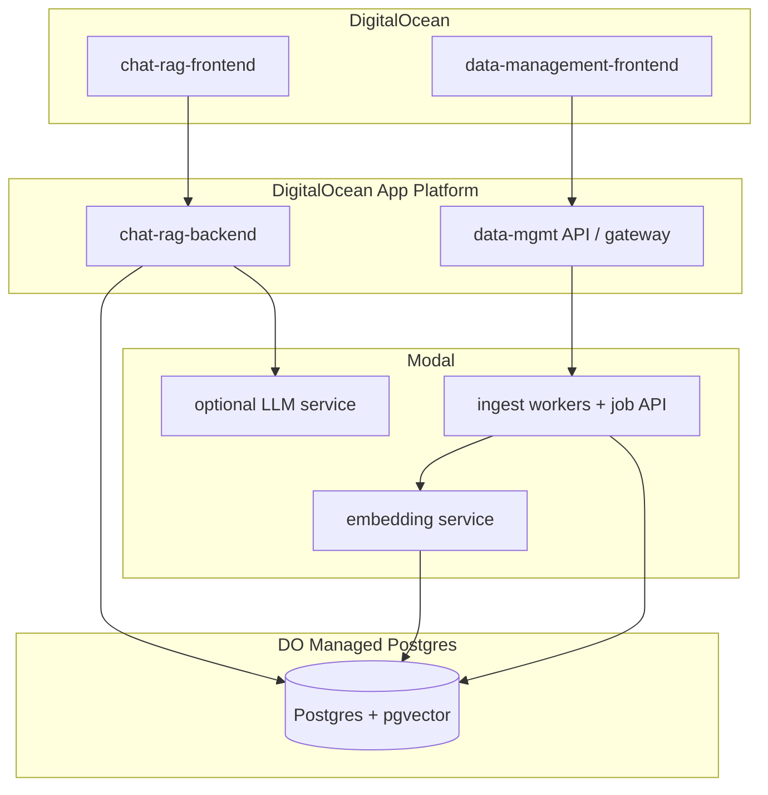

# Context Brief — Vecinita (5-app monorepo)

**Stage:** 00-context  
**Date:** 2026-05-19  
**Status:** Complete (regenerated)

---

## 1. Executive Summary

Vecinita is a **fresh monorepo** on branch `fresh-start` that delivers two products: a **bilingual community Q&A RAG chatbot** (ChatRAG) and a **data management platform** (corpus ingest, jobs, admin). The user defined **five applications** — ChatRAG Backend, ChatRAG Frontend, Data Management Backend, Data Management Frontend, and Database — with deployment centered on a **hybrid of Modal and DigitalOcean** (Modal for async/GPU workers; DigitalOcean for HTTP APIs, both frontends, and managed Postgres).

The target repo currently contains only pipeline scaffolding (Cursor skills, hooks, README stub). Prior implementations live in sibling repos under `/root/GitHub/VECINA/` and a legacy worktree; the user chose **greenfield APIs** (siblings are reference only, not compatibility constraints).

**Non-functional constraints (hard):** keep **costs low**, maintain **data sovereignty** (single-region, self-hosted inference by default), and store **zero personal data** — including no admin user accounts in the application database (option B). See §2.1 and ADR-004. Downstream **01-requirements** must encode these as acceptance criteria and forbidden data fields.

---

## 2. Template Selection

| Field | Value |
|-------|--------|
| **Template ID** | `api` + `worker` (multi-app; not single monolith deploy) |
| **Confidence** | high |
| **Overridden by user** | false |
| **Service name** | `vecinita` |
| **Database** | PostgreSQL 15+ with pgvector on **DigitalOcean Managed Postgres** |
| **Vector store** | pgvector (dimension TBD in 01-requirements; siblings used 384) |

### Classification signals

| Signal | Evidence | Maps to |
|--------|----------|---------|
| HTTP chat/query API, sub-second–few-second latency | User: ChatRAG Backend; worktree `/api/v1/ask` | `api` |
| Bulk ingest, queues, retries | User: Data Management Backend; sibling Modal queues | `worker` |
| Two SPAs | User: two frontends | `api` (static hosts on DO) |
| Durable state | User: Database app | Postgres (DO), not Modal Volume |
| GPU/async optional | Hybrid deploy decision R2 | Modal worker tier |

**Not applicable:** `template-modal-job` (RFantibody GPU pipeline) — stale `.cursor/rules/` still reference it; reconcile in **03-plan-tooling**.

### Deploy targets

| Application | Primary platform | Notes |
|---------------|------------------|-------|
| ChatRAG Backend | DigitalOcean App Platform | FastAPI + RAG orchestration (LangGraph-style) |
| ChatRAG Frontend | DigitalOcean (static / App Platform) | React/Vite |
| Data Management Backend | **Modal** (workers + optional ASGI API) + DO gateway/BFF | Scrape → chunk → embed → store |
| Data Management Frontend | DigitalOcean | React/Vite admin UI |
| Database | **DigitalOcean Managed Postgres** | Migrations in `apps/database/` or `db/` |

Modal GPU tiers (if LLM/embedding on Modal): see `.cursor/skills/deployment-catalog.md` — select in **04-tech-plan** when workloads are sized.

### 2.1 Non-functional constraints (cost, sovereignty, privacy)

| Constraint | Requirement | Design implication |
|------------|-------------|-------------------|
| **Cost** | **≤ $25/mo target**, **≤ $50/mo hard cap** | Consolidate DO deployables (avoid 5 always-on App Platform apps); Modal scale-to-zero; self-hosted LLM/embed; cost estimate in 04-tech-plan |
| **Data sovereignty** | **US-only** regions (DO + Modal) | `nyc1` / `sfo3` (or equivalent); no default foreign SaaS LLM; external APIs need documented exception |
| **Zero personal data (B)** | No PII for visitors **or operators** in Vecinita DB | No Supabase Auth, no user/admin tables, no chat logs, no invite-by-email; stateless chat; admin APIs via platform secrets/network only |

**What the database may store:** public corpus (documents, chunks, vectors), scrape job metadata (URLs, status), operational config — **not** identities, sessions, or message history.

**ADR:** [ADR-004](adr/ADR-004-cost-sovereignty-zero-personal-data.md)

---

## 3. Resolution Log

| ID | Category | Issue | Resolution |
|----|----------|-------|------------|
| R1 | Decision | Monorepo structure | **Five apps** in `vecinita` monorepo — see ADR-001 |
| R2 | Decision | Deployment platform | **Hybrid Modal + DigitalOcean** — see ADR-002 |
| R3 | Decision | Sibling repo constraints | **Greenfield APIs** — siblings reference only — see ADR-003 |
| R4 | Decision | Database hosting | **DigitalOcean Managed Postgres + pgvector**; Database app = schema/migrations/seeds — see ADR-005 |
| R5 | Decision | Auth / identity | **No identity in app** — no user or admin accounts in DB; protect data-mgmt APIs with infrastructure credentials only (ADR-004) |
| R6 | Ambiguity | API gateway | **Deferred v1** — direct backend URLs (ADR-010); dedicated gateway — decide in 04-tech-plan |
| R7 | Contradiction | Stale RFantibody Cursor rules vs RAG skills | **Tooling debt** — rewrite rules in 03-plan-tooling before 07-build |
| R8 | Uncertainty | Embedding dimension / model | Default reference: **384-dim** (sibling migrations); confirm in 01-requirements |
| R9 | Decision | Cost | **≤ $25/mo preferred, ≤ $50/mo cap** — consolidated DO runtime, Modal on-demand, self-hosted inference — ADR-004 |
| R10 | Decision | Data sovereignty | **US-only** DO + Modal regions; no third-party LLM by default — ADR-004 |
| R10a | Decision | Region | **United States** (`nyc1` / `sfo3` or Modal US workspace) — user confirmed |
| R11 | Decision | Personal data | **Zero personal data (option B)** — no visitor or operator PII in Vecinita storage; stateless chat — ADR-004 |

---

## 4. Source Analysis Summaries

### 4.1 Fresh-start `vecinita` repo

- **Path:** `/root/GitHub/VECINA/vecinita`
- **State:** README stub; `workflow-state.yaml`; Cursor pipeline 00–17; hooks expect `pyproject.toml` (absent)
- **Role:** Target monorepo for all five applications

### 4.2 User input (this session)

- Five named applications (ChatRAG ×2, Data Management ×2, Database)
- Deployment: Modal considered → **hybrid with DigitalOcean** confirmed
- Repo home: **single monorepo** in `vecinita`
- Regenerate context brief (discard prior assumed resolutions)
- Cost, data sovereignty, zero personal data (option B — no admin accounts in app)

### 4.3 Ecosystem (reference only — R3)

Seven git repos under `/root/GitHub/VECINA/` were discovered; user declined to treat them as constraints. Summary for migration reference:

| Repo | Relevance to 5-app map |
|------|------------------------|
| vecinita-data-management | Submodule monorepo layout; Supabase + Modal split |
| vecinita-data-management-frontend | Data admin UI patterns (no chat route) |
| vecinita-modal-proxy | Render gateway → Modal (`/jobs`, `/model`, `/embedding`) |
| vecinita-scraper | Data Management Backend — Modal queues + `/jobs` API |
| vecinita-embedding | Embedding microservice (FastEmbed, Modal volume) |
| vecinita-model | LLM `/chat`, `/stream` only (not full RAG) |
| vecinita.worktrees/... | Richest ChatRAG reference — LangGraph, bilingual, gateway `/api/v1/ask` |

---

## 5. Ecosystem Analysis (advisory)

### Scanned repos (org: `/root/GitHub/VECINA`)

| # | Repo | Classification | Constraint status |
|---|------|----------------|-------------------|
| 1 | vecinita | Greenfield shell | **Target** |
| 2 | vecinita-data-management | Data-platform monorepo | Reference |
| 3 | vecinita-data-management-frontend | Admin SPA | Reference |
| 4 | vecinita-modal-proxy | API gateway (Render) | Reference → replace with DO gateway |
| 5 | vecinita-scraper | Modal ingest | Reference for Data Mgmt Backend |
| 6 | vecinita-model | Modal LLM | Reference for optional Modal LLM |
| 7 | vecinita-embedding | Modal embeddings | Reference for Data Mgmt Backend |
| — | vecinita.worktrees/... | Legacy full-stack | ChatRAG + gateway API reference |

### Integration map (target 5-app architecture)



### Pattern inventory (optional adopt)

| Pattern | Source | Recommendation |
|---------|--------|----------------|
| `VECINITA_*` env prefix | Siblings | Adopt |
| Modal `requires_proxy_auth` on ASGI | scraper, model, embedding | Adopt for Modal HTTP |
| Split Modal app: workers vs API | vecinita-scraper | Adopt for Data Mgmt Backend |
| OpenAPI as contract source | template-registry | **Required** (greenfield) |
| React 18 + Vite | Sibling frontends | Adopt |
| `packages/` must not import `apps/` | data-management README | Adopt |

### Constraint list (from user decisions — hard)

| Constraint | Source |
|------------|--------|
| Five applications with separate deploy boundaries | User R1, ADR-001 |
| DO hosts APIs, frontends, Postgres | User R2, ADR-002 |
| Modal hosts async ingest/embedding (and optional LLM) | User R2, ADR-002 |
| Modal secrets not in browser | ADR-002, sibling proxy pattern |
| Greenfield API contracts | User R3, ADR-003 |
| Zero personal data (no user/admin tables, no chat logs) | User R11, ADR-004 |
| Data sovereignty — single region, self-hosted LLM default | User R10, ADR-004 |
| Cost minimization — no default paid LLM/embed APIs | User R9, ADR-004 |

### Divergence risks

| Risk | Impact | Mitigation |
|------|--------|------------|
| Stale RFantibody rules in `.cursor/rules/` | Wrong build guardrails | 03-plan-tooling rewrite |
| Re-implementing sibling API drift | Broken admin features | OpenAPI-first in 01-requirements |
| Dual vector stores (Chroma vs pgvector) if porting worktree blindly | Ops complexity | Standardize on pgvector (R4) |
| Sibling Supabase Auth + admin invites | Violates R11 | Do not port; use infra-only gates for data-mgmt |
| Third-party LLM APIs | Sovereignty + cost + data leakage | Default Ollama/FastEmbed on Modal; ADR for any exception |
| Worktree chat/session persistence | Violates R11 | Stateless chat only; client-side UI state OK |

---

## 6. Cross-Reference Matrix

| Topic | User intent | Sibling ecosystem | Legacy worktree | Alignment |
|-------|-------------|-------------------|-----------------|-----------|
| App count | 5 deployables | Many micro-repos | Monorepo backend+frontend | **New split** |
| Chat UI | ChatRAG Frontend | Missing in DM frontend | Submodule not checked out | Build greenfield |
| RAG logic | ChatRAG Backend | model = LLM only | LangGraph agent | **Orchestration on DO** |
| Ingest | Data Mgmt Backend | Modal scraper | Gateway `/scrape` | Modal workers + DO API |
| Database | DO Postgres | Supabase | Local postgres + pgvector | **DO replaces Supabase host** |
| Deploy | Modal + DO | Modal + Render | Docker/GCP/Render | **DO replaces Render** |
| Bilingual Q&A | Implied (prior workflow-state) | — | Yes (en/es) | Confirm in 01-requirements |
| Personal data | None (option B) | Supabase Auth, invites | Sessions possible | **Reject sibling auth patterns** |
| Cost / sovereignty | Minimize; single region | Mixed cloud | External LLMs | **Self-hosted default** |

---

## 7. Data & Asset Requirements

| Asset | Source | Auth | Used by |
|-------|--------|------|---------|
| DO Managed Postgres | DigitalOcean | Connection string in DO secrets | All backends, migrations |
| Modal workspace | modal.com | `MODAL_TOKEN_ID` / `SECRET` on DO backends | Data Mgmt Backend workers |
| Embedding model weights | Hugging Face / FastEmbed | Modal volume or baked image | Embedding (Modal) |
| LLM weights (if Ollama on Modal) | Ollama registry | Modal volume | Optional LLM Modal app |
| Corpus URL lists | `data/` fixtures | Public URLs | Scraper |
| LLM (self-hosted default) | Ollama on Modal volume | Modal secrets | ChatRAG Backend — external APIs only by ADR exception |

---

## 8. Unresolved Gaps (for 01-requirements)

1. **Monorepo paths** — confirm `apps/chat-rag-backend`, `apps/chat-rag-frontend`, `apps/data-management-backend`, `apps/data-management-frontend`, `apps/database` (or `db/` at root).
2. ~~**Sovereignty region**~~ — **Resolved: US-only** (`nyc1` / `sfo3`) — pin exact region in 04-tech-plan.
3. **ChatRAG API surface** — `/query`, `/chat`, streaming; **no server-side session history** (R11).
4. **Data Management API** — unify `/jobs` with corpus CRUD; protect with API key / private network only (R5, R11).
5. **Bilingual scope** — detection, prompts, corpus languages (worktree evidence).
6. **Gateway** — single DO BFF vs two APIs (R6).
7. **Embedding model and dimension** — confirm 384 vs other (R8); prefer local FastEmbed (R9, R10).
8. **Privacy enforcement** — schema deny-list, stateless chat, log redaction, automated tests (see ADR-004 §Privacy enforcement).
9. **Forbidden schema fields** — explicit list for migrations (no `users`, `sessions`, `messages` with identity).
10. **Cost topology** — prove ≤ $50/mo (path to $25) in 04-tech-plan; likely single Droplet or one App + smallest Managed Postgres.
11. **RFantibody rule cleanup** — blocking accurate build guardrails (R7).
12. **License audit** — before importing sibling code (`audit-licenses` skill).

---

## 9. Proposed Monorepo Layout

```text
vecinita/
  apps/
    chat-rag-backend/       # FastAPI + packages/rag
    chat-rag-frontend/      # React/Vite
    data-management-backend/  # Modal apps + DO-facing API
    data-management-frontend/
    database/               # Alembic migrations, seeds, pgvector enablement
  packages/
    shared-schemas/
    rag/
    ingest/
    embedding-client/
  infra/
    docker-compose.yml      # local DO-tier stack
    modal/                  # deploy docs per Modal app
  docs/
```

---

## 10. Full Agent Reports

<details>
<summary>explore — legacy worktree (ChatRAG reference)</summary>

Monorepo with `backend/` (gateway :8004, agent :8000, embedding :8001), `auth/`, empty `frontend/` submodule. LangGraph agent at `backend/src/agent/main.py` with bilingual en/es prompts and FAQ tools. Gateway exposes `/api/v1/ask`, `/ask/stream`, scrape, embed, admin, documents. Vector stores: Chroma primary, Supabase/pgvector fallback. Deployment references: docker-compose, GCP prod, Render, Modal for scraper/embedding modules.

</details>

<details>
<summary>explore — Modal sibling services</summary>

**scraper:** Apps `vecinita-scraper` (queues) + `vecinita-scraper-api` (ASGI, `requires_proxy_auth`), Supabase tables for jobs/chunks/embeddings, routes `/jobs/*`.

**model:** App `vecinita-model`, `/health`, `/chat`, `/stream`, Ollama on volume `vecinita-models`, no DB.

**embedding:** App `vecinita-embedding`, FastEmbed on volume `embedding-models`, `/embed`, `/embed/batch`.

**proxy:** Render FastAPI, routes `/jobs/*`, `/model/*`, `/embedding/*`, injects Modal credentials server-side.

</details>
