# Vecinita Data Flow Diagrams

> **Status:** Draft (issue #58)  
> **Last updated:** 2026-07-03  
> **Format:** Mermaid in `docs/` — render on GitHub or in VS Code Mermaid preview.

Companion to [architecture.md](architecture.md). Covers C4-style overview, sequences, ERD, state machines, class diagrams, requirement traceability, user journeys, and flowcharts. **ADR-004** zero-PII boundaries annotated.

---

## Diagram index

| § | Type | Title |
|---|------|-------|
| — | Legend | [Color coding](#color-legend) |
| 1 | C4 context | System context |
| 2 | Flowchart | Container diagram (DO + Modal split) |
| 3–6 | Sequence | Ingest, query, admin, eval |
| 7 | Table | Data store summary |
| 8 | ERD | Corpus Postgres schema |
| 9–11 | State | Job, eval run, admin auth session |
| 12–13 | Class | RAG pipeline + shared schemas |
| 14 | Requirement | Features → components |
| 15–16 | Journey / flowchart | Key user journeys |
| 17 | Flowchart | CI/CD deploy pipeline |

Narrative journey steps: [user-journeys.md](user-journeys.md).

---

## Color legend

Apply these `classDef` styles across flowcharts for consistent parsing. Actors use **cool blue** (community), **purple** (operator), platforms use **green** (DO), **indigo** (Modal), **amber** (Supabase), **teal** (data stores).

| Class | Meaning | Fill | Stroke |
|-------|---------|------|--------|
| `community` | Community member / ChatRAG surface | `#e3f2fd` | `#1565c0` |
| `operator` | Corpus operator / admin UI | `#f3e5f5` | `#7b1fa2` |
| `do` | DigitalOcean services | `#e8f5e9` | `#2e7d32` |
| `modal` | Modal GPU/CPU workers | `#e8eaf6` | `#3949ab` |
| `supabase` | Supabase Auth (operator identity) | `#fff3e0` | `#ef6c00` |
| `datastore` | Postgres / pgvector corpus | `#e0f2f1` | `#00695c` |
| `package` | Shared `packages/*` modules | `#f5f5f5` | `#616161` |
| `external` | Public web, CI, browsers | `#fafafa` | `#9e9e9e` |

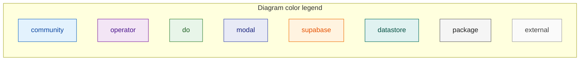

---

## 1. C4-style system context

Community members use ChatRAG (anonymous). Corpus operators use the admin UI (Supabase-authenticated). All corpus content is **public community material** — no end-user PII in Postgres.

```mermaid
C4Context
    title Vecinita — System Context (C4 Level 1)

    Person communityMember as "Community member"
    Person operator as "Corpus operator"

    System(vecinita as "Vecinita", "Bilingual RAG Q&A + corpus management") {
        System(chatrag as "ChatRAG", "Anonymous Q&A")
        System(admin as "Admin platform", "Ingest + corpus CRUD")
    }

    System_Ext(supabase as "Supabase Auth", "Operator identity only")
    System_Ext(publicWeb as "Public web", "Source URLs for ingest")

    Rel(communityMember, chatrag, "Asks questions (EN/ES)", "HTTPS")
    Rel(operator, admin, "Manages corpus", "HTTPS + JWT")
    Rel(operator, supabase, "Login / invite accept", "HTTPS")
    Rel(admin, publicWeb, "Scrapes public URLs", "HTTPS")
    Rel(admin, supabase, "Verify JWT", "JWKS")

    UpdateLayoutConfig($c4ShapeInRow="3", $c4BoundaryInRow="1")
```

---

## 2. C4-style container diagram

Shows the **Modal + DigitalOcean split** and where data stores live. Dashed boundary = zero PII in corpus DB (ADR-004).

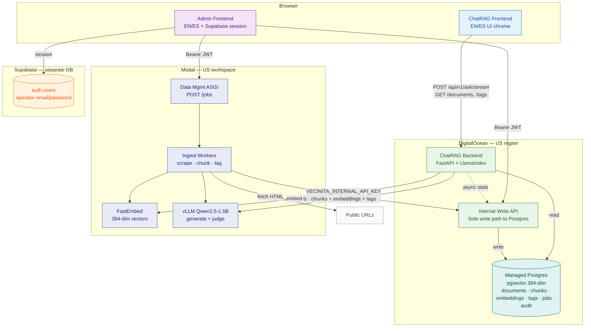

**PII boundary:** Postgres stores **no** emails, names, or chat history. Supabase holds operator identity only. Audit log may store opaque `actor_id` (UUID) — not PII (ADR-026).

---

## 3. Sequence — Ingest → embed → store

Operator submits URLs from admin UI. Content flows through Modal workers; persistence goes through DO internal write API only.

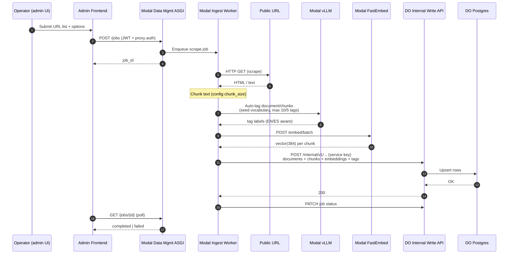

**Bilingual note:** Source pages may be EN or ES; tagging uses vocabulary slugs with language metadata. No translation step in ingest — content stored as scraped.

**Privacy note:** Job records store URL and status only — no operator email in Postgres.

---

## 4. Sequence — Query → retrieval → LLM response

Community member asks a question. ChatRAG is **stateless** — no server-side chat history (ADR-004, ADR-006).

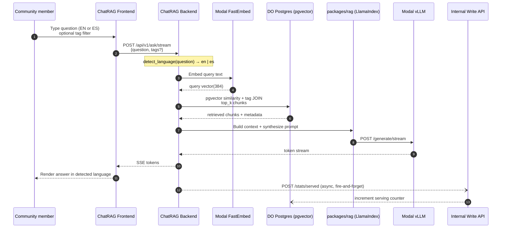

**Bilingual paths:**

| Step | EN path | ES path |
|------|---------|---------|
| UI chrome | `vecinita.locale=en` or browser `en*` | `vecinita.locale=es` or default ES |
| Query language | Auto-detect from question text | Auto-detect from question text |
| Response language | Matches detected query language | Matches detected query language |
| Retrieval | Same pgvector index; corpus has EN + ES documents | Same |

User-selected **tags** override LLM-inferred tags when provided (spec §Data Flow step 9).

---

## 5. Sequence — Admin / corpus management

Operators browse, edit tags, bulk delete, view audit — via internal write API. Ingest jobs via Modal ASGI.

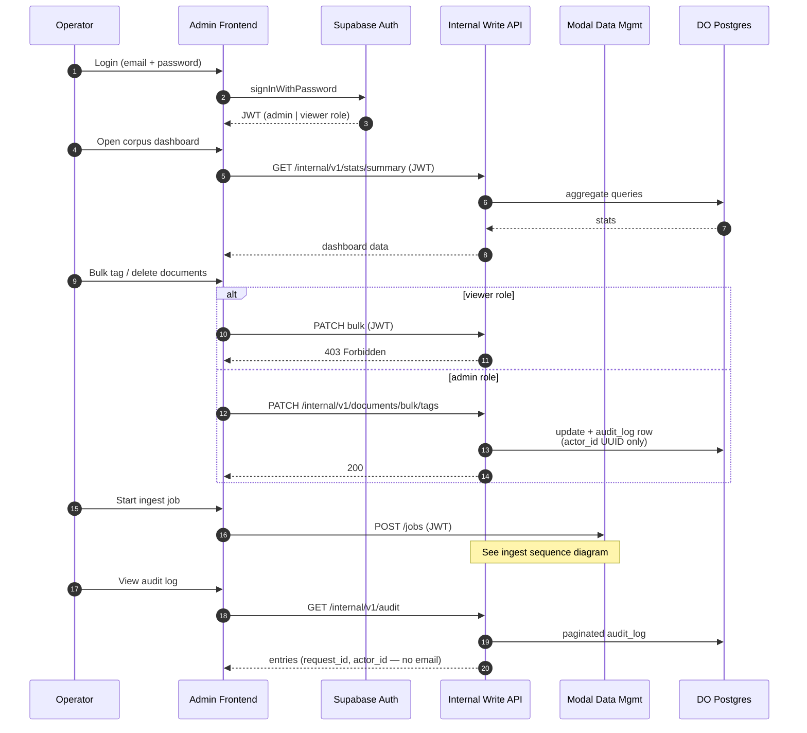

---

## 6. Evaluation path (admin — EV-008)

Golden-set eval runs use the same Modal LLM as ChatRAG for judging. Results stored in Postgres via internal write API.

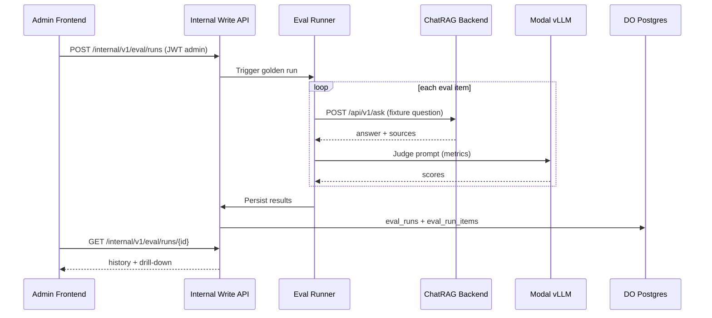

---

## 7. Data store summary

| Store | Contents | PII? | Region |
|-------|----------|------|--------|
| DO Postgres | Corpus, embeddings, jobs, audit, eval | No (opaque actor UUID only) | US (DO) |
| Supabase Auth | Operator accounts, invites | Yes — admin only, separate DB | Supabase project |
| Modal volumes | Model weights (FastEmbed, Qwen) | No user content | US Modal |
| Browser localStorage | `vecinita.locale`, eval dashboard prefs | Device-local only | Client |

---

## 8. Entity-relationship diagram (corpus Postgres)

Alembic head `20260702_0007`. **Supabase `auth.users` is a separate database** — not shown. `owner_id` / `promoted_by` / `actor_id` are opaque UUIDs only (ADR-004, ADR-026).

```mermaid
erDiagram
    documents ||--o{ chunks : "has"
    chunks ||--|| embeddings : "vector384"
    documents ||--o{ document_tags : "tagged"
    tags ||--o{ document_tags : "applied"
    chunks ||--o{ chunk_tags : "tagged"
    tags ||--o{ chunk_tags : "applied"
    documents ||--o{ document_versions : "history"
    documents ||--o| document_serving_stats : "served_count"
    eval_runs ||--o{ eval_run_items : "contains"
    eval_config_presets ||--o{ eval_runs : "optional preset"

    documents {
        uuid id PK
        text url UK
        text title
        text content_hash
        string language
        timestamptz created_at
    }
    chunks {
        uuid id PK
        uuid document_id FK
        int chunk_index
        text text
        int token_count
    }
    embeddings {
        uuid id PK
        uuid chunk_id FK UK
        vector384 embedding
    }
    tags {
        uuid id PK
        text slug
        text label
        string language
    }
    document_tags {
        uuid document_id FK
        uuid tag_id FK
        string source
    }
    chunk_tags {
        uuid chunk_id FK
        uuid tag_id FK
        string source
    }
    jobs {
        uuid id PK
        string status
        string job_type
        json urls
    }
    audit_log {
        uuid id PK
        string event_type
        uuid entity_id
        uuid request_id
        uuid actor_id
        string actor_role
        json payload
    }
    document_versions {
        uuid id PK
        uuid document_id FK
        int version_number
        json tags_snapshot
    }
    document_serving_stats {
        uuid document_id PK FK
        int served_count
    }
    eval_runs {
        uuid id PK
        string status
        string mode
        uuid preset_id FK
        json config_snapshot
        json metrics_summary
    }
    eval_run_items {
        uuid id PK
        uuid run_id FK
        string case_id
        text question
        json metrics
    }
    eval_criteria {
        uuid id PK
        string slug UK
        string scorer_type
        text rubric
        bool enabled
    }
    eval_config_presets {
        uuid id PK
        string preset_name
        uuid owner_id
        json config
        bool shared
    }
    rag_production_config {
        uuid id PK
        json config
        int config_version
        bool is_active
        uuid promoted_by
    }
    config {
        text key PK
        json value
    }
```

**Note:** `GET /jobs` may surface eval runs with virtual `job_type=eval` merged from `eval_runs` (F37) — not a `jobs` table column.

---

## 9. State diagram — ingest job lifecycle

Modal ingest workers update job status via the internal write API. Operators poll from the admin UI.

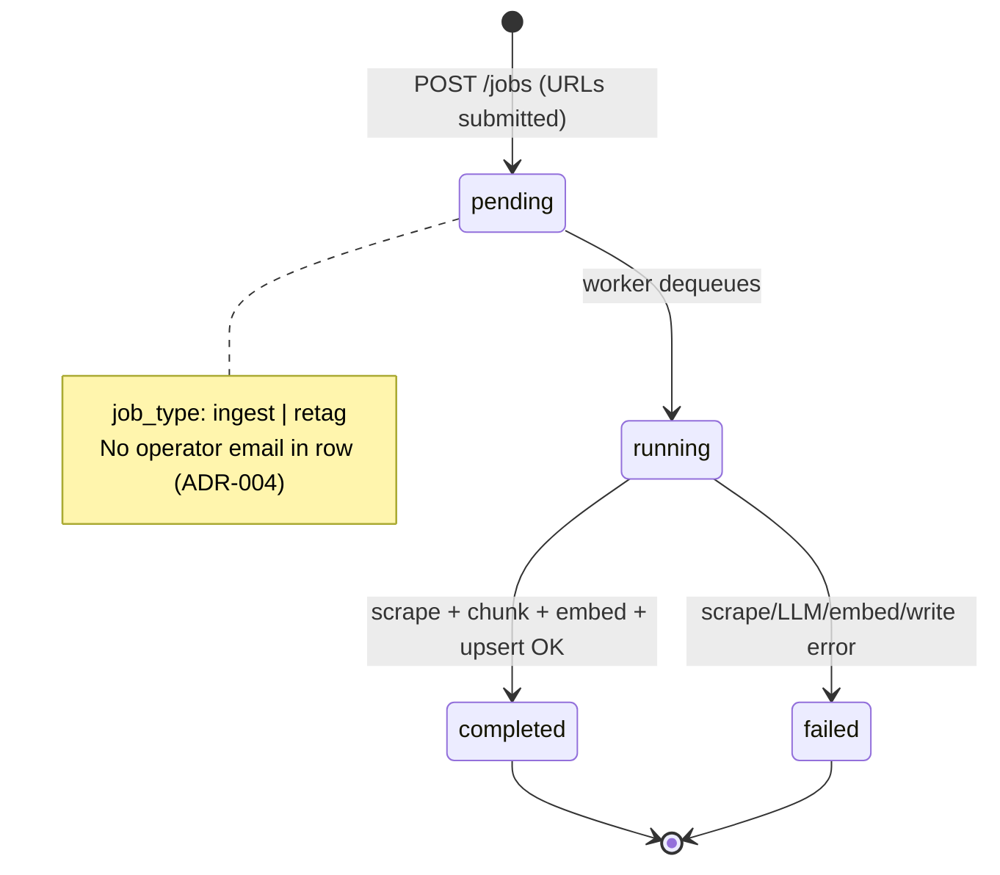

---

## 10. State diagram — eval run lifecycle

Golden-set and playground eval runs (F36, F37). Persisted in `eval_runs`; items in `eval_run_items`.

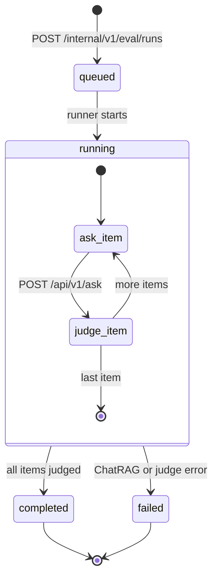

---

## 11. State diagram — admin auth session

Operator identity lives in **Supabase only**. JWT carries `admin` or `viewer` role claim for internal-write API authorization.

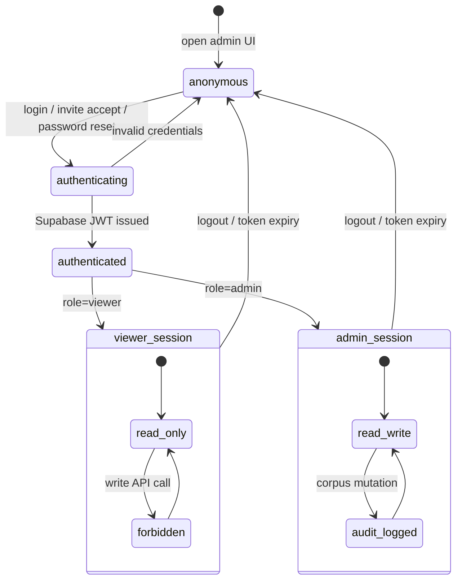

---

## 12. Class diagram — RAG pipeline (`packages/rag`)

Core types used by ChatRAG backend. LlamaIndex `BaseRetriever` adapter wraps pgvector SQL.

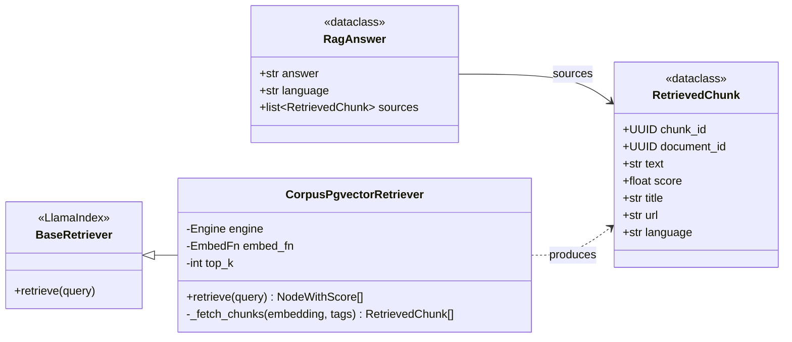

---

## 13. Class diagram — shared schemas (write path)

Pydantic models in `packages/shared-schemas` at the Modal → internal-write API boundary.

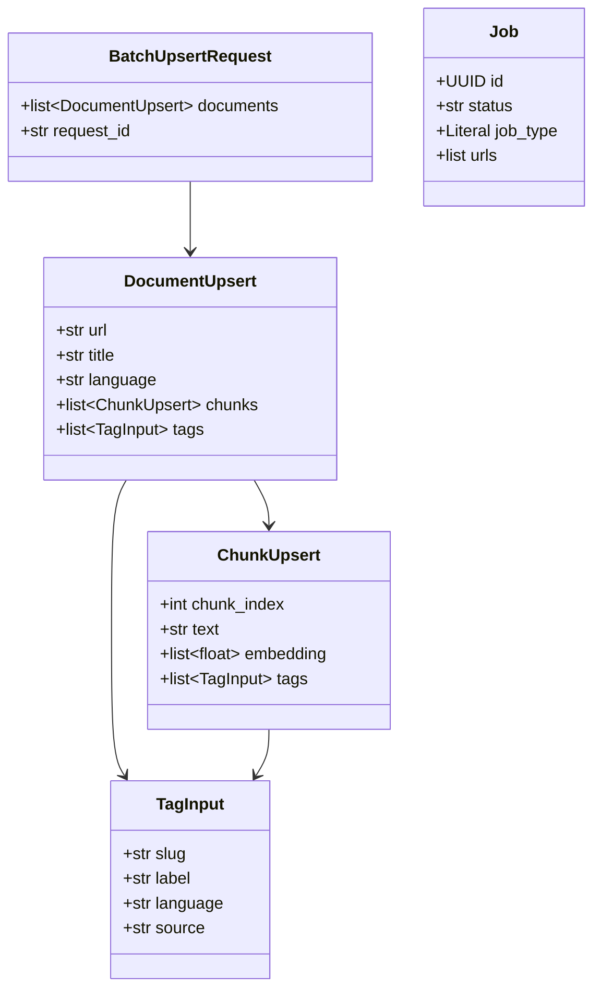

---

## 14. Requirement diagram — features to components

Traceability from [feature-list.md](feature-list.md) to deployable components. Verification via [test-plan.md](test-plan.md) / `tests/e2e/`.

```mermaid
requirementDiagram

    requirement F1_bilingual_qa {
        id: F1
        text: Bilingual community Q&A (RAG)
        risk: high
        verifymethod: test
    }

    requirement F7_ingest {
        id: F7
        text: URL scrape, chunk, embed, store
        risk: high
        verifymethod: test
    }

    requirement F15_privacy {
        id: F15
        text: Zero PII in corpus DB
        risk: high
        verifymethod: inspection
    }

    requirement F34_admin_auth {
        id: F34
        text: Supabase auth for admin surfaces
        risk: medium
        verifymethod: test
    }

    requirement F36_eval {
        id: F36
        text: Golden-set RAG evaluation
        risk: medium
        verifymethod: test
    }

    element chat_rag_backend {
        type: module
        docref: apps/chat-rag-backend
    }

    element chat_rag_frontend {
        type: module
        docref: apps/chat-rag-frontend
    }

    element modal_workers {
        type: module
        docref: apps/data-management-backend
    }

    element internal_write_api {
        type: module
        docref: apps/internal-write-api
    }

    element supabase_auth {
        type: module
        docref: supabase/
    }

    element eval_runner {
        type: module
        docref: packages/eval
    }

    element privacy_tests {
        type: test
        docref: tests/privacy/
    }

    F1_bilingual_qa - satisfies -> chat_rag_backend
    F1_bilingual_qa - satisfies -> chat_rag_frontend
    F7_ingest - satisfies -> modal_workers
    F7_ingest - satisfies -> internal_write_api
    F15_privacy - satisfies -> privacy_tests
    F15_privacy - satisfies -> internal_write_api
    F34_admin_auth - satisfies -> supabase_auth
    F34_admin_auth - satisfies -> internal_write_api
    F36_eval - satisfies -> eval_runner
    F36_eval - satisfies -> internal_write_api
```

---

## 15. User journey maps (Mermaid `journey`)

Satisfaction scores are illustrative (1–5). Full step lists: [user-journeys.md](user-journeys.md).

### UJ-001 — Ask community question (streaming)

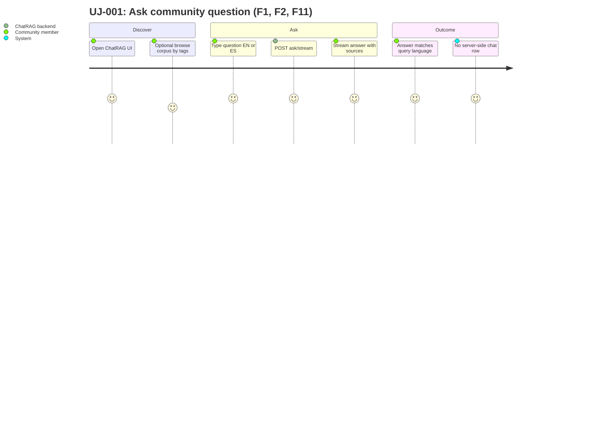

### UJ-002 — Ingest public URLs

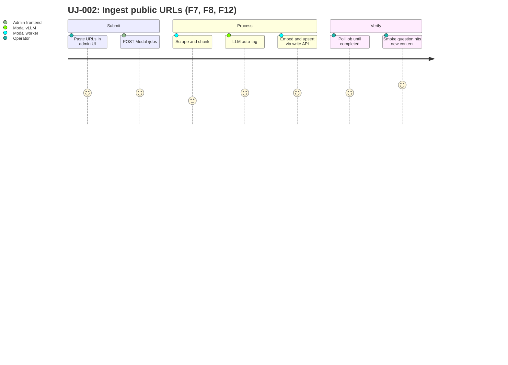

### UJ-026 — Admin login

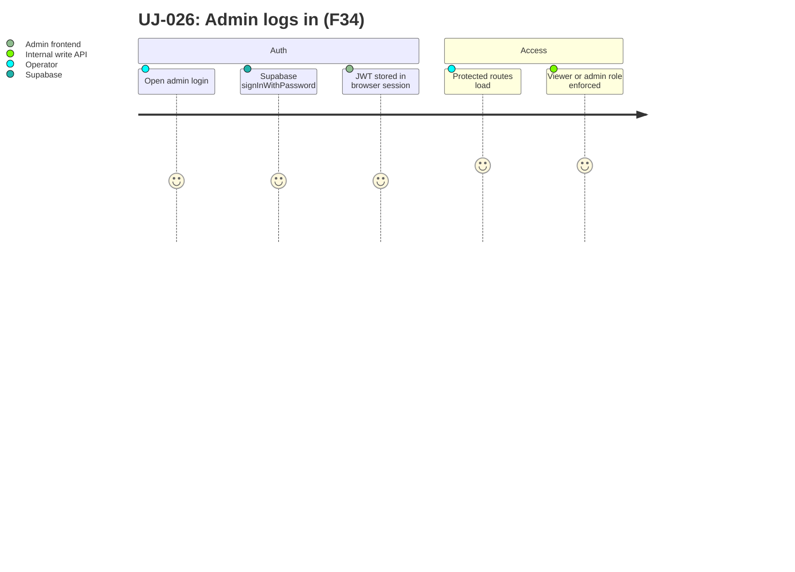

---

## 16. Flowchart — query path (RAG decision flow)

End-to-end ChatRAG query logic from browser to streamed response.

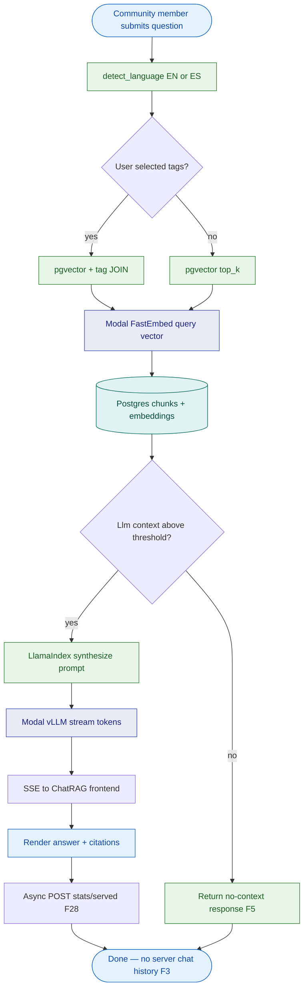

---

## 17. Flowchart — CI/CD deploy pipeline

On merge to `main`. See [architecture.md](architecture.md) §Deploy pipeline and [ci-after-push.mdc](../.cursor/rules/ci-after-push.mdc).

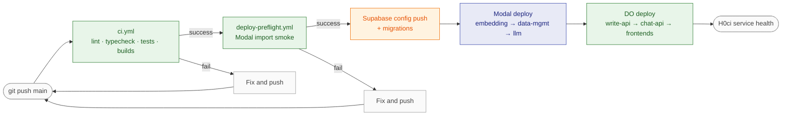

---

## References

- [architecture.md](architecture.md) — service map and environments
- [spec.md](spec.md) §Data Flow — tabular stage list
- [ADR-004](adr/ADR-004-cost-sovereignty-zero-personal-data.md) — zero PII
- [ADR-007](adr/ADR-007-modal-do-database-write-boundary.md) — write boundary
- [runbooks/corpus-operator-guide.md](runbooks/corpus-operator-guide.md) — operator procedures
