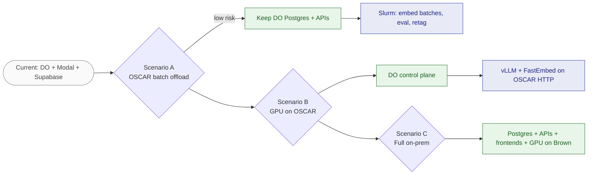

# Hosting Migration Summary — Architecture & Infrastructure

> **Purpose:** Executive summary for stakeholders evaluating a **hosting switch** (e.g. Brown University / OSCAR vs current DigitalOcean + Modal)  
> **Issues:** [#55](https://github.com/Math-Data-Justice-Collaborative/vecinita/issues/55) · [#56](https://github.com/Math-Data-Justice-Collaborative/vecinita/issues/56) · [#92](https://github.com/Math-Data-Justice-Collaborative/vecinita/issues/92)  
> **Last updated:** 2026-07-03  
> **Detail:** [architecture.md](architecture.md) · [oscar-hosting-feasibility.md](oscar-hosting-feasibility.md)

---

## Executive summary

Vecinita is a **bilingual community Q&A + corpus admin** platform deployed as **eight runtime services** across **DigitalOcean** (HTTP + Postgres) and **Modal** (GPU/CPU inference), with **Supabase** for admin login only.

A hosting migration is **feasible in phases**. The lowest-risk path is offloading **batch GPU/CPU work** (ingest embedding, evaluation runs) to **Brown OSCAR** while keeping **interactive ChatRAG** on cloud until latency and public HTTPS requirements are validated on OSCAR.

Full migration (Postgres + all APIs to Brown) is **high effort** and should follow a successful Phase A batch offload proof.

---

## Current state at a glance

| Category | Today | Monthly cost (est.) |
|----------|-------|---------------------|
| Managed Postgres (pgvector) | DigitalOcean | ~$15 |
| 4× DO App Platform services | Chat API, write API, 2× static frontends | ~$20–27 |
| Modal GPU (vLLM T4, scale-to-zero) | US workspace `vecinita` | ~$5–20 |
| Modal CPU (embed, ingest, ASGI) | Same workspace | ~$2–8 |
| Supabase Pro (admin auth) | Cloud | ~$25 |
| **Total** | Hybrid cloud | **~$67–75/mo** (post EV-005); pilot target was ≤$50 (ADR-004) |

**Live staging:** [deploy-state.md](deploy-state.md) (URLs verified 2026-06-26).

**Privacy model:** Corpus DB is **zero PII** (ADR-004). Chat is anonymous. Operators authenticate via Supabase — identity never stored in corpus Postgres (ADR-026).

---

## Architecture inventory (what must exist in any host)

### Must-have components

| # | Component | Function | Hard requirements |
|---|-----------|----------|-------------------|
| 1 | Postgres 15+ **pgvector** | Corpus + embeddings (384-dim) | Alembic migrations; US residency |
| 2 | ChatRAG backend | RAG `/api/v1/ask`, public browse | HTTPS, CORS, p95 < 15s, `DATABASE_URL` read |
| 3 | Internal write API | Sole Postgres **writer** for workers | Service auth; Supabase JWT for admin |
| 4 | ChatRAG frontend | Static SPA | Build-time API URL |
| 5 | Admin frontend | Static SPA + Supabase client | Invite-only auth |
| 6 | Embedding service | FastEmbed 384-dim | HTTP `/embed` |
| 7 | LLM service | vLLM Qwen2.5-1.5B | HTTP `/generate`, GPU |
| 8 | Ingest orchestration | Job queue + scrape/chunk/tag | Calls write API — **no direct DB** |
| 9 | Supabase (or replacement) | Admin identity | JWT verification on admin APIs |

### Critical design rules (non-negotiable without ADR)

1. **Modal/worker → Postgres:** only via internal write API (ADR-007)
2. **No PII in corpus DB** — forbidden tables enforced in CI (ADR-004)
3. **US-only** infrastructure unless ADR amended (ADR-004 sovereignty)
4. **Self-hosted LLM/embed** by default — no paid API dependency (ADR-008, ADR-009)

---

## Environment & secrets (migration checklist)

| Asset | Current location | Migration action |
|-------|------------------|------------------|
| `DATABASE_URL` | DO app secrets | Export dump; restore on target Postgres; re-point secrets |
| Alembic revisions | `apps/database/alembic/` | `alembic upgrade head` on new DB |
| Seed/fixture corpus | `data/fixtures/` + DB rows | Re-seed or pg_dump restore |
| Modal model volumes | Modal `embedding-models`, `llm-models` | Re-stage on OSCAR shared FS or new volume |
| `VECINITA_INTERNAL_API_KEY` | DO + Modal secrets | Rotate; sync all consumers |
| Modal/DO URLs | Env vars per app | Update `VITE_*` + redeploy frontends |
| Supabase project | Cloud | Update redirect URLs; or migrate to Brown IdP |
| GitHub CI secrets | `MODAL_TOKEN_*`, `DIGITALOCEAN_TOKEN` | Add OSCAR deploy credentials if needed |
| DNS | `*.ondigitalocean.app` | New domains + TLS certs on target |

Secrets matrix: [staging-secrets-matrix.md](staging-secrets-matrix.md).

---

## Deploy pipeline today

Full CI/CD flowchart: [data-flow.md §17](data-flow.md#17-flowchart--cicd-deploy-pipeline).

Manual staging order: Postgres → migrations → Modal → DO apps → H1–H6 health tiers.

Any new host must replicate **ordered deploy** and **health gates** — see [staging-runbook.md](staging-runbook.md).

---

## Migration path (scenarios)

Color legend: [data-flow.md §Color legend](data-flow.md#color-legend). Recommended progression: **A → B → C** only after each phase passes health gates.

## Migration scenarios

### Scenario A — OSCAR batch offload only (recommended first)

| Stays on cloud | Moves to OSCAR |
|----------------|----------------|
| DO Postgres + HTTP APIs | Slurm: ingest embed batches, eval runs, bulk retag |
| Modal vLLM for interactive chat | GPU queue for offline jobs |

**Effort:** Medium (weeks)  
**Risk:** Low  
**Cost impact:** Reduces Modal GPU hours; DO unchanged  

### Scenario B — GPU on OSCAR, control plane on DO

| Stays | Moves |
|-------|-------|
| DO Postgres + APIs + frontends | vLLM + FastEmbed on OSCAR with HTTP reverse proxy |

**Effort:** Medium–high  
**Risk:** Medium (chat latency, HTTPS to OSCAR)  
**Cost impact:** May eliminate Modal GPU line item  

### Scenario C — Full Brown/on-prem hosting

| Moves |
|-------|
| Postgres, all APIs, frontends, GPU inference |

**Effort:** High (months)  
**Risk:** High (ops, SLA, public access, Supabase replacement)  
**Cost impact:** Depends on Brown allocation vs cloud bill  

---

## Open questions for stakeholders ([#55](https://github.com/Math-Data-Justice-Collaborative/vecinita/issues/55))

| Topic | Question | Status |
|-------|----------|--------|
| Sovereignty | Must all data remain on Brown networks? | Open |
| Budget | Is ~$75/mo cloud acceptable during transition? | Open |
| Timeline | Fixed cutover date? | Open — early planning |
| Public access | Anonymous community ChatRAG from internet — approved on OSCAR? | Open — see [#92](oscar-hosting-feasibility.md) Q7 |
| Identity | Keep Supabase vs Brown SSO? | Open |
| DNS | Brown subdomain vs continue DO URLs? | Open |
| Ops ownership | Who runs Postgres backups, on-call? | Open |
| GPU | Reserved warm GPU vs queue wait for chat? | Open |

---

## Gap analysis — documentation delivered (2026-07-03)

| Issue | Deliverable | Path |
|-------|-------------|------|
| #56 | Architecture overview | [architecture.md](architecture.md) |
| #58 | Data flow diagrams (Mermaid) | [data-flow.md](data-flow.md) |
| #52 | Dev guide | [runbooks/data-management-dev-guide.md](runbooks/data-management-dev-guide.md) |
| #52 | Operator guide | [runbooks/corpus-operator-guide.md](runbooks/corpus-operator-guide.md) |
| #92 | OSCAR feasibility for Carlos | [oscar-hosting-feasibility.md](oscar-hosting-feasibility.md) |
| #55 + #92 | This summary | [hosting-migration-summary.md](hosting-migration-summary.md) |

### Remaining doc gaps

| Gap | Action |
|-----|--------|
| Carlos answers Q1–Q10 | Update oscar-hosting-feasibility.md Response column |
| Production URLs at cutover | Update deploy-state.md |
| ADR for OSCAR topology | Create after stakeholder sign-off |
| Runbook for OSCAR Slurm jobs | Future — after Phase A approved |

---

## Recommended next steps

1. **Review** this summary + [oscar-hosting-feasibility.md](oscar-hosting-feasibility.md) with Carlos/CCV
2. **Answer** open questions in [#55](https://github.com/Math-Data-Justice-Collaborative/vecinita/issues/55) checklist
3. **Prototype** one OSCAR Slurm job: embed fixture batch → POST to staging internal write API
4. **Decide** Scenario A vs B vs C; record ADR
5. **Plan cutover** only after H1–H6 smokes pass on target environment

---

## Quick reference links

| Doc | Use when |
|-----|----------|
| [architecture.md](architecture.md) | Service map, env matrix, deploy pipeline |
| [data-flow.md](data-flow.md) | ERD, sequences, state, class, requirement, journey diagrams |
| [deployment-integration.md](deployment-integration.md) | EV-specific redeploy order |
| [deploy-state.md](deploy-state.md) | Live staging URLs |
| [infra/do/README.md](../infra/do/README.md) | DO App Platform specs |
| [infra/modal/README.md](../infra/modal/README.md) | Modal apps |
| [adr/README.md](adr/README.md) | Architectural decisions |
