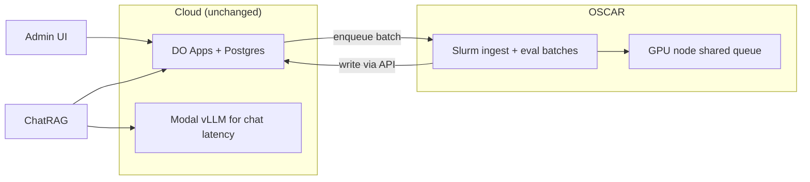

# OSCAR Hosting Feasibility — Architecture Offload Review

> **Audience:** Carlos (Brown CCV) + Vecinita infra team  
> **Issue:** [#92](https://github.com/Math-Data-Justice-Collaborative/vecinita/issues/92)  
> **Last updated:** 2026-07-03  
> **Companion:** [hosting-migration-summary.md](hosting-migration-summary.md) · [architecture.md](architecture.md)

---

## Purpose

This document frames Vecinita's **current architecture** for review with Brown CCV, with the goal of identifying **what can offload onto OSCAR** (Brown's HPC cluster) versus what must remain on cloud App Platform / managed services.

It answers the open questions from the Carlos prototype-review meeting (2026-06-26) and extends discovery tracked in [#55](https://github.com/Math-Data-Justice-Collaborative/vecinita/issues/55) and [#56](https://github.com/Math-Data-Justice-Collaborative/vecinita/issues/56).

**Action for Joe:** Share this doc with Carlos asynchronously; record answers inline or in follow-up ADRs.

---

## Current architecture (baseline)

Vecinita today runs a **hybrid stack**:

| Layer | Current host | Workload |
|-------|--------------|----------|
| HTTP APIs + Postgres reads/writes | DigitalOcean App Platform + Managed Postgres | ChatRAG API, internal write API, pgvector |
| Static frontends | DO App Platform | Chat + admin React SPAs |
| GPU/CPU inference | Modal (US) | FastEmbed, vLLM Qwen2.5-1.5B, ingest workers |
| Admin auth | Supabase | Operator login (separate from corpus DB) |

**Monthly cost envelope:** ~$42–75/mo depending on Supabase tier and GPU cold-start usage (ADR-004, ADR-027).

Full service map: [architecture.md](architecture.md).

---

## Offload candidates — what maps to OSCAR?

OSCAR is typically **batch/slurm HPC** with optional GPU nodes — not a direct replacement for always-on HTTP App Platform or serverless edge. The table below rates each Vecinita component for OSCAR suitability.

| Component | Current | OSCAR fit | Offload model | Notes |
|-----------|---------|-----------|---------------|-------|
| **vLLM inference** | Modal GPU T4, scale-to-zero | **High** | Slurm job + shared GPU queue; or persistent GPU node if budget allows | Largest GPU cost today; batch-friendly for eval; interactive chat needs low latency |
| **FastEmbed** | Modal CPU | **Medium** | CPU batch jobs or sidecar on GPU node | Lower priority than LLM; CPU-heavy |
| **Ingest scrape workers** | Modal queue | **High** | Slurm array jobs per URL batch | Embarrassingly parallel; no persistent HTTP needed |
| **Eval runner (golden set)** | Modal or DO-triggered | **High** | Scheduled Slurm job | Offline batch — ideal HPC pattern |
| **ChatRAG backend** | DO always-on | **Low** | Would need Brown-hosted VM/k8s with public HTTPS | Needs stable URL, CORS, p95 < 15s |
| **Internal write API** | DO always-on | **Low–Medium** | VM/container on Brown network | Must hold Postgres connection; public or VPN reachability from workers |
| **Postgres + pgvector** | DO Managed | **Low on OSCAR** | Separate decision — Brown DB service or self-hosted on VM | pgvector ops expertise required |
| **Frontends** | DO static | **Low** | Static hosting anywhere (S3, nginx, DO) | Build artifacts only |
| **Supabase Auth** | Supabase cloud | **None on OSCAR** | Keep managed or replace with Brown IdP | Identity is not HPC workload |

### Recommended offload priority (for Carlos discussion)

1. **Phase A — Batch GPU/CPU (low risk):** ingest embed batches, eval golden runs, bulk retag jobs → OSCAR Slurm
2. **Phase B — Interactive LLM (medium risk):** vLLM on dedicated OSCAR GPU node with HTTP proxy; compare latency vs Modal cold start
3. **Phase C — Full migration (high risk):** move Postgres + HTTP APIs to Brown — only after Phase A/B prove ops model

---

## OSCAR hosting questions (for Carlos / CCV)

Please answer or point to Brown documentation. Record responses in the **Responses** column (or linked issue/ADR).

| # | Question | Context | Response |
|---|----------|---------|----------|
| Q1 | How does **hosting a web service** work on OSCAR? | ChatRAG needs HTTPS endpoints, not just batch jobs | _Pending Carlos_ |
| Q2 | Is there **serverless** on OSCAR (scale-to-zero, pay-per-invoke)? | Modal today scales LLM/embed to zero | _Pending Carlos_ |
| Q3 | **GPU availability** — which queues, limits, max job duration? | vLLM on T4 today; eval + chat share GPU | _Pending Carlos_ |
| Q4 | **Rate limits**, fair-share, or account quotas? | Community traffic spikes on ChatRAG | _Pending Carlos_ |
| Q5 | **Persistent storage** for model weights (~GB) and job outputs? | FastEmbed + Qwen weights on Modal volumes today | _Pending Carlos_ |
| Q6 | **Egress / inbound HTTPS** from internet to OSCAR-hosted API? | Community users are non-Brown, often unauthenticated | _Pending Carlos_ |
| Q7 | Are **non-authenticated community members** acceptable use? | ChatRAG is anonymous public Q&A — see access-model discussions | _Pending Carlos_ |
| Q8 | **Postgres or managed DB** on Brown — recommended pattern for pgvector? | Corpus is ~GB scale today, growing with ingest | _Pending Carlos_ |
| Q9 | **Secrets management** (API keys, DB URLs) on OSCAR? | Today: DO/Modal/GitHub secrets | _Pending Carlos_ |
| Q10 | **Compliance / data residency** — is all data required to stay on Brown networks? | ADR-004 US-only; Brown move may tighten further | _Pending Carlos_ |

---

## Architecture options (sketches)

### Option 1 — Minimal offload (recommended first step)

Keep DO + Modal for interactive path; run **batch ingest embed** and **eval jobs** on OSCAR.

**Pros:** Low cutover risk; proves OSCAR ops.  
**Cons:** Dual infra; still pay Modal for chat GPU.

### Option 2 — GPU on OSCAR, control plane on DO

Move vLLM + FastEmbed to OSCAR GPU; DO keeps Postgres + HTTP APIs.

**Pros:** Cuts Modal GPU cost.  
**Cons:** Need stable HTTP proxy to OSCAR; cold-start vs Slurm scheduling latency for chat.

### Option 3 — Full Brown hosting

Postgres + all APIs + frontends on Brown; OSCAR for GPU only or integrated.

**Pros:** Single institution sovereignty.  
**Cons:** Highest migration cost; lose Modal scale-to-zero; ops burden on CCV.

---

## Non-authenticated community access (Q7 detail)

ChatRAG intentionally serves **anonymous** community members (no login). Implications for OSCAR/Brown:

- Public HTTPS endpoint required (or CDN in front)
- Abuse/rate limiting currently informal — need Brown-approved approach
- No PII stored from chat queries (ADR-004) — reduces compliance scope but not abuse risk
- Admin surfaces remain Supabase-authenticated (operators only)

Cross-reference: access-model issue (invite-only admin vs public chat).

---

## What we cannot move to OSCAR without redesign

| Constraint | Reason |
|------------|--------|
| Modal `@asgi_app` + proxy auth pattern | OSCAR is not Modal; rewrite job API as Slurm + status DB |
| Scale-to-zero GPU for chat | HPC queues add queue wait — bad for interactive p95 < 15s unless warm GPU reserved |
| `DATABASE_URL` on Modal workers | Already forbidden (ADR-007) — any OSCAR worker must call write API too |
| Supabase Auth | Managed SaaS — replace only with Brown IdP + ADR update |

---

## Decision log (fill after Carlos review)

| Decision | Date | Outcome |
|----------|------|---------|
| Offload Phase A scope | | |
| Interactive LLM stays Modal vs OSCAR | | |
| Postgres stays DO vs Brown | | |
| Target cutover timeline | | |
| Budget vs ADR-004 $50 cap | | |

---

## Next steps

1. **Joe → Carlos:** Send this doc + [hosting-migration-summary.md](hosting-migration-summary.md)
2. **Record answers** in Q1–Q10 table above
3. **Spin ADRs** for any topology change (Stage 07-build or evolve cycle)
4. **Update [#55](https://github.com/Math-Data-Justice-Collaborative/vecinita/issues/55)** checklist with stakeholder answers
5. **Prototype:** one Slurm job — embed batch from staging fixture → write API smoke

---

## References

- [architecture.md](architecture.md)
- [data-flow.md](data-flow.md)
- [hosting-migration-summary.md](hosting-migration-summary.md)
- [ADR-004](adr/ADR-004-cost-sovereignty-zero-personal-data.md) — sovereignty + zero PII
- [ADR-009](adr/ADR-009-vllm-primary-llm-modal.md) — vLLM on Modal
- [ADR-022](adr/ADR-022-gpu-memory-snapshot-cold-start.md) — cold-start tradeoffs
