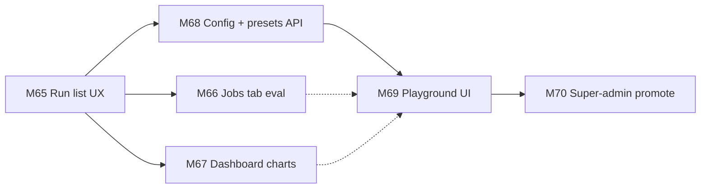
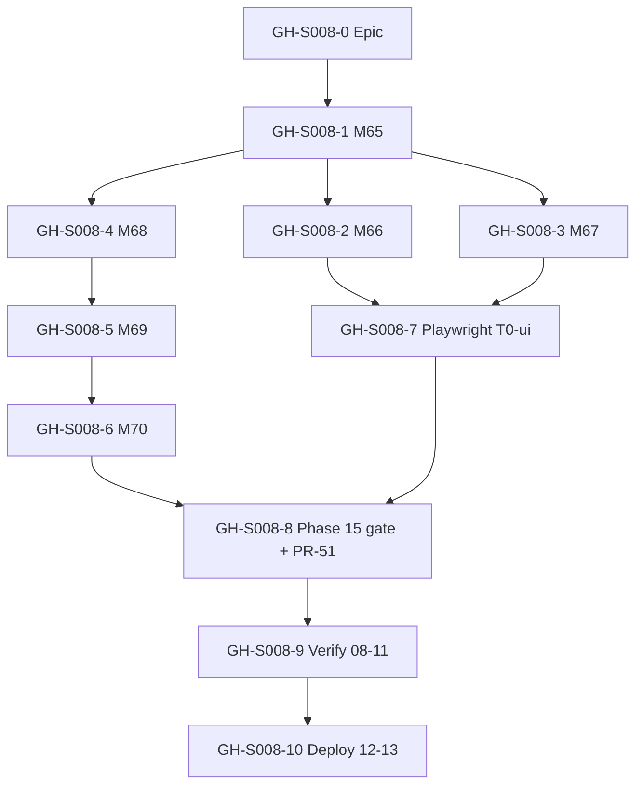
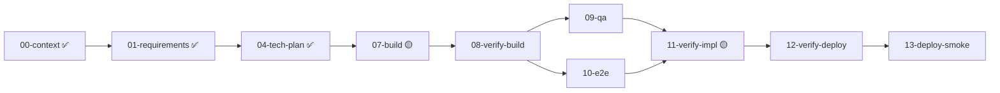
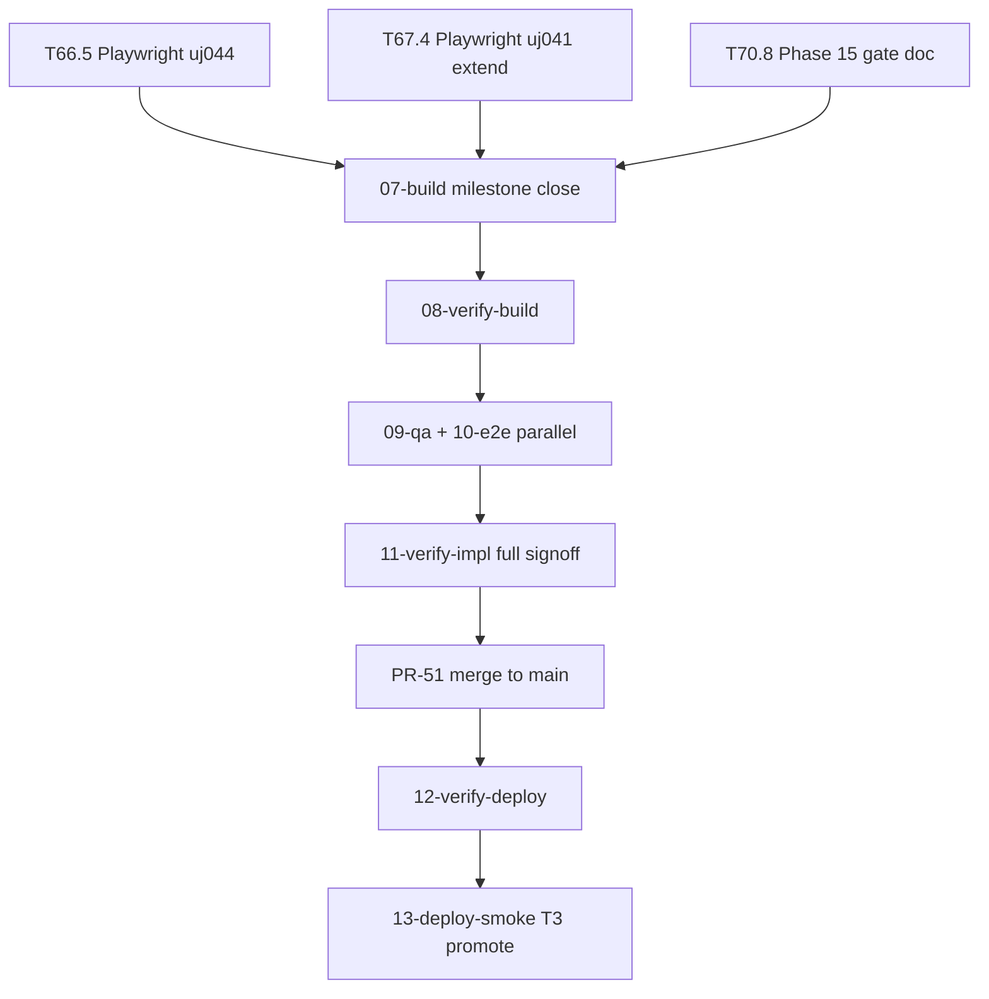
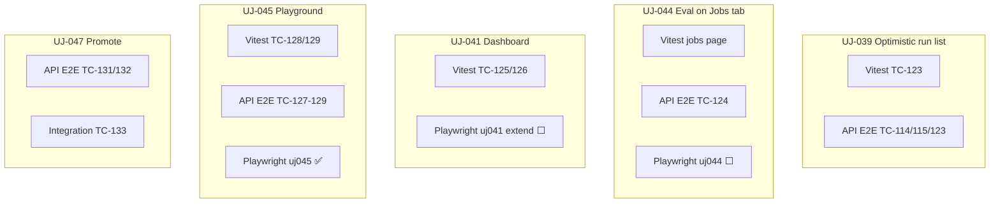
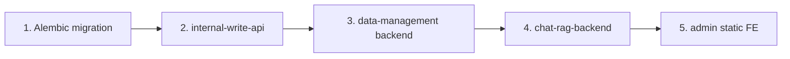

# Session roadmap — S008 / EV-009

> **Session:** S008-eval-ux-playground  
> **Evolve cycle:** EV-009  
> **Features:** F36 follow-ons (M65–M67), F37 (M68–M70)  
> **Branch:** `feat/S008-eval-ux-playground` → `main` (PR-51)  
> **Last updated:** 2026-07-03  
> **Sources:** [session-brief](./session-brief.md) · [routing-plan](./routing-plan.md) · [execution-plan](../../execution-plan.md) Phase 15 · [ADR-035](../../adr/ADR-035-ev009-eval-playground-production-config.md)

## Purpose

This document decomposes the approved session scope into **GitHub-trackable issues** with explicit
dependencies. It is produced after **01-requirements** and **04-tech-plan** (execution-plan tasks
exist) and updated through **07-build** and deploy stages.

**Board:** [Math-Data-Justice-Collaborative/vecinita Project #3](https://github.com/orgs/Math-Data-Justice-Collaborative/projects/3)  
**Issue conventions:** [project-board.md](../../project-board.md)

---

## Vision (session)

Deliver evaluation UX polish (optimistic run list, unified Jobs tab, richer dashboard charts) and
an admin **Playground** for sandboxed RAG + judge configuration, with **super-admin runtime promote**
to production ChatRAG — without redeploying Modal/DO for every config tweak.

---

## Current state

| Track | Status | Notes |
|-------|--------|-------|
| 00-context | ✅ Complete | [eval-ux-playground.md](../../context/eval-ux-playground.md) |
| 01-requirements | ✅ Complete | F37 + F36 follow-ons; RD-114–RD-130 |
| 04-tech-plan | ✅ Complete | ADR-035, TP-S008-01–16, Phase 15 |
| 07-build M65–M70 | 🟡 Nearly complete | T67.4 Playwright pending; T70.8 gate doc in progress |
| 08–10 verify | ⬜ Pending | Formal verify-build, QA, E2E |
| 11-verify-impl | 🟡 Partial | M65–M69 inline; full signoff after M70 + formal 09/10 |
| 12–13 deploy | ⬜ Pending | Migration → API → FE redeploy order per TP-S008-16 |

---

## GitHub issue map

Proposed issues for this session. Create the **epic first**, then sub-issues; link with
`Blocks` / `Blocked by` in issue bodies or project board dependencies.

| ID | Title | Labels | Execution tasks | Depends on | Status |
|----|-------|--------|-----------------|------------|--------|
| **GH-S008-0** | `[EV-009] Epic — Eval UX polish + Playground (S008)` | `evolve`, `app:admin` | Phase 15 gate | — | ⬜ Create |
| **GH-S008-1** | `[EV-009][F36] M65 — Optimistic eval run list + poll UX` | `evolve`, `app:admin` | T65.1–T65.3 | — | ✅ Done |
| **GH-S008-2** | `[EV-009][F36] M66 — Unified jobs API + Jobs tab eval rows` | `evolve`, `app:admin` | T66.1–T66.6 | GH-S008-1 | ✅ Complete |
| **GH-S008-3** | `[EV-009][F36] M67 — Dashboard scatter + time-range presets` | `evolve`, `app:admin` | T67.1–T67.5 | GH-S008-1 | 🟡 T67.4 Playwright open |
| **GH-S008-4** | `[EV-009][F37] M68 — Config schema + preset API + DB` | `evolve`, `app:admin`, `app:infra` | T68.1–T68.13 | GH-S008-1 | ✅ Done |
| **GH-S008-5** | `[EV-009][F37] M69 — Playground UI (golden + ad-hoc + compare)` | `evolve`, `app:admin` | T69.1–T69.9 | GH-S008-4 | ✅ Done |
| **GH-S008-6** | `[EV-009][F37] M70 — Super-admin promote + ChatRAG config reader` | `evolve`, `app:admin`, `app:chat-rag`, `deploy` | T70.1–T70.8 | GH-S008-5 | 🟡 T70.8 gate doc |
| **GH-S008-7** | `[EV-009] Playwright T0-ui — UJ-044 + UJ-041 dashboard` | `evolve`, `app:admin` | T66.5, T67.4 | GH-S008-2, GH-S008-3 | ⬜ Open |
| **GH-S008-8** | `[EV-009] Phase 15 gate + PR-51 merge` | `evolve`, `deploy` | T70.8, Phase 15 gate | GH-S008-6, GH-S008-7 | ⬜ Open |
| **GH-S008-9** | `[EV-009] S008 verify pipeline (08 → 09 → 10 → 11)` | `evolve` | Stages 08–11 | GH-S008-8 | ⬜ Open |
| **GH-S008-10** | `[EV-009] S008 staging deploy + smoke (12 → 13)` | `evolve`, `deploy` | Stages 12–13, T3 smokes | GH-S008-9 | ⬜ Open |

### Epic body template (GH-S008-0)

```markdown
## Summary
Session S008 / EV-009 — evaluation UX polish + Playground + super-admin runtime promote.

## Features
- F36 follow-ons: optimistic run list, unified Jobs tab, dashboard charts (M65–M67)
- F37: Playground, versioned presets, super-admin promote (M68–M70)

## Spec links
- ADR-035, execution-plan Phase 15
- UJ-039, UJ-041, UJ-044–UJ-047
- TC-123–TC-134

## Session artifacts
docs/sessions/S008-eval-ux-playground/roadmap.md
```

### Sub-issue body checklist

Each milestone issue should include:

- **Feature ID:** F36 or F37  
- **User journeys:** UJ-NNN  
- **Test cases:** TC-NNN  
- **Apps touched:** data-management-frontend, internal-write-api, chat-rag-backend, Modal eval  
- **Depends on:** upstream issue numbers (after creation)  
- **Definition of done:** tasks green in execution-plan; tests per test-plan layer

---

## Task inventory (execution-plan Phase 15)

| Task | Milestone | Type | Status | Spec |
|------|-----------|------|--------|------|
| T65.1–T65.3 | M65 | Test + Code | ✅ | TC-123, UJ-039 |
| T66.1–T66.4, T66.6 | M66 | Test + Code | ✅ | TC-124, UJ-044 |
| T66.5 | M66 | Playwright | ✅ | `uj044-eval-jobs-tab.spec.ts` |
| T67.1–T67.3, T67.5 | M67 | Test + Code | ✅ | TC-125/126, UJ-041 |
| T67.4 | M67 | Playwright | ✅ | extend `uj041-eval-dashboard-tabs.spec.ts` |
| T68.1–T68.13 | M68 | Test + Code + Config | ✅ | TC-127, TC-134 |
| T69.1–T69.9 | M69 | Test + Code | ✅ | TC-128–130, UJ-045/046 |
| T70.1–T70.7 | M70 | Test + Code + Config | ✅ | TC-131–133, UJ-047 |
| T70.8 | M70 | Docs | 🟡 | Phase 15 gate checklist |

---

## Dependency diagrams

### 1. Milestone build order (approved TP-S008-01)

Sequential UX-first, playground last. M66/M67 can proceed in parallel after M65.



### 2. GitHub issue dependencies

Solid = hard blocker; dashed = soft / parallel track.



### 3. Session routing plan (pipeline stages)



### 4. Remaining work critical path

What blocks session close today:



### 5. Test-layer coverage by journey



---

## Phase gate checklist (exit criteria)

From execution-plan Phase 15 gate:

- [x] All M65–M70 tasks completed (incl. T66.5, T67.4, T70.8) — 2026-07-03
- [x] TC-123–TC-133 green; UJ-044–047 covered at T2 — 2026-07-03
- [x] AC-E22–AC-E26 satisfied at T2; live promote smoke at T3 (13-deploy-smoke) — **T3 pending**
- [x] Migrations applied; privacy tests green — 2026-07-03
- [x] No new Python runtime deps (ADR-035 §15) — 2026-07-03
- [x] CORS preflight covers EV-009 routes — 2026-07-03
- [x] ruff / basedpyright / ESLint clean; full suites green — 2026-07-03
- [ ] PR-51 merged; CI + deploy-preflight green on `main`

---

## Deploy order (TP-S008-16)



---

## Open questions

| # | Question | Affects | Recommendation |
|---|----------|---------|----------------|
| Q1 | Re-run journey AskQuestion before deploy? | GH-S008-10 | Yes — or explicit waiver in 12-verify-deploy (VI-S008-001) |
| Q2 | S007 deploy stages 12–13 still deferred? | Independent | S008 does not block; note in deploy checklist |
| Q3 | Create GitHub issues now or at PR open? | Board hygiene | Create epic + open items (GH-S008-7–10) before merge |

---

## Creating issues (reference commands)

Replace `#N` with epic issue number after GH-S008-0 is created.

```bash
# Epic
gh issue create --repo Math-Data-Justice-Collaborative/vecinita \
  --title "[EV-009] Epic — Eval UX polish + Playground (S008)" \
  --label "evolve,app:admin" \
  --body-file docs/sessions/S008-eval-ux-playground/roadmap-epic-body.md

# Example open sub-issue (Playwright gap)
gh issue create --repo Math-Data-Justice-Collaborative/vecinita \
  --title "[EV-009] Playwright T0-ui — UJ-044 + UJ-041 dashboard" \
  --label "evolve,app:admin" \
  --body "Closes gap T66.5 + T67.4. See docs/sessions/S008-eval-ux-playground/roadmap.md GH-S008-7."
```

Add each issue to Project #3 and set Status per [project-board.md](../../project-board.md).

---

## References

- [01-requirements report](./reports/01-requirements.md)
- [04-tech-plan report](./reports/04-tech-plan.md)
- [verify-impl partial](./reports/verify-impl.md)
- [feature-list F37](../../feature-list.md)
- [user-journeys UJ-044–047](../../user-journeys.md)
- [test-plan TC-123–134](../../test-plan.md)
