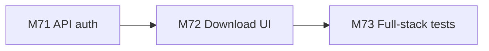
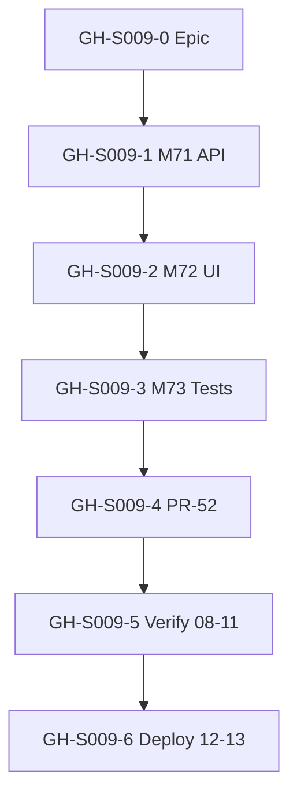
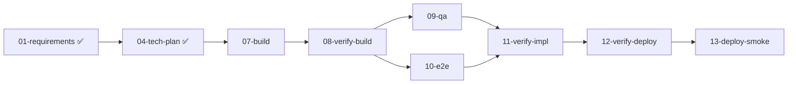
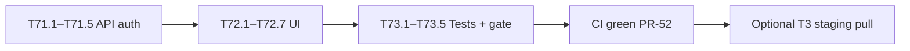

# Session roadmap — S009 / EV-010

> **Session:** S009-playground-model-download  
> **Evolve cycle:** EV-010  
> **Feature:** F38 — Playground model download (super-admin)  
> **Branch:** `feat/S009-playground-model-download` → `main` (PR-52)  
> **Last updated:** 2026-07-05  
> **Sources:** [session-brief](./session-brief.md) · [routing-plan](./routing-plan.md) · [execution-plan](../../sessions/S000-internal-docs-archive/execution-plan.md) Phase 16 · [ADR-036](../../adr/ADR-036-ev010-playground-model-download.md)

## Purpose

Decompose F38 into **GitHub-trackable issues** with explicit dependencies. Updated through
**07-build** and verify/deploy stages.

**Board:** [Math-Data-Justice-Collaborative/vecinita Project #3](https://github.com/orgs/Math-Data-Justice-Collaborative/projects/3)

---

## Vision (session)

Super-admins can download additional Ollama models into the Modal `vecinita-models` volume from
the Evaluation Playground, with visible pull progress via model-list polling. Regular admins list
and select models but cannot pull. Full-stack tests prove auth boundaries and UI behavior in CI.

---

## Current state

| Track | Status | Notes |
|-------|--------|-------|
| 00-context | ✅ Complete | [playground-model-download.md](../../sessions/S000-internal-docs-archive/context/playground-model-download.md) |
| 01-requirements | ✅ Complete | RD-146–RD-153; F38 standing docs |
| 04-tech-plan | ✅ Complete | ADR-036, TP-S009-01–16, Phase 16 |
| 07-build M71–M73 | ⬜ Pending | Start T71.1 |
| 08–10 verify | ⬜ Pending | Formal verify-build, QA, E2E |
| 11-verify-impl | ⬜ Pending | AC-E27–E29 signoff |
| 12–13 deploy | ⬜ Pending | write-api → admin FE |

---

## GitHub issue map

| ID | Title | Labels | Execution tasks | Depends on | Status |
|----|-------|--------|-----------------|------------|--------|
| **GH-S009-0** | `[EV-010] Epic — Playground model download (S009)` | `evolve`, `app:admin` | Phase 16 gate | — | ⬜ Create |
| **GH-S009-1** | `[EV-010][F38] M71 — Super-admin-only pull API auth` | `evolve`, `app:admin` | T71.1–T71.5 | GH-S009-0 | ⬜ Pending |
| **GH-S009-2** | `[EV-010][F38] M72 — Playground download UI + poll` | `evolve`, `app:admin` | T72.1–T72.7 | GH-S009-1 | ⬜ Pending |
| **GH-S009-3** | `[EV-010][F38] M73 — Full-stack tests (UJ-048)` | `evolve`, `app:admin` | T73.1–T73.5 | GH-S009-2 | ⬜ Pending |
| **GH-S009-4** | `[EV-010] Phase 16 gate + PR-52 merge` | `evolve`, `deploy` | T73.5, Phase 16 gate | GH-S009-3 | ⬜ Pending |
| **GH-S009-5** | `[EV-010] S009 verify pipeline (08 → 09 → 10 → 11)` | `evolve` | Stages 08–11 | GH-S009-4 | ⬜ Pending |
| **GH-S009-6** | `[EV-010] S009 staging deploy + smoke (12 → 13)` | `evolve`, `deploy` | Stages 12–13 | GH-S009-5 | ⬜ Pending |

### Epic body template (GH-S009-0)

```markdown
## Summary
Session S009 / EV-010 — super-admin-only Ollama model download for eval Playground.

## Feature
- F38: tighten pull auth, download UI, poll-until-available, full-stack tests

## Spec links
- ADR-036, execution-plan Phase 16
- UJ-048, TC-134–TC-138, AC-E27–AC-E29

## Session artifacts
docs/sessions/S009-playground-model-download/roadmap.md
```

---

## Task inventory (execution-plan Phase 16)

| Task | Milestone | Type | Status | Spec |
|------|-----------|------|--------|------|
| T71.1 | M71 | Test | pending | TC-134 auth matrix — red |
| T71.2 | M71 | Test | pending | unit pull auth — red |
| T71.3 | M71 | Code | pending | SuperAdminActorDep on pull |
| T71.4 | M71 | Code | pending | TC-134 green |
| T71.5 | M71 | Config | pending | OpenAPI EV-010 |
| T71.6 | M71 | Docs | pending | deployment-integration §EV-010 Modal storage |
| T72.1 | M72 | Test | pending | TC-135 Vitest — red |
| T72.2 | M72 | Test | pending | TC-136 Vitest — red |
| T72.3 | M72 | Test | pending | admin.test.ts pull client — red |
| T72.4 | M72 | Code | pending | pullOllamaModel() |
| T72.5 | M72 | Code | pending | Download panel + poll |
| T72.6 | M72 | Code | pending | i18n keys |
| T72.7 | M72 | Code | pending | TC-135/136 green |
| T73.1 | M73 | Test | pending | TC-138 E2E — red |
| T73.2 | M73 | Test | pending | TC-137 Playwright — red |
| T73.3 | M73 | Code | pending | E2E green |
| T73.4 | M73 | Code | pending | Playwright green |
| T73.5 | M73 | Docs | pending | Phase 16 gate checklist |
| T73.6 | M73 | Test | pending | TC-139 Modal manifest/volume contract |

---

## Dependency diagrams

### 1. Milestone build order



### 2. GitHub issue dependencies



### 3. Session pipeline stages



### 4. Critical path (open work)



---

## Phase 16 gate checklist

- [ ] All M71–M73 tasks completed (T71.1–T73.5)
- [ ] TC-134–TC-139 green; UJ-048 covered at T2
- [ ] AC-E27–AC-E30 satisfied at T2
- [ ] Modal storage: pulls target `vecinita-models` volume (TC-139)
- [ ] No DB migration; no new Python runtime deps
- [ ] CORS preflight for ollama pull route still green
- [ ] ruff / basedpyright / ESLint clean; full test suites green
- [ ] PR-52 merged; CI green on `main`

---

## Issue creation commands (optional — do not run without approval)

```bash
gh issue create --title "[EV-010] Epic — Playground model download (S009)" \
  --label "evolve,app:admin" \
  --body "See docs/sessions/S009-playground-model-download/roadmap.md GH-S009-0 template"

gh issue create --title "[EV-010][F38] M71 — Super-admin-only pull API auth" \
  --label "evolve,app:admin" \
  --body "Tasks T71.1–T71.5. TC-134. Depends on epic."
```

---

## References

- [ADR-036](../../adr/ADR-036-ev010-playground-model-download.md)
- [04-tech-plan report](./reports/04-tech-plan.md)
- [execution-plan Phase 16](../../sessions/S000-internal-docs-archive/execution-plan.md)
