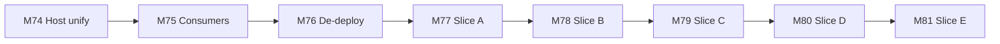
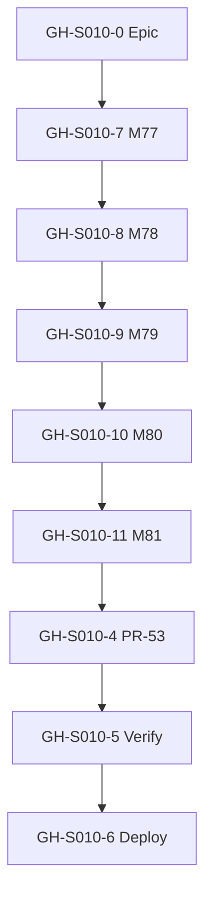
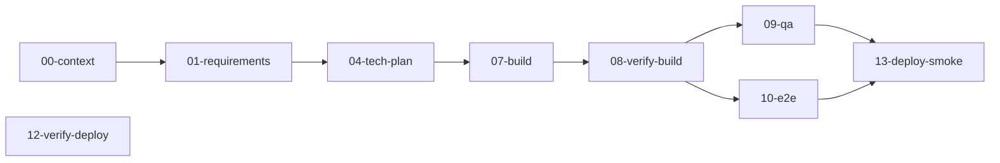
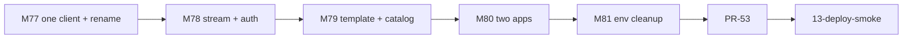

# Session roadmap — S010 / EV-011

> **Session:** S010-unify-llm-service  
> **Evolve cycle:** EV-011  
> **Feature:** F39 — Unified LLM Modal service + client consolidation  
> **Branch:** `feat/S010-unify-llm-service` → `main` (PR-53)  
> **Last updated:** 2026-07-10  
> **Sources:** [session-brief](./session-brief.md) · [execution-plan](../../sessions/S000-internal-docs-archive/execution-plan.md) Phase 17–18 · [ADR-037](../../adr/ADR-037-unified-vecinita-llm-modal-app.md)

## Purpose

Decompose F39 into **GitHub-trackable issues** with explicit dependencies. Updated through
**07-build** and verify/deploy stages.

**Board:** [Math-Data-Justice-Collaborative/vecinita Project #3](https://github.com/orgs/Math-Data-Justice-Collaborative/projects/3)

---

## Vision (session)

**Prod** (`vecinita-llm`) and **playground** (`vecinita-llm-playground`) share volume
`llm-models`. One `LlmClient` surface; real vLLM SSE; proxy auth everywhere; Ollama naming
removed from code/UI (path aliases kept). No provider ABC.

---

## Current state

| Track | Status | Notes |
|-------|--------|-------|
| 00-context | ✅ Complete | consolidation seed + RD-163–RD-172 path |
| 01-requirements | ✅ Complete | RD-163–RD-172; client-consolidation report |
| 04-tech-plan | ✅ Complete (delta) | TP-S010-17–31; Phase 18 M77–M81 |
| 07-build Phase 17 | ✅ Host unify | M74–M76 |
| 07-build Phase 18 | ⬜ Pending | Start M77 / T77.1 |
| 08–13 verify/deploy | ⬜ Re-run after Phase 18 | |

---

## GitHub issue map

| ID | Title | Labels | Execution tasks | Depends on | Status |
|----|-------|--------|-----------------|------------|--------|
| **GH-S010-0** | `[EV-011] Epic — Unified vecinita-llm (S010)` | `evolve`, `infra:modal` | Phase 17–18 gates | — | ⬜ Create |
| **GH-S010-1** | `[EV-011][F39] M74 — Unified Modal llm_app` | `evolve`, `infra:modal` | T74.1–T74.8 | GH-S010-0 | ✅ Done |
| **GH-S010-2** | `[EV-011][F39] M75 — Consumer wiring` | `evolve`, `app:admin` | T75.1–T75.7 | GH-S010-1 | ✅ Done |
| **GH-S010-3** | `[EV-011][F39] M76 — Deprecation + deploy gate` | `evolve`, `deploy` | T76.1–T76.7 | GH-S010-2 | ✅ Done |
| **GH-S010-7** | `[EV-011][F39] M77 — Slice A one client + rename` | `evolve` | T77.1–T77.7 | GH-S010-3 | ⬜ Next |
| **GH-S010-8** | `[EV-011][F39] M78 — Slice B stream + auth` | `evolve`, `infra:modal` | T78.1–T78.6 | GH-S010-7 | ⬜ |
| **GH-S010-9** | `[EV-011][F39] M79 — Slice C template + catalog` | `evolve` | T79.1–T79.6 | GH-S010-8 | ⬜ |
| **GH-S010-10** | `[EV-011][F39] M80 — Slice D two Modal apps` | `evolve`, `infra:modal`, `deploy` | T80.1–T80.7 | GH-S010-9 | ⬜ |
| **GH-S010-11** | `[EV-011][F39] M81 — Slice E env cleanup` | `evolve` | T81.1–T81.5 | GH-S010-10 | ⬜ |
| **GH-S010-4** | `[EV-011] Phase 18 gate + PR-53 merge` | `evolve`, `deploy` | Phase 18 gate | GH-S010-11 | ⬜ |
| **GH-S010-5** | `[EV-011] Verify pipeline (08 → 11)` | `evolve` | Stages 08–11 | GH-S010-4 | ⬜ |
| **GH-S010-6** | `[EV-011] Staging deploy smoke (12 → 13)` | `evolve`, `deploy` | T80.7 + smokes | GH-S010-5 | ⬜ |

### Issue creation (optional — do not run without approval)

```bash
# Example only — create after user approval
gh issue create --title "[EV-011][F39] M77 — Slice A one client + rename" \
  --label "evolve" --body "See docs/sessions/S010-unify-llm-service/roadmap.md"
```

---

## Dependency diagrams

### 1. Milestone build order



### 2. GitHub issue dependencies



### 3. Session pipeline stages



### 4. Critical path (remaining)



---

## Phase 18 gate checklist

- [ ] M77–M81 tasks complete (T77.1–T81.5)
- [ ] TC-141–TC-145 green
- [ ] AC-E34–AC-E38 met
- [ ] Two Modal apps; shared `llm-models`; playground URL wired
- [ ] Real SSE streaming; proxy middleware; no Ollama fallbacks
- [ ] No provider ABC

---

## References

- [ADR-037](../../adr/ADR-037-unified-vecinita-llm-modal-app.md)
- [04-tech-plan client consolidation](./reports/04-tech-plan-client-consolidation.md)
- [execution-plan Phase 18](../../sessions/S000-internal-docs-archive/execution-plan.md)
- [deployment-integration §EV-010](../../deployment-integration.md)
