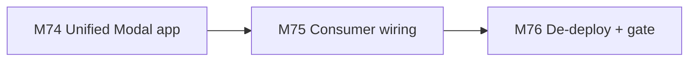
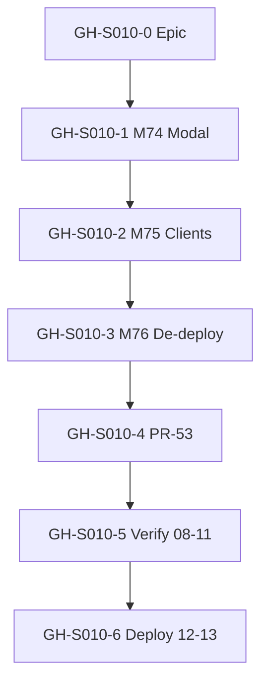
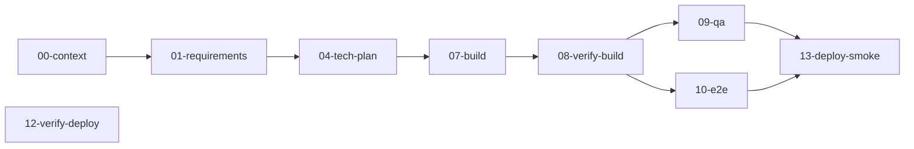
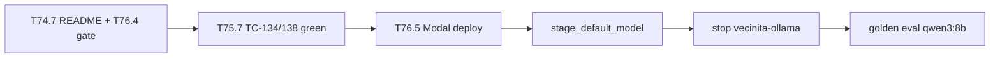

# Session roadmap — S010 / EV-011

> **Session:** S010-unify-llm-service  
> **Evolve cycle:** EV-011  
> **Feature:** F39 — Unified LLM Modal service (deprecate `vecinita-ollama`)  
> **Branch:** `feat/S010-unify-llm-service` → `main` (PR-53)  
> **Last updated:** 2026-07-08  
> **Sources:** [session-brief](./session-brief.md) · [context-brief](./context-brief.md) · [execution-plan](../../sessions/S000-internal-docs-archive/execution-plan.md) Phase 17 · [ADR-037](../../adr/ADR-037-unified-vecinita-llm-modal-app.md)

## Purpose

Decompose F39 into **GitHub-trackable issues** with explicit dependencies. Updated through
**07-build** and verify/deploy stages.

**Board:** [Math-Data-Justice-Collaborative/vecinita Project #3](https://github.com/orgs/Math-Data-Justice-Collaborative/projects/3)

---

## Vision (session)

One canonical Modal LLM deployable — **`vecinita-llm`** — serves ChatRAG, ingest/retag, eval, and
playground model download/staging. vLLM is the sole inference engine; HF Hub downloads replace
Ollama pulls. `vecinita-ollama` is de-deployed; all consumers use `VECINITA_MODAL_LLM_URL`.

---

## Current state

| Track | Status | Notes |
|-------|--------|-------|
| 00-context | ✅ Complete | context-brief.md; ADR-037 accepted |
| 01-requirements | ✅ Complete | RD-154–RD-162; F39 standing docs |
| 04-tech-plan | ✅ Complete | TP-S010-01–16, Phase 17 |
| 07-build M74–M75 | ✅ Complete | M76 T2 docs/tests done; operator T76.5–T76.7 pending |
| 08–10 verify | ⬜ Pending | Formal verify-build, QA, E2E |
| 11-verify-impl | ⬜ Pending | AC-E31–AC-E33 signoff |
| 12–13 deploy | ⬜ Pending | Modal deploy + de-deploy ollama + golden eval smoke |

---

## GitHub issue map

| ID | Title | Labels | Execution tasks | Depends on | Status |
|----|-------|--------|-----------------|------------|--------|
| **GH-S010-0** | `[EV-011] Epic — Unified vecinita-llm (S010)` | `evolve`, `infra:modal` | Phase 17 gate | — | ⬜ Create |
| **GH-S010-1** | `[EV-011][F39] M74 — Unified Modal llm_app (vLLM + HF staging)` | `evolve`, `infra:modal` | T74.1–T74.8 | GH-S010-0 | 🟡 Partial |
| **GH-S010-2** | `[EV-011][F39] M75 — Consumer wiring + eval routing` | `evolve`, `app:admin` | T75.1–T75.7 | GH-S010-1 | 🟡 Partial |
| **GH-S010-3** | `[EV-011][F39] M76 — Deprecation + deploy gate` | `evolve`, `deploy` | T76.1–T76.7 | GH-S010-2 | ⬜ Pending |
| **GH-S010-4** | `[EV-011] Phase 17 gate + PR-53 merge` | `evolve`, `deploy` | T76.4, Phase 17 gate | GH-S010-3 | ⬜ Pending |
| **GH-S010-5** | `[EV-011] S010 verify pipeline (08 → 09 → 10 → 11)` | `evolve` | Stages 08–11 | GH-S010-4 | ⬜ Pending |
| **GH-S010-6** | `[EV-011] S010 staging deploy + de-deploy smoke (12 → 13)` | `evolve`, `deploy` | T76.5–T76.7 | GH-S010-5 | ⬜ Pending |

### Epic body template (GH-S010-0)

```markdown
## Summary
Session S010 / EV-011 — consolidate LLM onto vecinita-llm; deprecate vecinita-ollama.

## Feature
- F39: unified Modal app, HF Hub staging, eval routing, consumer wiring

## Spec links
- ADR-037, execution-plan Phase 17
- UJ-048 (backend), TC-139/TC-140, AC-E31–AC-E33

## Session artifacts
docs/sessions/S010-unify-llm-service/roadmap.md
```

---

## Task inventory (execution-plan Phase 17)

| Task | Milestone | Type | Status | Spec |
|------|-----------|------|--------|------|
| T74.1 | M74 | Test | completed | TC-139 manifest — `test_llm_volume_manifest.py` |
| T74.2 | M74 | Test | completed | `test_llm_model_registry.py` |
| T74.3 | M74 | Code | completed | `llm_app.py` unified surface |
| T74.4 | M74 | Code | completed | `llm_model_registry.py` |
| T74.5 | M74 | Config | completed | `modal.sh` llm-only |
| T74.6 | M74 | Code | completed | Remove `ollama_app.py` |
| T74.7 | M74 | Docs | completed | `infra/modal/README.md` ADR-037 routes |
| T74.8 | M74 | Config | completed | `sync_llm_secret.sh`; `vecinita-llm` secret |
| T75.1 | M75 | Test | completed | TC-140 — `test_modal_llm_model_routing.py` |
| T75.2 | M75 | Test | completed | `test_llm_client.py`, `test_ollama_models_client.py` |
| T75.3 | M75 | Code | completed | `modal_llm.py` — no Ollama branch |
| T75.4 | M75 | Code | completed | `LlmClient`, `OllamaModelsClient` → llm URL |
| T75.5 | M75 | Config | completed | DO specs omit OLLAMA_URL (AC-E31) |
| T75.6 | M75 | Docs | completed | `user-journeys.md` UJ-048 preconditions |
| T75.7 | M75 | Test | completed | TC-134/TC-138 green |
| T76.3 | M76 | Docs | completed | `deployment-integration.md` secret merge |
| T76.4 | M76 | Docs | completed | `reports/phase17-gate.md` |
| T76.1 | M76 | Test | completed | Bug tests aligned with ADR-037 |
| T76.2 | M76 | Docs | completed | ADR-036 superseded note |
| T76.5 | M76 | Operator | completed | Deploy + `stage_default_model` |
| T76.6 | M76 | Operator | completed | `modal app stop vecinita-ollama` |
| T76.7 | M76 | Operator | pending | Golden eval `qwen3:8b` smoke (AC-E32) |

---

## Dependency diagrams

### 1. Milestone build order



### 2. GitHub issue dependencies



### 3. Session pipeline stages



### 4. Critical path (remaining)



---

## Phase 17 gate checklist

- [ ] M74–M76 tasks complete (T74.1–T76.7)
- [ ] TC-139, TC-140 green
- [ ] TC-134, TC-138 green (UJ-048 on llm backend)
- [ ] AC-E31–AC-E33 met
- [ ] `vecinita-ollama` de-deployed; `vecinita-llm` only in `modal.sh`
- [ ] AC-E32 golden eval smoke (T3)

---

## References

- [ADR-037](../../adr/ADR-037-unified-vecinita-llm-modal-app.md)
- [execution-plan Phase 17](../../sessions/S000-internal-docs-archive/execution-plan.md)
- [deployment-integration §EV-011](../../deployment-integration.md)
