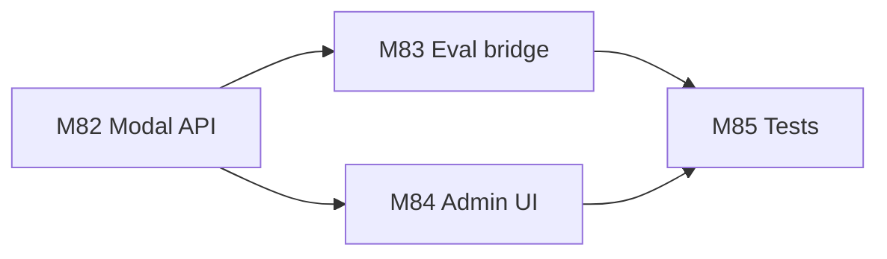
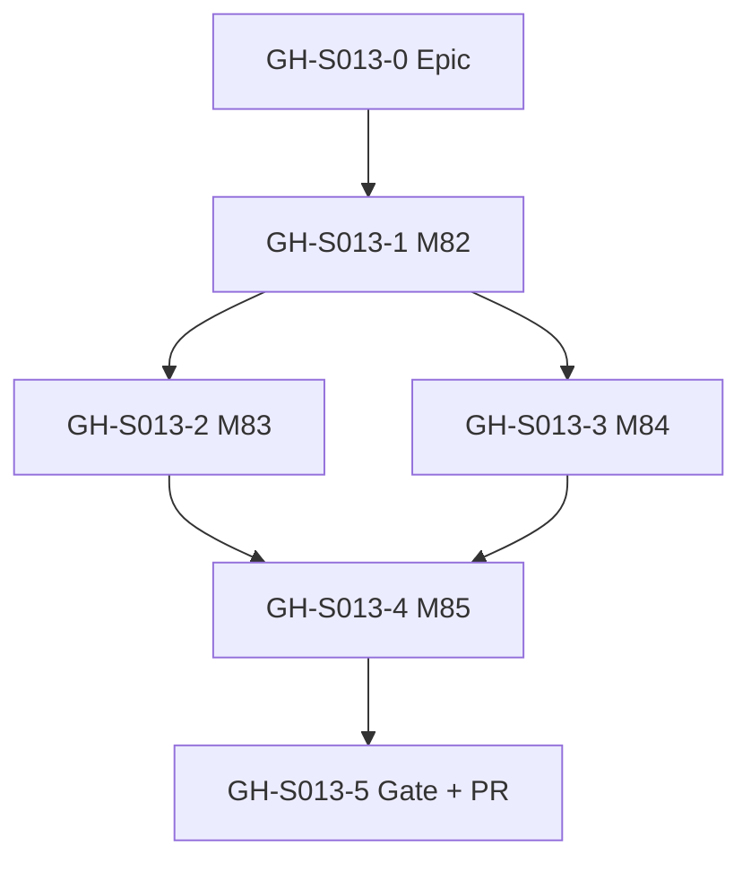
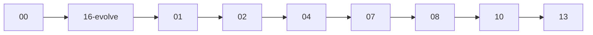

# Session roadmap — S013 / EV-012

> **Session:** S013-unified-job-monitoring  
> **Evolve cycle:** EV-012  
> **Features:** F32, F36 (extend; no new Fn)  
> **Branch:** `evolve/EV-012-unified-job-monitoring` → `main` (PR-54)  
> **Last updated:** 2026-07-29  
> **Sources:** [session-brief](./session-brief.md) · [routing-plan](./routing-plan.md) · [execution-plan](../S000-internal-docs-archive/execution-plan.md) Phase 19 · [ADR-038](../../adr/ADR-038-modal-job-lifecycle-storage-split.md) · [phase19-gate](./reports/phase19-gate.md)

## Purpose

Decompose #116 unified Admin Jobs into GitHub-trackable issues with explicit dependencies.
Updated through **07-build** and verify/deploy stages.

**Board:** [Math-Data-Justice-Collaborative/vecinita Project #3](https://github.com/orgs/Math-Data-Justice-Collaborative/projects/3)

---

## Vision (session)

Operators monitor all long-running admin work (ingest, retag, eval) on one Modal-primary Jobs
tab with detail, SSE+poll, and admin CRUD. Eval metrics stay in DO Postgres; create-run enqueues
Modal `job_type=eval`.

---

## Current state

| Track | Status | Notes |
|-------|--------|-------|
| 00-context | ✅ Complete | Session open |
| 01-requirements | ✅ Complete | RD-173–RD-178; ADR-038 |
| 02-verify-plan | ✅ Complete | Gate A→B; M1–M3 |
| 04-tech-plan | ✅ Complete | TP-S013-01–08; gate B→C |
| 07-build M82–M85 | ✅ Complete | M85 T85.1–T85.5; Phase 19 gate PASS at T2 |
| 08-verify-build | ✅ Complete | M85/Phase 19 PASS 2026-07-29 — see reports/verification-report.md |
| 10-e2e | ✅ Complete | T0 PASS 12/12 + Playwright 9/9; T1 skipped (no Docker); see reports/e2e-report.md |
| 13-deploy-smoke | 🔄 Next | ISS-004 closed; Lean+build deploy smoke |

---

## GitHub issue map

| ID | Title | Labels | Execution tasks | Depends on | Status |
|----|-------|--------|-----------------|------------|--------|
| **GH-S013-0** | `[EV-012] Epic — Unified Admin Jobs (#116)` | `evolve`, `app:admin` | Phase 19 gate | — | ⬜ Create |
| **GH-S013-1** | `[EV-012][F32] M82 — Modal jobs API + SSE + CRUD` | `evolve`, `app:admin` | T82.1–T82.6 | GH-S013-0 | ⬜ Pending |
| **GH-S013-2** | `[EV-012][F36] M83 — Eval enqueue + DO SSE + soft-delete` | `evolve`, `app:admin` | T83.1–T83.6 | GH-S013-1 | ⬜ Pending |
| **GH-S013-3** | `[EV-012][F32/F36] M84 — Admin Jobs UI` | `evolve`, `app:admin` | T84.1–T84.6 | GH-S013-1 | ⬜ Pending |
| **GH-S013-4** | `[EV-012] M85 — API e2e + Playwright T0-ui` | `evolve`, `app:admin` | T85.1–T85.5 | GH-S013-2, GH-S013-3 | ✅ Done |
| **GH-S013-5** | `[EV-012] Phase 19 gate + PR-54` | `evolve`, `deploy` | Phase 19 gate | GH-S013-4 | 🔄 Gate PASS; 08 next |

Do **not** create GitHub issues until user approves.

---

## Milestone build order



## Issue dependency graph



## Session pipeline stages



## Critical path

`T82.1 → T82.3 → T82.4 → T83.4 → T84.4 → T85.1/T85.3 → T85.5`

---

## Phase 19 gate checklist

- [ ] M82–M85 complete
- [ ] TC-146–151 + TC-124 T2 green; Playwright list→detail
- [ ] AC-J1–J10 T2
- [ ] M1–M3 + TP-S013-01–08 honored
- [ ] No ChatRAG UI / no new CORS origins
- [ ] Lint/typecheck/tests green

---

## Optional issue create (after approval)

```bash
# gh issue create ...  # only with user approval
```
