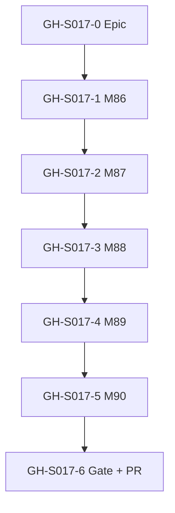
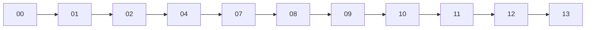

# Session roadmap — S017 / EV-015

> **Session:** S017-corpus-reembed-migration  
> **Evolve cycle:** EV-015  
> **Feature:** F41  
> **Branch:** `evolve/EV-015-corpus-reembed-migration` → `main` (PR-55)  
> **Last updated:** 2026-07-30  
> **Sources:** [session-brief](./session-brief.md) · [routing-plan](./routing-plan.md) · [execution-plan](../S000-internal-docs-archive/execution-plan.md) Phase 20 · [ADR-040](../../adr/ADR-040-corpus-document-store-rebuild.md) · [04-tech-plan](./reports/04-tech-plan.md)

## Purpose

Decompose #167 corpus document store + rebuild into GitHub-trackable issues with explicit
dependencies. Updated through 04-tech-plan; refine through 07-build.

**Board:** [Math-Data-Justice-Collaborative/vecinita Project #3](https://github.com/orgs/Math-Data-Justice-Collaborative/projects/3)

---

## Vision (session)

Operators can backfill a document store, enqueue store-backed rebuilds (reembed/rechunk/rescrape),
preview via shadow dry-run, gate with F36 on `rebuild_run_id`, and promote to live — with Admin
Jobs enqueue + promote. Staging proves live same-settings **and** shadow→promote; prod = runbook.

---

## Current state

| Track | Status | Notes |
|-------|--------|-------|
| 00-context | ✅ Complete | Session open |
| 01-requirements | ✅ Complete | RD-188–196; ADR-040 |
| 02-verify-plan | ✅ Complete | Gate A→B; M1–M6 |
| 04-tech-plan | 🔄 In progress | TP-S017-01–09; awaiting user review |
| 07-build M86–M90 | ⬜ Pending | After Gate B→C |
| 08–13 | ⬜ Pending | Per routing-plan |

---

## GitHub issue map

| ID | Title | Labels | Execution tasks | Depends on | Status |
|----|-------|--------|-----------------|------------|--------|
| **GH-S017-0** | `[EV-015] Epic — Corpus store + rebuild (#167 / F41)` | `evolve`, `app:admin` | Phase 20 gate | — | ⬜ Create |
| **GH-S017-1** | `[EV-015][F41] M86 — Schema store + shadow` | `evolve`, `app:database` | T86.1–T86.4 | GH-S017-0 | ⬜ Pending |
| **GH-S017-2** | `[EV-015][F41] M87 — Ingest store + backfill` | `evolve`, `app:admin` | T87.1–T87.6 | GH-S017-1 | ⬜ Pending |
| **GH-S017-3** | `[EV-015][F41] M88 — Rebuild job + shadow` | `evolve`, `app:admin` | T88.1–T88.6 | GH-S017-2 | ⬜ Pending |
| **GH-S017-4** | `[EV-015][F41] M89 — Promote + F36 + Admin UI` | `evolve`, `app:admin` | T89.1–T89.7 | GH-S017-3 | ⬜ Pending |
| **GH-S017-5** | `[EV-015][F41] M90 — E2E + Playwright + docs` | `evolve`, `app:admin` | T90.1–T90.5 | GH-S017-4 | ⬜ Pending |
| **GH-S017-6** | `[EV-015] Phase 20 gate + PR-55` | `evolve`, `deploy` | Phase 20 gate | GH-S017-5 | ⬜ Pending |

Do **not** create GitHub issues until user approves.

---

## Milestone build order

## Issue dependency graph

## Session pipeline stages

Skipped: 03, 05, 06 (Standard+build).

## Critical path (remaining)

04 review → Gate B→C → M86 → M87 → M88 → M89 → M90 → 08 → 09/10 → 11 → 12 → 13

## Phase 20 gate checklist

See [execution-plan](../S000-internal-docs-archive/execution-plan.md) §Phase 20 Gate Check.
