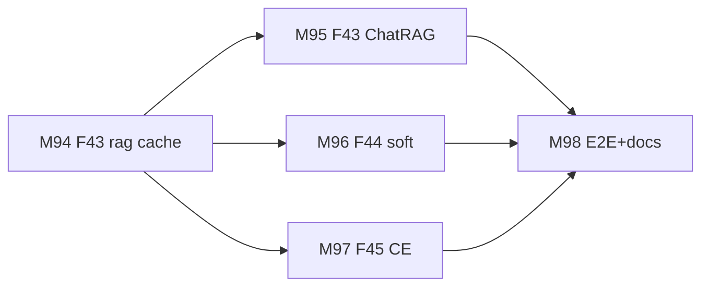
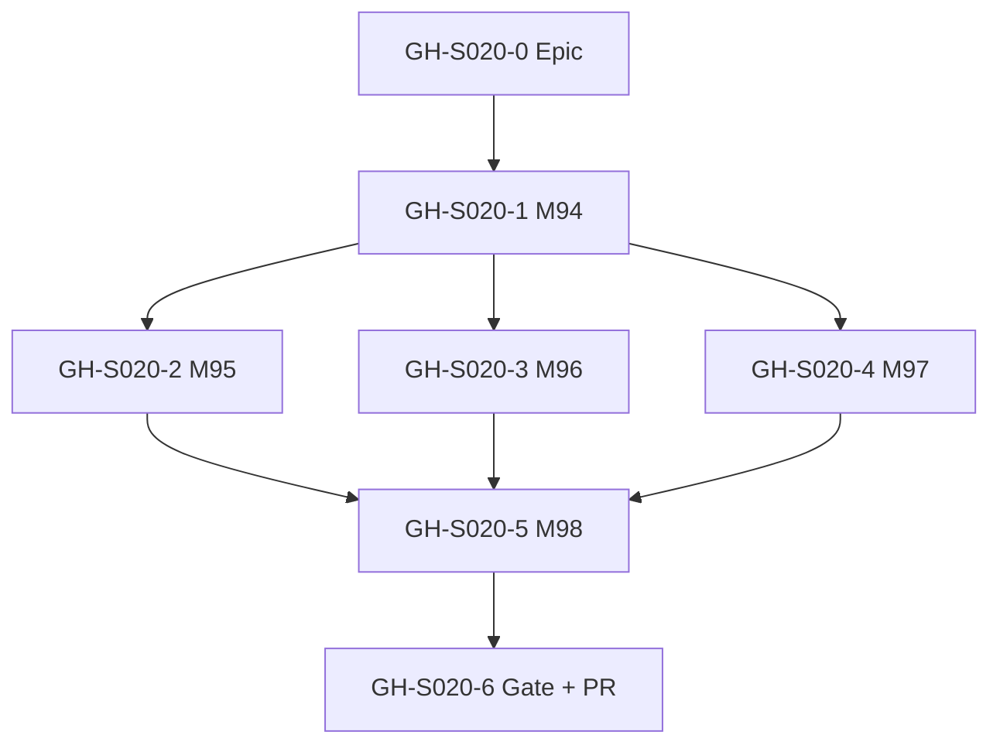
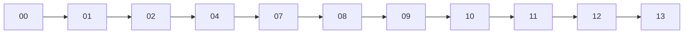

# Session roadmap — S020 / EV-017

> **Session:** S020-retrieval-batch-b  
> **Evolve cycle:** EV-017  
> **Features:** F43, F44, F45  
> **Branch:** `evolve/EV-017-retrieval-batch-b` → `main`  
> **Last updated:** 2026-08-02  
> **Sources:** [session-brief](./session-brief.md) · [routing-plan](./routing-plan.md) · [execution-plan](../S000-internal-docs-archive/execution-plan.md) Phase 22 · [ADR-042](../../adr/ADR-042-in-process-h1-answer-cache.md) · [tech-plan-delta](./reports/tech-plan-delta.md)

## Purpose

Decompose Batch B retrieval (answer cache + soft language + CE spike/gate) into
GitHub-trackable issues with explicit dependencies. Refined through 04-tech-plan; update
through 07-build.

**Issues in scope:** [#83](https://github.com/Math-Data-Justice-Collaborative/vecinita/issues/83),
[#161](https://github.com/Math-Data-Justice-Collaborative/vecinita/issues/161),
[#162](https://github.com/Math-Data-Justice-Collaborative/vecinita/issues/162)

---

## Vision (session)

ChatRAG cuts repeat-ask cost via an in-process H1 cache cascade; soft language L1 is
available behind a default-off flag with a testable empty-hit path; CE rerank is spiked on
Modal T4 with a hard ship gate before any prod enablement.

---

## Current state

| Track | Status | Notes |
|-------|--------|-------|
| 00-context | ✅ Complete | Session open |
| 01-requirements | ✅ Complete | RD-197–208 |
| 02-verify-plan | ✅ Complete | Gate A→B; M1–M4 / S020-D15 |
| 04-tech-plan | 🔄 In progress | TP1–TP7 approved; awaiting Gate B→C |
| 07-build M94–M98 | ⬜ Pending | After Gate B→C |
| 08–13 | ⬜ Pending | Per routing-plan |

---

## GitHub issue map

| ID | Title | Labels | Execution tasks | Depends on | Status |
|----|-------|--------|-----------------|------------|--------|
| **GH-S020-0** | `[EV-017] Epic — Retrieval Batch B (F43–F45)` | `evolve`, `app:chat` | Phase 22 gate | — | ⬜ Create |
| **GH-S020-1** | `[EV-017][F43] M94 — packages/rag H1 cascade` | `evolve`, `app:chat` | T94.1–T94.5 | GH-S020-0 | ⬜ Pending |
| **GH-S020-2** | `[EV-017][F43] M95 — ChatRAG + OpenAPI + harness` | `evolve`, `app:chat` | T95.1–T95.5 | GH-S020-1 | ⬜ Pending |
| **GH-S020-3** | `[EV-017][F44] M96 — Soft language L1 (#162)` | `evolve`, `app:chat` | T96.1–T96.4 | GH-S020-1 | ⬜ Pending |
| **GH-S020-4** | `[EV-017][F45] M97 — CE spike + client (#83/#161)` | `evolve`, `app:chat` | T97.1–T97.5 | GH-S020-1 | ⬜ Pending |
| **GH-S020-5** | `[EV-017] M98 — E2E + ship-gate docs` | `evolve`, `app:chat` | T98.1–T98.4 | GH-S020-2–4 | ⬜ Pending |
| **GH-S020-6** | `[EV-017] Phase 22 gate + PR` | `evolve`, `deploy` | Phase 22 gate | GH-S020-5 | ⬜ Pending |

Do **not** create GitHub issues until user approves.

---

## Milestone build order

## Issue dependency graph

## Session pipeline stages

Skipped: 03, 05, 06, 15 (Standard).

## Critical path (remaining)

04 Gate B→C → M94 → M95 (+ M96/M97 after M94) → M98 → 08 → 09/10 → 11 → 12 → 13

## Phase 22 gate checklist

See [execution-plan](../S000-internal-docs-archive/execution-plan.md) §Phase 22 Gate Check.
