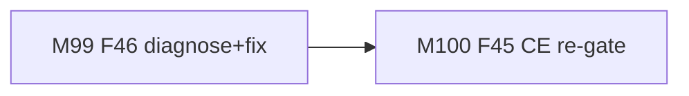

# Session roadmap — S021 / EV-018

> **Session:** S021-retrieval-follow-on  
> **Evolve cycle:** EV-018  
> **Features:** F46, F45 (re-gate)  
> **Branch:** `evolve/EV-018-retrieval-follow-on` → `main`  
> **Last updated:** 2026-08-02  
> **Sources:** [session-brief](./session-brief.md) · [routing-plan](./routing-plan.md) ·
> [execution-plan](../S000-internal-docs-archive/execution-plan.md) Phase 23 ·
> [tech-plan-delta](./reports/tech-plan-delta.md)

## Purpose

Restore non-empty staging retrieve pools (F46), then re-run the F45 CE ship gate with
valid pools. Prod CE stays off unless AC-BB9 passes.

## Current state

| Track | Status | Notes |
|-------|--------|-------|
| 00-context | ✅ Complete | Session open |
| 01-requirements | ✅ Complete | RD-209–218 |
| 02-verify-plan | ✅ Complete | Gate A→B; M1–M4 / S021-D17 |
| 04-tech-plan | ✅ TP1–TP6 approved | Phase 23 drafted; Gate B→C next |
| 07-build M99–M100 | ⬜ Pending | After Gate B→C |
| 08–13 | ⬜ Pending | Per routing-plan |

## Milestone build order

## GitHub issues

Do **not** create new GitHub issues until user approves. Track against existing #83 / #161.
