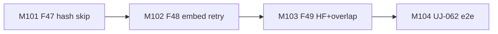
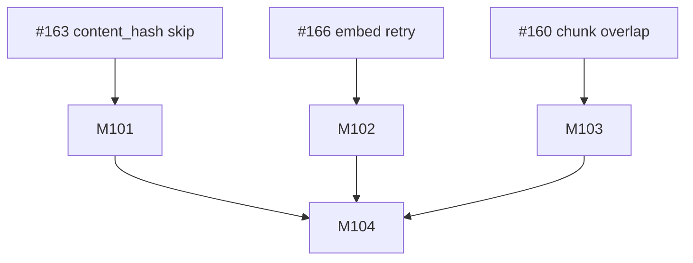
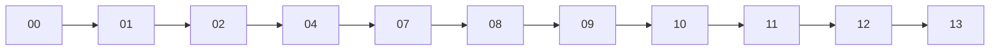

# Session roadmap — S022 / EV-019

> **Session:** S022-ingest-resilience  
> **Evolve cycle:** EV-019  
> **Features:** F47, F48, F49  
> **Branch:** `evolve/EV-019-ingest-resilience` → `main`  
> **Last updated:** 2026-08-02  
> **Sources:** [session-brief](./session-brief.md) · [routing-plan](./routing-plan.md) ·
> [execution-plan](../S000-internal-docs-archive/execution-plan.md) Phase 24 ·
> [tech-plan-delta](./reports/tech-plan-delta.md)

## Purpose

Ship ingest resilience on the shared write/embed path: skip no-op re-embeds when
`content_hash` is unchanged (#163), sub-batch + retry transient embed failures (#166),
and HF tokenizer + chunk overlap default 32 (#160 / ADR-044).

## Current state

| Track | Status | Notes |
|-------|--------|-------|
| 00-context | ✅ Complete | Session open |
| 01-requirements | ✅ Complete | RD-219–228 |
| 02-verify-plan | ✅ Complete | Gate A→B; M1–M6 / S022-D20 |
| 04-tech-plan | ✅ TP1–TP6 approved | Phase 24 drafted; Gate B→C next |
| 07-build M101–M104 | ⬜ Pending | After Gate B→C |
| 08–13 | ⬜ Pending | Per routing-plan |

## Milestone build order



## GitHub issue dependency graph



## Session pipeline stages



Skipped: 03, 05, 06, 15.

## Critical path

T101.1 → T101.3 → T102.3 → T103.3 → T104.1 → Phase 24 gate → 08–13.

## Phase 24 gate checklist (exit)

- [ ] T101.1–T104.4 complete
- [ ] AC-IR1–IR6 green at T2
- [ ] OpenAPI/`JobOptions` `chunk_overlap_tokens` + ingest `force`
- [ ] Embed defaults batch 32 / retries 3 / backoff 0.5s
- [ ] AC-IR7 scope held; no Playwright unless FE knobs

## GitHub issues

Do **not** create new GitHub issues until user approves. Track against existing
[#163](https://github.com/Math-Data-Justice-Collaborative/vecinita/issues/163),
[#166](https://github.com/Math-Data-Justice-Collaborative/vecinita/issues/166),
[#160](https://github.com/Math-Data-Justice-Collaborative/vecinita/issues/160).

### Optional create commands (not run)

```bash
# Epic already covered by session; per-milestone issues optional:
# gh issue create --title "[S022] M101 F47 content_hash skip" --label "evolve"
```
