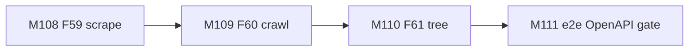
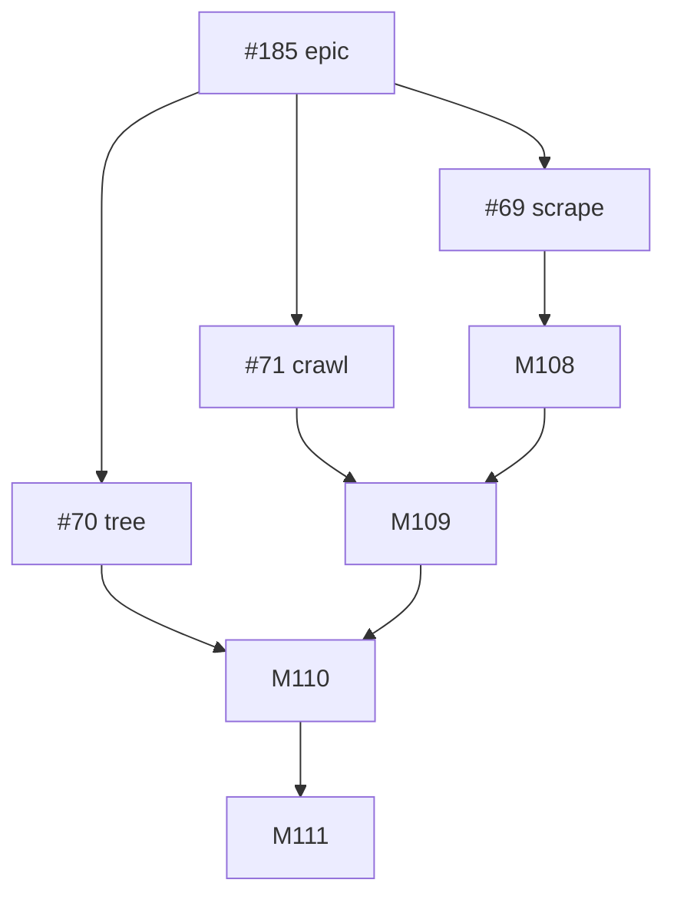
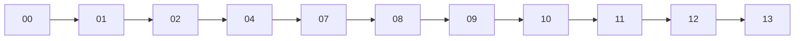

# Session roadmap — S024 / EV-022

> **Session:** S024-website-scrape-crawl  
> **Evolve cycle:** EV-022  
> **Features:** F59, F60, F61  
> **Branch:** `evolve/EV-022-website-scrape-crawl` → `main`  
> **Last updated:** 2026-08-03  
> **Sources:** [session-brief](./session-brief.md) · [routing-plan](./routing-plan.md) ·
> [execution-plan](../S000-internal-docs-archive/execution-plan.md) Phase 26 ·
> [tech-plan-delta](./reports/tech-plan-delta.md) · [ADR-045](../../adr/ADR-045-website-scrape-crawl-tree.md)

## Purpose

Ship website scrape → crawl → Admin tree UI for multi-page ingest (epic #185):
robust scrape (#69 / F59), same-site crawl (#71 / F60), corpus tree + nested meta
(#70 / F61). Independently reviewable PRs in order `#69 → #71 → #70`.

## Current state

| Track | Status | Notes |
|-------|--------|-------|
| 00-context | ✅ Complete | Session open |
| 01-requirements | ✅ Complete | RD-252–263 |
| 02-verify-plan | ✅ Complete | Gate A→B PASS (S024-D34) |
| 04-tech-plan | ✅ TP1–TP6 locked | Phase 26 drafted; Gate B→C next |
| 07-build M108–M111 | ⬜ Pending | After Gate B→C |
| 08–13 | ⬜ Pending | Per routing-plan |

## Milestone build order



## GitHub issue dependency graph



## Session pipeline stages



Skipped: 03, 05, 06, 15.

## Critical path

T108.1 → T108.5 (Playwright+trafilatura) → T109.3 → T110.3 → T111.1 (UJ e2e) →
Phase 26 gate → 08–13.

## Phase 26 gate checklist (exit)

- [ ] T108.1–T111.4 complete
- [ ] AC-SC1–SC11 green at T2 (unit + API e2e); AC-SC12 scope held
- [ ] ADR-045 implemented; Playwright in Modal worker; `trafilatura` + `pypdf`
- [ ] OpenAPI JobOptions crawl + tree paths; nested source fields
- [ ] Playwright T0-ui UJ-066 required; UJ-065 optional
- [ ] No new CORS; H4–H5 deferred to 13

## GitHub issues

Do **not** create new GitHub issues until user approves. Track against existing
[#185](https://github.com/Math-Data-Justice-Collaborative/vecinita/issues/185),
[#69](https://github.com/Math-Data-Justice-Collaborative/vecinita/issues/69),
[#71](https://github.com/Math-Data-Justice-Collaborative/vecinita/issues/71),
[#70](https://github.com/Math-Data-Justice-Collaborative/vecinita/issues/70).

### Optional create commands (not run)

```bash
# Per-milestone tracking optional — epic children already exist:
# gh issue create --title "[S024] M108 F59 robust scrape" --label "evolve"
```
