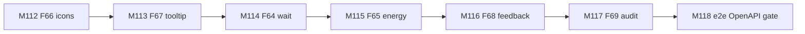
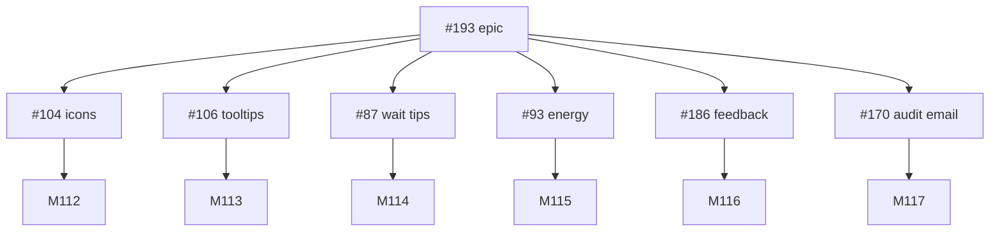
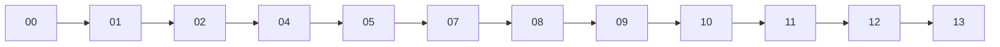

# Session roadmap — S026 / EV-024

> **Session:** S026-frontend-ux-polish  
> **Evolve cycle:** EV-024  
> **Features:** F64–F69  
> **Branch:** `evolve/EV-024-frontend-ux-polish` → `main`  
> **Last updated:** 2026-08-04  
> **Sources:** [session-brief](./session-brief.md) · [routing-plan](./routing-plan.md) ·
> [execution-plan](../S000-internal-docs-archive/execution-plan.md) Phase 27 ·
> [tech-plan-delta](./reports/tech-plan-delta.md) ·
> [ADR-046](../../adr/ADR-046-anonymous-community-feedback.md) ·
> [ADR-047](../../adr/ADR-047-ask-energy-heuristic-car-equivalent.md)

## Purpose

Ship ChatRAG + Admin UX polish (epic #193): ActionIcon (#104), Tooltip (#106), wait
tips/marketing (#87), energy+car (#93), anonymous feedback (#186), audit actor email (#170).
**One PR per issue** from a single evolve branch.

## Current state

| Track | Status | Notes |
|-------|--------|-------|
| 00-context | ✅ Complete | Session open |
| 01-requirements | ✅ Complete | RD-272–289 |
| 02-verify-plan | ✅ Complete | Gate A→B PASS (S026-D23) |
| 04-tech-plan | ✅ TP1–TP6 locked | Phase 27 drafted (S026-D24); completed S026-D25 |
| 05-verify-tech | ✅ Complete | Gate B→C PASS (S026-D28) |
| 07-build M112–M118 | ✅ Complete | Code PRs #200–#206; M118 OpenAPI/gate (T118.3) |
| Gate C→D | 🔄 Pending | AskQuestion after M118 PR / 08-verify |
| 08–13 | ⬜ Pending | Per routing-plan |

## Milestone build order

## GitHub issue dependency graph

## Session pipeline stages

## PR plan (one per issue)

| Order | Issue | Milestone | PR | Status |
|-------|-------|-----------|-----|--------|
| 1 | #104 | M112 | #200 | merged |
| 2 | #106 | M113 | #202 | merged |
| 3 | #87 | M114 | #203 | merged; issue CLOSED |
| 4 | #93 | M115 | #205 | merged |
| 5 | #186 | M116 | #205 | merged |
| 6 | #170 | M117 | #206 | merged @ `eb65837` |
| — | #193 | M118 gate | M118 PR | OpenAPI/gate docs; close epic after children + 13 H1–H5 |
