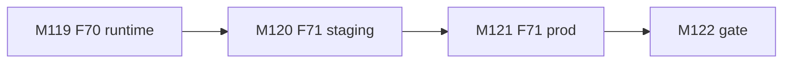
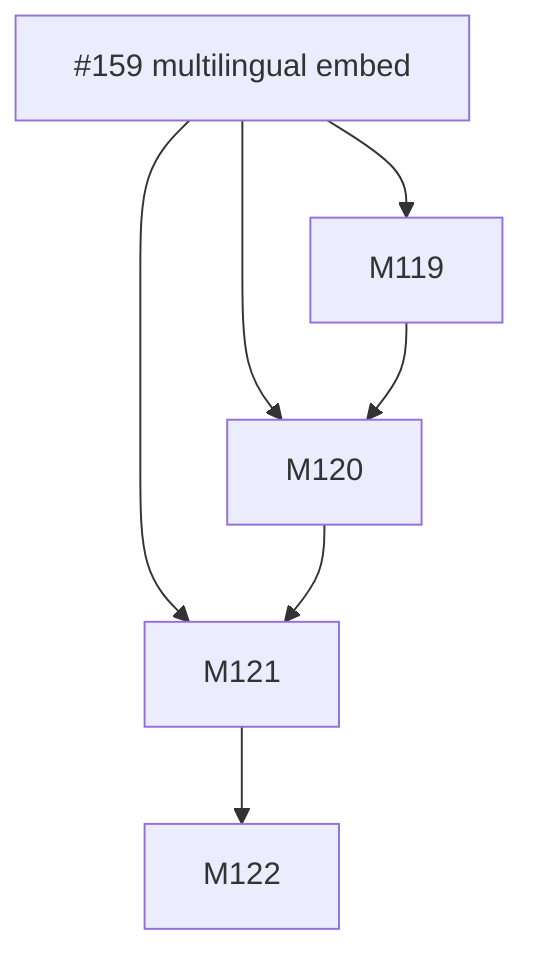
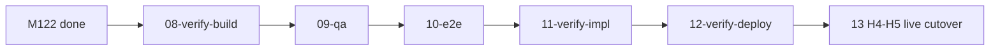

# Session roadmap — S027 / EV-025

> **Session:** S027-multilingual-embeddings  
> **Evolve cycle:** EV-025  
> **Features:** F70–F71  
> **Branch:** `evolve/EV-025-multilingual-embeddings` → `main`  
> **Last updated:** 2026-08-05  
> **Sources:** [session-brief](./session-brief.md) · [routing-plan](./routing-plan.md) ·
> [execution-plan](../S000-internal-docs-archive/execution-plan.md) Phase 28 ·
> [tech-plan-delta](./reports/tech-plan-delta.md) ·
> [ADR-048](../../adr/ADR-048-multilingual-384-embeddings.md)

## Purpose

Ship multilingual 384-d embedding pin (prefer E1) with Modal FastEmbed→ST fallback, shared
client e5 prefixes, F41 rechunk+re-embed, staging then prod cutover (#159).

## Current state

| Track | Status | Notes |
|-------|--------|-------|
| 00-context | ✅ Complete | Session open; Standard (S027-D8) |
| 01-requirements | ✅ Complete | RD-290–304; ADR-048 |
| 02-verify-plan | ✅ Complete | Gate A→B PASS (S027-D26) |
| 04-tech-plan | ✅ Complete | TP1–TP5; Phase 28 |
| 05-verify-tech | ✅ Complete | M1–M6; Gate B→C PASS (S027-D30) |
| 07-build M119–M122 | ✅ Complete | PR #208/#210/#211 merged; M122 docs gate |
| 08–13 | ⬜ Pending | Formal verify + **live prod cutover H4–H5 at 13** |

## Milestone build order



## GitHub issue dependency graph



## Session pipeline stages


## Critical path (remaining)



## Phase gate checklist (exit)

- [x] T119.1–T122.3 completed (conditionals: S027-D35 / S027-D39)
- [ ] AC-ME1–ME11 verified at 08/09–11 (mapped + unit/stub green at 07)
- [x] Staging runbooks + E0 rollback path documented
- [ ] Live prod cutover smoke (H4–H5 at 13)
- [x] No UI/CORS/dim drift

## PR plan

| Order | Milestone | PR slot | Status |
|-------|-----------|---------|--------|
| 1 | M119 F70 | PR-67 | merged — #208 |
| 2 | M120 F71 staging | PR-68 | merged — #210 |
| 3 | M121 F71 prod | PR-69 | merged — #211 @`e38516a` |
| 4 | M122 gate | PR-70 | opening |
| 5 | Phase 28 major | PR-71 | pending — after 08+ |

## #159 closeout

Close [#159](https://github.com/Math-Data-Justice-Collaborative/vecinita/issues/159) only after
**13-deploy-smoke** live cutover confirmation — not at M122 alone.
See [t122_3_phase28_gate.md](./reports/t122_3_phase28_gate.md).

## Issue creation (optional — do not run without approval)

```bash
# Epic already #159 — child issues only if operator wants split
```
