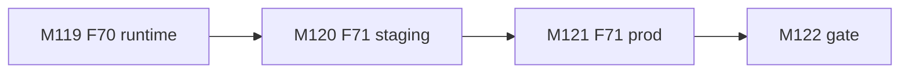
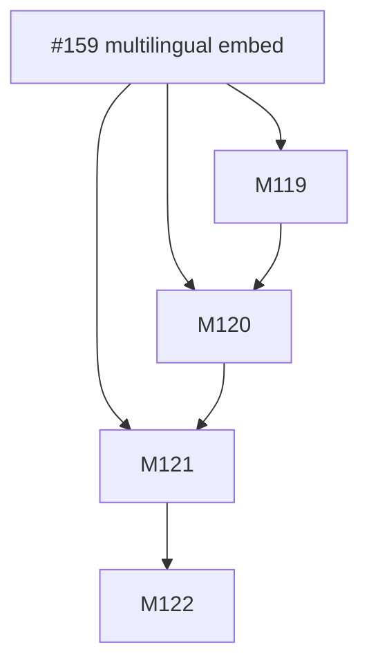
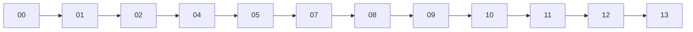
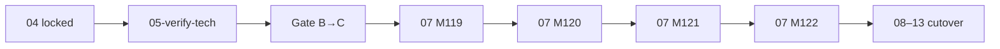

# Session roadmap — S027 / EV-025

> **Session:** S027-multilingual-embeddings  
> **Evolve cycle:** EV-025  
> **Features:** F70–F71  
> **Branch:** `evolve/EV-025-multilingual-embeddings` → `main`  
> **Last updated:** 2026-08-05  
> **Sources:** [session-brief](./session-brief.md) · [routing-plan](./routing-plan.md) ·
> [execution-plan](../S000-internal-docs-archive/execution-plan.md) Phase 28 ·
> [tech-plan-delta](./reports/tech-plan-delta.md) ·
> [ADR-048](../../adr/ADR-048-multilingual-384-embeddings.md)

## Purpose

Ship multilingual 384-d embedding pin (prefer E1) with Modal FastEmbed→ST fallback, shared
client e5 prefixes, F41 rechunk+re-embed, staging then prod cutover (#159).

## Current state

| Track | Status | Notes |
|-------|--------|-------|
| 00-context | ✅ Complete | Session open; Standard (S027-D8) |
| 01-requirements | ✅ Complete | RD-290–304; ADR-048 |
| 02-verify-plan | ✅ Complete | Gate A→B PASS (S027-D26) |
| 04-tech-plan | ✅ TP1–TP5 locked | Phase 28 drafted (S027-D27); completed S027-D28 |
| 05-verify-tech | ✅ Complete | M1–M6 applied (S027-D29); Gate B→C pending |
| 07-build M119–M122 | ⬜ Pending | After Gate B→C |
| 08–13 | ⬜ Pending | Per routing-plan; live prod cutover smoke at 13 |

## Milestone build order



## GitHub issue dependency graph



## Session pipeline stages



## Critical path (remaining)



## Phase gate checklist (exit)

- [ ] T119.1–T122.3 completed
- [ ] AC-ME1–ME11 verified
- [ ] Staging + prod cutover; E0 rollback path
- [ ] No UI/CORS/dim drift

## PR plan

| Order | Milestone | PR slot | Status |
|-------|-----------|---------|--------|
| 1 | M119 F70 | PR-67 | pending |
| 2 | M120 F71 staging | PR-68 | pending |
| 3 | M121 F71 prod | PR-69 | pending |
| 4 | M122 gate | PR-70 | pending |
| 5 | Phase 28 major | PR-71 | pending |

## Issue creation (optional — do not run without approval)

```bash
# Epic already #159 — child issues only if operator wants split
```
