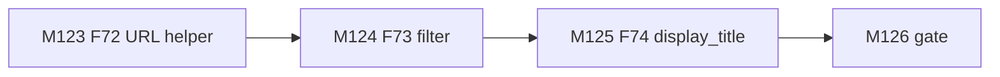
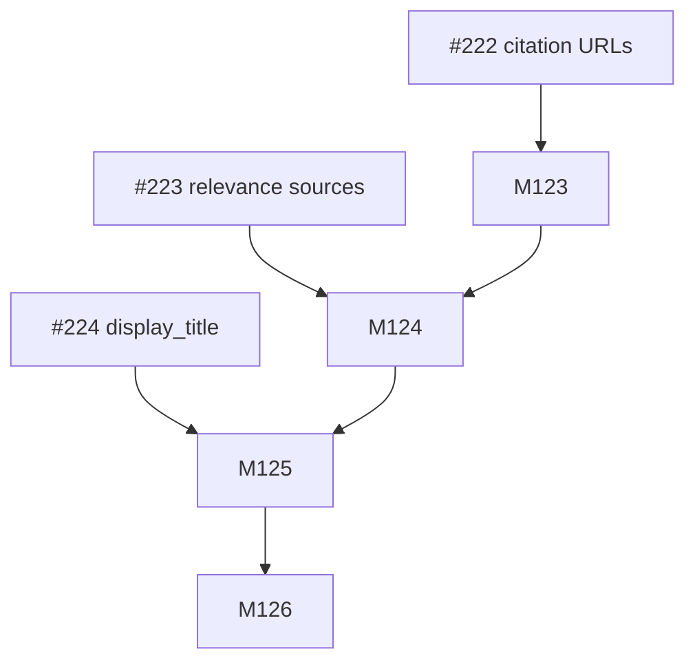
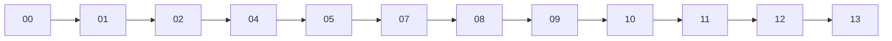
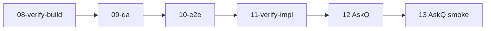

# Session roadmap — S028 / EV-026

> **Session:** S028-chat-source-ux  
> **Evolve cycle:** EV-026  
> **Features:** F72–F74  
> **Branch:** `evolve/EV-026-chat-source-ux`  
> **Last updated:** 2026-08-06  
> **Sources:** [session-brief](./session-brief.md) · [routing-plan](./routing-plan.md) ·
> [execution-plan](../S000-internal-docs-archive/execution-plan.md) Phase 29 ·
> [tech-plan-delta](./reports/tech-plan-delta.md) ·
> [ADR-051](../../adr/ADR-051-display-title-vs-lock-flag.md)

## Purpose

Ship chat source UX: citation URL validation (F72/#222), relevance-gated sources without
fixed pad (F73/#223), and operator `display_title` (F74/#224).

## Current state

| Track | Status | Notes |
|-------|--------|-------|
| 00-context | ✅ Complete | Feature preset; prod-careful |
| 01-requirements | ✅ Complete | RD-309–321 |
| 02-verify-plan | ✅ Complete | Gate A→B PASS (S028-D20) |
| 04-tech-plan | ✅ Complete | TP1–TP4; Phase 29 |
| 05-verify-tech | ✅ Complete | Gate B→C PASS |
| 07-build | ✅ Complete | M123–M126; ADR-051 Accepted |
| 08–11 | ⬜ Pending | Next: 08-verify-build |
| 12–13 | ⬜ Pending | **AskQuestion before prod** (S028-D2) |

## Milestone build order

## GitHub issue dependency graph

## Session pipeline stages

## Critical path (remaining)

## Phase gate checklist (exit)

- [x] T123.1–T126.3 completed (07-build)
- [x] AC-SU1–SU10 mapped; TC-242–251 green at 07 ([t126_1](./reports/t126_1_tc_green_gate.md))
- [x] ADR-051 Accepted
- [x] OpenAPI + CORS H0c for `PATCH /documents/{id}`
- [x] No new deps (06 skipped); Playwright optional only
- [ ] Live prod smoke only after AskQuestion (S028-D2) — **at 13**
- [ ] Formal AC verify 08/09–11

## PR plan

| Order | Milestone | PR slot | Status |
|-------|-----------|---------|--------|
| 1 | M123–M126 (branch) | PR-75 | pending — open after M126 |
| 2 | Phase 29 major | PR-76 | pending — after Gate C→D / verify |

## Issue closeout

Close #222 / #223 / #224 after **11-verify-impl** (and 13 only if deploy approved). Do not
close on M126 alone if live smoke is still open. See [t126_3](./reports/t126_3_phase29_gate.md).
