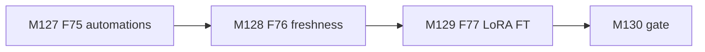
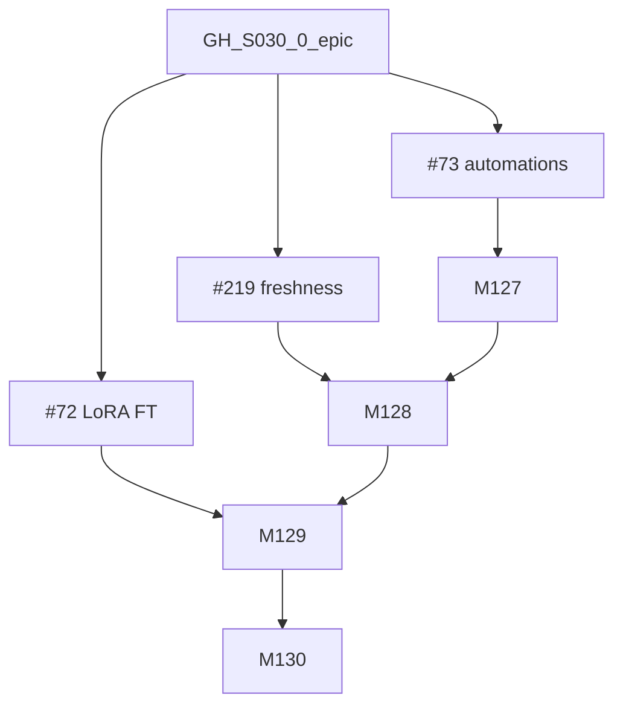

# Session roadmap — S030 / EV-027

> **Session:** S030-corpus-automations  
> **Evolve cycle:** EV-027  
> **Features:** F75–F77  
> **Branch:** `evolve/EV-027-corpus-automations`  
> **Last updated:** 2026-08-07  
> **Sources:** [session-brief](./session-brief.md) · [routing-plan](./routing-plan.md) ·
> [execution-plan](../S000-internal-docs-archive/execution-plan.md) Phase 30 ·
> [tech-plan-delta](./reports/tech-plan-delta.md) ·
> [ADR-052](../../adr/ADR-052-corpus-automation-orchestration.md) ·
> [ADR-053](../../adr/ADR-053-modal-lora-finetune.md)

## Purpose

Ship corpus change automations (#73 / F75), corpus freshness (#219 / F76), and Modal
LoRA fine-tune with human promote after eval evidence (#72 / F77) in one Full-preset
cycle.

## Current state

| Track | Status | Notes |
|-------|--------|-------|
| 00-context | ✅ Complete | Feature session open |
| 01-requirements | ✅ Complete | RD-325–344 |
| 02-verify-plan | ✅ Complete | Gate A→B PASS (S030-D26) |
| 03-plan-tooling | ✅ Complete | R1–R4 / H1 / S1 (S030-D27) |
| 04-tech-plan | ✅ Complete | TP1–TP10; Phase 30 (S030-D29) |
| 05-verify-tech | ⬜ Pending | Gate B→C |
| 06-tech-tooling | ✅ Complete | Exact FT pins (S030-D33) |
| 07-build | ⬜ Pending | M127–M130 |
| 08–11 | ⬜ Pending | |
| 12–13 | ⬜ Pending | **AskQuestion before prod** (S030-D10 / TP9) |

## GitHub issue table

| Issue | Epic / role | Milestones | Labels (suggested) | Depends on |
|-------|-------------|------------|--------------------|------------|
| GH-S030-0 | Epic — Corpus automations + FT | M127–M130 | `session:S030`, `evolve:EV-027` | — |
| #73 | F75 automations | M127, M130 | `F75` | GH-S030-0 |
| #219 | F76 freshness | M128, M130 | `F76` | #73 (shared schedule) |
| #72 | F77 LoRA FT | M129, M130 | `F77` | #73 (kill-switch), 06 pins |

Do **not** create GitHub issues without explicit user approval (`gh issue create` snippets
deferred).

## Milestone build order



## GitHub issue dependency graph



## Session pipeline stages


## Critical path (remaining)


## Phase gate checklist (exit)

- [ ] T127.1–T130.4 completed (07-build)
- [ ] AC-AU* / AC-FR* / AC-FT* mapped; TC-252–265 green
- [ ] ADR-052 / ADR-053 Accepted with TP path locks
- [ ] OpenAPI + CORS H0c for new routes; secrets matrix updated
- [x] 06 PEFT/TRL exact pins before M129 train worker (`finetune_pins.py`)
- [ ] Live prod automation enable / FT promote only after AskQuestion (TP9) — **at 13**

## PR plan

| Order | Milestone | PR slot | Status |
|-------|-----------|---------|--------|
| 1 | M127 | PR-77 | pending |
| 2 | M128 | PR-78 | pending |
| 3 | M129 | PR-79 | pending |
| 4 | M130 | PR-80 | pending |
| 5 | Phase 30 major | PR-81 | pending — after Gate C→D / verify |

## Issue creation commands (optional — do not run without approval)

```bash
# gh issue create --title "[S030] Epic: Corpus automations + LoRA FT (EV-027)" ...
# Link existing #73 #219 #72 to the epic rather than duplicating.
```

## Issue closeout

Close #73 / #219 / #72 after **11-verify-impl** (and 13 only if deploy approved). Do not
close on M130 alone if live smoke / promote AskQuestion is still open.
