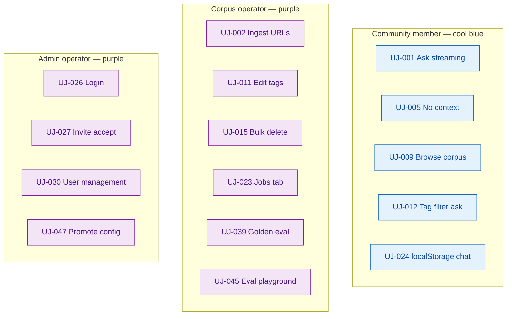
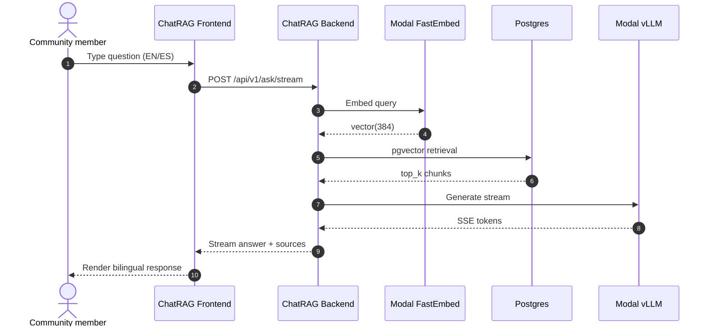
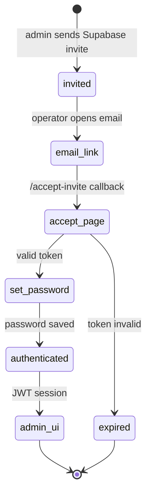
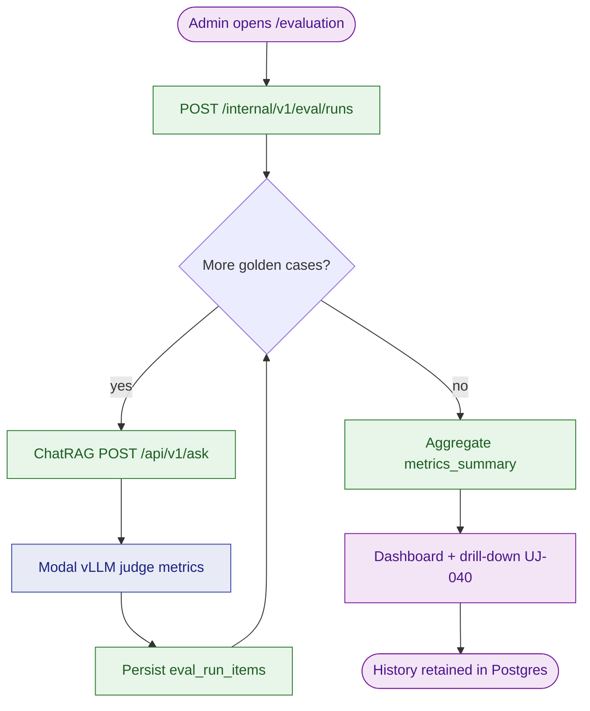

# User Journeys

> **Project**: Vecinita  
> **Source**: [feature-list.md](feature-list.md), [spec.md](spec.md), [decisions.md#Requirements decisions](decisions.md#requirements-decisions-01-requirements)  
> **Last updated**: 2026-07-08 (S010/EV-011 F39 — UJ-048 backend unified on `vecinita-llm`, ADR-037)

Product-facing journeys describe what a **caller** does — not internal module tests.  
**E2E tier (v1):** **local** (TestClient + test DB + mocked Modal) — `uv run pytest tests/e2e -m "e2e and not live"`. **live** staging (`@pytest.mark.live`) after deploy: `tests/smoke/test_staging_health.py`, `test_staging_latency.py` (AC-C6 p95). **UI (T0-ui):** Playwright against preview bundles — `tests/ui/`, `make test-ui` (see `tests/ui/README.md`). Vitest remains the fast component layer; Playwright covers real-browser shell/navigation.

## Journey Index

| ID | Journey | Actor | Entry point | Feature | E2E tier |
|----|---------|-------|-------------|---------|----------|
| UJ-001 | Ask community question (bilingual, streaming) | Community member | ChatRAG Frontend → `POST /api/v1/ask/stream` | F1, F2, F11 | local |
| UJ-002 | Ingest public URLs | Operator | Data Mgmt Frontend → Modal `POST /jobs` | F7, F8, F12 | local |
| UJ-003 | Delete outdated document | Operator | Admin UI → corpus delete API | F9 | local |
| UJ-004 | Bootstrap local dev stack | Developer | CLI / docker-compose / Modal serve | F18 | local |
| UJ-005 | No relevant corpus context | Community member | `POST /api/v1/ask` | F1, F5 | local |
| UJ-006 | Scrape job failure | Operator | Job poll `GET /jobs/{id}` | F8 | local |
| UJ-007 | Reject identity fields in API | Client (malformed or policy test) | ChatRAG or write API | F15 | local |
| UJ-008 | Unauthorized data-mgmt access | Anonymous client | Modal/DO data-mgmt routes | F16 | local |
| UJ-009 | Browse corpus by tags & search | Community member | ChatRAG Frontend → `GET /api/v1/documents` | F19 | local |
| UJ-010 | Open corpus document (source URL) | Community member | Browse list → external `url` | F19 | local |
| UJ-011 | Admin view chunks & edit tags | Operator | Admin UI → internal-write chunk/tag APIs | F20, F21 | local |
| UJ-012 | Ask with tag filter (sidebar) | Community member | Chat sidebar tags → `POST /api/v1/ask/stream` | F22 | local |
| UJ-013 | View admin summary dashboard | Operator | Admin UI → `/internal/v1/stats/summary` | F25 | local |
| UJ-014 | Check system health | Operator | Admin UI → multiple `/health` endpoints | F26 | local |
| UJ-015 | Bulk delete documents | Operator | Admin UI bulk select → `DELETE /internal/v1/documents/bulk` | F27 | local |
| UJ-016 | Bulk tag documents | Operator | Admin UI bulk select → `PATCH /internal/v1/documents/bulk/tags` | F27 | local |
| UJ-017 | View global audit log | Operator | Admin UI → `GET /internal/v1/audit` | F29 | local |
| UJ-018 | View document version history | Operator | Admin UI document detail → `GET /internal/v1/documents/{id}/history` | F29 | local |
| UJ-019 | View top served documents | Operator | Admin summary dashboard → `GET /internal/v1/stats/top-served` | F28 | local |
| UJ-020 | Navigate modernized admin UI | Operator | Admin UI shadcn/Tailwind navigation | F23 | local |
| UJ-021 | View document tags in corpus list | Operator | Admin corpus list → tag chips | F24 | local |
| UJ-022 | Switch admin UI language (en/es) | Operator | Admin UI sidebar `LanguageToggle` → `packages/frontend-i18n` | F31 | local |
| UJ-023 | View & track jobs in Job Management tab | Operator | Admin UI → `GET /jobs` | F32 (#88, #89) | local |
| UJ-024 | Conversation persists across refresh / tab-away / tab-close / new tab | Community member | ChatRAG Frontend → `localStorage` (device-local) | F33 | local |
| UJ-025 | Revisit a previous conversation | Community member | ChatRAG Frontend previous-chats list → `localStorage` | F33 | local |
| UJ-026 | Admin logs in to the Data Management UI | Operator | DM Frontend login → Supabase Auth → protected routes | F34 | local |
| UJ-027 | Admin invites an operator; invitee accepts | Admin operator | Supabase invite (email) → invitee sets password → login | F34 | local |
| UJ-028 | Unauthenticated admin request rejected | Anonymous / expired-session client | DM API / internal-write API without valid JWT | F34 | local |
| UJ-029 | Viewer is blocked from write actions | Viewer operator | DM UI / internal-write API write route | F34 | local |
| UJ-030 | Admin manages operators from the User Management page | Admin operator | DM UI `/users` → `/admin/users*` (Supabase Admin API) | F35 | local |
| UJ-031 | Admin invites an operator from the User Management page; invitee accepts | Admin operator + invitee | DM UI `/users` invite → Resend email → `/accept-invite` callback → set password → login | F35 | local + live (T3) |
| UJ-032 | Stay signed in across browser restart with "Remember me" | Operator | DM login → `vecinita.auth.remember` → `localStorage`/`sessionStorage` | F35 | local |
| UJ-033 | Operator resets a forgotten password | Operator | DM login "Forgot password?" → recovery email → `/reset-password` callback → in-app reset | F35 | local + live (T3) |
| UJ-039 | Admin runs golden-set RAG evaluation | Admin operator | DM UI `/evaluation` → `POST /internal/v1/eval/runs` | F36 (#99) | local |
| UJ-040 | Admin reviews eval scores, drill-down, and history | Admin operator | DM UI `/evaluation` → `GET /internal/v1/eval/runs*` | F36 (#99) | local |
| UJ-041 | Admin views eval metric trends (dashboard) | Admin operator | DM UI `/evaluation?tab=dashboard` → timeseries API | F36 (#99) | local |
| UJ-042 | Admin explores eval runs via pivot table | Admin operator | DM UI `/evaluation?tab=explore` | F36 (#99) | local |
| UJ-043 | Admin manages custom eval criteria | Admin operator | DM UI `/evaluation?tab=criteria` → criteria CRUD API | F36 (#99) | local |
| UJ-044 | Admin sees eval runs on Jobs tab | Admin operator | DM UI `/jobs` → unified `GET /jobs` (`job_type=eval`) | F37 (EV-009) | local |
| UJ-045 | Admin configures and runs eval in Playground | Admin operator | DM UI `/evaluation?tab=playground` → preset + run APIs | F37 (EV-009) | local |
| UJ-046 | Admin compares two eval runs | Admin operator | DM UI `/evaluation` compare view | F37 (EV-009) | local |
| UJ-047 | Super-admin promotes config to production ChatRAG | Super-admin | Playground → promote API → ChatRAG active config | F37 (EV-009) | local |
| UJ-048 | Super-admin downloads Ollama model for Playground | Super-admin | DM UI Playground download panel → pull + poll APIs → **`vecinita-llm`** | F38 + F39 (EV-010/EV-011) | local |

## Visual journey maps

Mermaid **journey**, **sequence**, and **flowchart** diagrams for representative paths. Color legend: [data-flow.md §Color legend](data-flow.md#color-legend). Additional diagrams: [data-flow.md §15–16](data-flow.md#15-user-journey-maps-mermaid-journey).

### Journey overview by actor

### UJ-001 — Ask community question (sequence)

### UJ-027 — Invite accept (state)

### UJ-039 — Golden-set evaluation (flowchart)

## Journey Details

### UJ-001: Ask community question (bilingual, streaming)

**Actor**: Community member (no account)

**Goal**: Get an accurate answer in the same language as the question, with cited sources, without creating a server-side conversation record.

**Steps**:

1. Open ChatRAG web UI.
2. Type a question in English or Spanish.
3. UI calls `POST /api/v1/ask/stream`.
4. System auto-detects language, retrieves chunks, streams answer with source references.
5. User reads answer; may ask another question (client may keep prior turns in browser memory only).

**Acceptance**: Answer language matches question; sources shown; no login; no server-side session row created.

**Automated tests**: `tests/e2e/test_uj001_ask_stream.py` (local, mocked Modal)

**Interview (11)**: "Does a Spanish question return a Spanish answer with relevant corpus citations?"

---

### UJ-002: Ingest public URLs

**Actor**: Operator (platform credential, not Vecinita user row)

**Goal**: Add new public web content to the corpus so ChatRAG can retrieve it.

**Steps**:

1. Open Data Management admin UI (authenticated via deploy secret / platform gate).
2. Paste one or more public URLs; submit ingest job.
3. UI polls job status until `completed`.
4. Optional: ask ChatRAG a question that only the new content can answer (smoke).

**Acceptance**: Job completes; chunks/embeddings present in Postgres via DO write API; retrieval returns new content.

**Automated tests**: `tests/e2e/test_uj002_ingest_job.py`

**Interview (11)**: "After ingest, does a targeted question retrieve the new URL's content?"

---

### UJ-003: Delete outdated document

**Actor**: Operator

**Goal**: Remove stale content from retrieval.

**Steps**:

1. Open admin UI document list.
2. Select document; confirm delete.
3. Verify document/chunks/embeddings removed (or soft-delete if spec'd later).
4. Confirm ChatRAG no longer retrieves deleted content.

**Acceptance**: Delete succeeds; subsequent queries do not return deleted chunks.

**Automated tests**: `tests/e2e/test_uj003_corpus_delete.py`

---

### UJ-004: Bootstrap local dev stack

**Actor**: Developer

**Goal**: Run full stack locally for development.

**Steps**:

1. Clone repo; configure env from template (no secrets in git).
2. `docker-compose up` (Postgres + pgvector).
3. Run Alembic migrations and seeds (`apps/database`).
4. `modal serve` for data-mgmt / embed / LLM apps.
5. Start ChatRAG Backend locally; start frontends.
6. `GET /health` OK; sample `POST /api/v1/ask` returns 200.

**Acceptance**: Health checks pass; sample query works against seeded corpus.

**Automated tests**: `tests/e2e/test_uj004_local_bootstrap.py` (may be partially scripted in CI)

---

### UJ-005: No relevant corpus context

**Actor**: Community member

**Goal**: Receive a safe response when retrieval finds nothing above threshold.

**Steps**:

1. Ask a question outside seeded corpus (or empty DB fixture).
2. Receive explicit "no relevant information" (or equivalent) — not fabricated policy text.

**Acceptance**: No false citations; HTTP 200 with clear message; no PII logged.

**Automated tests**: `tests/e2e/test_uj005_empty_retrieval.py`

---

### UJ-006: Scrape job failure

**Actor**: Operator

**Goal**: Understand and recover from a failed ingest.

**Steps**:

1. Submit job with invalid URL or timeout-triggering target.
2. Poll until status `failed` with error code/message.
3. Fix URL or retry job.

**Acceptance**: Job terminal state `failed`; no partial corrupt vectors without cleanup policy.

**Automated tests**: `tests/e2e/test_uj006_job_failure.py`

---

### UJ-007: Reject identity fields in API

**Actor**: API client (test harness)

**Goal**: Prove zero-PII API contracts are enforced.

**Steps**:

1. `POST /api/v1/ask` with body containing `email` or `user_id`.
2. Receive **400**; no DB write.

**Acceptance**: OpenAPI + handler reject forbidden fields; privacy tests pass in CI.

**Automated tests**: `tests/e2e/test_uj007_reject_identity.py`, `tests/privacy/`

---

### UJ-008: Unauthorized data-mgmt access

**Actor**: Anonymous or wrong API key

**Goal**: Corpus and jobs are not accessible without infrastructure auth.

**Steps**:

1. Call Modal job endpoint or DO write API without credentials.
2. Receive **401/403**.

**Acceptance**: No job created; no corpus mutation.

**Automated tests**: `tests/e2e/test_uj008_unauthorized_admin.py`

---

### UJ-009: Browse corpus by tags & search

**Actor**: Community member (no account)

**Goal**: Discover corpus documents and narrow by tags or title/URL search.

**Steps**:

1. Open ChatRAG web UI; navigate to **Corpus** (or browse panel).
2. Optionally select one or more tag filters from facet list (`GET /api/v1/tags`).
3. Optionally enter search text (title/URL match).
4. UI calls `GET /api/v1/documents?tags=...&q=...&page=1&page_size=20`.
5. User sees paginated list (title, tags, language); 20 per page.

**Acceptance**: No login; results match filters; empty state when no matches.

**Automated tests**: `tests/e2e/test_uj009_corpus_browse.py` (planned)

**Browser / connectivity**: ChatRAG frontend origin → ChatRAG backend GET routes; H4 CORS on new paths.

---

### UJ-010: Open corpus document (source URL)

**Actor**: Community member

**Goal**: Read the original public source of a corpus document.

**Steps**:

1. From browse list (UJ-009), click a document.
2. UI opens the document's **original URL** in a new browser tab (not in-app full text).

**Acceptance**: Link matches `documents.url`; no auth required.

**Automated tests**: Covered by UJ-009 UI unit tests + API contract tests.

---

### UJ-011: Admin view chunks & edit tags

**Actor**: Operator (platform credential)

**Goal**: Inspect how a document was chunked and curate tags for better retrieval.

**Steps**:

1. Open Data Management admin UI; select document from corpus list.
2. View chunk list (`GET /internal/v1/documents/{id}/chunks`) — read-only chunk text.
3. Edit document tags and/or per-chunk tags (human `source: human`).
4. Optionally trigger **LLM re-tag** for document (`POST .../retag` or admin action).
5. Confirm tags appear in community browse and affect RAG (UJ-012).

**Acceptance**: Max 10 document / 5 chunk tags enforced; no operator identity stored; unauthorized → 401.

**Automated tests**: `tests/e2e/test_uj011_admin_tags.py` (planned)

---

### UJ-012: Ask with tag filter (sidebar)

**Actor**: Community member

**Goal**: Narrow RAG answers to documents matching selected tags.

**Steps**:

1. Open ChatRAG UI; optional: select tag chips in **chat sidebar**.
2. Type question; UI calls `POST /api/v1/ask/stream` with `question` and optional `tags[]`.
3. If **tags selected**: retrieval filters by those tags only (LLM tag inference skipped).
4. If **no tags selected**: backend LLM infers relevant tags from question, then retrieves.
5. User receives streamed answer with sources.

**Acceptance**: Filtered retrieval returns only matching tagged content; bilingual behavior unchanged (F1).

**Automated tests**: `tests/e2e/test_uj012_tag_filtered_ask.py` (planned)

**Interview (11)**: "When I filter by tag X, do answers cite only documents tagged X?"

---

### UJ-013: View admin summary dashboard

**Actor**: Operator (platform credential)

**Goal**: Get a quick overview of corpus health, activity, and usage statistics.

**Steps**:

1. Open Data Management admin UI; navigate to **Dashboard** tab/page.
2. Dashboard loads aggregated stats from `GET /internal/v1/stats/summary`.
3. Operator sees: total documents, total chunks, tag distribution, job stats, language breakdown, recent activity feed, storage usage, top served documents.
4. Operator clicks "Refresh" to reload stats.

**Acceptance**: All stat cards render with correct counts; loading state shown during fetch; error state if API unreachable.

**Automated tests**: `tests/e2e/test_uj013_admin_dashboard.py` (planned)

---

### UJ-014: Check system health

**Actor**: Operator

**Goal**: Verify all Vecinita services are operational from a single admin view.

**Steps**:

1. Open admin UI; navigate to **Health** tab/page.
2. UI calls each service's `/health` endpoint directly (CORS required).
3. Operator sees status grid: green (up), red (down), yellow (degraded/timeout) for each of 8 services.
4. Operator clicks "Refresh" to re-check all services.

**Acceptance**: All services reachable display green; unreachable services display red with error detail; checks complete within `VECINITA_HEALTH_TIMEOUT_MS` per service.

**Automated tests**: `tests/e2e/test_uj014_health_dashboard.py` (planned)

**Browser / connectivity**: Admin frontend origin must have CORS access to all service health endpoints (internal-write-api, chat-rag-backend, data-mgmt-backend Modal, static frontends, Modal LLM/embed).

---

### UJ-015: Bulk delete documents

**Actor**: Operator

**Goal**: Remove multiple stale documents from the corpus in one operation.

**Steps**:

1. Open admin corpus list; enable selection mode (checkboxes appear).
2. Select multiple documents (checkbox click or shift+click range).
3. Click "Bulk Delete" in the toolbar.
4. Confirm destructive action in modal dialog (lists document count).
5. UI calls `DELETE /internal/v1/documents/bulk` with document IDs.
6. Documents removed; audit log records each deletion (F29).
7. List refreshes showing remaining documents.

**Acceptance**: Selected documents removed; audit_log has entries for each deleted document; ChatRAG no longer retrieves deleted content; max 100 per operation enforced.

**Automated tests**: `tests/e2e/test_uj015_bulk_delete.py` (planned)

---

### UJ-016: Bulk tag documents

**Actor**: Operator

**Goal**: Apply or remove tags across multiple documents at once.

**Steps**:

1. Select multiple documents (same selection UX as UJ-015).
2. Click "Bulk Tag" in toolbar.
3. Enter tags to add and/or tags to remove in a dialog.
4. Confirm; UI calls `PATCH /internal/v1/documents/bulk/tags` with add/remove lists.
5. Tags applied; audit log records each tag change (F29).
6. Corpus list refreshes showing updated tag chips (F24).

**Acceptance**: Tags applied/removed correctly; max 10 document tags enforced per document; audit entries created; unauthorized → 401.

**Automated tests**: `tests/e2e/test_uj016_bulk_tag.py` (planned)

---

### UJ-017: View global audit log

**Actor**: Operator

**Goal**: Review all recent changes across the corpus for compliance/debugging.

**Steps**:

1. Open admin UI; navigate to **Audit Log** tab/page.
2. UI calls `GET /internal/v1/audit?page=1&page_size=50`.
3. Operator sees chronological list of events (newest first) with: event type, entity, timestamp, payload summary.
4. Operator filters by event type (e.g., "deleted only") or date range.
5. Operator clicks an event to expand full payload (before/after diff).

**Acceptance**: Events displayed in reverse chronological order; filters work correctly; pagination works; no personal data visible in entries.

**Automated tests**: `tests/e2e/test_uj017_audit_log.py` (planned)

---

### UJ-018: View document version history

**Actor**: Operator

**Goal**: See what has changed for a specific document over time (title, language, tags).

**Steps**:

1. Open document detail (from corpus list or audit log link).
2. Click "History" tab/section.
3. UI calls `GET /internal/v1/documents/{id}/history`.
4. Operator sees version timeline: version number, timestamp, what changed (title, language, tags before/after).
5. Operator can compare any two versions visually.

**Acceptance**: Version list shows all changes; tags_snapshot is accurate; versions are immutable (no editing history entries); deleted documents show history up to deletion.

**Automated tests**: `tests/e2e/test_uj018_document_history.py` (planned)

---

### UJ-019: View top served documents

**Actor**: Operator

**Goal**: Understand which corpus documents are most cited in RAG responses.

**Steps**:

1. Open admin dashboard (UJ-013).
2. Locate "Top Served Documents" widget.
3. See ranked list of documents by serve count (highest first) with last-served timestamp.
4. Click a document to navigate to its detail/history view.

**Acceptance**: Ranking matches actual `document_serving_stats` data; documents with zero serves are excluded; list refreshes with dashboard.

**Automated tests**: `tests/e2e/test_uj019_top_served.py` (planned)

---

### UJ-020: Navigate modernized admin UI

**Actor**: Operator

**Goal**: Use the redesigned admin interface with modern styling and light/dark theme.

**Steps**:

1. Open Data Management admin UI in a browser.
2. UI loads with shadcn/ui component library (Tailwind CSS + Radix primitives).
3. Theme automatically matches system preference (light or dark mode).
4. Navigate between pages (Dashboard, Corpus, Health, Audit Log) using sidebar or top navigation.
5. All pages render with consistent spacing, typography, color tokens, and responsive layout.

**Acceptance**: All pages render without visual regressions; theme toggle respects system preference; navigation between all admin sections works; responsive at 768px and 1280px breakpoints; accessible (keyboard nav, ARIA labels on interactive elements).

**Automated tests**: `tests/e2e/test_uj020_admin_ui.py` (planned — Vitest component + visual snapshot)

---

### UJ-021: View document tags in corpus list

**Actor**: Operator

**Goal**: See which tags are assigned to documents at a glance without opening each document.

**Steps**:

1. Open admin corpus list (existing view).
2. Each document row displays colored tag chips/badges below the document title.
3. Tags are color-coded by source: one color for LLM-assigned, another for human-assigned.
4. Operator can visually scan tags across the list to identify tagging gaps or patterns.

**Acceptance**: Tags render for all documents that have them; empty state (no tags) shows nothing or a subtle "no tags" indicator; tag chips match the tag data from the API response; color coding distinguishes LLM vs human source.

**Automated tests**: `tests/e2e/test_uj021_tag_display.py` (planned — Vitest component)

---

### UJ-022: Switch admin UI language (en/es)

**Actor**: Operator

**Goal**: Use the admin dashboard in English or Spanish with the same locale behavior as ChatRAG, including persistence across page reloads and both Vecinita frontends in the same browser.

**Steps**:

1. Open Data Management admin UI (any page).
2. Locate EN/ES language toggle in sidebar footer beside theme control (desktop) or mobile nav sheet footer.
3. Select **ES** — navigation labels, headings, buttons, empty states, and validation messages update to Spanish; `document.documentElement.lang` becomes `es`.
4. Navigate to Dashboard, Corpus, Health, and Audit — all static UI chrome remains in Spanish.
5. Reload browser — UI stays Spanish (`vecinita.locale` in `localStorage`).
6. Open ChatRAG frontend in same browser — UI uses same stored locale.
7. Switch back to **EN** — admin UI returns to English; ChatRAG reflects change on next load or toggle.

**Acceptance**: All ~120+ static admin strings translated; corpus document titles, tag labels, URLs, audit event types, and API error text remain in source language (R30); audit/dashboard timestamps use UI locale via `Intl` / `toLocaleString()`; no API calls change; toggle is keyboard-accessible.

**Not translated**: Document `title`, tag `label`, `url`, audit JSON payloads, health `overall` / service status strings, job status enums, API `error_message`.

**Automated tests**: `apps/data-management-frontend/src/test/test_admin_language_toggle_i18n.test.tsx`; `packages/frontend-ui` Vitest; migrated ChatRAG i18n tests import shared packages.

**E2E tier**: local (Vitest component smoke); live browser toggle waived at T0 (same as other admin UI journeys).

### UJ-023: View & track jobs in Job Management tab

**Actor**: Operator

**Goal**: See every ingest/retag job (running, completed, failed) from a dedicated admin tab, with failed jobs surfacing their error, regardless of where the job was started or whether the operator navigated away.

**Steps**:

1. Start an ingest job on the **Corpus** tab (`POST /jobs`).
2. Navigate to another tab (e.g. Dashboard) and back to **Jobs** — the job is **not** lost; the Job Management tab re-fetches `GET /jobs` (server-sourced, ADR-023), so running/completed/failed jobs remain visible (regression class of #53/#89).
3. A job whose LLM tag completion was empty / non-JSON still appears as **completed** (tagging is best-effort, #88) — the document is ingested without LLM tags rather than the whole job failing.
4. A genuinely failed job (e.g. bad URL, retag tag error) appears as **failed** with its `error_code` and `error_message`.
5. Optionally filter by status via `GET /jobs?status=…`.

**Acceptance**: `GET /jobs` returns jobs newest-first with optional `status` filter; failed jobs expose `error_code`/`error_message`; a non-JSON tag completion does not fail an ingest job; job list persists across in-app navigation because it is server-sourced.

**Automated tests**:
- API E2E: `tests/e2e/test_uj023_job_management.py` (list ordering, status filter, failed error surfacing, server-sourced persistence); `tests/e2e/test_uj002_ingest_tag_resilience.py` (#88 non-JSON tag completion → job completed, document written without tags, job observable in list).
- Regression (pipeline): `tests/bugs/test_bug_2026_06_26_ingest_tag_nonjson_fails_job.py`.
- UI E2E (Vitest): `apps/data-management-frontend/src/test/test_job_management_navigation.test.tsx` (job started on Corpus still visible after switching to Jobs); `apps/data-management-frontend/src/test/test_jobs_page.test.tsx`.

**E2E tier**: local (API TestClient + Vitest component smoke); live browser waived at T0 (same as other admin UI journeys).

---

### UJ-024: Conversation persists across refresh / tab-away

**Actor**: Community member (no account)

**Goal**: Not lose the current chat when the page reloads, when leaving the ChatRAG tab and returning, when closing and reopening the tab, or when opening a new tab — without any server-side history.

**Steps**:

1. Open ChatRAG web UI and ask one or more questions (UJ-001); answers stream in with sources.
2. The active conversation is written to `localStorage` (device-local; never sent to the server).
3. **Refresh the page** (or switch to another tab/app and come back, **close and reopen the tab**, or open a **new tab** of the same origin) — the full conversation (user turns + assistant answers + sources) is rehydrated from `localStorage` and rendered.
4. Continue the conversation; new turns persist the same way.
5. If `localStorage` is unavailable/full, the app keeps working with in-memory state only (no crash, no error toast required).

**Acceptance**: After a page reload, tab-away/return, tab close/reopen, or in a new tab, the prior conversation is restored from `localStorage`; no `POST` carries history to the server; no server-side session/message row is created (F3, ADR-023/025). History stays on the device and is shared across tabs of the same origin (durable until cleared, ADR-025). Live sync between two simultaneously-open tabs is not implemented (last-write-wins).

**Automated tests**: `apps/chat-rag-frontend/src/test/test_chat_history_persistence.test.tsx` (Vitest + jsdom `localStorage`): rehydrate after remount; continue a rehydrated conversation and re-persist the new turn (step 4); rehydrate the archived previous-chats list after a reload / new tab (AC-S1, UJ-025); graceful fallback when storage throws.

**E2E tier**: local (Vitest component/app smoke through the real `App` + router; jsdom `localStorage`). Live browser refresh covered as a connectivity-neutral UI check at 10-e2e.

---

### UJ-025: Revisit a previous conversation

**Actor**: Community member (no account)

**Goal**: Open an earlier chat from a list of previous conversations on the main page.

**Steps**:

1. With an active conversation in progress, click **"New chat"** — the current conversation is archived to the previous-chats list and a fresh conversation starts (R44).
2. The main page shows a **previous-chats list**, each item labeled with the **first user message + relative timestamp** (R46), newest first, capped at the **last 10** (oldest evicted, R45).
3. Select a previous conversation — it loads as the active conversation (messages + sources restored from `localStorage`).
4. Manage history: **per-item delete** removes one conversation; **"Clear all history"** empties the list; **"Clear"** resets the active conversation (R47). Storage is updated to match.
5. All of the above persists across refresh/tab-away (UJ-024).

**Acceptance**: Starting a "New chat" preserves the prior conversation in the list; the list shows correct labels, ordering, and the 10-item cap with FIFO eviction; selecting an item restores that conversation; delete / clear-all / clear update both the UI and `localStorage`; nothing is sent to the server.

**Automated tests**: `apps/chat-rag-frontend/src/test/test_previous_chats_list.test.tsx` (Vitest): new-chat archival, label derivation, select-to-restore (incl. restored **sources**, TC-076), the **10-item cap with FIFO eviction driven through the UI** (TC-075), delete + clear-all semantics.

**E2E tier**: local (Vitest component/app smoke). Live browser waived at T0 (consistent with other ChatRAG UI journeys).

---

### UJ-026: Admin logs in to the Data Management UI

**Actor**: Operator (Supabase identity — admin or viewer)

**Goal**: Sign in once and reach the admin dashboard; unauthenticated visitors cannot see admin pages.

**Steps**:

1. Open the Data Management UI without a session → redirected to a **login screen** (protected routes).
2. Enter email + password (Supabase Auth via `@supabase/supabase-js`).
3. On success, the SPA stores the Supabase session; the operator lands on the dashboard with their **current user** shown (and a **logout** control).
4. Subsequent admin API calls carry `Authorization: Bearer <supabase_jwt>`.
5. Logging out clears the session and returns to the login screen.

**Acceptance**: No session → all admin routes redirect to login; valid credentials → dashboard with current-user display + logout; admin API calls include the bearer JWT; logout clears the session. Operator identity is stored in **Supabase only** (no Vecinita user row).

**Automated tests**: `apps/data-management-frontend/src/test/test_auth_login_protected_routes.test.tsx` (Vitest: redirect when unauthenticated, render on session, current-user + logout); API side covered by UJ-028.

**Browser / connectivity**: DM frontend origin → DM API + internal-write API with `Authorization` header (H4 CORS includes `Authorization`).

**E2E tier**: local (Vitest component/app smoke; API TestClient for token verification). Live browser login waived at T0 (consistent with other admin UI journeys).

---

### UJ-027: Admin invites an operator; invitee accepts

**Actor**: Admin operator (inviter) + invited operator (invitee)

**Goal**: Onboard a new operator **without** public sign-up.

**Steps**:

1. An `admin` invites a new operator by **email** (Supabase invite / magic link). Public sign-up is **disabled**, so this is the only way to create an account.
2. The invitee receives an email, opens the link, and **sets a password**.
3. The invitee logs in (UJ-026) with the assigned role (`admin` or `viewer`).
4. Attempting to self-register without an invite is rejected.

**Acceptance**: Only invited emails can create accounts; public sign-up returns an error / is unavailable; the invitee can log in after setting a password; role is assigned at/after invite.

**Automated tests**: `tests/e2e/test_uj027_invite_only_registration.py` (asserts public sign-up is disabled / unauthorized; an invited identity can authenticate). Invite issuance is a Supabase admin operation (verified via Supabase config + integration, not by creating real mailboxes in CI).

**E2E tier**: local (integration against a Supabase test/branch project or mocked admin API). Live invite flow verified at 10-e2e / 13-deploy-smoke.

---

### UJ-028: Unauthenticated admin request rejected

**Actor**: Anonymous client, or a client with a missing/invalid/expired JWT

**Goal**: Admin APIs are not accessible without a valid Supabase JWT.

**Steps**:

1. Call a Data Management API route or an internal-write `/internal/v1/*` route with **no** `Authorization` header → **401**.
2. Call the same route with an **invalid or expired** JWT → **401**.
3. No corpus mutation occurs; no job is created.

**Acceptance**: Missing/invalid/expired token → `401`; no side effects. ChatRAG `/api/v1/*` is unaffected (stays anonymous). Service-to-service Modal→internal-write calls using `VECINITA_INTERNAL_API_KEY` continue to work.

**Automated tests**: `tests/e2e/test_uj028_unauthenticated_admin.py` (401 on DM API + internal-write routes without/with bad JWT); `tests/e2e/test_uj001_ask_stream.py` confirms ChatRAG needs no auth.

**E2E tier**: local (API TestClient with a stub/real Supabase JWKS). Live verified at 13-deploy-smoke.

---

### UJ-029: Viewer is blocked from write actions

**Actor**: Operator with role `viewer`

**Goal**: Read-only operators cannot mutate the corpus.

**Steps**:

1. A `viewer` logs in (UJ-026) and can **read** dashboards, corpus, audit, jobs.
2. The `viewer` attempts a **write** (e.g. delete a document, edit tags, submit an ingest job) → **403** at the API; the UI hides or disables the write controls.
3. An `admin` performing the same write succeeds and the action is attributed in `audit_log` to the admin's **opaque Supabase user UUID + role**.

**Acceptance**: `viewer` → `403` on write routes; `admin` → success; `audit_log` records `actor_id` (UUID) + `actor_role` with **no** email/name; read routes work for both roles.

**Automated tests**: `tests/e2e/test_uj029_role_gating.py` (viewer 403 on writes, admin 200; audit actor is opaque UUID + role, no PII); UI gating covered by `apps/data-management-frontend/src/test/test_role_gated_controls.test.tsx`.

**E2E tier**: local (API TestClient + Vitest). Live verified at 13-deploy-smoke.

---

### UJ-030: Admin manages operators from the User Management page

**Actor**: Admin operator

**Goal**: Manage the operator roster entirely in-app — without opening the Supabase Dashboard.

**Steps**:

1. Open the DM UI; navigate to **User Management** (`/users`, admin-only sidebar item).
2. The page lists operators from `GET /admin/users` (email, role, status `active`/`disabled`/`invited`, last sign-in, **`invited_at`** for pending rows with **"expires ~1h"** hint).
3. **Change a role** (`admin`↔`viewer`) → `PATCH /admin/users/{id}/role`.
4. **Resend an invite** to a pending invitee → `POST /admin/users/{id}/resend-invite` (passes `redirect_to` to `/accept-invite`).
5. **Retract invitation** for `status=invited` only → `POST /admin/users/{id}/revoke-invite` (distinct label from delete; audit `user.invite_revoked`).
6. **Disable** (ban) an operator → `POST /admin/users/{id}/disable`; **enable** to restore.
7. **Delete user** (revoke active/disabled account) → `DELETE /admin/users/{id}` (confirmation dialog).
8. **Reset a password** for an operator → `POST /admin/users/{id}/reset-password` (sends recovery email with `redirect_to` to `/reset-password`).
9. Each mutating action is recorded in `audit_log` with `actor_id` (UUID) + `actor_role`.

**Acceptance**: Admin can list/role/resend/retract-invite/disable/enable/delete/reset; retract is only offered for pending invites; a `viewer` is `403` on all `/admin/users*` writes and the page/controls are hidden in the UI; operator email/role/status are shown **in transit only** and never written to the corpus DB; user-mgmt actions appear in the audit log with no PII.

**Automated tests**: `tests/e2e/test_uj030_user_management.py` (admin list + each mutation maps to Supabase Admin API; viewer `403`; audit attribution non-PII — verified against a Supabase test/branch project or mocked Admin API, no real mailboxes in CI); UI in `apps/data-management-frontend/src/test/test_user_management_page.test.tsx`.

**Browser / connectivity**: DM frontend origin → `/admin/users*` with `Authorization: Bearer` (H4 CORS includes `Authorization`).

**E2E tier**: local (API TestClient + Vitest). Live verified at 10-e2e / 13-deploy-smoke.

---

### UJ-031: Admin invites an operator from the User Management page; invitee accepts

**Actor**: Admin operator (inviter) + invited operator (invitee)

**Goal**: Onboard a new operator from the in-app page, with the invite email delivered via Resend and a working accept flow in staging/production. (Extends UJ-027, which covered the underlying invite-only model.)

**Steps**:

1. On `/users`, the admin clicks **Invite**, enters an **email + role**, and submits → `POST /admin/users/invite`.
   Backend passes `redirect_to={VECINITA_ADMIN_FRONTEND_URL}/accept-invite` to GoTrue.
2. Supabase issues the invite; the **invite email** (repo-versioned, bilingual template) is delivered via **Resend SMTP**.
   The `ConfirmationURL` in the email must land on the **deployed admin frontend** `/accept-invite` route (not `localhost:3000`).
3. The invitee opens the link. The SPA:
   - Parses hash/query for Supabase auth params (`access_token`, `refresh_token`, `code`, or `#error=…`).
   - Waits for `detectSessionInUrl` / code exchange to establish a session **before** showing the password form.
   - On `#error=otp_expired` or `access_denied`: shows a **bilingual** error with guidance to contact an admin or request a resend (not a blank page).
4. With a valid session, the invitee **sets a password** (`updateUser({ password })`), email is confirmed per GoTrue invite flow (`enable_confirmations = true`), and they log in (UJ-026) with the assigned role.
5. The new operator appears in the list as `invited` then `active` after first sign-in. Pending rows show **`invited_at`** and an **"expires ~1h"** hint (from `created_at` + global `otp_expiry`).
6. Public self-registration without an invite remains rejected (F34).
7. Admin may **Retract invitation** on pending rows (`POST /admin/users/{id}/revoke-invite`) or **Resend invite** (refreshes OTP with correct `redirect_to`).

**Acceptance**: Only invited emails can create accounts; invite email link opens the configured admin frontend `/accept-invite`; invitee establishes a session from the link and can set a password and log in; role assigned at invite time; expired links show actionable in-app error; retract/resend available for pending invites; action audited (`actor_id`+`actor_role`).

**Automated tests**:

- `tests/e2e/test_uj031_invite_from_page.py` — invite endpoint → Supabase Admin API; role assignment; audited; **`redirect_to` query param asserted** (TC-104).
- `apps/data-management-frontend/src/test/test_accept_invite_callback.test.tsx` (Vitest) — hash/code session bootstrap, `#error=otp_expired` UX, password form gated on session (TC-106).
- Email delivery + live redirect verified at **13-deploy-smoke** (T3, TC-104 live).

**E2E tier**: **local** (T2 — mocked Supabase callback in Vitest + backend integration). **live** (T3 — full invite link in staging at 13-deploy-smoke; deferred from S005).

**Browser integration**: Cross-origin redirect chain GoTrue → admin frontend hash fragment. Requires correct Supabase `site_url` + redirect allowlist and backend `redirect_to` (see `docs/deployment-integration.md` §EV-007).

---

### UJ-032: Stay signed in across browser restart with "Remember me"

**Actor**: Operator

**Goal**: Choose whether the session persists after closing the browser.

**Steps**:

1. Open the DM login screen — a **"Remember me"** checkbox is shown, **checked by default**.
2. **Checked**: after login, the Supabase session is stored in **`localStorage`**; closing and reopening the browser keeps the operator signed in.
3. **Unchecked**: the session is stored in **`sessionStorage`**; closing the tab/browser clears it and the operator must sign in again.
4. The choice is remembered in `localStorage` key **`vecinita.auth.remember`**; the storage adapter is selected **before** `createClient` so the correct backend is used from the first request.
5. Toggling the checkbox on a later login updates the preference and the session storage location.

**Acceptance**: Default checked → session survives a browser restart (rehydrated from `localStorage`); unchecked → session is gone after the tab/browser closes; `vecinita.auth.remember` reflects the choice; no extra data is sent to the server (browser-local only); logout clears whichever storage is in use.

**Automated tests**: `apps/data-management-frontend/src/test/test_remember_me.test.tsx` (Vitest + jsdom): checkbox default checked; checked routes session writes to `localStorage`, unchecked to `sessionStorage`; preference persisted/read from `vecinita.auth.remember`; logout clears the active storage.

**E2E tier**: local (Vitest component/app smoke). Live browser-restart check waived at T0 (consistent with other admin UI journeys).

---

### UJ-033: Operator resets a forgotten password

**Actor**: Operator (locked out)

**Goal**: Recover access without an admin, via email, with a working recovery callback in staging/production.

**Steps**:

1. On the login screen, click **"Forgot password?"** and enter the account email.
2. The SPA calls Supabase `resetPasswordForEmail` with `redirectTo={origin}/reset-password`.
3. A **recovery email** (repo-versioned, bilingual template, Resend SMTP) is sent.
4. The operator opens the link and lands on **`/reset-password`**. The SPA:
   - Parses hash/query for auth params or `#error=…` (same callback pattern as UJ-031 `/accept-invite`).
   - Waits for session before showing the password form.
   - On expired/invalid link: bilingual error with guidance (contact admin or retry forgot-password).
5. With a valid session, they set a new password (`updateUser`) and log in (UJ-026).
6. Non-existent emails do not reveal account existence (generic confirmation message).

**Acceptance**: "Forgot password?" triggers a recovery email via Resend using the versioned template; recovery link opens `/reset-password` on the deployed admin frontend; session established from link before password change; operator can log in with the new password; expired links show actionable error; response does not disclose whether an email is registered.

**Automated tests**:

- `apps/data-management-frontend/src/test/test_password_reset.test.tsx` (Vitest): forgot-password form calls `resetPasswordForEmail` with correct `redirectTo`; reset page callback + `updateUser` (TC-107).
- Admin-triggered recovery: backend passes `redirect_to={VECINITA_ADMIN_FRONTEND_URL}/reset-password` on `POST /admin/users/{id}/reset-password` (TC-105).
- Live recovery link verified at 13-deploy-smoke (T3).

**E2E tier**: local (T2 Vitest callback mocks). Live delivery at 13-deploy-smoke (T3).

---

### UJ-034: Operator is auto-signed-out after inactivity (idle timeout)

**Actor**: Operator (idle)

**Goal**: Reduce risk of an unattended, signed-in admin session.

**Steps**:

1. After **30 minutes** (default `VITE_VECINITA_IDLE_TIMEOUT_MIN`) with no activity, a **warning modal** appears ("Stay signed in?" with a countdown of `VITE_VECINITA_IDLE_WARNING_SEC`, default 60s).
2. If the operator interacts (mousemove/keydown/click/scroll) or clicks **Stay signed in**, the timer resets.
3. If the countdown elapses, the SPA calls `signOut({scope:"local"})` and redirects to `/login` with an "signed out due to inactivity" notice.
4. Activity in any tab of the same origin resets the timer; the timer lives in the always-mounted admin shell so route changes never reset/lose it.

**Acceptance**: idle past the threshold shows the warning, then signs out the current device and redirects to login; any tracked activity resets the timer; the timeout/warning values come from build env; nothing extra is sent to the server (browser-local only). (ADR-031 TP-S005-17)

**Automated tests**: `apps/data-management-frontend/src/test/test_idle_timeout.test.tsx` (Vitest + fake timers): warning appears at threshold; activity resets; timeout triggers `signOut({scope:"local"})` + redirect.

**E2E tier**: local (Vitest component smoke).

---

### UJ-035: Operator logs out of all devices

**Actor**: Operator

**Goal**: Revoke every active session (e.g. after losing a device or changing password).

**Steps**:

1. From the account menu, the operator clicks **"Log out of all devices"**.
2. The SPA calls `supabase.auth.signOut()` with the default **`global`** scope → all refresh tokens revoked across devices.
3. The operator is redirected to `/login`; other devices lose access on their next token refresh.

**Acceptance**: the action revokes all refresh tokens (global scope); ordinary logout uses `{scope:"local"}`; the current device is redirected to login. Documented caveat: already-issued access tokens remain valid until `exp` (≤ 1h). (ADR-031 TP-S005-18)

**Automated tests**: `apps/data-management-frontend/src/test/test_logout_all_devices.test.tsx` (Vitest): "log out of all devices" calls `signOut()` (global); standard logout calls `signOut({scope:"local"})`.

**E2E tier**: local (Vitest component smoke).

---

### UJ-036: Admin force-signs-out another operator

**Actor**: Admin operator

**Goal**: Immediately revoke a compromised/departing operator's sessions without deleting their account.

**Steps**:

1. On `/users`, the admin opens a row's actions and clicks **"Force sign-out"**.
2. The SPA calls `POST /admin/users/{user_id}/signout`; the backend invokes the `admin_delete_user_sessions` RPC (service key) to delete the target's `auth.sessions` rows.
3. The action is audited (`user.signed_out`, `actor_id`+`actor_role`, target `entity_id`).
4. If the session-revoke RPC is not yet applied to the Supabase project, the endpoint returns `503 mechanism_unavailable` and the UI advises using **Disable** (ban) as the guaranteed lockout.

**Acceptance**: force sign-out revokes the target's refresh tokens (sessions deleted); the action is audited; `503` is surfaced with the disable fallback when the RPC is absent. Documented caveat: the target's current access token stays valid until `exp` (≤ 1h). (ADR-031 TP-S005-19)

**Automated tests**: `tests/e2e/test_uj036_force_signout.py` (TestClient): admin → `202` + audit emitted; viewer → `403`; RPC-absent path → `503`. `apps/data-management-frontend/src/test/test_force_signout.test.tsx`: row action calls the endpoint + shows fallback on `503`.

**E2E tier**: local (API TestClient + Vitest). Live verified at 13-deploy-smoke.

---

### UJ-037: Admin sends a test email to verify deliverability

**Actor**: Admin operator

**Goal**: Confirm the Resend sending domain + DNS (SPF/DKIM/DMARC) deliver mail before relying on invites.

**Steps**:

1. On `/users` (or an email-settings panel), the admin clicks **"Send test email"** and enters a recipient address.
2. The SPA calls `POST /admin/email/test`; the backend sends via the **Resend REST API** from `RESEND_SENDER_EMAIL`.
3. On success the UI shows the Resend `message_id`; the admin confirms receipt in the inbox.
4. The action is audited (`email.test_sent`, recipient **domain** only) and rate-limited (5/h/admin).
5. If `RESEND_API_KEY`/`RESEND_SENDER_EMAIL` are unset, the endpoint returns `503 email_unconfigured` and the UI links to the deliverability checklist.

**Acceptance**: a valid request sends a test email and returns a `message_id`; rate limit enforced (`429`); unconfigured → `503`; audited with domain only (no full address). (ADR-031 TP-S005-22)

**Automated tests**: `tests/e2e/test_uj037_email_test_send.py` (TestClient, Resend REST mocked): admin → `202` + `message_id`; viewer → `403`; unconfigured → `503`; rate limit → `429`; audit payload has no full email.

**E2E tier**: local (API TestClient, Resend mocked). Live send verified manually at 13-deploy-smoke.

---

### UJ-038: Admin reviews a user's activity in the audit log

**Actor**: Admin operator

**Goal**: See the history of management actions on a given operator.

**Steps**:

1. On `/users`, the admin clicks a row's **"View activity"** link → opens the Audit page pre-filtered by that user's `entity_id`.
2. The Audit page (F29) lists `user.*` events with friendly bilingual labels; an **`entity_type` "Users"** quick-filter narrows to user-management events.
3. The admin expands a row to see the (PII-free) payload.

**Acceptance**: user-management events appear on the Audit page with `entity_type="user"` and friendly EN/ES labels; the entity-type filter and per-user link work; payloads contain no email/name (UUIDs + role only). (ADR-031 TP-S005-21)

**Automated tests**: `apps/data-management-frontend/src/test/test_audit_user_events.test.tsx` (Vitest): `entity_type` filter incl. "Users"; `user.*` labels rendered; per-user link sets the `entity_id` filter. Backend emission covered by TC-092 + UJ-030/036/037 e2e.

**E2E tier**: local (Vitest + existing audit API).

---

### UJ-039: Admin runs golden-set RAG evaluation

**Actor**: Admin operator (`role=admin`)

**Goal**: Measure current RAG quality against the maintained golden eval set and persist a run for regression tracking.

**Steps**:

1. Open Data Management admin UI → **Evaluation** (`/evaluation`) in the sidebar (en/es label `admin.nav.evaluation`).
2. On the **Runs** tab, click **Run evaluation** → UI navigates to **Playground** tab with the last-used preset (or defaults).
3. Confirm or adjust config and click **Run** → `POST /internal/v1/eval/runs` with optional `config` overrides on internal-write-api with JWT.
4. Backend enqueues or executes the eval runner: each golden row through `packages/rag` (same path as ChatRAG) with Modal LLM for judge metrics.
5. New run appears **immediately** in the Runs history sidebar as `pending`/`running` (optimistic prepend + poll); no manual refresh required.
6. UI polls until run status is `completed` or `failed`; summary shows retrieval %, faithfulness, answer relevancy, latency p95.

**Acceptance**: Run row visible in sidebar without refresh; run completes with per-metric aggregates; ad-hoc and fixture questions only (no visitor PII). `viewer` cannot trigger (403).

**Automated tests**: `tests/e2e/test_uj039_eval_run_trigger.py` (TC-114, TC-115, TC-123); Vitest `test_evaluation_page.test.tsx`; Playwright `tests/ui/admin/uj045-eval-playground.spec.ts`.

**E2E tier**: local (mocked Modal LLM + test Postgres).

---

### UJ-040: Admin reviews eval scores, drill-down, and history

**Actor**: Admin operator (`role=admin`)

**Goal**: Inspect per-question pass/fail, retrieved sources, generated answer, and compare runs over time.

**Steps**:

1. On `/evaluation`, select a completed run from history (`GET /internal/v1/eval/runs`).
2. View per-metric scores with thresholds (retrieval ≥80%, faithfulness/answer relevancy CI gates ≥0.60, display highlight &lt;0.70).
3. Expand a question row: question → retrieved sources → answer → per-metric pass/fail.
4. Compare trend across prior runs (same page or history list).

**Acceptance**: Drill-down shows all golden rows including edge cases (`abstain`, `empty`, `any_of`); history lists prior runs newest-first; bilingual UI strings for chrome only (questions shown as stored in fixture).

**Automated tests**: Vitest `test_evaluation_page.test.tsx` (TC-116); Playwright `tests/ui/admin/uj039-eval-run.spec.ts`; harness integration TC-111–TC-113.

**E2E tier**: local.

---

### UJ-041: Admin views eval metric trends (dashboard)

**Actor**: Admin operator (`role=admin`)

**Goal**: See how retrieval, faithfulness, answer relevancy, and latency trend across completed eval runs.

**Steps**:

1. Open `/evaluation` and select the **Dashboard** tab (or navigate to `?tab=dashboard`).
2. UI loads `GET /internal/v1/eval/runs/timeseries` and filters client-side by selected time range.
3. Select time span: **1D**, **7D**, **10D**, **1M**, **1Y**, or **Custom** (date-range picker).
4. Per metric panel, toggle chart type: **line**, **area**, or **scatter**.
5. Optionally collapse a chart panel; layout preference persists in browser `localStorage`.

**Acceptance**: Charts respect selected range; custom range shows empty state when no points fall in window; scatter plots individual runs; tab state reflected in URL; panel collapse survives refresh (device-local only).

**Automated tests**: Vitest `test_evaluation_dashboard.test.tsx` (TC-117, TC-119, TC-125, TC-126); Playwright `tests/ui/admin/uj041-eval-dashboard-tabs.spec.ts`.

**E2E tier**: local.

---

### UJ-042: Admin explores eval runs via pivot table

**Actor**: Admin operator (`role=admin`)

**Goal**: Slice per-question eval results by case, locale, or metric without exporting data.

**Steps**:

1. Open `/evaluation?tab=explore`.
2. Choose row, column, and value axes from selectors.
3. Pivot table aggregates fetched run items client-side; axis choices persist in `localStorage`.

**Acceptance**: Table updates when axes change; preferences survive refresh.

**Automated tests**: Vitest `test_evaluation_dashboard.test.tsx` (TC-118); Playwright `tests/ui/admin/uj041-eval-dashboard-tabs.spec.ts`.

**E2E tier**: local.

---

### UJ-043: Admin manages custom eval criteria

**Actor**: Admin operator (`role=admin`)

**Goal**: Define LLM rubric criteria that flow into future eval runs and dashboards.

**Steps**:

1. Open `/evaluation?tab=criteria`.
2. Review existing criteria from `GET /internal/v1/eval/criteria`.
3. Enter slug, label, and rubric; submit to `POST /internal/v1/eval/criteria`.
4. Edit or disable criteria via `PATCH /internal/v1/eval/criteria/{id}` (API); viewer cannot create (403).

**Acceptance**: New criterion appears in list; form validation blocks empty slug; viewer denied at API.

**Automated tests**: `tests/integration/test_eval_dashboard_routes.py` (TC-120); Vitest + Playwright `uj041-eval-dashboard-tabs.spec.ts` (TC-121).

**E2E tier**: local.

---

### UJ-044: Admin sees eval runs on Jobs tab

**Actor**: Admin operator

**Goal**: Monitor eval runs alongside ingest and retag jobs from the unified Jobs page.

**Preconditions**: Admin authenticated; at least one eval run exists or is triggered.

**Steps**:

1. Open Data Management admin UI → **Jobs** (`/jobs`).
2. UI polls `GET /jobs` every ~4s (same as ingest/retag).
3. Eval runs appear with `job_type: "eval"`, status (`pending` | `running` | `completed` | `failed`), timestamps, and error message when failed.
4. Clicking an eval job navigates to `/evaluation` with the run selected (or shows eval-specific detail).

**Acceptance**: Newly started eval run visible on Jobs tab without navigating away from Jobs; ingest/retag behavior unchanged.

**Automated tests**: `tests/e2e/test_uj044_eval_jobs_tab.py` (TC-124); Vitest `test_jobs_page.test.tsx`; Playwright `tests/ui/admin/uj044-eval-jobs-tab.spec.ts`.

**E2E tier**: local.

---

### UJ-045: Admin configures and runs eval in Playground

**Actor**: Admin operator

**Goal**: Experiment with RAG and judge hyper-parameters in an isolated sandbox before promoting a winning config.

**Preconditions**: Admin authenticated.

**Steps**:

1. Open `/evaluation?tab=playground` (or click **Run evaluation** from Runs tab — opens Playground with last-used preset).
2. Edit RAG overrides: `top_k`, `min_retrieval_score`, `system_prompt` (includes guardrail/rules text), `max_tokens`, `temperature`, `corpus_profile`.
3. Select judge criteria from existing eval criteria list; set judge `temperature`.
4. Choose run mode: **Golden-set batch** or **Ad-hoc single question** (operator types question text).
5. Optionally save/load/version a named preset (private by default; **share-read** lets other admins view and clone).
6. Click **Run** → `POST /internal/v1/eval/runs` with `mode` and `config` body; run executes in **sandbox** (does not change live ChatRAG).
7. View results on Runs tab / drill-down when complete.

**Acceptance**: Overrides affect eval run only; preset save/load works per user; ad-hoc question stored in `eval_run_items`; viewer → `403`.

**Automated tests**: `tests/e2e/test_uj045_eval_playground.py` (TC-127–TC-129); Vitest `test_evaluation_playground.test.tsx`; Playwright `tests/ui/admin/uj045-eval-playground.spec.ts`.

**E2E tier**: local.

---

### UJ-046: Admin compares two eval runs

**Actor**: Admin operator

**Goal**: Side-by-side comparison of metrics and per-question results between two experiment runs.

**Preconditions**: At least two completed eval runs.

**Steps**:

1. On `/evaluation` (Runs tab or Playground), select **Compare runs**.
2. Pick run A and run B from history.
3. UI shows aggregate metric delta and per-question table (matched by `case_id` or ad-hoc row).
4. Highlight regressions (metric drop below display threshold).

**Acceptance**: Compare view renders for two selected runs; mismatched ad-hoc-only runs show appropriate single-row compare.

**Automated tests**: Vitest `test_evaluation_compare.test.tsx` (TC-130); Playwright `tests/ui/admin/uj045-eval-playground.spec.ts` (compare flow).

**E2E tier**: local.

---

### UJ-047: Super-admin promotes config to production ChatRAG

**Actor**: Super-admin (`role=super-admin`, seeded from `VECINITA_SUPER_ADMIN_EMAIL`)

**Goal**: Apply a validated playground preset as the active production RAG configuration without redeploy.

**Preconditions**: Super-admin authenticated; sandbox eval run completed with desired config.

**Steps**:

1. From Playground, open a saved preset or completed run config.
2. Click **Promote to production** → confirm dialog.
3. `POST /internal/v1/rag/config/promote` writes active row to `rag_production_config` (versioned audit).
4. ChatRAG backend reads active config on next `POST /api/v1/ask` (fallback to env defaults if none).
5. Regular `admin` operators see promote button disabled/hidden (`403` on API).

**Acceptance**: After promote, staging ChatRAG answers reflect new `system_prompt` / retrieval params; non-super-admin cannot promote.

**Automated tests**: `tests/e2e/test_uj047_eval_promote_config.py` (TC-131, TC-132); `tests/integration/test_rag_production_config.py` (TC-133).

**E2E tier**: local (staging T3 for live ChatRAG read-after-promote optional).

---

### UJ-048: Super-admin downloads Ollama model for Playground

**Actor**: Super-admin (`role=super-admin`, seeded from `VECINITA_SUPER_ADMIN_EMAIL`)

**Goal**: Download an additional Ollama model tag onto the Modal `vecinita-models` volume so eval playground experiments can use it.

**Preconditions**: Super-admin authenticated; `VECINITA_MODAL_OLLAMA_URL` configured on internal-write-api (otherwise pull returns `503`).

**Steps**:

1. Open `/evaluation?tab=playground` as super-admin.
2. **Download model** panel is visible (regular `admin` operators do **not** see this section).
3. Enter a free-text Ollama `model_id` tag (e.g. `qwen2.5:3b-instruct`).
4. Click **Download** → `POST /internal/v1/models/ollama/pull` with `{ "model_id": "..." }` → `202` with `job_id` and `status: "pulling"`.
5. UI shows in-progress state and polls `GET /internal/v1/models/ollama` every **10 seconds**.
6. When the matching entry reports `available: true`, UI shows success and the model appears in the shared model picker.
7. If `available` stays `false` for **30 minutes**, UI shows a timeout error; super-admin may retry (parallel duplicate pulls allowed in v1).
8. Regular `admin` can list and select the downloaded model for playground runs but receives `403` on pull API and has no download UI.

**Cross-component interactions**: `EvaluationPlaygroundTab` download panel ↔ `admin.ts` `pullOllamaModel()` ↔ internal-write-api pull route ↔ **`vecinita-llm`** Modal proxy (`pull_model_job` HF download); poll loop refreshes the same model picker used by UJ-045 run flow. Eval runs (UJ-045) with a sandbox `model_id` tag also route to **`vecinita-llm`** `/generate` (no `vecinita-ollama` branch — ADR-037).

**E2E tier**: T0 API (`tests/e2e/`), T0-ui Playwright (`tests/ui/admin/`), Vitest for isolated panel logic. Staging (T3): golden eval with `qwen3:8b` tag hits **`vecinita-llm`** after de-deploy.

**Acceptance**: Super-admin pull succeeds (`202`); admin pull → `403`; viewer → `403`; downloaded model selectable in picker once `available=true`.

**Automated tests**: `tests/e2e/test_uj048_playground_model_download.py` (TC-134, TC-138); Vitest `test_evaluation_playground.test.tsx` (TC-135, TC-136); Playwright `tests/ui/admin/uj048-playground-model-download.spec.ts` (TC-137).

**E2E tier**: local.
