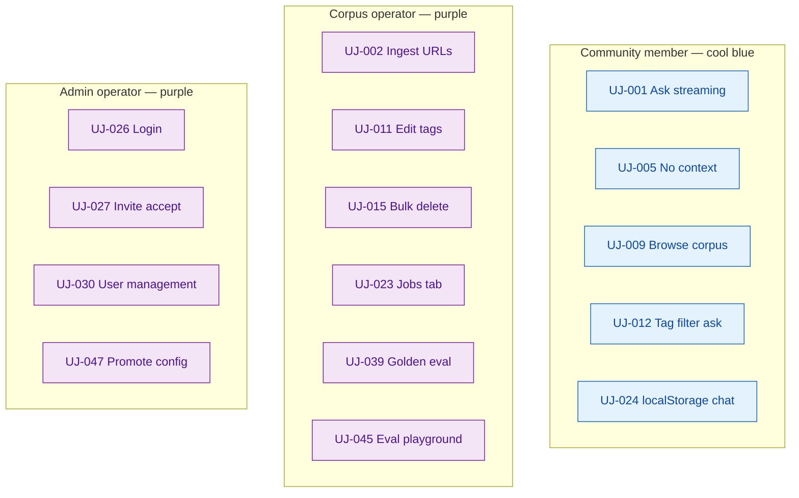
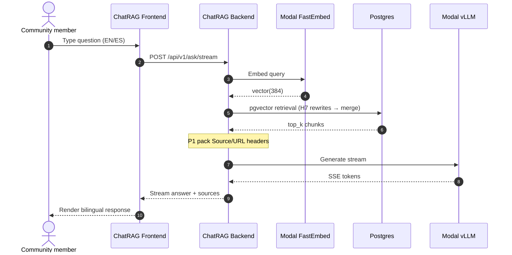
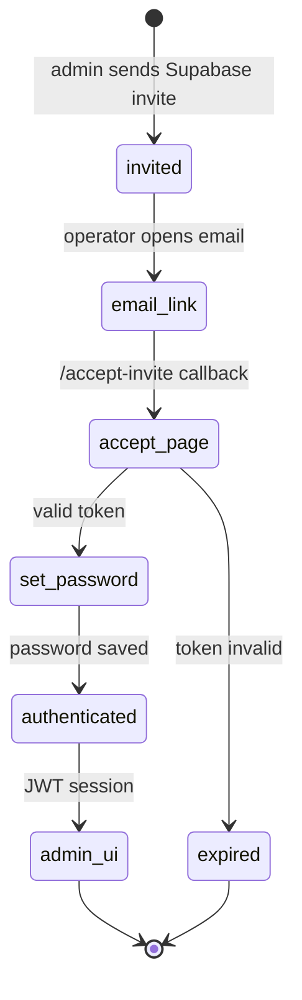
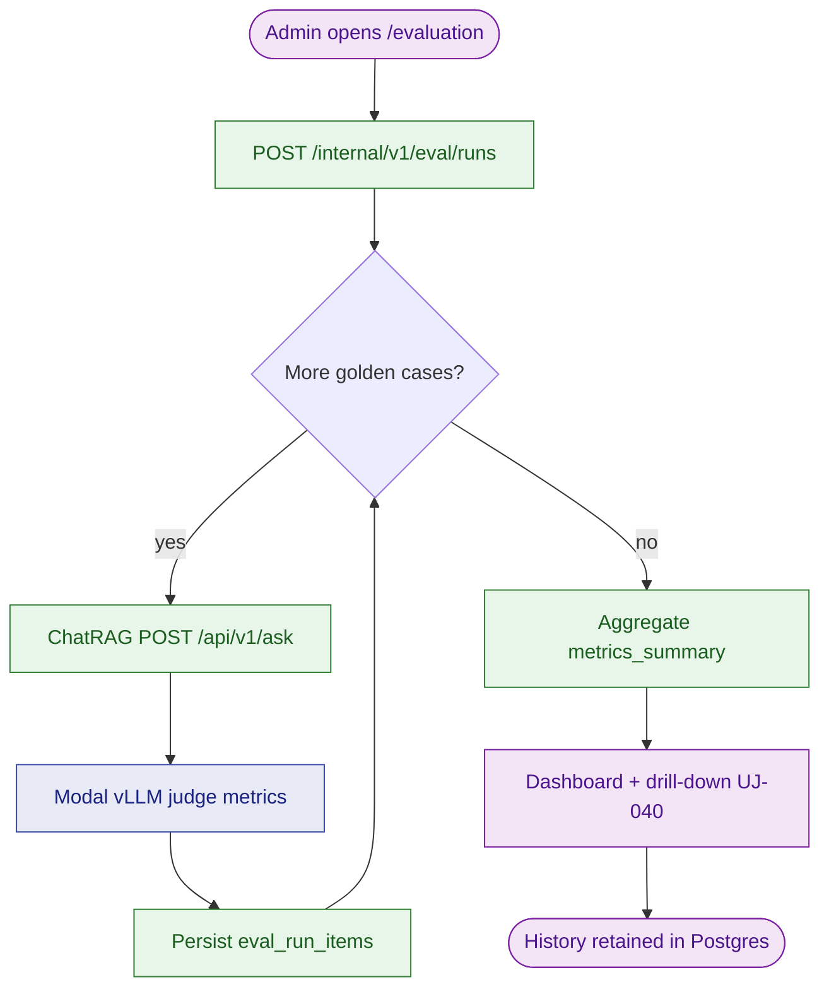

# User Journeys

> **Project**: Vecinita  
> **Source**: [feature-list.md](feature-list.md), [spec.md](spec.md), [decisions.md#Requirements decisions](decisions.md#requirements-decisions-01-requirements)  
> **Last updated**: 2026-08-29 (EV-036 F84 — UJ-088–089; prior S030 UJ-080–082)

Product-facing journeys describe what a **caller** does — not internal module tests.  
**E2E tier (v1):** **local** (TestClient + test DB + mocked Modal) — `uv run pytest tests/e2e -m "e2e and not live"`. **live** staging (`@pytest.mark.live`) after deploy: `tests/smoke/test_staging_health.py`, `test_staging_latency.py` (AC-C6 p95). **UI (T0-ui):** Playwright against preview bundles — `tests/ui/`, `make test-ui` (see `tests/ui/README.md`). Vitest remains the fast component layer; Playwright covers real-browser shell/navigation.

## Journey Index

| ID | Journey | Actor | Entry point | Feature | E2E tier |
|----|---------|-------|-------------|---------|----------|
| UJ-001 | Ask community question (bilingual, streaming) | Community member | ChatRAG Frontend → `POST /api/v1/ask/stream` | F1, F2, F11, F42 | local |
| UJ-002 | Ingest public URLs | Operator | Data Mgmt Frontend → Modal `POST /jobs` | F7, F8, F12 | local |
| UJ-003 | Delete outdated document | Operator | Admin UI → corpus delete API | F9 | local |
| UJ-004 | Bootstrap local dev stack | Developer | CLI / docker-compose / Modal serve | F18 | local |
| UJ-005 | No relevant corpus context | Community member | `POST /api/v1/ask` | F1, F5 | local |
| UJ-006 | Scrape job failure | Operator | Job poll `GET /jobs/{id}` | F8 | local |
| UJ-007 | Reject identity fields in API | Client (malformed or policy test) | ChatRAG or write API | F15 | local |
| UJ-008 | Unauthorized data-mgmt access | Anonymous client | Modal/DO data-mgmt routes | F16 | local |
| UJ-009 | Browse corpus by tags & search | Community member | ChatRAG Frontend → `GET /api/v1/documents` | F19 | local |
| UJ-010 | Open corpus document (source URL) | Community member | Browse list → external `url` | F19 | local |
| UJ-011 | Admin view chunks & edit tags | Operator | Admin UI → internal-write chunk/tag APIs | F20, F21 | local |
| UJ-012 | Ask with tag filter (sidebar) | Community member | Chat sidebar tags → `POST /api/v1/ask/stream` | F22 | local |
| UJ-013 | View admin summary dashboard | Operator | Admin UI → `/internal/v1/stats/summary` | F25 | local |
| UJ-014 | Check system health | Operator | Admin UI → multiple `/health` endpoints | F26 | local |
| UJ-015 | Bulk delete documents | Operator | Admin UI bulk select → `DELETE /internal/v1/documents/bulk` | F27 | local |
| UJ-016 | Bulk tag documents | Operator | Admin UI bulk select → `PATCH /internal/v1/documents/bulk/tags` | F27 | local |
| UJ-017 | View global audit log | Operator | Admin UI → `GET /internal/v1/audit` | F29 | local |
| UJ-018 | View document version history | Operator | Admin UI document detail → `GET /internal/v1/documents/{id}/history` | F29 | local |
| UJ-019 | View top served documents | Operator | Admin summary dashboard → `GET /internal/v1/stats/top-served` | F28 | local |
| UJ-020 | Navigate modernized admin UI | Operator | Admin UI shadcn/Tailwind navigation | F23 | local |
| UJ-021 | View document tags in corpus list | Operator | Admin corpus list → tag chips | F24 | local |
| UJ-022 | Switch admin UI language (en/es) | Operator | Admin UI sidebar `LanguageToggle` → `packages/frontend-i18n` | F31 | local |
| UJ-023 | View & track jobs in Job Management tab | Operator | Admin UI → Modal `GET /jobs` (+ SSE) | F32 (#88, #89); EV-012 #116 | local |
| UJ-024 | Conversation persists across refresh / tab-away / tab-close / new tab | Community member | ChatRAG Frontend → `localStorage` (device-local) | F33 | local |
| UJ-025 | Revisit a previous conversation | Community member | ChatRAG Frontend previous-chats list → `localStorage` | F33 | local |
| UJ-026 | Admin logs in to the Data Management UI | Operator | DM Frontend login → Supabase Auth → protected routes | F34 | local |
| UJ-027 | Admin invites an operator; invitee accepts | Admin operator | Supabase invite (email) → invitee sets password → login | F34 | local |
| UJ-028 | Unauthenticated admin request rejected | Anonymous / expired-session client | DM API / internal-write API without valid JWT | F34 | local |
| UJ-029 | Viewer is blocked from write actions | Viewer operator | DM UI / internal-write API write route | F34 | local |
| UJ-030 | Admin manages operators from the User Management page | Admin operator | DM UI `/users` → `/admin/users*` (Supabase Admin API) | F35 | local |
| UJ-031 | Admin invites an operator from the User Management page; invitee accepts | Admin operator + invitee | DM UI `/users` invite → Resend email → `/accept-invite` callback → set password → login | F35 | local + live (T3) |
| UJ-032 | Stay signed in across browser restart with "Remember me" | Operator | DM login → `vecinita.auth.remember` → `localStorage`/`sessionStorage` | F35 | local |
| UJ-033 | Operator resets a forgotten password | Operator | DM login "Forgot password?" → recovery email → `/reset-password` callback → in-app reset | F35 | local + live (T3) |
| UJ-039 | Admin runs golden-set RAG evaluation | Admin operator | DM UI `/evaluation` → `POST /internal/v1/eval/runs` | F36 (#99) | local |
| UJ-040 | Admin reviews eval scores, drill-down, and history | Admin operator | DM UI `/evaluation` → `GET /internal/v1/eval/runs*` | F36 (#99) | local |
| UJ-041 | Admin views eval metric trends (dashboard) | Admin operator | DM UI `/evaluation?tab=dashboard` → timeseries API | F36 (#99) | local |
| UJ-042 | Admin explores eval runs via pivot table | Admin operator | DM UI `/evaluation?tab=explore` | F36 (#99) | local |
| UJ-043 | Admin manages custom eval criteria | Admin operator | DM UI `/evaluation?tab=criteria` → criteria CRUD API | F36 (#99) | local |
| UJ-044 | Admin sees eval runs on Jobs tab | Admin operator | DM UI `/jobs` → Modal `GET /jobs` (`job_type=eval`) | F36/F32 EV-012 (#116); F37 M66 | local |
| UJ-045 | Admin configures and runs eval in Playground | Admin operator | DM UI `/evaluation?tab=playground` → preset + run APIs | F37 (EV-009) | local |
| UJ-046 | Admin compares two eval runs | Admin operator | DM UI `/evaluation` compare view | F37 (EV-009) | local |
| UJ-047 | Super-admin promotes config to production ChatRAG | Super-admin | Playground → promote API → ChatRAG active config | F37 (EV-009) | local |
| UJ-048 | Super-admin downloads playground model (path aliases) | Super-admin | DM UI Playground download panel → pull + poll APIs → **`vecinita-llm`** | F38 + F39 (EV-010/EV-011) | local |
| UJ-049 | LLM proxy auth failure (generate/warm/models) | Operator / service | Modal ASGI without proxy key → `401` | F39 follow-on | local |
| UJ-050 | Job detail drill-down + admin job CRUD | Admin operator | Admin UI `/jobs/:id` → Modal job detail / cancel / retry / delete | F32 EV-012 #116 | local |
| UJ-051 | Scan dense corpus / admin tables with truncated titles/URLs | Admin operator | DM UI `/corpus` (+ Jobs/Users/Audit/Eval lists) | F9, F12 EV-013 #148 | local |
| UJ-052 | Cold-start / long-wait fun facts + consent | Community member | ChatRAG Frontend wait UX (retry or >8s) | F40 EV-014 #87 | local |
| UJ-053 | Enqueue corpus rebuild (store-backed) | Admin operator | Admin Jobs → Modal `rebuild` job | F41 EV-015 #167 | local |
| UJ-054 | Shadow dry-run rebuild → F36 → promote | Admin operator | Jobs detail + eval + Admin promote | F41 EV-015 #167 | local |
| UJ-055 | Ask with H7+P1 packed multi-query retrieval | Community member | ChatRAG → `POST /api/v1/ask` / stream | F42 EV-016 #165; **defaults → F51 P3** | local |
| UJ-056 | Admin validates F42 via F36 staging golden (Hy1) | Admin operator | DM UI `/evaluation` → staging fixture | F36, F42 EV-016 | local (+ live promote smoke) |
| UJ-057 | Repeat ask hits answer/retrieve cache | Community member | ChatRAG → `POST /api/v1/ask` (warm) | F43 EV-017 | local |
| UJ-058 | Soft language fallback on empty same-lang hit | Community member | ChatRAG ask with F44 flag on + empty-hit fixture | F44 EV-017 #162 | local |
| UJ-059 | CE rerank gated ask (flag on after ship) | Community member | ChatRAG ask with F45 CE enabled | F45 EV-017 #83/#161 | local |
| UJ-060 | Admin / spike validates F45 CE ship gate | Operator | Staging golden + CE spike harness | F45, F36 EV-017/EV-018 | local (+ staging) |
| UJ-061 | Operator validates non-empty staging retrieve | Operator | Staging golden retrieve + ChatRAG sample ask | F46 EV-018 | local (+ staging) |
| UJ-062 | Re-ingest resilience (hash skip, force, embed retry) | Admin operator | Admin ingest job re-run + force | F47–F49 EV-019 #163/#166/#160 | local |
| UJ-063 | Ask with default top_k=8 + P3 packing | Community member | ChatRAG → `POST /api/v1/ask` / stream | F50–F51 EV-020 #158/#165 | local |
| UJ-064 | Robust scrape (HTML/JS/PDF) single URL | Admin operator | Admin ingest job | F59 EV-022 #69 | local |
| UJ-065 | Crawl seed → multi-page site | Admin operator | Admin JobForm crawl → Jobs detail | F60 EV-022 #71 | local |
| UJ-066 | Browse corpus as tree (nesting) | Admin operator | Admin Corpus tree toggle + bulk | F61 EV-022 #70 | local |
| UJ-067 | Lean local push (Husky) | Developer | `git push` → Husky pre-push | F62 EV-023 #182 | local |
| UJ-068 | Auto release tag after main CD | Maintainer / CD | DO deploy workflow → release job | F63 EV-023 #103 | local |
| UJ-075 | Ask after multilingual embed cutover | Community member | ChatRAG → `POST /api/v1/ask` / stream | F70–F71 EV-025 #159 | local (+ staging/prod smoke) |
| UJ-076 | F36 EN/ES compare for embed pin promote | Admin operator | F36 eval / shadow rebuild report | F71 EV-025 #159 | local (+ staging) |
| UJ-077 | Citation link only for valid http(s) URLs | Community member | ChatRAG SourceList | F72 EV-026 #222 | local (Vitest) |
| UJ-078 | Ask sources length 0…top_k by relevance | Community member | ChatRAG → `POST /api/v1/ask` / stream | F73 EV-026 #223 | local |
| UJ-079 | Operator sets document display_title | Admin operator | DocumentAdmin rename + ask citation | F74 EV-026 #224 | local |
| UJ-080 | Ingest bilingual translation on job | Admin operator | JobForm translate checkbox → ingest job | F75 EV-030 #251 | local |
| UJ-081 | Use suggested question chips (empty state) | Community member | ChatRAG welcome → chip click → prefilled ask | F1 EV-216 #216 | local |
| UJ-082 | Enable automations + view run history | Admin operator | DM Automations UI + write-API | F78 EV-027 #73 | local |
| UJ-083 | Refresh stale sources / schedule freshness | Admin operator | DM freshness + Modal schedule | F79 EV-027 #219 | local |
| UJ-084 | Approve FT train + human promote | Admin / super-admin | FT job + eval report + llm promote | F80 EV-027 #72 | local |
| UJ-085 | LLM query refinement gated ask | Community member | ChatRAG ask with F81 enabled | F81 EV-029 #82 | local |
| UJ-086 | Verified answer with citations | Community member | ChatRAG ask/stream with F82 enabled | F82 EV-030 #84 | local |
| UJ-088 | View Monitoring success rates (ingest/chat/embed) | Admin operator | DM UI `/monitoring` → write-API metrics | F84 EV-036 #114 | local |
| UJ-089 | View staging Grafana/Loki + webhook alert | Operator | Staging obs Droplet Grafana/Loki/Alertmanager | F84 EV-036 #114 | staging |
| UJ-090 | Mount prewarm races ahead of first ask | Community member | ChatRAG FE mount → `POST /api/v1/warm` → Modal `/warm` spawn | ADR-022 EV-318 #318 | local |
| UJ-091 | Seed GPU snapshots after LLM deploy | Operator | Staging Modal deploy → seed script → restore-kind samples | ADR-022 EV-315 #315 | staging |
| UJ-092 | Tune LLM scaledown_window from gaps | Operator | Env + staging evidence → AskQuestion prod flip | ADR-022 EV-319 #319 | staging |
| UJ-093 | FAQ fast-path canned answer (skip LLM) | Community member | ChatRAG ask/stream → FAQ match → faq_bypass | F85 EV-320 #320 / #79 | local |

## Visual journey maps

Mermaid **journey**, **sequence**, and **flowchart** diagrams for representative paths. Color legend: [data-flow.md §Color legend](data-flow.md#color-legend). Additional diagrams: [data-flow.md §15–16](data-flow.md#15-user-journey-maps-mermaid-journey).

### Journey overview by actor

```mermaid
flowchart TB
    subgraph Community["Community member — cool blue"]
        UJ001[UJ-001 Ask streaming]
        UJ005[UJ-005 No context]
        UJ009[UJ-009 Browse corpus]
        UJ012[UJ-012 Tag filter ask]
        UJ024[UJ-024 localStorage chat]
    end

    subgraph Operator["Corpus operator — purple"]
        UJ002[UJ-002 Ingest URLs]
        UJ011[UJ-011 Edit tags]
        UJ015[UJ-015 Bulk delete]
        UJ023[UJ-023 Jobs tab]
        UJ039[UJ-039 Golden eval]
        UJ045[UJ-045 Eval playground]
    end

    subgraph Admin["Admin operator — purple"]
        UJ026[UJ-026 Login]
        UJ027[UJ-027 Invite accept]
        UJ030[UJ-030 User management]
        UJ047[UJ-047 Promote config]
    end

    classDef community fill:#e3f2fd,stroke:#1565c0,color:#0d47a1
    classDef operator fill:#f3e5f5,stroke:#7b1fa2,color:#4a148c

    class UJ001,UJ005,UJ009,UJ012,UJ024 community
    class UJ002,UJ011,UJ015,UJ023,UJ039,UJ045,UJ026,UJ027,UJ030,UJ047 operator
```

### UJ-001 — Ask community question (sequence)

```mermaid
sequenceDiagram
    autonumber
    actor CM as Community member
    participant CF as ChatRAG Frontend
    participant CB as ChatRAG Backend
    participant FE as Modal FastEmbed
    participant PG as Postgres
    participant LLM as Modal vLLM

    CM->>CF: Type question (EN/ES)
    CF->>CB: POST /api/v1/ask/stream
    CB->>FE: Embed query
    FE-->>CB: vector(384)
    CB->>PG: pgvector retrieval (H7 rewrites → merge)
    PG-->>CB: top_k chunks
    Note over CB: P1 pack Source/URL headers
    CB->>LLM: Generate stream
    LLM-->>CB: SSE tokens
    CB-->>CF: Stream answer + sources
    CF-->>CM: Render bilingual response
```

### UJ-027 — Invite accept (state)

```mermaid
stateDiagram-v2
    [*] --> invited: admin sends Supabase invite
    invited --> email_link: operator opens email
    email_link --> accept_page: /accept-invite callback
    accept_page --> set_password: valid token
    set_password --> authenticated: password saved
    authenticated --> admin_ui: JWT session
    admin_ui --> [*]

    accept_page --> expired: token invalid
    expired --> [*]
```

### UJ-039 — Golden-set evaluation (flowchart)

```mermaid
flowchart TD
    Start([Admin opens /evaluation]) --> Run[POST /internal/v1/eval/runs]
    Run --> Loop{More golden cases?}
    Loop -->|yes| Ask[ChatRAG POST /api/v1/ask]
    Ask --> Judge[Modal vLLM judge metrics]
    Judge --> Store[Persist eval_run_items]
    Store --> Loop
    Loop -->|no| Summary[Aggregate metrics_summary]
    Summary --> Dashboard[Dashboard + drill-down UJ-040]
    Dashboard --> End([History retained in Postgres])

    classDef operator fill:#f3e5f5,stroke:#7b1fa2,color:#4a148c
    classDef do fill:#e8f5e9,stroke:#2e7d32,color:#1b5e20
    classDef modal fill:#e8eaf6,stroke:#3949ab,color:#1a237e
    classDef datastore fill:#e0f2f1,stroke:#00695c,color:#004d40

    class Start,Dashboard,End operator
    class Run,Ask,Store,Summary do
    class Judge modal
```

## Journey Details

### UJ-001: Ask community question (bilingual, streaming)

**Actor**: Community member (no account)

**Goal**: Get an accurate answer in the same language as the question, with cited sources, without creating a server-side conversation record.

**Steps**:

1. Open ChatRAG web UI.
2. Type a question in English or Spanish.
3. UI calls `POST /api/v1/ask/stream`.
4. System auto-detects language; **H7** multi-query fan-out merges retrieval; **P1** packs
   chunks with Source/URL headers (F42 — same public API; invisible to the user); streams
   answer with source references.
5. User reads answer; may ask another question (client may keep prior turns in browser memory only).

**Acceptance**: Answer language matches question; sources shown; no login; no server-side session row created.
Tokens arrive **incrementally from vLLM** (real SSE), not a full reply split into words after generation (RD-164).
Packed context uses shared `packages/rag` helpers (not bare concat).

**Automated tests**: `tests/e2e/test_uj001_ask_stream.py` (local, mocked Modal) — assert incremental stream contract (API E2E + unit; Playwright only if FE asserts token-by-token UX — RD-172 / Q3e). F42 packer/H7 unit + UJ-055.

**Interview (11)**: "Does a Spanish question return a Spanish answer with relevant corpus citations?"

---

### UJ-002: Ingest public URLs

**Actor**: Operator (platform credential, not Vecinita user row)

**Goal**: Add new public web content to the corpus so ChatRAG can retrieve it.

**Steps**:

1. Open Data Management admin UI (authenticated via deploy secret / platform gate).
2. Paste one or more public URLs; submit ingest job (optional `chunk_size_tokens` /
   `chunk_overlap_tokens`; default overlap **32**, HF tokenizer — F49).
3. UI polls job status until `completed`.
4. Optional: ask ChatRAG a question that only the new content can answer (smoke).
5. **Re-run** (see UJ-062): unchanged body → hash skip (F47); transient embed faults
   recover via sub-batch retry (F48).

**Acceptance**: Job completes; chunks/embeddings present in Postgres via DO write API;
retrieval returns new content; re-ingest of unchanged URLs does not blindly re-embed
(unless `force`).

**Automated tests**: `tests/e2e/test_uj002_ingest_job.py`;
`tests/e2e/test_uj062_ingest_resilience.py` (TC-187–192).

**Interview (11)**: "After ingest, does a targeted question retrieve the new URL's content?"

---

### UJ-003: Delete outdated document

**Actor**: Operator

**Goal**: Remove stale content from retrieval.

**Steps**:

1. Open admin UI document list.
2. Select document; confirm delete.
3. Verify document/chunks/embeddings removed (or soft-delete if spec'd later).
4. Confirm ChatRAG no longer retrieves deleted content.

**Acceptance**: Delete succeeds; subsequent queries do not return deleted chunks.

**Automated tests**: `tests/e2e/test_uj003_corpus_delete.py`

---

### UJ-004: Bootstrap local dev stack

**Actor**: Developer

**Goal**: Run full stack locally for development.

**Steps**:

1. Clone repo; configure env from template (no secrets in git).
2. `docker-compose up` (Postgres + pgvector).
3. Run Alembic migrations and seeds (`apps/database`).
4. `modal serve` for data-mgmt / embed / LLM apps.
5. Start ChatRAG Backend locally; start frontends.
6. `GET /health` OK; sample `POST /api/v1/ask` returns 200.

**Acceptance**: Health checks pass; sample query works against seeded corpus.

**Automated tests**: `tests/e2e/test_uj004_local_bootstrap.py` (may be partially scripted in CI)

---

### UJ-005: No relevant corpus context

**Actor**: Community member

**Goal**: Receive a safe response when retrieval finds nothing above threshold.

**Steps**:

1. Ask a question outside seeded corpus (or empty DB fixture).
2. Receive explicit "no relevant information" (or equivalent) — not fabricated policy text.

**Acceptance**: No false citations; HTTP 200 with clear message; no PII logged.

**Automated tests**: `tests/e2e/test_uj005_empty_retrieval.py`

---

### UJ-006: Scrape job failure

**Actor**: Operator

**Goal**: Understand and recover from a failed ingest.

**Steps**:

1. Submit job with invalid URL or timeout-triggering target.
2. Poll until status `failed` with error code/message.
3. Fix URL or retry job.

**Acceptance**: Job terminal state `failed`; no partial corrupt vectors without cleanup policy.

**Automated tests**: `tests/e2e/test_uj006_job_failure.py`

---

### UJ-007: Reject identity fields in API

**Actor**: API client (test harness)

**Goal**: Prove zero-PII API contracts are enforced.

**Steps**:

1. `POST /api/v1/ask` with body containing `email` or `user_id`.
2. Receive **400**; no DB write.

**Acceptance**: OpenAPI + handler reject forbidden fields; privacy tests pass in CI.

**Automated tests**: `tests/e2e/test_uj007_reject_identity.py`, `tests/privacy/`

---

### UJ-008: Unauthorized data-mgmt access

**Actor**: Anonymous or wrong API key

**Goal**: Corpus and jobs are not accessible without infrastructure auth.

**Steps**:

1. Call Modal job endpoint or DO write API without credentials.
2. Receive **401/403**.

**Acceptance**: No job created; no corpus mutation.

**Automated tests**: `tests/e2e/test_uj008_unauthorized_admin.py`

---

### UJ-009: Browse corpus by tags & search

**Actor**: Community member (no account)

**Goal**: Discover corpus documents and narrow by tags or title/URL search.

**Steps**:

1. Open ChatRAG web UI; navigate to **Corpus** (or browse panel).
2. Optionally select one or more tag filters from facet list (`GET /api/v1/tags`).
3. Optionally enter search text (title/URL match).
4. UI calls `GET /api/v1/documents?tags=...&q=...&page=1&page_size=20`.
5. User sees paginated list (title, tags, language); 20 per page.

**Acceptance**: No login; results match filters; empty state when no matches.

**Automated tests**: `tests/e2e/test_uj009_corpus_browse.py` (planned)

**Browser / connectivity**: ChatRAG frontend origin → ChatRAG backend GET routes; H4 CORS on new paths.

---

### UJ-010: Open corpus document (source URL)

**Actor**: Community member

**Goal**: Read the original public source of a corpus document.

**Steps**:

1. From browse list (UJ-009), click a document.
2. UI opens the document's **original URL** in a new browser tab (not in-app full text).

**Acceptance**: Link matches `documents.url`; no auth required.

**Automated tests**: Covered by UJ-009 UI unit tests + API contract tests.

---

### UJ-011: Admin view chunks & edit tags

**Actor**: Operator (platform credential)

**Goal**: Inspect how a document was chunked and curate tags for better retrieval.

**Steps**:

1. Open Data Management admin UI; select document from corpus list.
2. View chunk list (`GET /internal/v1/documents/{id}/chunks`) — read-only chunk text.
3. Edit document tags and/or per-chunk tags (human `source: human`).
4. Optionally trigger **LLM re-tag** for document (`POST .../retag` or admin action).
5. Confirm tags appear in community browse and affect RAG (UJ-012).

**Acceptance**: Max 10 document / 5 chunk tags enforced; no operator identity stored; unauthorized → 401.

**Automated tests**: `tests/e2e/test_uj011_admin_tags.py` (planned)

---

### UJ-012: Ask with tag filter (sidebar)

**Actor**: Community member

**Goal**: Narrow RAG answers to documents matching selected tags.

**Steps**:

1. Open ChatRAG UI; optional: select tag chips in **chat sidebar**.
2. Type question; UI calls `POST /api/v1/ask/stream` with `question` and optional `tags[]`.
3. If **tags selected**: retrieval filters by those tags only (LLM tag inference skipped).
4. If **no tags selected**: backend LLM infers relevant tags from question, then retrieves.
5. User receives streamed answer with sources.

**Acceptance**: Filtered retrieval returns only matching tagged content; bilingual behavior unchanged (F1).

**Automated tests**: `tests/e2e/test_uj012_tag_filtered_ask.py` (planned)

**Interview (11)**: "When I filter by tag X, do answers cite only documents tagged X?"

---

### UJ-013: View admin summary dashboard

**Actor**: Operator (platform credential)

**Goal**: Get a quick overview of corpus health, activity, and usage statistics.

**Steps**:

1. Open Data Management admin UI; navigate to **Dashboard** tab/page.
2. Dashboard loads aggregated stats from `GET /internal/v1/stats/summary`.
3. Operator sees: total documents, total chunks, tag distribution, job stats, language breakdown, recent activity feed, storage usage, top served documents.
4. Operator clicks "Refresh" to reload stats.

**Acceptance**: All stat cards render with correct counts; loading state shown during fetch; error state if API unreachable.

**Automated tests**: `tests/e2e/test_uj013_admin_dashboard.py` (planned)

---

### UJ-014: Check system health

**Actor**: Operator

**Goal**: Verify all Vecinita services are operational from a single admin view.

**Steps**:

1. Open admin UI; navigate to **Health** tab/page.
2. UI calls each service's `/health` endpoint directly (CORS required).
3. Operator sees status grid: green (up), red (down), yellow (degraded/timeout) for each of 8 services.
4. Operator clicks "Refresh" to re-check all services.

**Acceptance**: All services reachable display green; unreachable services display red with error detail; checks complete within `VECINITA_HEALTH_TIMEOUT_MS` per service.

**Automated tests**: `tests/e2e/test_uj014_health_dashboard.py` (planned)

**Browser / connectivity**: Admin frontend origin must have CORS access to all service health endpoints (internal-write-api, chat-rag-backend, data-mgmt-backend Modal, static frontends, Modal LLM/embed).

---

### UJ-015: Bulk delete documents

**Actor**: Operator

**Goal**: Remove multiple stale documents from the corpus in one operation.

**Steps**:

1. Open admin corpus list; enable selection mode (checkboxes appear).
2. Select multiple documents (checkbox click or shift+click range).
3. Click "Bulk Delete" in the toolbar.
4. Confirm destructive action in modal dialog (lists document count).
5. UI calls `DELETE /internal/v1/documents/bulk` with document IDs.
6. Documents removed; audit log records each deletion (F29).
7. List refreshes showing remaining documents.

**Acceptance**: Selected documents removed; audit_log has entries for each deleted document; ChatRAG no longer retrieves deleted content; max 100 per operation enforced.

**Automated tests**: `tests/e2e/test_uj015_bulk_delete.py` (planned)

---

### UJ-016: Bulk tag documents

**Actor**: Operator

**Goal**: Apply or remove tags across multiple documents at once.

**Steps**:

1. Select multiple documents (same selection UX as UJ-015).
2. Click "Bulk Tag" in toolbar.
3. Enter tags to add and/or tags to remove in a dialog.
4. Confirm; UI calls `PATCH /internal/v1/documents/bulk/tags` with add/remove lists.
5. Tags applied; audit log records each tag change (F29).
6. Corpus list refreshes showing updated tag chips (F24).

**Acceptance**: Tags applied/removed correctly; max 10 document tags enforced per document; audit entries created; unauthorized → 401.

**Automated tests**: `tests/e2e/test_uj016_bulk_tag.py` (planned)

---

### UJ-017: View global audit log

**Actor**: Operator

**Goal**: Review all recent changes across the corpus for compliance/debugging.

**Steps**:

1. Open admin UI; navigate to **Audit Log** tab/page.
2. UI calls `GET /internal/v1/audit?page=1&page_size=50`.
3. Operator sees chronological list of events (newest first) with: event type, entity, timestamp, payload summary.
4. Operator filters by event type (e.g., "deleted only") or date range.
5. Operator clicks an event to expand full payload (before/after diff).

**Acceptance**: Events displayed in reverse chronological order; filters work correctly; pagination works; no personal data visible in entries.

**Automated tests**: `tests/e2e/test_uj017_audit_log.py` (planned)

---

### UJ-018: View document version history

**Actor**: Operator

**Goal**: See what has changed for a specific document over time (title, language, tags).

**Steps**:

1. Open document detail (from corpus list or audit log link).
2. Click "History" tab/section.
3. UI calls `GET /internal/v1/documents/{id}/history`.
4. Operator sees version timeline: version number, timestamp, what changed (title, language, tags before/after).
5. Operator can compare any two versions visually.

**Acceptance**: Version list shows all changes; tags_snapshot is accurate; versions are immutable (no editing history entries); deleted documents show history up to deletion.

**Automated tests**: `tests/e2e/test_uj018_document_history.py` (planned)

---

### UJ-019: View top served documents

**Actor**: Operator

**Goal**: Understand which corpus documents are most cited in RAG responses.

**Steps**:

1. Open admin dashboard (UJ-013).
2. Locate "Top Served Documents" widget.
3. See ranked list of documents by serve count (highest first) with last-served timestamp.
4. Click a document to navigate to its detail/history view.

**Acceptance**: Ranking matches actual `document_serving_stats` data; documents with zero serves are excluded; list refreshes with dashboard.

**Automated tests**: `tests/e2e/test_uj019_top_served.py` (planned)

---

### UJ-020: Navigate modernized admin UI

**Actor**: Operator

**Goal**: Use the redesigned admin interface with modern styling and light/dark theme.

**Steps**:

1. Open Data Management admin UI in a browser.
2. UI loads with shadcn/ui component library (Tailwind CSS + Radix primitives).
3. Theme automatically matches system preference (light or dark mode).
4. Navigate between pages (Dashboard, Corpus, Health, Audit Log) using sidebar or top navigation.
5. All pages render with consistent spacing, typography, color tokens, and responsive layout.

**Acceptance**: All pages render without visual regressions; theme toggle respects system preference; navigation between all admin sections works; responsive at 768px and 1280px breakpoints; accessible (keyboard nav, ARIA labels on interactive elements).

**Automated tests**: `tests/e2e/test_uj020_admin_ui.py` (planned — Vitest component + visual snapshot)

---

### UJ-021: View document tags in corpus list

**Actor**: Operator

**Goal**: See which tags are assigned to documents at a glance without opening each document.

**Steps**:

1. Open admin corpus list (existing view).
2. Each document row displays colored tag chips/badges below the document title.
3. Tags are color-coded by source: one color for LLM-assigned, another for human-assigned.
4. Operator can visually scan tags across the list to identify tagging gaps or patterns.

**Acceptance**: Tags render for all documents that have them; empty state (no tags) shows nothing or a subtle "no tags" indicator; tag chips match the tag data from the API response; color coding distinguishes LLM vs human source.

**Automated tests**: `tests/e2e/test_uj021_tag_display.py` (planned — Vitest component)

---

### UJ-022: Switch admin UI language (en/es)

**Actor**: Operator

**Goal**: Use the admin dashboard in English or Spanish with the same locale behavior as ChatRAG, including persistence across page reloads and both Vecinita frontends in the same browser.

**Steps**:

1. Open Data Management admin UI (any page).
2. Locate EN/ES language toggle in sidebar footer beside theme control (desktop) or mobile nav sheet footer.
3. Select **ES** — navigation labels, headings, buttons, empty states, and validation messages update to Spanish; `document.documentElement.lang` becomes `es`.
4. Navigate to Dashboard, Corpus, Health, and Audit — all static UI chrome remains in Spanish.
5. Reload browser — UI stays Spanish (`vecinita.locale` in `localStorage`).
6. Open ChatRAG frontend in same browser — UI uses same stored locale.
7. Switch back to **EN** — admin UI returns to English; ChatRAG reflects change on next load or toggle.

**Acceptance**: All ~120+ static admin strings translated; corpus document titles, tag labels, URLs, audit event types, and API error text remain in source language (R30); audit/dashboard timestamps use UI locale via `Intl` / `toLocaleString()`; no API calls change; toggle is keyboard-accessible.

**Not translated**: Document `title`, tag `label`, `url`, audit JSON payloads, health `overall` / service status strings, job status enums, API `error_message`.

**Automated tests**: `apps/data-management-frontend/src/test/test_admin_language_toggle_i18n.test.tsx`; `packages/frontend-ui` Vitest; migrated ChatRAG i18n tests import shared packages.

**E2E tier**: local (Vitest component smoke); live browser toggle waived at T0 (same as other admin UI journeys).

### UJ-023: View & track jobs in Job Management tab

**Actor**: Operator

**Goal**: See every long-running admin job (ingest, retag, eval, future types) from a dedicated
admin tab, with failed jobs surfacing their error, regardless of where the job was started or
whether the operator navigated away.

**Steps**:

1. Start an ingest job on the **Corpus** tab (`POST /jobs` on Modal) and/or an eval run from
   **Evaluation** (creates Modal `job_type=eval`).
2. Navigate to another tab (e.g. Dashboard) and back to **Jobs** — the job is **not** lost; the
   Job Management tab re-fetches Modal `GET /jobs` (server-sourced, ADR-023 / EV-012 RD-174), so
   running/completed/failed jobs remain visible (regression class of #53/#89).
3. Prefer **SSE** job events (`GET /jobs/events` or equivalent); on SSE failure, fall back to **4s
   poll** and retry SSE with backoff (RD-173).
4. Optionally filter by status via `GET /jobs?status=…` (UI control).
5. Retag rows show **document context** (`document_id`), not an empty URLs column (#116).
6. A job whose LLM tag completion was empty / non-JSON still appears as **completed** (tagging is
   best-effort, #88).
7. A genuinely failed job appears as **failed** with `error_code` / `error_message`.
8. Click a row → **UJ-050** detail at `/jobs/:id`.

**Acceptance**: Modal `GET /jobs` returns jobs newest-first with optional `status` filter and
`job_type` including `eval`; failed jobs expose errors; non-JSON tag completion does not fail
ingest; list persists across in-app navigation; eval appears within one update cycle after start
(#116).

**Automated tests**:
- API E2E: `tests/e2e/test_uj023_job_management.py` (extend for eval + filter + retag document_id);
  `tests/e2e/test_uj044_eval_jobs_tab.py`; `tests/e2e/test_uj002_ingest_tag_resilience.py`.
- UI: Vitest Jobs page; Playwright `tests/ui/admin/uj023-jobs-tab.spec.ts` / list→detail (RD-178).

**E2E tier**: local (API TestClient + Vitest + Playwright T0-ui); live T3 after deploy (S013-D19).

---

### UJ-050: Job detail drill-down + admin job CRUD

**Actor**: Admin operator (`role=admin`)

**Goal**: Open a job detail view with enough context for progress and post-mortem; cancel, retry,
or delete jobs (admin-only).

**Preconditions**: Admin authenticated; at least one job exists.

**Steps**:

1. From `/jobs`, click a job row → navigate to `/jobs/:id` (type-aware).
2. Detail shows: status timeline, timestamps, type-specific context (URLs or `document_id` for
   retag; eval summary + link to `/evaluation?run=…`), error context on failure, Modal
   function/call id + copy + dashboard link when known (RD-177).
3. Admin may **cancel** a pending/running job, **retry** a failed job, or **delete** a terminal
   job from the Modal job store (RD-176). Viewer sees read-only detail (no mutate controls);
   mutate APIs return `403` for viewer.
4. Updates arrive via SSE with 4s poll fallback (RD-173).

**Acceptance**: Detail route works for ingest/retag/eval; eval links to existing drill-down;
admin CRUD succeeds; viewer cannot mutate; no PII beyond existing F32 limits.

**Automated tests**:
- API E2E: `tests/e2e/test_uj050_job_detail_crud.py` (TC-146–TC-149).
- Vitest: Jobs detail page + App router navigation.
- Playwright: `tests/ui/admin/uj050-job-detail.spec.ts` (list → detail, RD-178).

**E2E tier**: local; live T3 after deploy.

---

### UJ-051: Scan dense corpus / admin tables with truncated titles/URLs

**Actor**: Admin operator (`role=admin` or viewer for read-only corpus)

**Goal**: Work the Corpus Documents table (and other admin list tables) on a laptop viewport
without layout blowouts — long titles/URLs clipped, Actions reachable, full text available to
hover and assistive tech — without cookies or new preference storage.

**Preconditions**: Admin SPA loaded; corpus has at least one document with a long title and long
URL (or Vitest fixtures); #112 pagination live (`page_size` 50).

**Steps**:

1. Open `/corpus` at ~1280×800. First page of documents is usable without scrolling the whole app
   chrome just to reach row Actions (sticky header and/or bounded table scroll + compact rows).
2. Long document titles render with ellipsis; hover (native `title`) and accessible name
   (`aria-label` / accessible text) expose the full title.
3. Long URLs render clipped; link remains clickable; full URL on hover + accessible name.
4. Tag chips under title show a bounded set with `+N` when over the max visible count; row height
   does not grow unboundedly.
5. Select-all (page-scoped), bulk toolbar, manage-tags, and delete still work (UJ-003 / UJ-015 /
   UJ-016 regression).
6. Toggle light ↔ dark via existing ThemeToggle — truncation chrome uses semantic tokens and
   remains readable. With OS `prefers-contrast: more` (or Forced Colors), clipped text and links
   remain distinguishable (CSS-only; no high-contrast theme mode, no new storage).
7. Repeat truncation/density patterns on Jobs, Users, Audit, and Evaluation list tables where
   long strings appear (shared helper).

**Privacy / cookies**: Journey must **not** set `document.cookie`, must **not** add localStorage
keys beyond existing theme/locale/auth prefs, and must **not** introduce a cookie-consent banner.
Truncation is presentational only.

**Acceptance**: Viewport density AC met; titles/URLs truncated with full text via `title` +
`aria-label`; Actions visible without horizontal page scroll; bulk/delete/tag flows unchanged;
theme + OS contrast readable; no new cookies/storage.

**Automated tests**:
- Vitest: `apps/data-management-frontend/src/test/test_corpus_list_truncation.test.tsx` (and
  shared `TruncatedText` unit tests) — TC-152–TC-154.
- Vitest regression: existing corpus bulk/select tests remain green.
- Playwright T0-ui (required for viewport density AC-U1):  
  `tests/ui/admin/uj051-corpus-density.spec.ts` — TC-155.

**E2E tier**: local (Vitest primary; Playwright for viewport density).

---

### UJ-052: Cold-start / long-wait fun facts + consent

**Actor**: Community member (no account)

**Goal**: While the assistant is cold-starting or slow to produce the first token, see rotating
bilingual WRWC / Providence fun facts and a soft donate CTA so the wait feels informative — without
tracking personal data. Optionally remember which facts were already shown (device-local) after an
explicit friendly consent choice.

**Preconditions**: ChatRAG SPA loaded; ask path can simulate cold-start retry and/or delayed first
token; locale `en` or `es`.

**Steps**:

1. User submits a question (UJ-001). Existing cold-start retries and/or client `/warm` prewarm run
   as today (`prewarmChatServices`).
2. **Trigger A — cold-start retry:** On retry (`onRetry`), show short “starting up…” status **and**
   begin rotating fun facts (~4–5s).
3. **Trigger B — slow stream:** If **8s** elapse with no first token (even without a retry), show
   the same wait UX.
4. Fun facts rotate through a static EN/ES curated list (~10). A secondary line links to
   [wrwc.org/donate](https://wrwc.org/donate/) (or `VITE_WRWC_DONATE_URL`) in a new tab.
5. **Consent banner** (first time, before remembering): friendly copy that we are **not** tracking
   the user — we only want to avoid repeating messages. Actions: **Accept** (remember) /
   **No thanks** (opt-out). Facts may rotate either way; **memory only after Accept**.
6. On **Accept**: set first-party HTTP preference cookie; store seen fact ids in `localStorage`
   (`vecinita.chat.coldstart.facts.v1`). Prefer unseen facts when rotating.
7. On **No thanks**: set opt-out cookie; do **not** persist seen-fact ids; still rotate facts.
8. On first streamed token or final error: clear wait UX; keep existing failure copy.
9. Cookie / storage are **not** sent to ChatRAG APIs and are not required for ask/stream.

**Cross-component interaction**: Chat shell / `ChatPanel` status region ↔ consent banner ↔ donate
link (Playwright T0-ui).

**Acceptance**: Triggers at retry or 8s; rotation + donate CTA; consent before remember; opt-out
stops persistence; EN/ES; no PII; no API contract change.

**Automated tests**:
- Vitest: rotation timer, 8s slow-trigger, consent Accept/Opt-out, storage/cookie helpers,
  donate href — TC-156–TC-159.
- Playwright T0-ui: `tests/ui/chat/uj052-cold-start-wait.spec.ts` — TC-160.

**E2E tier**: local (Vitest + Playwright); live observation at 13-deploy-smoke only if easy.

---

### UJ-053: Enqueue corpus rebuild (store-backed)

**Actor**: Admin operator (`admin` role)

**Goal**: Trigger a corpus rebuild from the Admin Jobs UI without ad-hoc SQL, using the
Postgres document store as the text source (no live scrape for default staging runs).

**Preconditions**: F41 deployed; document store populated for target docs; operator authenticated.

**Steps**:

1. Open Admin **Jobs** (UJ-023) and choose **Rebuild corpus** (or equivalent enqueue control).
2. Select `mode`: `reembed` | `rechunk` | `rescrape` (default staging: `rechunk` or `reembed`).
3. Optionally set `document_ids` (default = whole corpus); set **force** to bypass hash-skip.
4. Leave **dry_run** off for a live staging write, or use UJ-054 for shadow path.
5. Submit → `202` with `job_id`; job appears with `job_type=rebuild`.
6. Watch SSE / poll; open `/jobs/:id` for progress and per-doc failures.
7. On success, version stamps on revisions/embeddings match current model + chunk settings.

**Cross-component**: Jobs list ↔ job detail ↔ enqueue form (Playwright T0-ui).

**Acceptance**: Rebuild enqueued with mode/force; store-backed modes do not fetch URLs unless
`rescrape`; failures isolated per document; ADR-007 write path only.

**Automated tests**: API e2e TC-161–163, TC-166; Vitest enqueue form; Playwright TC-167.

**E2E tier**: local (API + UI); staging smoke at 13.

---

### UJ-054: Shadow dry-run rebuild → F36 → promote

**Actor**: Admin operator (`admin` role)

**Goal**: Preview a rebuild into shadow tables, validate with F36 eval, then promote to live
staging corpus (prod promote deferred to runbook).

**Preconditions**: UJ-053 capable; F36 golden set available on staging.

**Steps**:

1. Enqueue rebuild with `dry_run=true` (and `force` as needed).
2. Job writes shadow chunks/embeddings keyed by `rebuild_run_id` — live retrieval unchanged.
3. Review job detail counts / failures.
4. Run **F36 against shadow-backed** staging configuration (**before** promote).
5. If gate passes, invoke **promote** for that `rebuild_run_id` from **Admin UI** (Jobs
   detail / promote control) → `POST /internal/v1/rebuild/{rebuild_run_id}/promote`
   (`admin` role — same as enqueue).
6. Confirm live retrieval uses new revision stamps; prior revision retained for rollback.

**Acceptance**: Dry-run never mutates live retrieval until promote; F36 gate recorded **before**
promote; Admin UI promote control; version stamps queryable; prod live promote not required in
EV-015.

**Automated tests**: API e2e TC-164–165; integration promote; eval gate checklist TC-168;
Playwright TC-169.

**E2E tier**: local API/integration + UI; staging at 12/13.

---

### UJ-055: Ask with H7+P1 packed multi-query retrieval

**Actor**: Community member (no account)

**Goal**: Receive an answer grounded in packed retrieval context (title/URL headers + H7
fan-out) for English and Spanish questions, without any new UI surface.

**Preconditions**: ChatRAG backend wired to `packages/rag` P1 packer + H7 (F42); E0 embed pin.

**Steps**:

1. Call `POST /api/v1/ask` or `/ask/stream` with an English community question.
2. Backend runs H7 rewrites → merged retrieval → P1 pack → synthesis.
3. Repeat with a Spanish (`es`) question (Spanish-aware rewrites).
4. Observe answer language match and source references (same response shape as UJ-001).

**Acceptance**: Prompt assembly uses P1 headers (not bare concat); H7 runs by default;
`answer_lang_match` for en/es; no new request fields required. **EV-020 / F51:** prod default
packer is **P3** (dedupe + budget); UJ-055 still covers H7 + shared helpers — see **UJ-063**
for default top_k=8 + P3 assertions.

**Automated tests**: Unit packer/H7 (TC-170–172); API e2e `tests/e2e/test_uj055_h7_p1_ask.py`
(TC-173); extend/adjust for P3 default in TC-193–195 / UJ-063.

**E2E tier**: local.

---

### UJ-063: Ask with default top_k=8 + P3 packing

**Actor**: Community member (no account)

**Goal**: Receive an answer with up to **8** sources and **P3**-packed context (doc dedupe +
char budget) using production defaults — no request overrides.

**Preconditions**: ChatRAG defaults `VECINITA_TOP_K=8`, `VECINITA_RAG_PACKER=p3`,
`VECINITA_RAG_CONTEXT_MAX_CHARS=3500`; H7 remains on (F42); CE remains off.

**Steps**:

1. Call `POST /api/v1/ask` (or stream) with a community question that has ≥8 distinct corpus
   hits **above** `min_retrieval_score` (strong-hit fixture — see UJ-078 / F73 for filtered cases).
2. Observe `sources[]` length ≤ 8 after relevance filter; equals `top_k` only when ≥`top_k`
   hits clear the bar (no separate FE truncation; no pad). RD-231 “sources = retrieve count”
   is superseded by RD-311 / F73 for length semantics.
3. Confirm synthesis path uses P3 packing (unit/e2e via packer mode or observable dedupe when
   multiple chunks share a `document_id`).
4. Repeat for a Spanish question (language match still holds).

**Acceptance**: Defaults are 8 + p3 without client overrides; sources count ≤ 8 (0…`top_k`);
P3 dedupe keeps ≤1 chunk per document_id before budget truncate; response shape unchanged
(UJ-001 / UJ-055). Filtered/sparse sources: **UJ-078**.

**Automated tests**: Unit defaults + P3 (TC-193–194); API e2e
`tests/e2e/test_uj063_topk_p3_ask.py` (TC-195). No new Playwright (no UI change).

**E2E tier**: local.

---

### UJ-064: Robust scrape (HTML / JS / PDF)

**Actor**: Admin operator

**Goal**: Ingest a single public URL with clean main-content extraction, politeness, and
support for JS-rendered HTML and PDF text (best-effort).

**Preconditions**: DM Job form; F59 scrape path live; fixture HTML/PDF available in tests.

**Steps**:

1. Submit `POST /jobs` with one HTML fixture URL (`crawl=false`).
2. Job reaches `completed`; document text lacks nav/footer boilerplate vs fixture expectation.
3. Submit a JS-sparse fixture (or render-flagged URL); content includes main body after render path.
4. Submit a PDF URL/fixture; text extracted when present; if empty → page soft-failed with
   error in job metrics (not silent empty corpus row) (S024-D29).
5. Confirm robots-disallowed fixture is skipped with `pages_skipped_robots` / equivalent.

**Acceptance**: Cleaner extract than pre-F59; robots/rate-limit honored; PDF/JS paths behave
per AC-SC*; no ChatRAG UI change.

**Automated tests**: Unit fixtures (TC-196–198); API e2e `tests/e2e/test_uj064_robust_scrape.py`
(TC-199). Vitest N/A.

**E2E tier**: local (T0/T2); T3 live optional single public page after deploy.

---

### UJ-065: Crawl seed → multi-page site

**Actor**: Admin operator

**Goal**: From one seed URL, crawl same-site pages under depth/page limits and see progress
then results.

**Preconditions**: JobForm crawl controls (F60); polite fixtures / mock HTTP graph.

**Steps**:

1. Open Job form; set seed URL; enable crawl; set `max_depth=2`, `max_pages=25` (or defaults).
2. Submit job; Jobs detail shows progress / partial metrics while running.
3. Job completes with `pages_fetched` ≥ 2 on fixture graph; link graph / tree available via
   `GET /jobs/{id}/tree`.
4. Force a mid-crawl page failure in fixture; job still completes with `pages_failed` &gt; 0
   and other pages ingested (S024-D13).
5. Confirm single-URL ingest (`crawl=false`) unchanged.

**Acceptance**: Additive job options only; soft per-page fail; metrics present; UJ-002 still
works.

**Automated tests**: Unit scope/dedup (TC-200–201); API e2e
`tests/e2e/test_uj065_website_crawl.py` (TC-202); Vitest JobForm crawl fields (TC-203).

**UI E2E**: Playwright optional if JobForm ↔ Jobs detail cross-route — prefer
`tests/ui/admin/uj065-crawl-job.spec.ts` when interaction spans pages.

**E2E tier**: local; T3 live crawl on safe public fixture site post-deploy (S024-D24).

---

### UJ-066: Browse corpus as tree (nesting)

**Actor**: Admin operator

**Goal**: View ingest/crawl results as a nested tree (domain → path → document → chunks)
with status/counts, toggle flat list, and run bulk actions from selection.

**Preconditions**: Corpus with multi-path documents from crawl or fixtures; F61 APIs.

**Steps**:

1. Open Admin Corpus; toggle **Tree** view.
2. Expand domain → path segments → document; see chunk children (lazy OK) and status badges.
3. Select multiple documents in tree; open bulk delete/tag/metadata; confirm dialogs work.
4. Toggle back to flat list; existing CorpusList behavior preserved.
5. Empty corpus shows empty state + CTA toward ingest/crawl.

**Acceptance**: Strong nesting UX (S024-D9); EN/ES labels; no ChatRAG FE (S024-D17).

**Automated tests**: API e2e tree payload (TC-204); Vitest tree component (TC-205–206);
Playwright `tests/ui/admin/uj066-corpus-tree.spec.ts` for tree ↔ bulk dialog interaction
(TC-207).

**E2E tier**: local (T0-ui + Vitest); T3-ui optional after deploy.

---

### UJ-067: Lean local push (Husky gates)

**Actor**: Developer

**Goal**: Everyday `git push` stays fast (lint + scoped unit tests) while heavier local
gates (typecheck, security-scan) run on `git commit` via Husky pre-commit, without dropping
the job_type dispatch regression guard.

**Preconditions**: Husky installed; repo root; no skip env vars unless testing skips.

**Steps**:

1. Stage a normal code change and `git commit`.
2. Pre-commit runs: typecheck + security-scan + job_type dispatch guard (BUG-2026-07-31).
3. `git push` (default): pre-push runs lint + `make test-fast` only — **not** typecheck or
   security-scan.
4. Optional: `VECINITA_MEDIUM_PRE_PUSH=1` / `VECINITA_FULL_PRE_PUSH=1` for heavier push;
   `VECINITA_SKIP_PRE_COMMIT=1` / `VECINITA_SKIP_PRE_PUSH=1` skip hooks.
5. Before opening a PR: `make ci-push` (unchanged GitHub merge gate).

**Acceptance**: Default push path = lint + units only (AC-CI1–CI3); docs/rules match
(AC-CI4); format-check not on commit (S025-D5).

**Automated tests**: Unit/script tests for hook entrypoints and Makefile targets
(TC-208–211); no browser UI; no product API e2e.

**E2E tier**: local (developer tooling — pytest/script smoke at the hook layer).

---

### UJ-068: Auto release tag after successful main CD

**Actor**: Maintainer / GitHub Actions CD

**Goal**: Every successful production deploy on `main` gets an immutable semver tag and
GitHub Release for traceability.

**Preconditions**: CI + deploy-preflight + Modal + DigitalOcean workflows green on `main`;
HEAD not already tagged (or idempotent skip); commit message lacks `[skip release]`.

**Steps**:

1. Merge to `main` triggers CI → deploy-preflight → Deploy Modal → Deploy DigitalOcean.
2. On DO deploy **success**, release workflow/job runs.
3. Compute next **patch** semver from latest `v*` tag (or bootstrap from CHANGELOG baseline).
4. Create annotated tag `vX.Y.Z` + GitHub Release with SHA + CI/CD run URLs.
5. If HEAD already tagged or `[skip release]` present → no-op (no duplicate / no tag).

**Acceptance**: Tag after DO CD (AC-REL1); patch bump + Release notes (AC-REL2–3); skip +
idempotent (AC-REL4); no floating tags / no semantic-release (S025-D6).

**Automated tests**: Unit tests for bump/skip/idempotent helpers (TC-212–215); workflow YAML
lint/structure assertions; live tag creation verified on first green main merge (T3/ops).

**E2E tier**: local (unit) + live verify after merge (13-deploy-smoke).

---

### UJ-069: Cold-start wait shows tips + marketing (F64)

**Actor**: Community visitor (ChatRAG)

**Goal**: During cold-start / long wait, see rotating bilingual content including query tips
and VECINA marketing (in addition to F40 fun facts), without mini surveys.

**Preconditions**: ChatRAG FE with F40 wait UX; slow first token or cold-start retry.

**Steps**:

1. Submit an ask that triggers wait UX (retry or >8s no token).
2. Observe rotating entries with types `fact` / `tip` / `marketing`.
3. Confirm donate CTA + consent still behave per UJ-052 / ADR-039.
4. No survey UI appears.

**Acceptance**: AC-UX1–UX2; TC-216–217.

**Components**: `ColdStartWait` ↔ fact catalog ↔ ChatPanel.

**E2E tier**: T0-ui Playwright + Vitest.

---

### UJ-070: Ask shows energy estimate + advisory (F65)

**Actor**: Community visitor (ChatRAG)

**Goal**: After an answer, see an approximate energy / CO₂e estimate with a clear advisory
that it is heuristic (not live Modal power), a **car-travel distance equivalent**
(meters/miles), plus access a short use guide (may include % of car-day/year).

**Preconditions**: ChatRAG backend returns `energy_estimate`; FE wired.

**Steps**:

1. Ask a question (stream or non-stream).
2. On completion, UI shows Wh / gCO₂e chip, car-distance line (≈ m/mi), and advisory (EN/ES).
3. Open use guide (wait surface and/or chrome) with query + env guidance; optional
   car-day/year fraction copy.

**Acceptance**: AC-UX3–UX5, AC-UX17; TC-218–220, TC-231.

**Components**: ChatPanel ↔ ask API ↔ energy chip / use guide.

**E2E tier**: API e2e + Vitest + T0-ui for chip/advisory/car line.

---

### UJ-071: Action icons animate while pending (F66)

**Actor**: Visitor / admin operator

**Goal**: Refresh/send/destructive actions show consistent icon animations while pending;
reduced-motion disables/shortens them.

**Steps**:

1. Admin: trigger Jobs/Corpus/Health refresh — icon spins while loading.
2. ChatRAG: Ask while streaming — send control shows pending animation.
3. With `prefers-reduced-motion: reduce`, animations skipped/shortened.

**Acceptance**: AC-UX6–UX7; TC-221–222.

**E2E tier**: Vitest (required); Playwright optional for cross-component.

---

### UJ-072: Bilingual tooltips on chrome controls (F67)

**Actor**: Visitor / admin operator

**Goal**: Hover/focus theme and language toggles (and ≥1 domain control per app) shows
localized tooltip; locale toggle switches tooltip language.

**Steps**:

1. Focus/hover theme toggle — tooltip in current locale.
2. Switch language — tooltip text switches EN↔ES.
3. Keyboard focus reveals tooltip without mouse.

**Acceptance**: AC-UX8–UX9; TC-223–224.

**E2E tier**: Vitest EN/ES; Playwright optional for focus.

---

### UJ-073: Submit anonymous product feedback (F68)

**Actor**: Community visitor; Admin reviewer

**Goal**: Visitor submits category + message via Feedback page; admin lists it; no email
field; rows purge after 90 days. Stronger bilingual no-PII/sensitive notice (#214); optional
operator webhook and/or email notify without inventing visitor identity.

**Steps**:

1. ChatRAG: open Feedback from chrome → `/feedback`.
2. See privacy/sensitive-data notice (callout) and short intro **above** the form (EN/ES).
3. Choose category; enter message; submit — success state.
4. Confirm request rejects `email` / identity fields.
5. When notify env is set, operators receive webhook and/or Resend email with id/category/
   locale/created_at/message only; when unset or notify fails, submit still succeeds.
6. Admin: open Feedback page; see new row (admin/super-admin).
7. Retention job deletes rows older than 90 days.

**Acceptance**: AC-UX10–UX13, AC-UX18–UX19; TC-225–228, TC-308–311.

**E2E tier**: API e2e + Vitest UI journeys + privacy tests + notify unit/integration.

---

### UJ-074: Audit log shows actor email (F69)

**Actor**: Admin operator

**Goal**: Audit Log / history / user activity shows resolved actor email (from Supabase),
falling back to truncated `actor_id`; corpus `audit_log` still has no email column.

**Steps**:

1. Open Admin Audit Log with known `actor_id`.
2. See email label when resolvable; truncated UUID otherwise.
3. Privacy/schema tests confirm no email/name on `audit_log` writes.

**Acceptance**: AC-UX14–UX15; TC-229–230.

**E2E tier**: Vitest UI + API/integration enrich; privacy regression.

---

### UJ-075: Ask after multilingual embed cutover (F70–F71)

**Actor**: Community member (no account)

**Goal**: After F70 pin + F71 promote, bilingual asks return answers with sources from the
re-embedded corpus; query embed uses the shared client (e5 `query:` prefix when required).

**Preconditions**: F70 Modal embed app serves the chosen pin; corpus live revision stamped
with matching `embedding_model_id`; ChatRAG uses `packages/embedding-client`.

**Steps**:

1. `POST /api/v1/ask` (or stream) with an in-corpus **EN** question — non-empty `sources[]`,
   answer language en.
2. Repeat with an in-corpus **ES** question — non-empty `sources[]`, answer language es.
3. Confirm embed client applies prefixes consistently (unit/integration; not visible in UI).

**Acceptance**: AC-ME7–ME8; TC-237–238.

**E2E tier**: API e2e (mocked embed OK for prefix/pin wiring); live smoke at 12/13.

---

### UJ-076: F36 EN/ES compare for embed pin promote (F71)

**Actor**: Admin operator

**Goal**: Before promoting a multilingual re-embed revision, review an F36 (and dense)
advisory report vs E0 baseline — EN/ES relevancy + faithfulness (Hy1) plus dense
hit@k/mean_rank when available — then decide promote or keep E0 (operator judgment).

**Preconditions**: F41 dry-run shadow reembed with candidate `embedding_model_id`; staging
golden available; E0 baseline metrics recorded or re-runnable.

**Steps**:

1. Enqueue `rebuild` `mode=reembed` `dry_run=true` with F70 model id (extends UJ-053/054).
2. Run F36 against shadow (Hy1 path) with EN/ES breakdown; capture dense metrics if harness provides.
3. Compare to E0 baseline; operator decides promote or abort.
4. On promote: activate shadow (UJ-054); confirm live pin stamp; retain E0 revision for rollback.
5. Repeat staging→prod order per S027-D21.

**Acceptance**: AC-ME3–ME6, AC-ME9–ME10; TC-232–236, TC-239–240.

**E2E tier**: API e2e for rebuild stamp + report artifact shape; live F36 at staging/ops.

---

### UJ-077: Citation link only for valid http(s) URLs (F72)

**Actor**: Community member (no account)

**Goal**: See source citations with clickable links only when the URL is a valid absolute
`http:` / `https:` URL; otherwise see the title (or corpus-chunk label) as plain text.

**Preconditions**: ChatRAG UI with `SourceList`; ask response may include valid and invalid URLs.

**Steps**:

1. Ask a question that returns sources including a valid `https://…` URL — citation is an
   `<a href>` to that URL; title visible.
2. With a source whose `url` is invalid (`fixture://…`, relative path, empty, `javascript:`) —
   title/label shown **without** an `<a href>`.
3. Confirm backend/fixtures may still *store* invalid URLs (no ingest change).

**Acceptance**: AC-SU1–SU2; TC-242–244.

**Automated tests**: Vitest `SourceList` / URL helper (`apps/chat-rag-frontend`).

**E2E tier**: local (Vitest). Playwright optional (no required cross-component shell change).

---

### UJ-078: Ask sources length 0…top_k by relevance (F73)

**Actor**: Community member (no account)

**Goal**: Receive only relevance-qualified sources — not a padded list to fill `top_k`.

**Preconditions**: Corpus with mixed strong/weak hits; `top_k` and `min_retrieval_score` configured.

**Steps**:

1. Ask an in-corpus question with few strong hits above threshold — `sources[]` length is
   small (e.g. 1–3), not forced to 8.
2. Ask with many weak hits only — `sources[]` may be empty or few; answer path still valid
   (aligns with empty-retrieval UX where applicable).
3. Confirm synthesis and UI use the same filtered set; length ≤ `top_k`.

**Acceptance**: AC-SU3–SU5; TC-245–247.

**Automated tests**: Unit retrieval filter; API e2e `tests/e2e/test_uj078_relevance_sources.py`.

**E2E tier**: local (API TestClient).

---

### UJ-079: Operator sets document display_title (F74)

**Actor**: Admin operator

**Goal**: Rename a single document’s display name so ChatRAG citations and admin lists show
the human-chosen name; rescrape updates raw `title` but preserves `display_title`.

**Preconditions**: Admin authenticated; document exists with scraped `title`; DocumentAdmin UI.

**Steps**:

1. Open DocumentAdmin for one document; set **display title** (rename) and save.
2. Confirm list/detail shows new display name; audit `document.edited` with before/after.
3. Ask ChatRAG a question that cites that document — `sources[].title` equals display name.
4. Re-ingest/rescrape body (force as needed) — raw `title` may change; `display_title` remains
   until operator clears it (null → fall back to `title`).
5. Optional: bulk metadata `display_title` for multi-select (F27 path).

**Acceptance**: AC-SU6–SU10; TC-248–251.

**Automated tests**: Integration PATCH + coalesce; API e2e citation; Vitest DocumentAdmin rename.
Playwright optional if list↔detail cross-panel.

**E2E tier**: local.

---

### UJ-082: Enable automations + view run history (F78)

**Actor**: Admin operator

**Goal**: Turn corpus-change automations on/off and inspect run history (status, last run, errors).

**Preconditions**: Admin JWT; automations feature deployed; kill-switch config available.

**Steps**:

1. Open DM Automations (or Jobs-adjacent) panel; view enable/disable and current kill-switch state.
2. Enable automations; trigger or wait for a catch-up / post-job automation run.
3. Confirm run appears in history with status, timestamps, and error (if any).
4. Disable or hit kill-switch — no new automation jobs enqueue.

**Acceptance**: AC-AU1–AU6; TC-266–269, TC-270.

**Automated tests**: API e2e `tests/e2e/test_uj082_automations.py`; Vitest enable/history panel.
**UI E2E**: Playwright if shell ↔ automations panel cross-nav.

**E2E tier**: local (API TestClient); T0-ui when UI ships.

---

### UJ-083: Refresh stale sources / schedule freshness (F79)

**Actor**: Admin operator

**Goal**: Keep URL sources current via schedule or manual refresh; see stale/last-checked state.

**Preconditions**: URL-backed documents; freshness enabled; shared Modal schedule.

**Steps**:

1. View corpus/admin list with stale badge / last_checked for a URL doc older than threshold (default 30d).
2. Trigger **Refresh now** on one source — job runs; hash-unchanged skips rechunk; last_checked updates.
3. Confirm scheduled refresh job type runs on cron without incorrectly duplicating F78 catch-up.
4. Disable refresh for a source — schedule skips it.

**Acceptance**: AC-FR1–FR6; TC-271–274, TC-270.

**Automated tests**: API e2e `tests/e2e/test_uj083_freshness.py`; unit hash/stale helpers.
**UI E2E**: Playwright list ↔ refresh action if cross-panel.

**E2E tier**: local; T0-ui when UI ships.

---

### UJ-084: Approve FT train + human promote (F80)

**Actor**: Admin / super-admin

**Goal**: Manually approve a LoRA train job, review base-vs-adapter eval evidence, promote to
prod `vecinita-llm` only when the operator judges quality better.

**Preconditions**: FT Modal app; kill-switch off; train budget; golden/held-out set available.

**Steps**:

1. Request train; job stays pending until **Approve train**.
2. After train, open eval report (base vs adapter); optionally load adapter on playground.
3. Operator judges promote / no-promote (human gate — no automated abort).
4. On promote: prod `vecinita-llm` loads adapter; AskQuestion before live cutover in deploy stages.
5. Rollback path documented (revert to base pin).

**Acceptance**: AC-FT1–FT9; TC-275–279.

**Automated tests**: Unit train-data builder; API e2e approve/promote/rollback state machine;
integration eval report shape. Live GPU train is T3 / smoke — not CI default.

**E2E tier**: local (state machine); T3 for real Modal train when approved.

---

### UJ-081: Use suggested question chips (empty state) (F1)

**Actor**: Community member

**Goal**: On first visit, tap a suggested community question that retrieves a grounded answer
from the current corpus (EN or ES locale).

**Preconditions**: Chat empty state; staging/prod corpus includes food, rent, and ESL sources
(EV-029, EV-218).

**Steps**:

1. Open ChatRAG — welcome heading and three suggested-question chips visible.
2. Switch locale EN ↔ ES — chip labels update to localized strings.
3. Click a chip — question input prefills with the chip text.
4. Submit — answer cites corpus sources appropriate to the topic (staging-verified wording).

**Acceptance**: TC-259; chip strings documented in `messages.ts`; evidence in EV-216 session
`reports/staging-chip-eval.json`.

**Automated tests**: Vitest `messages.test.ts`, `ChatPanel.test.tsx` (empty-state chips).

**E2E tier**: local (Vitest); staging spot-check optional.

---

### UJ-056: Admin validates F42 via F36 staging golden (Hy1)

**Actor**: Admin operator (`admin` role)

**Goal**: Confirm F42 ship quality on the **staging** golden set (Hy1 cell: H7+P1 on E0)
before promote-path smoke.

**Preconditions**: ISS-008 deployed — Admin `corpus_profile=staging` loads
`qa_pairs_staging.json`; F42 ChatRAG/eval sandbox share packing+H7 helpers.

**Steps**:

1. Open DM UI `/evaluation` (or enqueue eval job) with staging corpus profile.
2. Run golden eval using the same packer+H7 path as ChatRAG.
3. Review aggregate answer relevancy / faithfulness (and EN/ES breakdown when present).
4. Gate promote / ship smoke only if Hy1 thresholds in acceptance criteria pass.

**Acceptance**: Staging fixture used (not prod `qa_pairs.json`); eval path shares
`packages/rag` helpers; Hy1 gate recorded for F42 ship (ISS-008 prereq).

**Automated tests**: Unit ISS-008 fixture mapping (existing); e2e/eval gate TC-174–175;
live promote smoke at 12/13 after write-api deploy.

**E2E tier**: local (+ live promote smoke).

---

### UJ-057: Repeat ask hits answer/retrieve cache

**Actor**: Community member (no account)

**Goal**: On a repeated (or near-duplicate) question, get a fast answer via the F43 H1
cascade without paying full LLM cost when exact/semantic hit.

**Preconditions**: F43 enabled (`VECINITA_RAG_CACHE=true`); prior ask warmed exact or
semantic store for the normalized query+locale.

**Steps**:

1. Call `POST /api/v1/ask` with a community question (cold) — observe `cache_hit: none`
   (or generate path) and a normal answer + sources.
2. Repeat the same question (exact) — observe `cache_hit: exact` and answer without LLM.
3. Optionally ask a near-paraphrase above semantic threshold — `cache_hit: semantic`.
4. Confirm response shape still includes `answer`, `language`, `sources`.

**Acceptance**: Exact/semantic hits skip LLM; quality on warm golden ≥ H0; keys are
content-hash only (no identity); TTL/size cap enforced; corpus version / F41 rebuild
busts entries.

**Automated tests**: Unit cascade (TC-176–178); API e2e `tests/e2e/test_uj057_answer_cache.py`
(TC-179).

**E2E tier**: local.

---

### UJ-058: Soft language fallback on empty same-lang hit

**Actor**: Community member (no account)

**Goal**: When same-language retrieve is empty, optionally retry without language filter
(L1) so #54-class monolingual misses can recover.

**Preconditions**: `VECINITA_RAG_SOFT_LANGUAGE_FALLBACK=true`; empty-hit fixture (staging
golden alone is insufficient — S019 A3).

**Steps**:

1. Ask a query that yields empty same-lang chunks above `min_retrieval_score`.
2. Backend retries retrieve without language filter.
3. Observe non-empty sources (or empty_final if still none) and normal answer schema.

**Acceptance**: Default flag **off** preserves L0-strict prod; when on, fallback fires only
on empty first pass; empty-hit fixture covers the path in CI.

**Automated tests**: Unit L1 (TC-180); API e2e `tests/e2e/test_uj058_soft_language.py`
(TC-181).

**E2E tier**: local.

---

### UJ-059: CE rerank gated ask (flag on after ship)

**Actor**: Community member (no account)

**Goal**: When F45 CE is enabled post-gate, ask path retrieves top-N, reranks with
`bge-reranker-v2-m3`, keeps `top_k`, then P1 packs + synthesizes.

**Preconditions**: Ship gate passed (UJ-060); `VECINITA_RAG_RERANK_CE=true`.

**Steps**:

1. Call `POST /api/v1/ask` with CE enabled.
2. Backend retrieves N≥top_k, CE-reranks, packs P1, synthesizes.
3. Response shape unchanged vs UJ-001/UJ-055.

**Acceptance**: Default CE **off**; when on, keep_k=`top_k`; no schema break.

**Automated tests**: Unit CE merge (TC-182) when client lands; API e2e
`tests/e2e/test_uj059_ce_rerank.py` (TC-183) — mock CE in CI.

**E2E tier**: local.

---

### UJ-060: Admin / spike validates F45 CE ship gate

**Actor**: Operator

**Goal**: Run CE spike (`bge-reranker-v2-m3` on Modal T4) against staging golden; ship only
if relevancy ≥ **0.28** and faith ≥ **0.91**.

**Preconditions**: **F46 / UJ-061 pass** (non-empty retrieve pools on staging golden); F42 Hy1
baseline path; Modal CE spike available. Do **not** treat empty-pool runs as CE quality
evidence (EV-017 lesson).

**Steps**:

1. Confirm UJ-061 (non-empty pools) before starting CE.
2. Run session CE spike script (top-N → CE → keep_k) with P1 packing.
3. Compare aggregate relevancy/faith to floors.
4. If pass → enable prod flag path (F45 ship); else keep spike-only / #83 open.

**Acceptance**: Gate recorded; no prod CE without pass (S020-D5/D12; S021-D6/D7).

**Automated tests**: Spike harness + gate doc (TC-184); not a CI Modal live requirement.

**E2E tier**: local (+ staging spike).

---

### UJ-085: LLM query refinement gated ask (F81, #82)

**Actor**: Community member (no account)

**Goal**: When F81 is enabled, the ask path calls **`vecinita-llm`** to produce 1–2
same-locale retrieval query variants before pgvector retrieve, improving recall without
translating the user's language away.

**Preconditions**: `VECINITA_RAG_QUERY_REFINE=true`; LLM URL available (mocked in CI).

**Steps**:

1. User asks a question in `en` or `es`.
2. Backend optionally refines → runs F42 H7 multi-query (if on) → retrieve → F45 CE (if on) → P1 pack → synthesize.
3. On LLM/parse failure, retrieve uses the raw question only.

**Acceptance**: AC-SR4–SR5; default refine **off**; no API schema break vs UJ-001.

**Automated tests**: `tests/e2e/test_uj085_query_refine.py` (TC-282–283); unit refine parser.

**E2E tier**: local.

---

### UJ-087: Operator uses distinct staging before merge to main (F83)

**Actor**: Operator / maintainer

**Goal**: Deploy and smoke a **true staging** stack (DO + Supabase + Modal Environment
`staging` in workspace `vecinita`), then merge to `main` only when CI and staging smoke are green.

**Features**: F83 — EV-staging-do-supabase; EV-033 Stage→Main rule; ADR-054

**Preconditions**: Staging resources provisioned (or being provisioned in Build band);
prod stack treated as `prod`; no live corpus mutation without AskQuestion.
Agents follow `.cursor/rules/stage-before-main.mdc` (always-applied).

**Steps**:

1. Confirm `env_role` target is staging for this deploy (not prod / not staging_as_live).
2. Deploy or update staging DO apps + migrate/seed staging DB.
3. Deploy Modal apps with `MODAL_ENVIRONMENT=staging` (same workspace `vecinita`); wire
   Environment-scoped staging secrets only.
4. Point staging admin FE at staging Supabase project; run H1–H5.
5. Open PR to `main`; observe required checks: CI + staging smoke for tip SHA.
6. Merge only when both green; prod CD runs post-merge on Environment `production`.
7. Do **not** use a GitHub `stage` branch as the promotion path (ADR-054 / EV-033-D4).

**Acceptance**: AC-ST1–AC-ST8; TC-294–TC-298.

**Automated tests**: smoke/live gated (`tests/smoke/…`); ruleset + rule file checks (TC-297/298).

**E2E tier**: staging (T2/T3) after provision.

---

### UJ-088: View Monitoring success rates (ingest/chat/embed) (F84, #114)

**Actor**: Admin operator

**Goal**: Open the admin **Monitoring** tab and see privacy-safe success rates and trends
for ingest, chat, and embed for at least 24h and 7d windows; drill failed ingest to Jobs.

**Features**: F84 — EV-036; ADR-055; complements F25/F26/F32

**Preconditions**: Operator authenticated (F34); metrics tables migrated; sample job and
chat outcome events present (fixtures in local e2e).

**Steps**:

1. Navigate to `/monitoring` from admin nav (en/es labels).
2. Select window `24h` — summary cards show success % + counts for ingest, chat, embed.
3. Select window `7d` — cards and time-series update from server aggregates (survive nav).
4. Open failure breakdown — top `error_code` counts only (no message bodies).
5. Click through to `/jobs` for a failed ingest job (F32).
6. Confirm no chat question/answer text appears anywhere on the page or in API responses.

**Acceptance**: AC-MON1–AC-MON5; TC-299–TC-304.

**Automated tests**: `tests/e2e/test_uj088_monitoring_metrics.py`; Vitest Monitoring page.

**E2E tier**: local.

---

### UJ-089: View staging Grafana/Loki + webhook alert (F84)

**Actor**: Operator / maintainer

**Goal**: On **staging only**, open Grafana dashboards for Modal + DO health, search Loki
without PII, and confirm ≥1 Alertmanager rule can notify a configured webhook.

**Features**: F84 — EV-036; ADR-055; ADR-004 log allow-list

**Preconditions**: Staging obs Droplet with `infra/observability/` compose up; webhook
secret set; no prod Grafana this cycle.

**Steps**:

1. Open staging Grafana URL (auth via platform secret / basic auth — no visitor PII).
2. View Modal + DO panels (latency/error proxies from scraped metrics or log-derived rates).
3. Query Loki for recent structured logs — assert no prompt/answer fields in samples.
4. Trigger or simulate alert condition → Alertmanager posts to staging webhook URL.

**Acceptance**: AC-MON6–AC-MON8; TC-305–TC-306.

**Automated tests**: runbook checklist + optional smoke; privacy unit for log redaction.

**E2E tier**: staging.

---

### UJ-062: Re-ingest resilience (hash skip, force, embed retry)

**Actor**: Admin operator

**Goal**: Re-run ingest safely — skip no-op embeds when content is unchanged, force rewrite
when needed, and survive transient Modal embed failures without silent corpus holes.

**Features**: F47 (#163), F48 (#166), F49 (#160) — EV-019

**Preconditions**: Corpus has at least one previously ingested URL with stored
`content_hash`; Modal embed / write path available (mocked in CI).

**Steps**:

1. Ingest URL A (baseline) — job `completed`; chunks present (UJ-002).
2. Re-ingest same URL A with unchanged body and `force=false` → job completes with
   **skip** (no chunk delete/re-embed); metadata may refresh.
3. Re-ingest URL A with `force=true` → chunks rewritten even if hash matches.
4. (CI) Simulate transient `/embed/batch` 5xx → sub-batch retry succeeds; job completes.
5. (CI) Exhaust retries or dim mismatch → URL fails; no partial silent hole policy.

**Acceptance**: AC-IR1–IR6; overlap default 32 on new chunks (F49).

**Automated tests**: `tests/e2e/test_uj062_ingest_resilience.py` (TC-187–190);
unit chunk overlap/tokenizer (TC-191–192). Optional Playwright only if admin FE exposes
`force` / overlap controls with cross-component interaction.

**E2E tier**: local (API TestClient + mocked embed).

---

### UJ-061: Operator validates non-empty staging retrieve

**Actor**: Operator

**Goal**: Prove staging retrieve returns **non-empty pools / sources** so CE re-gate (UJ-060)
and faith scoring are valid. Addresses EV-017 Path A `pool=0` / empty `sources`.

**Preconditions**: Staging corpus + embed pin current; ChatRAG / retrieve path deployed;
staging golden fixture available.

**Steps**:

1. Run staging golden retrieve (or F36 / spike harness retrieve cell) for representative rows.
2. Assert `pool > 0` / non-empty passage lists (not all rows empty).
3. Sample live ChatRAG `POST /api/v1/ask` (cold path, cache miss) and assert non-empty
   `sources[]` when corpus should match the question.
4. Record root-cause class found in 04/07 (pin / min_score / fixtures / code) — outcome ACs
   do not require locking the cause in product specs (S021-D13).

**Acceptance**: AC-FO1 + AC-FO2; unblocks UJ-060. Empty pools → F46 fail (do not proceed to
CE ship decision).

**Automated tests**: Unit/integration for retrieve path as needed; API e2e
`tests/e2e/test_uj061_retrieve_nonempty.py` (TC-185/186) with fixtures; staging evidence in
session report for Path A.

**E2E tier**: local (+ staging verify).

**UI E2E**: None — no browser surface change (API / operator harness only).

---

### UJ-024: Conversation persists across refresh / tab-away

**Actor**: Community member (no account)

**Goal**: Not lose the current chat when the page reloads, when leaving the ChatRAG tab and returning, when closing and reopening the tab, or when opening a new tab — without any server-side history.

**Steps**:

1. Open ChatRAG web UI and ask one or more questions (UJ-001); answers stream in with sources.
2. The active conversation is written to `localStorage` (device-local; never sent to the server).
3. **Refresh the page** (or switch to another tab/app and come back, **close and reopen the tab**, or open a **new tab** of the same origin) — the full conversation (user turns + assistant answers + sources) is rehydrated from `localStorage` and rendered.
4. Continue the conversation; new turns persist the same way.
5. If `localStorage` is unavailable/full, the app keeps working with in-memory state only (no crash, no error toast required).

**Acceptance**: After a page reload, tab-away/return, tab close/reopen, or in a new tab, the prior conversation is restored from `localStorage`; no `POST` carries history to the server; no server-side session/message row is created (F3, ADR-023/025). History stays on the device and is shared across tabs of the same origin (durable until cleared, ADR-025). Live sync between two simultaneously-open tabs is not implemented (last-write-wins).

**Automated tests**: `apps/chat-rag-frontend/src/test/test_chat_history_persistence.test.tsx` (Vitest + jsdom `localStorage`): rehydrate after remount; continue a rehydrated conversation and re-persist the new turn (step 4); rehydrate the archived previous-chats list after a reload / new tab (AC-S1, UJ-025); graceful fallback when storage throws.

**E2E tier**: local (Vitest component/app smoke through the real `App` + router; jsdom `localStorage`). Live browser refresh covered as a connectivity-neutral UI check at 10-e2e.

---

### UJ-025: Revisit a previous conversation

**Actor**: Community member (no account)

**Goal**: Open an earlier chat from a list of previous conversations on the main page.

**Steps**:

1. With an active conversation in progress, click **"New chat"** — the current conversation is archived to the previous-chats list and a fresh conversation starts (R44).
2. The main page shows a **previous-chats list**, each item labeled with the **first user message + relative timestamp** (R46), newest first, capped at the **last 10** (oldest evicted, R45).
3. Select a previous conversation — it loads as the active conversation (messages + sources restored from `localStorage`).
4. Manage history: **per-item delete** removes one conversation; **"Clear all history"** empties the list; **"Clear"** resets the active conversation (R47). Storage is updated to match.
5. All of the above persists across refresh/tab-away (UJ-024).

**Acceptance**: Starting a "New chat" preserves the prior conversation in the list; the list shows correct labels, ordering, and the 10-item cap with FIFO eviction; selecting an item restores that conversation; delete / clear-all / clear update both the UI and `localStorage`; nothing is sent to the server.

**Automated tests**: `apps/chat-rag-frontend/src/test/test_previous_chats_list.test.tsx` (Vitest): new-chat archival, label derivation, select-to-restore (incl. restored **sources**, TC-076), the **10-item cap with FIFO eviction driven through the UI** (TC-075), delete + clear-all semantics.

**E2E tier**: local (Vitest component/app smoke). Live browser waived at T0 (consistent with other ChatRAG UI journeys).

---

### UJ-026: Admin logs in to the Data Management UI

**Actor**: Operator (Supabase identity — admin or viewer)

**Goal**: Sign in once and reach the admin dashboard; unauthenticated visitors cannot see admin pages.

**Steps**:

1. Open the Data Management UI without a session → redirected to a **login screen** (protected routes).
2. Enter email + password (Supabase Auth via `@supabase/supabase-js`).
3. On success, the SPA stores the Supabase session; the operator lands on the dashboard with their **current user** shown (and a **logout** control).
4. Subsequent admin API calls carry `Authorization: Bearer <supabase_jwt>`.
5. Logging out clears the session and returns to the login screen.

**Acceptance**: No session → all admin routes redirect to login; valid credentials → dashboard with current-user display + logout; admin API calls include the bearer JWT; logout clears the session. Operator identity is stored in **Supabase only** (no Vecinita user row).

**Automated tests**: `apps/data-management-frontend/src/test/test_auth_login_protected_routes.test.tsx` (Vitest: redirect when unauthenticated, render on session, current-user + logout); API side covered by UJ-028.

**Browser / connectivity**: DM frontend origin → DM API + internal-write API with `Authorization` header (H4 CORS includes `Authorization`).

**E2E tier**: local (Vitest component/app smoke; API TestClient for token verification). Live browser login waived at T0 (consistent with other admin UI journeys).

---

### UJ-027: Admin invites an operator; invitee accepts

**Actor**: Admin operator (inviter) + invited operator (invitee)

**Goal**: Onboard a new operator **without** public sign-up.

**Steps**:

1. An `admin` invites a new operator by **email** (Supabase invite / magic link). Public sign-up is **disabled**, so this is the only way to create an account.
2. The invitee receives an email, opens the link, and **sets a password**.
3. The invitee logs in (UJ-026) with the assigned role (`admin` or `viewer`).
4. Attempting to self-register without an invite is rejected.

**Acceptance**: Only invited emails can create accounts; public sign-up returns an error / is unavailable; the invitee can log in after setting a password; role is assigned at/after invite.

**Automated tests**: `tests/e2e/test_uj027_invite_only_registration.py` (asserts public sign-up is disabled / unauthorized; an invited identity can authenticate). Invite issuance is a Supabase admin operation (verified via Supabase config + integration, not by creating real mailboxes in CI).

**E2E tier**: local (integration against a Supabase test/branch project or mocked admin API). Live invite flow verified at 10-e2e / 13-deploy-smoke.

---

### UJ-028: Unauthenticated admin request rejected

**Actor**: Anonymous client, or a client with a missing/invalid/expired JWT

**Goal**: Admin APIs are not accessible without a valid Supabase JWT.

**Steps**:

1. Call a Data Management API route or an internal-write `/internal/v1/*` route with **no** `Authorization` header → **401**.
2. Call the same route with an **invalid or expired** JWT → **401**.
3. No corpus mutation occurs; no job is created.

**Acceptance**: Missing/invalid/expired token → `401`; no side effects. ChatRAG `/api/v1/*` is unaffected (stays anonymous). Service-to-service Modal→internal-write calls using `VECINITA_INTERNAL_API_KEY` continue to work.

**Automated tests**: `tests/e2e/test_uj028_unauthenticated_admin.py` (401 on DM API + internal-write routes without/with bad JWT); `tests/e2e/test_uj001_ask_stream.py` confirms ChatRAG needs no auth.

**E2E tier**: local (API TestClient with a stub/real Supabase JWKS). Live verified at 13-deploy-smoke.

---

### UJ-029: Viewer is blocked from write actions

**Actor**: Operator with role `viewer`

**Goal**: Read-only operators cannot mutate the corpus.

**Steps**:

1. A `viewer` logs in (UJ-026) and can **read** dashboards, corpus, audit, jobs.
2. The `viewer` attempts a **write** (e.g. delete a document, edit tags, submit an ingest job) → **403** at the API; the UI hides or disables the write controls.
3. An `admin` performing the same write succeeds and the action is attributed in `audit_log` to the admin's **opaque Supabase user UUID + role**.

**Acceptance**: `viewer` → `403` on write routes; `admin` → success; `audit_log` records `actor_id` (UUID) + `actor_role` with **no** email/name; read routes work for both roles.

**Automated tests**: `tests/e2e/test_uj029_role_gating.py` (viewer 403 on writes, admin 200; audit actor is opaque UUID + role, no PII); UI gating covered by `apps/data-management-frontend/src/test/test_role_gated_controls.test.tsx`.

**E2E tier**: local (API TestClient + Vitest). Live verified at 13-deploy-smoke.

---

### UJ-030: Admin manages operators from the User Management page

**Actor**: Admin operator

**Goal**: Manage the operator roster entirely in-app — without opening the Supabase Dashboard.

**Steps**:

1. Open the DM UI; navigate to **User Management** (`/users`, admin-only sidebar item).
2. The page lists operators from `GET /admin/users` (email, role, status `active`/`disabled`/`invited`, last sign-in, **`invited_at`** for pending rows with **"expires ~1h"** hint).
3. **Change a role** (`admin`↔`viewer`) → `PATCH /admin/users/{id}/role`.
4. **Resend an invite** to a pending invitee → `POST /admin/users/{id}/resend-invite` (passes `redirect_to` to `/accept-invite`).
5. **Retract invitation** for `status=invited` only → `POST /admin/users/{id}/revoke-invite` (distinct label from delete; audit `user.invite_revoked`).
6. **Disable** (ban) an operator → `POST /admin/users/{id}/disable`; **enable** to restore.
7. **Delete user** (revoke active/disabled account) → `DELETE /admin/users/{id}` (confirmation dialog).
8. **Reset a password** for an operator → `POST /admin/users/{id}/reset-password` (sends recovery email with `redirect_to` to `/reset-password`).
9. Each mutating action is recorded in `audit_log` with `actor_id` (UUID) + `actor_role`.

**Acceptance**: Admin can list/role/resend/retract-invite/disable/enable/delete/reset; retract is only offered for pending invites; a `viewer` is `403` on all `/admin/users*` writes and the page/controls are hidden in the UI; operator email/role/status are shown **in transit only** and never written to the corpus DB; user-mgmt actions appear in the audit log with no PII.

**Automated tests**: `tests/e2e/test_uj030_user_management.py` (admin list + each mutation maps to Supabase Admin API; viewer `403`; audit attribution non-PII — verified against a Supabase test/branch project or mocked Admin API, no real mailboxes in CI); UI in `apps/data-management-frontend/src/test/test_user_management_page.test.tsx`.

**Browser / connectivity**: DM frontend origin → `/admin/users*` with `Authorization: Bearer` (H4 CORS includes `Authorization`).

**E2E tier**: local (API TestClient + Vitest). Live verified at 10-e2e / 13-deploy-smoke.

---

### UJ-031: Admin invites an operator from the User Management page; invitee accepts

**Actor**: Admin operator (inviter) + invited operator (invitee)

**Goal**: Onboard a new operator from the in-app page, with the invite email delivered via Resend and a working accept flow in staging/production. (Extends UJ-027, which covered the underlying invite-only model.)

**Steps**:

1. On `/users`, the admin clicks **Invite**, enters an **email + role**, and submits → `POST /admin/users/invite`.
   Backend passes `redirect_to={VECINITA_ADMIN_FRONTEND_URL}/accept-invite` to GoTrue.
2. Supabase issues the invite; the **invite email** (repo-versioned, bilingual template) is delivered via **Resend SMTP**.
   The `ConfirmationURL` in the email must land on the **deployed admin frontend** `/accept-invite` route (not `localhost:3000`).
3. The invitee opens the link. The SPA:
   - Parses hash/query for Supabase auth params (`access_token`, `refresh_token`, `code`, or `#error=…`).
   - Waits for `detectSessionInUrl` / code exchange to establish a session **before** showing the password form.
   - On `#error=otp_expired` or `access_denied`: shows a **bilingual** error with guidance to contact an admin or request a resend (not a blank page).
4. With a valid session, the invitee **sets a password** (`updateUser({ password })`), email is confirmed per GoTrue invite flow (`enable_confirmations = true`), and they log in (UJ-026) with the assigned role.
5. The new operator appears in the list as `invited` then `active` after first sign-in. Pending rows show **`invited_at`** and an **"expires ~1h"** hint (from `created_at` + global `otp_expiry`).
6. Public self-registration without an invite remains rejected (F34).
7. Admin may **Retract invitation** on pending rows (`POST /admin/users/{id}/revoke-invite`) or **Resend invite** (refreshes OTP with correct `redirect_to`).

**Acceptance**: Only invited emails can create accounts; invite email link opens the configured admin frontend `/accept-invite`; invitee establishes a session from the link and can set a password and log in; role assigned at invite time; expired links show actionable in-app error; retract/resend available for pending invites; action audited (`actor_id`+`actor_role`).

**Automated tests**:

- `tests/e2e/test_uj031_invite_from_page.py` — invite endpoint → Supabase Admin API; role assignment; audited; **`redirect_to` query param asserted** (TC-104).
- `apps/data-management-frontend/src/test/test_accept_invite_callback.test.tsx` (Vitest) — hash/code session bootstrap, `#error=otp_expired` UX, password form gated on session (TC-106).
- Email delivery + live redirect verified at **13-deploy-smoke** (T3, TC-104 live).

**E2E tier**: **local** (T2 — mocked Supabase callback in Vitest + backend integration). **live** (T3 — full invite link in staging at 13-deploy-smoke; deferred from S005).

**Browser integration**: Cross-origin redirect chain GoTrue → admin frontend hash fragment. Requires correct Supabase `site_url` + redirect allowlist and backend `redirect_to` (see `docs/deployment-integration.md` §EV-007).

---

### UJ-032: Stay signed in across browser restart with "Remember me"

**Actor**: Operator

**Goal**: Choose whether the session persists after closing the browser.

**Steps**:

1. Open the DM login screen — a **"Remember me"** checkbox is shown, **checked by default**.
2. **Checked**: after login, the Supabase session is stored in **`localStorage`**; closing and reopening the browser keeps the operator signed in.
3. **Unchecked**: the session is stored in **`sessionStorage`**; closing the tab/browser clears it and the operator must sign in again.
4. The choice is remembered in `localStorage` key **`vecinita.auth.remember`**; the storage adapter is selected **before** `createClient` so the correct backend is used from the first request.
5. Toggling the checkbox on a later login updates the preference and the session storage location.

**Acceptance**: Default checked → session survives a browser restart (rehydrated from `localStorage`); unchecked → session is gone after the tab/browser closes; `vecinita.auth.remember` reflects the choice; no extra data is sent to the server (browser-local only); logout clears whichever storage is in use.

**Automated tests**: `apps/data-management-frontend/src/test/test_remember_me.test.tsx` (Vitest + jsdom): checkbox default checked; checked routes session writes to `localStorage`, unchecked to `sessionStorage`; preference persisted/read from `vecinita.auth.remember`; logout clears the active storage.

**E2E tier**: local (Vitest component/app smoke). Live browser-restart check waived at T0 (consistent with other admin UI journeys).

---

### UJ-033: Operator resets a forgotten password

**Actor**: Operator (locked out)

**Goal**: Recover access without an admin, via email, with a working recovery callback in staging/production.

**Steps**:

1. On the login screen, click **"Forgot password?"** and enter the account email.
2. The SPA calls Supabase `resetPasswordForEmail` with `redirectTo={origin}/reset-password`.
3. A **recovery email** (repo-versioned, bilingual template, Resend SMTP) is sent.
4. The operator opens the link and lands on **`/reset-password`**. The SPA:
   - Parses hash/query for auth params or `#error=…` (same callback pattern as UJ-031 `/accept-invite`).
   - Waits for session before showing the password form.
   - On expired/invalid link: bilingual error with guidance (contact admin or retry forgot-password).
5. With a valid session, they set a new password (`updateUser`) and log in (UJ-026).
6. Non-existent emails do not reveal account existence (generic confirmation message).

**Acceptance**: "Forgot password?" triggers a recovery email via Resend using the versioned template; recovery link opens `/reset-password` on the deployed admin frontend; session established from link before password change; operator can log in with the new password; expired links show actionable error; response does not disclose whether an email is registered.

**Automated tests**:

- `apps/data-management-frontend/src/test/test_password_reset.test.tsx` (Vitest): forgot-password form calls `resetPasswordForEmail` with correct `redirectTo`; reset page callback + `updateUser` (TC-107).
- Admin-triggered recovery: backend passes `redirect_to={VECINITA_ADMIN_FRONTEND_URL}/reset-password` on `POST /admin/users/{id}/reset-password` (TC-105).
- Live recovery link verified at 13-deploy-smoke (T3).

**E2E tier**: local (T2 Vitest callback mocks). Live delivery at 13-deploy-smoke (T3).

---

### UJ-034: Operator is auto-signed-out after inactivity (idle timeout)

**Actor**: Operator (idle)

**Goal**: Reduce risk of an unattended, signed-in admin session.

**Steps**:

1. After **30 minutes** (default `VITE_VECINITA_IDLE_TIMEOUT_MIN`) with no activity, a **warning modal** appears ("Stay signed in?" with a countdown of `VITE_VECINITA_IDLE_WARNING_SEC`, default 60s).
2. If the operator interacts (mousemove/keydown/click/scroll) or clicks **Stay signed in**, the timer resets.
3. If the countdown elapses, the SPA calls `signOut({scope:"local"})` and redirects to `/login` with an "signed out due to inactivity" notice.
4. Activity in any tab of the same origin resets the timer; the timer lives in the always-mounted admin shell so route changes never reset/lose it.

**Acceptance**: idle past the threshold shows the warning, then signs out the current device and redirects to login; any tracked activity resets the timer; the timeout/warning values come from build env; nothing extra is sent to the server (browser-local only). (ADR-031 TP-S005-17)

**Automated tests**: `apps/data-management-frontend/src/test/test_idle_timeout.test.tsx` (Vitest + fake timers): warning appears at threshold; activity resets; timeout triggers `signOut({scope:"local"})` + redirect.

**E2E tier**: local (Vitest component smoke).

---

### UJ-035: Operator logs out of all devices

**Actor**: Operator

**Goal**: Revoke every active session (e.g. after losing a device or changing password).

**Steps**:

1. From the account menu, the operator clicks **"Log out of all devices"**.
2. The SPA calls `supabase.auth.signOut()` with the default **`global`** scope → all refresh tokens revoked across devices.
3. The operator is redirected to `/login`; other devices lose access on their next token refresh.

**Acceptance**: the action revokes all refresh tokens (global scope); ordinary logout uses `{scope:"local"}`; the current device is redirected to login. Documented caveat: already-issued access tokens remain valid until `exp` (≤ 1h). (ADR-031 TP-S005-18)

**Automated tests**: `apps/data-management-frontend/src/test/test_logout_all_devices.test.tsx` (Vitest): "log out of all devices" calls `signOut()` (global); standard logout calls `signOut({scope:"local"})`.

**E2E tier**: local (Vitest component smoke).

---

### UJ-036: Admin force-signs-out another operator

**Actor**: Admin operator

**Goal**: Immediately revoke a compromised/departing operator's sessions without deleting their account.

**Steps**:

1. On `/users`, the admin opens a row's actions and clicks **"Force sign-out"**.
2. The SPA calls `POST /admin/users/{user_id}/signout`; the backend invokes the `admin_delete_user_sessions` RPC (service key) to delete the target's `auth.sessions` rows.
3. The action is audited (`user.signed_out`, `actor_id`+`actor_role`, target `entity_id`).
4. If the session-revoke RPC is not yet applied to the Supabase project, the endpoint returns `503 mechanism_unavailable` and the UI advises using **Disable** (ban) as the guaranteed lockout.

**Acceptance**: force sign-out revokes the target's refresh tokens (sessions deleted); the action is audited; `503` is surfaced with the disable fallback when the RPC is absent. Documented caveat: the target's current access token stays valid until `exp` (≤ 1h). (ADR-031 TP-S005-19)

**Automated tests**: `tests/e2e/test_uj036_force_signout.py` (TestClient): admin → `202` + audit emitted; viewer → `403`; RPC-absent path → `503`. `apps/data-management-frontend/src/test/test_force_signout.test.tsx`: row action calls the endpoint + shows fallback on `503`.

**E2E tier**: local (API TestClient + Vitest). Live verified at 13-deploy-smoke.

---

### UJ-037: Admin sends a test email to verify deliverability

**Actor**: Admin operator

**Goal**: Confirm the Resend sending domain + DNS (SPF/DKIM/DMARC) deliver mail before relying on invites.

**Steps**:

1. On `/users` (or an email-settings panel), the admin clicks **"Send test email"** and enters a recipient address.
2. The SPA calls `POST /admin/email/test`; the backend sends via the **Resend REST API** from `RESEND_SENDER_EMAIL`.
3. On success the UI shows the Resend `message_id`; the admin confirms receipt in the inbox.
4. The action is audited (`email.test_sent`, recipient **domain** only) and rate-limited (5/h/admin).
5. If `RESEND_API_KEY`/`RESEND_SENDER_EMAIL` are unset, the endpoint returns `503 email_unconfigured` and the UI links to the deliverability checklist.

**Acceptance**: a valid request sends a test email and returns a `message_id`; rate limit enforced (`429`); unconfigured → `503`; audited with domain only (no full address). (ADR-031 TP-S005-22)

**Automated tests**: `tests/e2e/test_uj037_email_test_send.py` (TestClient, Resend REST mocked): admin → `202` + `message_id`; viewer → `403`; unconfigured → `503`; rate limit → `429`; audit payload has no full email.

**E2E tier**: local (API TestClient, Resend mocked). Live send verified manually at 13-deploy-smoke.

---

### UJ-038: Admin reviews a user's activity in the audit log

**Actor**: Admin operator

**Goal**: See the history of management actions on a given operator.

**Steps**:

1. On `/users`, the admin clicks a row's **"View activity"** link → opens the Audit page pre-filtered by that user's `entity_id`.
2. The Audit page (F29) lists `user.*` events with friendly bilingual labels; an **`entity_type` "Users"** quick-filter narrows to user-management events.
3. The admin expands a row to see the (PII-free) payload.

**Acceptance**: user-management events appear on the Audit page with `entity_type="user"` and friendly EN/ES labels; the entity-type filter and per-user link work; payloads contain no email/name (UUIDs + role only). (ADR-031 TP-S005-21)

**Automated tests**: `apps/data-management-frontend/src/test/test_audit_user_events.test.tsx` (Vitest): `entity_type` filter incl. "Users"; `user.*` labels rendered; per-user link sets the `entity_id` filter. Backend emission covered by TC-092 + UJ-030/036/037 e2e.

**E2E tier**: local (Vitest + existing audit API).

---

### UJ-039: Admin runs golden-set RAG evaluation

**Actor**: Admin operator (`role=admin`)

**Goal**: Measure current RAG quality against the maintained golden eval set and persist a run for regression tracking.

**Steps**:

1. Open Data Management admin UI → **Evaluation** (`/evaluation`) in the sidebar (en/es label `admin.nav.evaluation`).
2. On the **Runs** tab, click **Run evaluation** → UI navigates to **Playground** tab with the last-used preset (or defaults).
3. Confirm or adjust config and click **Run** → `POST /internal/v1/eval/runs` with optional `config` overrides on internal-write-api with JWT.
4. Backend enqueues or executes the eval runner: each golden row through `packages/rag` (same path as ChatRAG) with Modal LLM for judge metrics.
5. New run appears **immediately** in the Runs history sidebar as `pending`/`running` (optimistic prepend + poll); no manual refresh required.
6. UI polls until run status is `completed` or `failed`; summary shows retrieval %, faithfulness, answer relevancy, latency p95.

**Acceptance**: Run row visible in sidebar without refresh; run completes with per-metric aggregates; ad-hoc and fixture questions only (no visitor PII). `viewer` cannot trigger (403).

**Automated tests**: `tests/e2e/test_uj039_eval_run_trigger.py` (TC-114, TC-115, TC-123); Vitest `test_evaluation_page.test.tsx`; Playwright `tests/ui/admin/uj045-eval-playground.spec.ts`.

**E2E tier**: local (mocked Modal LLM + test Postgres).

---

### UJ-040: Admin reviews eval scores, drill-down, and history

**Actor**: Admin operator (`role=admin`)

**Goal**: Inspect per-question pass/fail, retrieved sources, generated answer, and compare runs over time.

**Steps**:

1. On `/evaluation`, select a completed run from history (`GET /internal/v1/eval/runs`).
2. View per-metric scores with thresholds (retrieval ≥80%, faithfulness/answer relevancy CI gates ≥0.60, display highlight &lt;0.70).
3. Expand a question row: question → retrieved sources → answer → per-metric pass/fail.
4. Compare trend across prior runs (same page or history list).

**Acceptance**: Drill-down shows all golden rows including edge cases (`abstain`, `empty`, `any_of`); history lists prior runs newest-first; bilingual UI strings for chrome only (questions shown as stored in fixture).

**Automated tests**: Vitest `test_evaluation_page.test.tsx` (TC-116); Playwright `tests/ui/admin/uj039-eval-run.spec.ts`; harness integration TC-111–TC-113.

**E2E tier**: local.

---

### UJ-041: Admin views eval metric trends (dashboard)

**Actor**: Admin operator (`role=admin`)

**Goal**: See how retrieval, faithfulness, answer relevancy, and latency trend across completed eval runs.

**Steps**:

1. Open `/evaluation` and select the **Dashboard** tab (or navigate to `?tab=dashboard`).
2. UI loads `GET /internal/v1/eval/runs/timeseries` and filters client-side by selected time range.
3. Select time span: **1D**, **7D**, **10D**, **1M**, **1Y**, or **Custom** (date-range picker).
4. Per metric panel, toggle chart type: **line**, **area**, or **scatter**.
5. Optionally collapse a chart panel; layout preference persists in browser `localStorage`.

**Acceptance**: Charts respect selected range; custom range shows empty state when no points fall in window; scatter plots individual runs; tab state reflected in URL; panel collapse survives refresh (device-local only).

**Automated tests**: Vitest `test_evaluation_dashboard.test.tsx` (TC-117, TC-119, TC-125, TC-126); Playwright `tests/ui/admin/uj041-eval-dashboard-tabs.spec.ts`.

**E2E tier**: local.

---

### UJ-042: Admin explores eval runs via pivot table

**Actor**: Admin operator (`role=admin`)

**Goal**: Slice per-question eval results by case, locale, or metric without exporting data.

**Steps**:

1. Open `/evaluation?tab=explore`.
2. Choose row, column, and value axes from selectors.
3. Pivot table aggregates fetched run items client-side; axis choices persist in `localStorage`.

**Acceptance**: Table updates when axes change; preferences survive refresh.

**Automated tests**: Vitest `test_evaluation_dashboard.test.tsx` (TC-118); Playwright `tests/ui/admin/uj041-eval-dashboard-tabs.spec.ts`.

**E2E tier**: local.

---

### UJ-043: Admin manages custom eval criteria

**Actor**: Admin operator (`role=admin`)

**Goal**: Define LLM rubric criteria that flow into future eval runs and dashboards.

**Steps**:

1. Open `/evaluation?tab=criteria`.
2. Review existing criteria from `GET /internal/v1/eval/criteria`.
3. Enter slug, label, and rubric; submit to `POST /internal/v1/eval/criteria`.
4. Edit or disable criteria via `PATCH /internal/v1/eval/criteria/{id}` (API); viewer cannot create (403).

**Acceptance**: New criterion appears in list; form validation blocks empty slug; viewer denied at API.

**Automated tests**: `tests/integration/test_eval_dashboard_routes.py` (TC-120); Vitest + Playwright `uj041-eval-dashboard-tabs.spec.ts` (TC-121).

**E2E tier**: local.

---

### UJ-044: Admin sees eval runs on Jobs tab

**Actor**: Admin operator

**Goal**: Monitor eval runs alongside ingest and retag jobs from the unified Jobs page.

**Preconditions**: Admin authenticated; at least one eval run exists or is triggered.

**Steps**:

1. Open Data Management admin UI → **Jobs** (`/jobs`).
2. UI prefers **SSE** job events; on failure falls back to ~4s poll (RD-173).
3. Eval runs appear with `job_type: "eval"`, status (`pending` | `running` | `completed` | `failed`), timestamps, and error message when failed.
4. Clicking an eval job opens `/jobs/:id` summary + link to `/evaluation` with the run selected (UJ-050).

**Acceptance**: Newly started eval run visible on Jobs tab without navigating away from Jobs;
ingest/retag behavior unchanged. Eval job lifecycle is Modal (`job_type=eval`); metrics remain in
Postgres (EV-012 RD-174/RD-175). Click → `/jobs/:id` summary + link to `/evaluation?run=…` (UJ-050).

**Automated tests**: `tests/e2e/test_uj044_eval_jobs_tab.py` (TC-124); Vitest `test_jobs_page.test.tsx`; Playwright `tests/ui/admin/uj044-eval-jobs-tab.spec.ts`.

**E2E tier**: local.

---

### UJ-045: Admin configures and runs eval in Playground

**Actor**: Admin operator

**Goal**: Experiment with RAG and judge hyper-parameters in an isolated sandbox before promoting a winning config.

**Preconditions**: Admin authenticated.

**Steps**:

1. Open `/evaluation?tab=playground` (or click **Run evaluation** from Runs tab — opens Playground with last-used preset).
2. Edit RAG overrides: `top_k`, `min_retrieval_score`, `system_prompt` (includes guardrail/rules text), `max_tokens`, `temperature`, `corpus_profile`.
3. Select judge criteria from existing eval criteria list; set judge `temperature`.
4. Choose run mode: **Golden-set batch** or **Ad-hoc single question** (operator types question text).
5. Optionally save/load/version a named preset (private by default; **share-read** lets other admins view and clone).
6. Click **Run** → `POST /internal/v1/eval/runs` with `mode` and `config` body; run executes in **sandbox** (does not change live ChatRAG).
7. View results on Runs tab / drill-down when complete.

**Acceptance**: Overrides affect eval run only; preset save/load works per user; ad-hoc question stored in `eval_run_items`; viewer → `403`.

**Automated tests**: `tests/e2e/test_uj045_eval_playground.py` (TC-127–TC-129); Vitest `test_evaluation_playground.test.tsx`; Playwright `tests/ui/admin/uj045-eval-playground.spec.ts`.

**E2E tier**: local.

---

### UJ-046: Admin compares two eval runs

**Actor**: Admin operator

**Goal**: Side-by-side comparison of metrics and per-question results between two experiment runs.

**Preconditions**: At least two completed eval runs.

**Steps**:

1. On `/evaluation` (Runs tab or Playground), select **Compare runs**.
2. Pick run A and run B from history.
3. UI shows aggregate metric delta and per-question table (matched by `case_id` or ad-hoc row).
4. Highlight regressions (metric drop below display threshold).

**Acceptance**: Compare view renders for two selected runs; mismatched ad-hoc-only runs show appropriate single-row compare.

**Automated tests**: Vitest `test_evaluation_compare.test.tsx` (TC-130); Playwright `tests/ui/admin/uj045-eval-playground.spec.ts` (compare flow).

**E2E tier**: local.

---

### UJ-047: Super-admin promotes config to production ChatRAG

**Actor**: Super-admin (`role=super-admin`, seeded from `VECINITA_SUPER_ADMIN_EMAIL`)

**Goal**: Apply a validated playground preset as the active production RAG configuration without redeploy.

**Preconditions**: Super-admin authenticated; sandbox eval run completed with desired config.

**Steps**:

1. From Playground, open a saved preset or completed run config.
2. Click **Promote to production** → confirm dialog.
3. `POST /internal/v1/rag/config/promote` writes active row to `rag_production_config` (versioned audit).
4. ChatRAG backend reads active config on next `POST /api/v1/ask` (fallback to env defaults if none).
5. Regular `admin` operators see promote button disabled/hidden (`403` on API).

**Acceptance**: After promote, staging ChatRAG answers reflect new `system_prompt` / retrieval params; non-super-admin cannot promote.

**Automated tests**: `tests/e2e/test_uj047_eval_promote_config.py` (TC-131, TC-132); `tests/integration/test_rag_production_config.py` (TC-133).

**E2E tier**: local (staging T3 for live ChatRAG read-after-promote optional).

---

### UJ-048: Super-admin downloads playground model (path aliases `/models/ollama`)

**Actor**: Super-admin (`role=super-admin`, seeded from `VECINITA_SUPER_ADMIN_EMAIL`)

**Goal**: Download an additional playground model tag (Ollama-style naming in UI) onto the Modal **`llm-models`** volume so eval playground experiments can use it via vLLM (ADR-037). Catalog lists only tags `resolve_hf_repo` accepts (RD-168).

**Preconditions**: Super-admin authenticated; `VECINITA_MODAL_LLM_URL` + `VECINITA_MODAL_PROXY_KEY` configured on internal-write-api (otherwise pull returns `503`). Missing proxy key on Modal → `401` (RD-165).

**Steps**:

1. Open `/evaluation?tab=playground` as super-admin.
2. **Download model** panel is visible (regular `admin` operators do **not** see this section).
3. Enter a free-text playground `model_id` tag (e.g. `qwen2.5:1.5b-instruct`) that appears in the HF-gated catalog.
4. Click **Download** → `POST /internal/v1/models/ollama/pull` with `{ "model_id": "..." }` → `202` with `job_id` and `status: "pulling"` (path alias retained — RD-166).
5. UI shows in-progress state and polls `GET /internal/v1/models/ollama` every **10 seconds**.
6. When the matching entry reports `available: true`, UI shows success and the model appears in the shared model picker.
7. If `available` stays `false` for **30 minutes**, UI shows a timeout error; super-admin may retry (parallel duplicate pulls allowed in v1).
8. Unmapped / non-catalog tag → clear error (not “looks available then fails on pull”) — RD-168.
9. Regular `admin` can list and select the downloaded model for playground runs but receives `403` on pull API and has no download UI.

**Cross-component interactions**: `EvaluationPlaygroundTab` download panel ↔ admin client pull helper ↔ internal-write-api pull route ↔ **`vecinita-llm`** Modal proxy (`pull_model_job` HF download); poll loop refreshes the same model picker used by UJ-045 run flow. Eval runs (UJ-045) with a sandbox `model_id` tag also route to **`vecinita-llm`** `/generate` (no `vecinita-ollama` branch — ADR-037). After slice D, playground `model_id` reload does not stall/break prod ChatRAG (RD-169).

**E2E tier**: T0 API (`tests/e2e/`), T0-ui Playwright (`tests/ui/admin/`), Vitest for isolated panel logic. Staging (T3): golden eval with `qwen3:8b` tag hits **`vecinita-llm`** after de-deploy.

**Acceptance**: Super-admin pull succeeds (`202`); admin pull → `403`; viewer → `403`; downloaded model selectable in picker once `available=true`; unmapped tag fails clearly.

**Automated tests**: `tests/e2e/test_uj048_playground_model_download.py` (TC-134, TC-138, TC-141); Vitest `test_evaluation_playground.test.tsx` (TC-135, TC-136); Playwright `tests/ui/admin/uj048-playground-model-download.spec.ts` (TC-137).

**E2E tier**: local.

### UJ-049: LLM proxy auth failure (generate / warm / models)

**Actor**: Operator / service client missing or wrong `VECINITA_MODAL_PROXY_KEY`

**Goal**: All LLM ASGI routes except `/health` reject unauthorized callers consistently (RD-165).

**Steps**:

1. Call `POST /generate`, `POST /generate/stream`, `POST /warm`, or `GET/POST /models/ollama*` without valid `X-Vecinita-Proxy-Key`.
2. Receive `401`.
3. `/health` may remain open (no proxy key).

**Acceptance**: Unauthorized → `401` on generate/warm/models; health still reachable for probes.

**Automated tests**: Unit + integration (TC-142); optional API E2E if wired through internal-write-api.

**E2E tier**: local.

### UJ-090: Mount prewarm races ahead of first ask (EV-318 / #318)

**Actor**: Community member opening ChatRAG

**Goal**: On SPA mount, fire async GPU prewarm so a normal open→type→ask often hits a ready
(or restoring) GPU before first token; residual cold still shows F40/F64 wait UX.

**Preconditions**: ChatRAG SPA; Modal embed + prod LLM URLs configured; proxy key on LLM warm.

**Steps**:

1. User loads ChatRAG (ChatPanel mounts).
2. Client calls `prewarmChatServices` → `POST /api/v1/warm` (not `/health`).
3. ChatRAG returns `{"status":"warming"}` immediately; background POSTs Modal embed+LLM `/warm`.
4. LLM Modal `/warm` spawns GPU warm and returns promptly (does not hold ASGI for full load).
5. User types and asks (UJ-001). If prewarm won: warm path ~0.5–1.1s historically. If lost:
   F40/F64 ColdStartWait may appear (UJ-052).

**Acceptance**: Mount never uses health as prewarm; spawn semantics on LLM warm; wait UX retained.

**Automated tests**: Vitest mount warm (TC-318-02); unit LLM warm spawn (TC-318-01); API e2e warm.

**E2E tier**: local (+ staging smoke optional).

**Refs**: [Corpus: ADR-022 §Amendment EV-318] [Corpus: api] [Corpus: feature-list.md §F40]

### UJ-091: Seed GPU snapshots after LLM deploy (EV-315 / #315)

**Actor**: Operator

**Goal**: After staging LLM deploy, prime authenticated GPU `/warm` so the first monitored
cold path is `snapshot_restore`, not ~70s `snapshot_create`.

**Preconditions**: `VECINITA_LLM_GPU_SNAPSHOT=true` at deploy; proxy key; #314 stamps available.

**Steps**:

1. Deploy `infra/modal/llm_app.py` to staging with snapshots on.
2. Run `scripts/ops/seed_gpu_snapshots.py` (authenticated `/warm` loop).
3. Observe `cold_kind` until samples are `snapshot_restore` (fail closed if create persists).
4. Optionally run `#314` bench smoke; document create latency separately from restore p50/p95.
5. Prod prime only after AskQuestion (same script, Environment `main`).

**Acceptance**: First monitored restore is restore-kind for expected worker types; CD hard gate
deferred; no raw prompts in logs.

**Automated tests**: TC-315-01 (unit); TC-315-02 (manual/live).

**E2E tier**: staging (ops).

**Refs**: [Corpus: ADR-022 §Amendment EV-315] [Corpus: staging] [Corpus: ADR-004]

### UJ-092: Tune LLM scaledown_window from inter-ask gaps (EV-319 / #319)

**Actor**: Operator

**Goal**: Choose `scaledown_window` (60/120/300) that cuts idle T4 cost while preserving
follow-up hit rate; easy env revert.

**Preconditions**: Staging Modal; privacy-safe timestamps only (no prompts).

**Steps**:

1. Collect anonymized inter-ask gaps on staging (or note thin traffic).
2. Document T4 $/s formula; pick candidate (thin traffic → recommend 120).
3. Deploy with `VECINITA_LLM_SCALEDOWN_WINDOW=<n>`; validate bounds.
4. Measure follow-up cold rate (optional #314); AskQuestion before prod default flip.
5. Revert by setting env back to `300` if needed. No `min_containers`.

**Acceptance**: Formula + chosen window in ADR/runbook; unit parse tests green; prod gated.

**Automated tests**: TC-319-01; TC-319-02 (doc/evidence).

**E2E tier**: staging (ops).

**Refs**: [Corpus: ADR-022 §Amendment EV-319] [Corpus: ADR-004] [Corpus: config]

### UJ-093: FAQ fast-path canned answer (F85 / EV-320 / #320)

**Actor**: Community member

**Goal**: Ask a reviewed FAQ (e.g. “What is Vecinita?”) and get a consistent canned answer
**without** waiting on Modal GPU cold start.

**Preconditions**: `VECINITA_FAQ_FASTPATH_ENABLED` true; FAQ store seeded (bilingual YAML);
ChatRAG backend reachable.

**Steps**:

1. Open ChatRAG; set language EN (or ES).
2. Submit an exact or normalized FAQ variant from the reviewed store.
3. Observe answer returns promptly with empty sources and `answer_path=faq_bypass`.
4. Submit a near-miss / unrelated question → normal RAG+LLM (`answer_path=rag_llm`).
5. (Operator) Disable kill-switch → all asks use RAG even for FAQ variants.

**Acceptance**: Hit = canned + empty sources + no LLM invoke; miss = RAG; kill-switch off = RAG.

**Automated tests**: TC-320-01–TC-320-04 (unit + API e2e).

**E2E tier**: local (API TestClient); staging smoke optional.

**Refs**: [Corpus: feature-list.md §F85] [Corpus: ADR-022 §Amendment EV-320] [Corpus: api] [Corpus: ADR-004]

