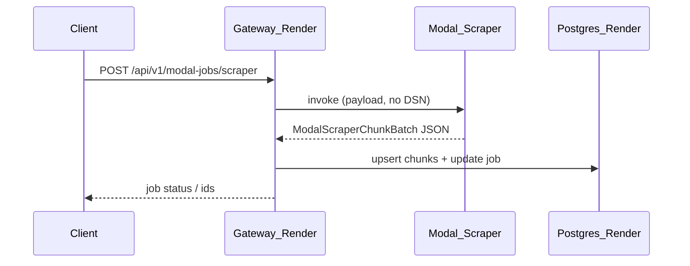

# Contract: Gateway (Render) owns persistence; Modal returns payloads

## Goal

Non-Render compute (**Modal**: model, embedding, scraper) **must not** use Postgres. **Render**
services perform **all** commits.

## Sequence (scrape ingestion — illustrative)

## HTTP / OpenAPI

- Public responses remain under `/api/v1/...` as today; internal persist steps are **not** new
  public routes unless explicitly added for reuse—prefer **private functions** inside gateway
  (same process as DB pool).

## Error mapping

- Modal failure → gateway maps to **documented** `5xx`/`502` OpenAPI responses (FR-006).  
- PG failure on Render → **documented** `5xx` with structured error body (no stack secrets).

## Versioning

- If response shapes change, bump OpenAPI / client contract per migration policy.
