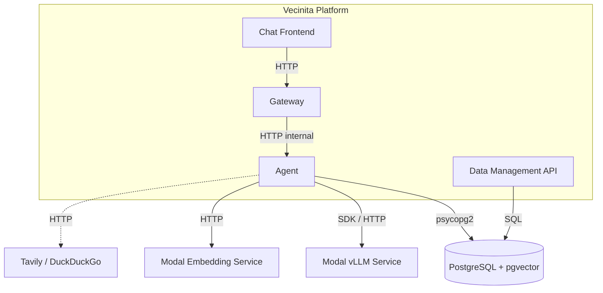
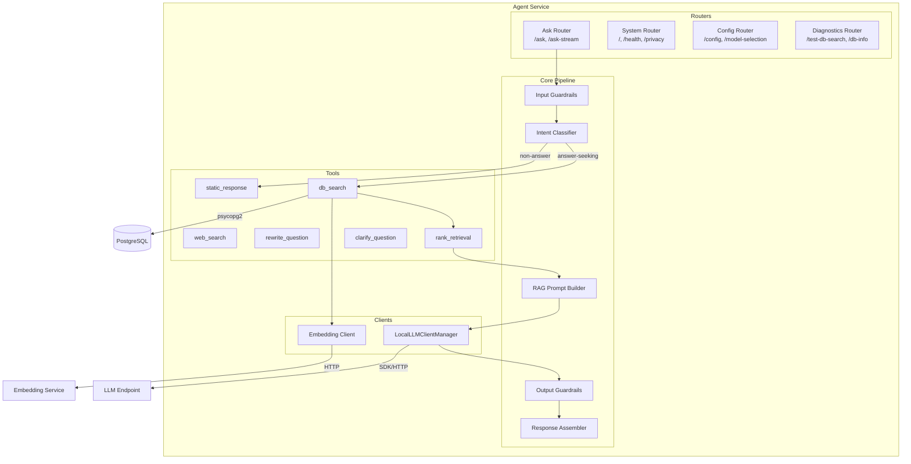

# Vecinita Agent — Architecture Diagram

> Auto-generated: 2026-05-12

## System Context

```mermaid
graph TB
    subgraph Vecinita Platform
        FE[Chat Frontend]
        GW[Gateway]
        AG[Agent]
        DM[Data Management API]
    end

    DB[(PostgreSQL + pgvector)]
    ModalLLM[Modal vLLM Service]
    ModalEmbed[Modal Embedding Service]
    Tavily[Tavily / DuckDuckGo]

    FE -->|HTTP| GW
    GW -->|HTTP internal| AG
    AG -->|psycopg2| DB
    AG -->|SDK / HTTP| ModalLLM
    AG -->|HTTP| ModalEmbed
    AG -.->|HTTP| Tavily
    DM -->|SQL| DB
```

## Component View

```mermaid
graph TB
    subgraph Agent Service
        subgraph Routers
            AskRouter[Ask Router<br>/ask, /ask-stream]
            SystemRouter[System Router<br>/, /health, /privacy]
            ConfigRouter[Config Router<br>/config, /model-selection]
            DiagRouter[Diagnostics Router<br>/test-db-search, /db-info]
        end

        subgraph Core Pipeline
            IntentClassifier[Intent Classifier]
            InputGuardrails[Input Guardrails]
            OutputGuardrails[Output Guardrails]
            RAGBuilder[RAG Prompt Builder]
            ResponseAssembler[Response Assembler]
        end

        subgraph Tools
            DBSearch[db_search]
            WebSearch[web_search]
            StaticFAQ[static_response]
            Rewrite[rewrite_question]
            Rerank[rank_retrieval]
            Clarify[clarify_question]
        end

        subgraph Clients
            LLMManager[LocalLLMClientManager]
            EmbedClient[Embedding Client]
        end
    end

    AskRouter --> InputGuardrails
    InputGuardrails --> IntentClassifier
    IntentClassifier -->|answer-seeking| DBSearch
    IntentClassifier -->|non-answer| StaticFAQ
    DBSearch --> Rerank
    Rerank --> RAGBuilder
    RAGBuilder --> LLMManager
    LLMManager --> OutputGuardrails
    OutputGuardrails --> ResponseAssembler
    DBSearch --> EmbedClient

    EmbedClient -->|HTTP| EmbedSvc[Embedding Service]
    LLMManager -->|SDK/HTTP| LLMSvc[LLM Endpoint]
    DBSearch -->|psycopg2| DB[(PostgreSQL)]
```
