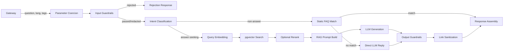
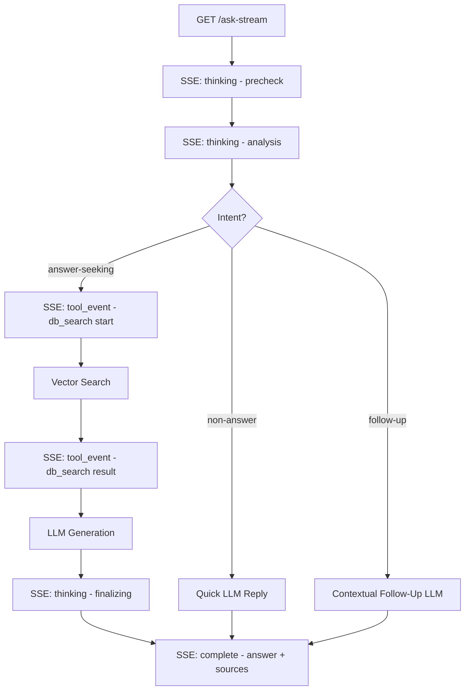
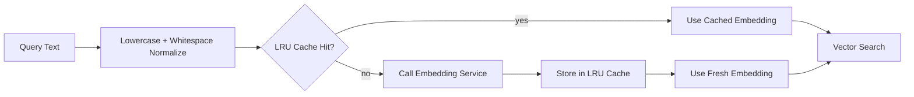

# Vecinita Agent — Data Flow Diagram

> Auto-generated: 2026-05-12

## Primary Data Flow (Answer-Seeking Query)

```mermaid
flowchart LR
    GW[Gateway] -->|question, lang, tags| Coerce[Parameter Coercion]
    Coerce --> Guards[Input Guardrails]
    Guards -->|rejected| Reject[Rejection Response]
    Guards -->|passed/redacted| Intent[Intent Classification]
    Intent -->|answer-seeking| Embed[Query Embedding]
    Intent -->|non-answer| FAQ[Static FAQ Match]
    FAQ -->|match| Resp[Response Assembly]
    FAQ -->|no match| LLMDirect[Direct LLM Reply]
    Embed --> VSearch[pgvector Search]
    VSearch --> Rerank[Optional Rerank]
    Rerank --> RAG[RAG Prompt Build]
    RAG --> LLM[LLM Generation]
    LLM --> OutGuard[Output Guardrails]
    OutGuard --> Sanitize[Link Sanitization]
    Sanitize --> Resp
    LLMDirect --> OutGuard
```

## Streaming Data Flow

```mermaid
flowchart TD
    Request[GET /ask-stream] --> SSE1[SSE: thinking - precheck]
    SSE1 --> SSE2[SSE: thinking - analysis]
    SSE2 --> Classify{Intent?}
    Classify -->|answer-seeking| SSE3[SSE: tool_event - db_search start]
    SSE3 --> Search[Vector Search]
    Search --> SSE4[SSE: tool_event - db_search result]
    SSE4 --> Generate[LLM Generation]
    Generate --> SSE5[SSE: thinking - finalizing]
    SSE5 --> SSE6[SSE: complete - answer + sources]
    Classify -->|non-answer| QuickLLM[Quick LLM Reply]
    QuickLLM --> SSE6
    Classify -->|follow-up| FollowUp[Contextual Follow-Up LLM]
    FollowUp --> SSE6
```

## Embedding Cache Flow

```mermaid
flowchart LR
    Query[Query Text] --> Normalize[Lowercase + Whitespace Normalize]
    Normalize --> CacheCheck{LRU Cache Hit?}
    CacheCheck -->|yes| UseCache[Use Cached Embedding]
    CacheCheck -->|no| CallEmbed[Call Embedding Service]
    CallEmbed --> StoreCache[Store in LRU Cache]
    StoreCache --> UseEmbed[Use Fresh Embedding]
    UseCache --> VSearch[Vector Search]
    UseEmbed --> VSearch
```
