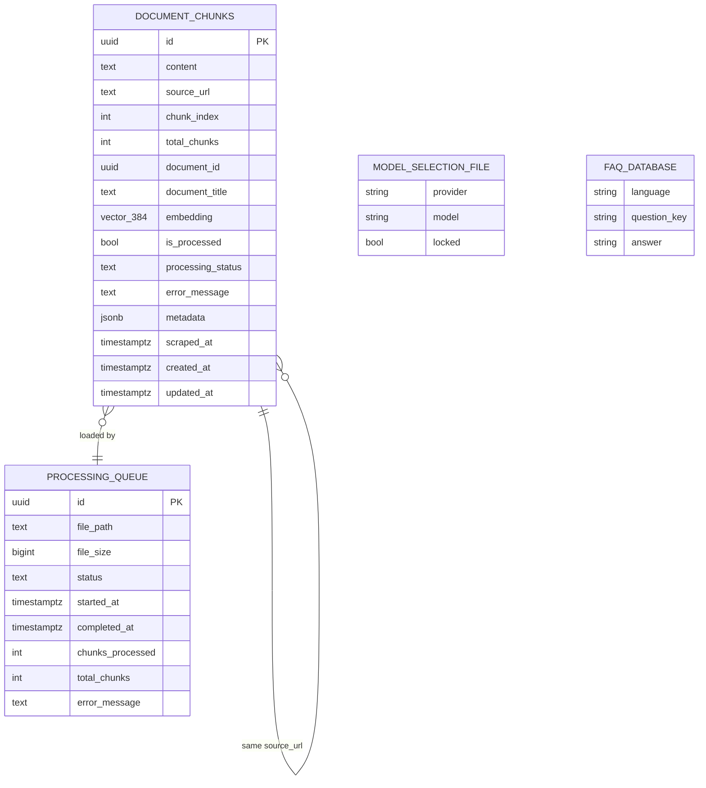

# Vecinita Agent — Data Model Diagram

> Auto-generated: 2026-05-12

```mermaid
erDiagram
    DOCUMENT_CHUNKS {
        uuid id PK
        text content
        text source_url
        int chunk_index
        int total_chunks
        uuid document_id
        text document_title
        vector_384 embedding
        bool is_processed
        text processing_status
        text error_message
        jsonb metadata
        timestamptz scraped_at
        timestamptz created_at
        timestamptz updated_at
    }

    PROCESSING_QUEUE {
        uuid id PK
        text file_path
        bigint file_size
        text status
        timestamptz started_at
        timestamptz completed_at
        int chunks_processed
        int total_chunks
        text error_message
    }

    MODEL_SELECTION_FILE {
        string provider
        string model
        bool locked
    }

    FAQ_DATABASE {
        string language
        string question_key
        string answer
    }

    DOCUMENT_CHUNKS }o--|| PROCESSING_QUEUE : "loaded by"
    DOCUMENT_CHUNKS ||--o{ DOCUMENT_CHUNKS : "same source_url"
```
