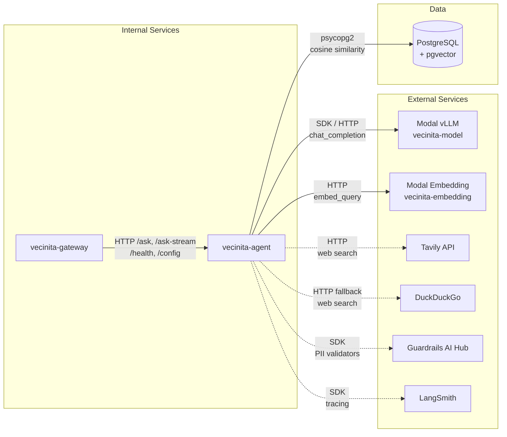
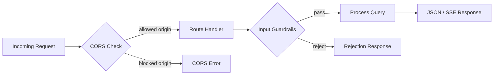

# Vecinita Agent — Integration Points Diagram

> Auto-generated: 2026-05-12

## Service Connectivity

```mermaid
graph LR
    subgraph Internal Services
        GW[vecinita-gateway]
        AG[vecinita-agent]
    end

    subgraph External Services
        ModalLLM[Modal vLLM<br>vecinita-model]
        ModalEmbed[Modal Embedding<br>vecinita-embedding]
        Tavily[Tavily API]
        DDG[DuckDuckGo]
        GrdHub[Guardrails AI Hub]
        LangSmith[LangSmith]
    end

    subgraph Data
        DB[(PostgreSQL<br>+ pgvector)]
    end

    GW -->|HTTP /ask, /ask-stream<br>/health, /config| AG
    AG -->|psycopg2<br>cosine similarity| DB
    AG -->|SDK / HTTP<br>chat_completion| ModalLLM
    AG -->|HTTP<br>embed_query| ModalEmbed
    AG -.->|HTTP<br>web search| Tavily
    AG -.->|HTTP fallback<br>web search| DDG
    AG -.->|SDK<br>PII validators| GrdHub
    AG -.->|SDK<br>tracing| LangSmith
```

## Request Authentication Flow

```mermaid
flowchart LR
    Request[Incoming Request] --> CORS{CORS Check}
    CORS -->|allowed origin| Handler[Route Handler]
    CORS -->|blocked origin| Reject[CORS Error]
    Handler --> Guardrails{Input Guardrails}
    Guardrails -->|pass| Process[Process Query]
    Guardrails -->|reject| Block[Rejection Response]
    Process --> Response[JSON / SSE Response]
```
