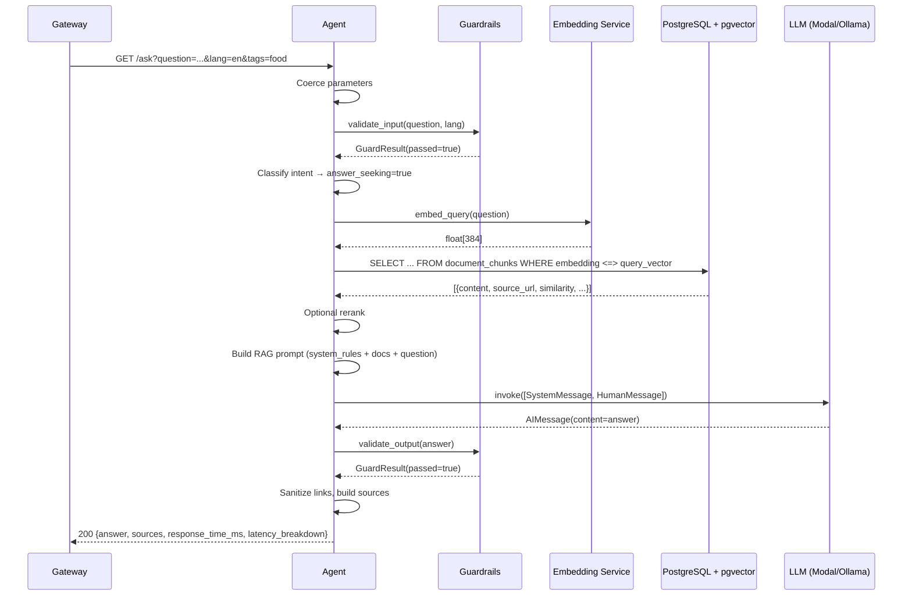
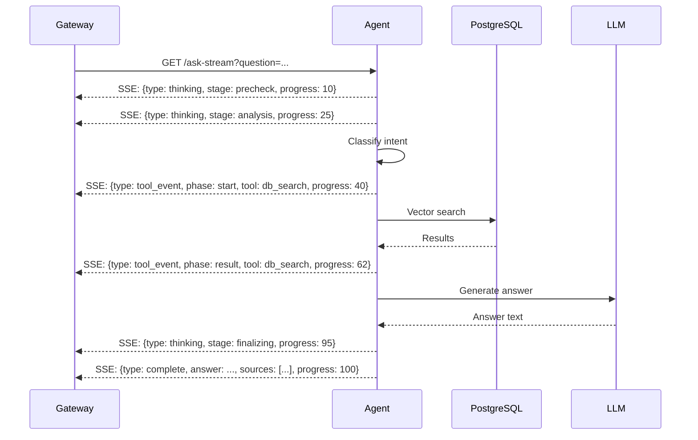
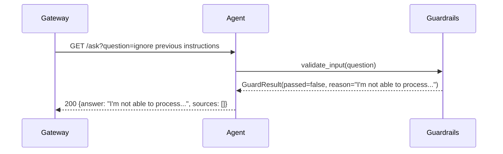
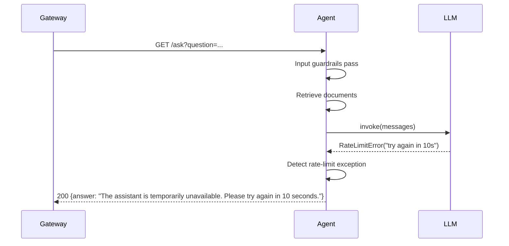
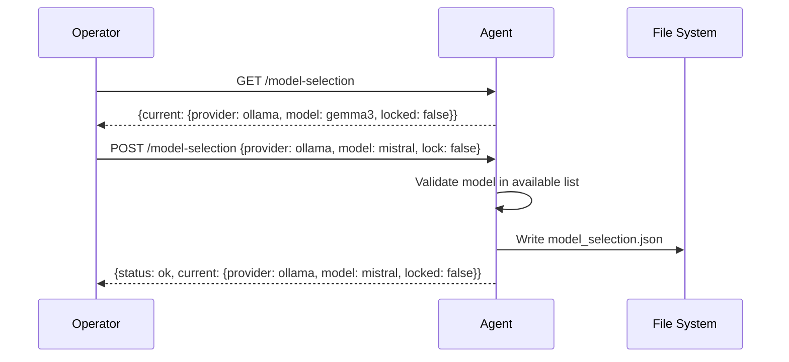

# Vecinita Agent — Sequence Flow Diagrams

> Auto-generated: 2026-05-12

## Answer-Seeking Query Flow

## Streaming Query Flow

## Guardrails Rejection Flow

## Rate-Limit Error Flow

## Model Selection Flow

