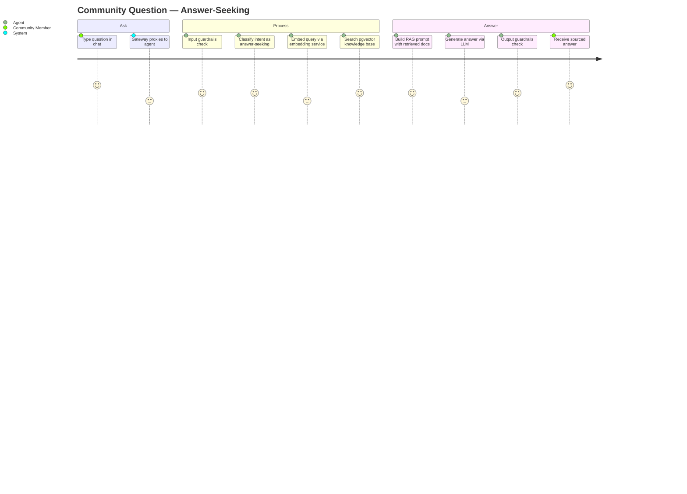
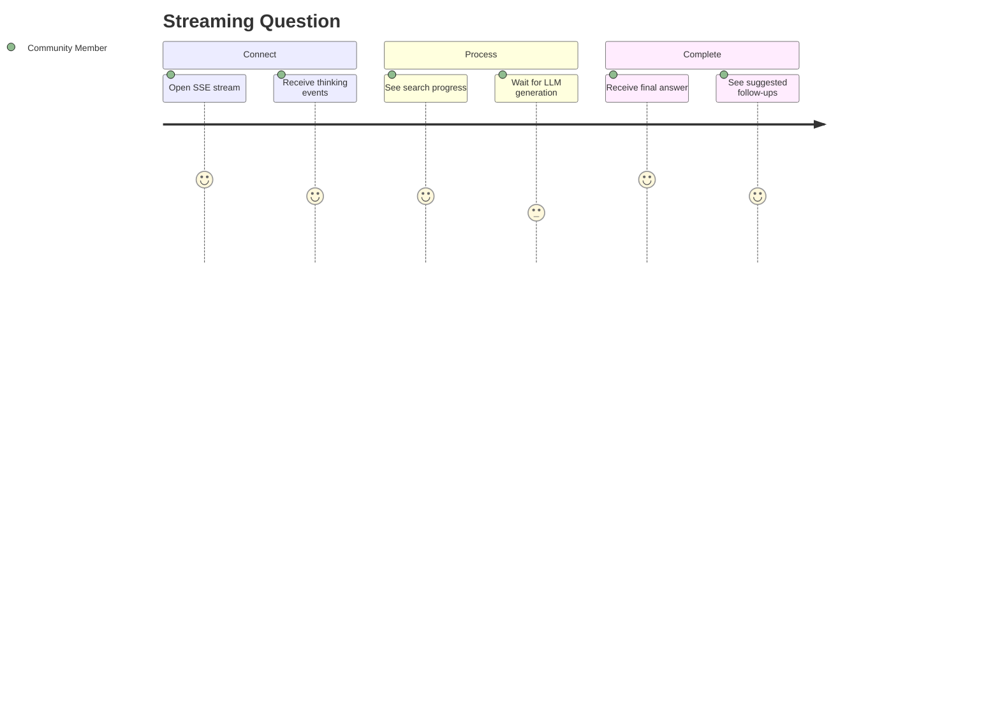
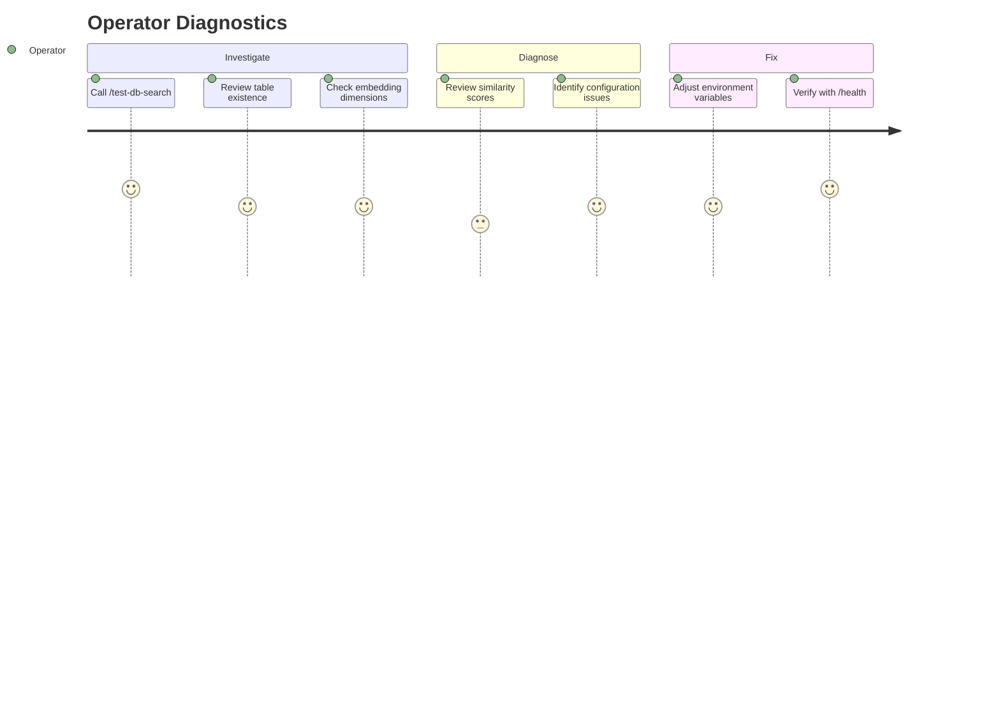

# Vecinita Agent — User Journey Diagrams

> Auto-generated: 2026-05-12

## Community Question (Answer-Seeking)

```mermaid
journey
    title Community Question — Answer-Seeking
    section Ask
        Type question in chat: 5: Community Member
        Gateway proxies to agent: 3: System
    section Process
        Input guardrails check: 4: Agent
        Classify intent as answer-seeking: 4: Agent
        Embed query via embedding service: 3: Agent
        Search pgvector knowledge base: 4: Agent
    section Answer
        Build RAG prompt with retrieved docs: 4: Agent
        Generate answer via LLM: 3: Agent
        Output guardrails check: 4: Agent
        Receive sourced answer: 5: Community Member
```

## Streaming Question

```mermaid
journey
    title Streaming Question
    section Connect
        Open SSE stream: 5: Community Member
        Receive thinking events: 4: Community Member
    section Process
        See search progress: 4: Community Member
        Wait for LLM generation: 3: Community Member
    section Complete
        Receive final answer: 5: Community Member
        See suggested follow-ups: 4: Community Member
```

## Operator Diagnostics

```mermaid
journey
    title Operator Diagnostics
    section Investigate
        Call /test-db-search: 5: Operator
        Review table existence: 4: Operator
        Check embedding dimensions: 4: Operator
    section Diagnose
        Review similarity scores: 3: Operator
        Identify configuration issues: 4: Operator
    section Fix
        Adjust environment variables: 4: Operator
        Verify with /health: 5: Operator
```
