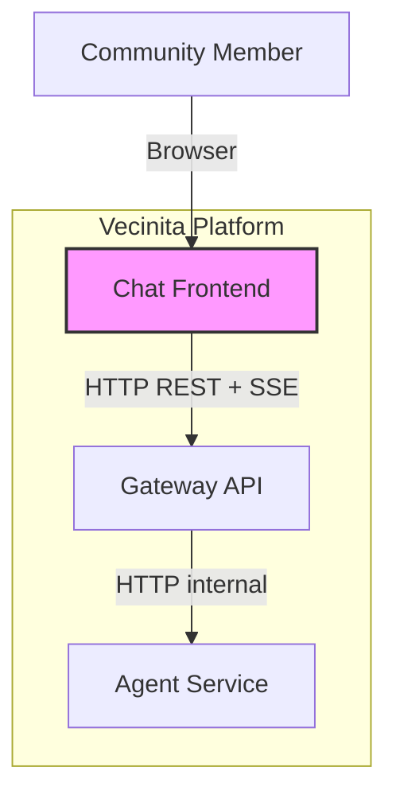
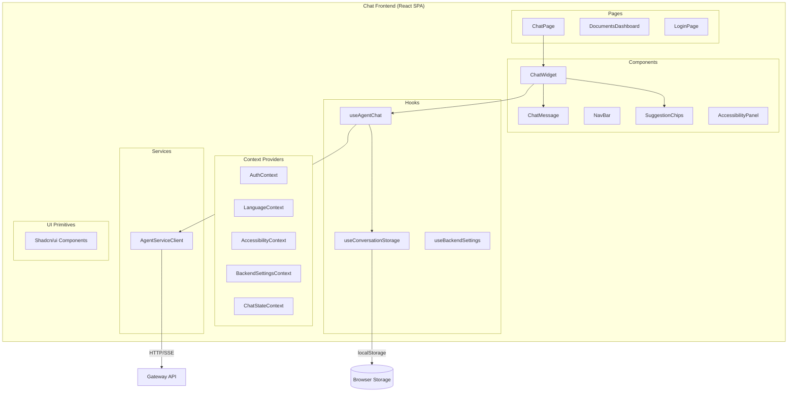

# chat-frontend — Architecture Diagram

> Auto-generated: 2026-05-12

## System Context

```mermaid
graph TB
    subgraph Vecinita Platform
        GW[Gateway API]
        AG[Agent Service]
        FE[Chat Frontend]
    end

    User[Community Member] -->|Browser| FE
    FE -->|"HTTP REST + SSE"| GW
    GW -->|HTTP internal| AG

    style FE fill:#f9f,stroke:#333,stroke-width:2px
```

## Component View

```mermaid
graph TB
    subgraph "Chat Frontend (React SPA)"
        subgraph "Context Providers"
            Auth[AuthContext]
            Lang[LanguageContext]
            A11y[AccessibilityContext]
            Backend[BackendSettingsContext]
            ChatState[ChatStateContext]
        end

        subgraph "Pages"
            ChatPage[ChatPage]
            DocsDash[DocumentsDashboard]
            LoginPg[LoginPage]
        end

        subgraph "Components"
            ChatWidget[ChatWidget]
            ChatMsg[ChatMessage]
            NavBar[NavBar]
            Suggestions[SuggestionChips]
            A11yPanel[AccessibilityPanel]
        end

        subgraph "Hooks"
            UseChat[useAgentChat]
            UseStorage[useConversationStorage]
            UseBackend[useBackendSettings]
        end

        subgraph "Services"
            AgentSvc[AgentServiceClient]
        end

        subgraph "UI Primitives"
            ShadcnUI[Shadcn/ui Components]
        end
    end

    ChatPage --> ChatWidget
    ChatWidget --> ChatMsg
    ChatWidget --> Suggestions
    ChatWidget --> UseChat
    UseChat --> AgentSvc
    UseChat --> UseStorage
    UseStorage -->|localStorage| Browser[(Browser Storage)]
    AgentSvc -->|"HTTP/SSE"| GW[Gateway API]
```
