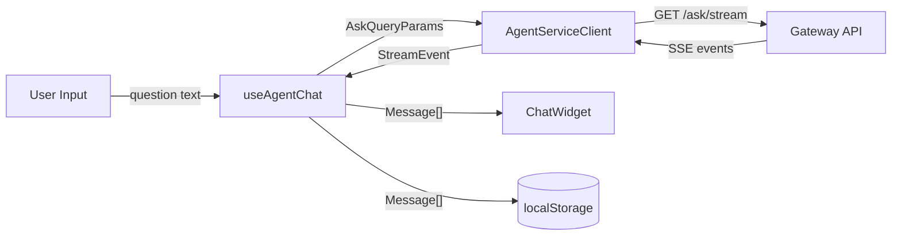
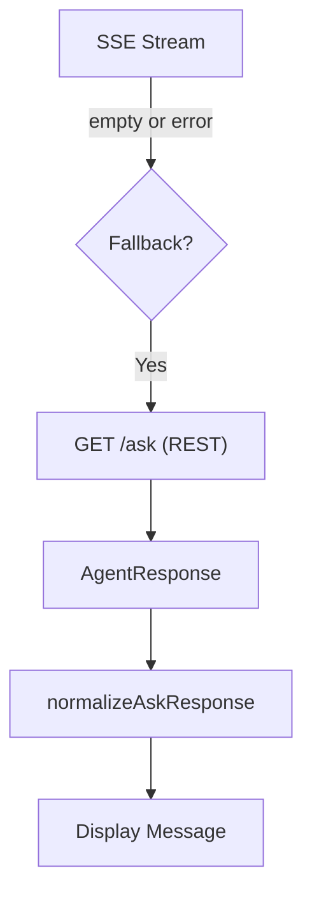
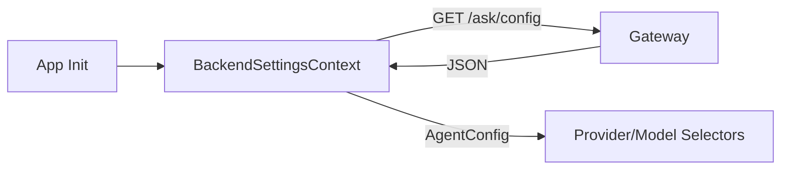

# chat-frontend — Data Flow Diagram

> Auto-generated: 2026-05-12

## Primary Data Flow — Ask Question (Streaming)

```mermaid
flowchart LR
    User[User Input] -->|"question text"| Hook[useAgentChat]
    Hook -->|"AskQueryParams"| Service[AgentServiceClient]
    Service -->|"GET /ask/stream"| GW[Gateway API]
    GW -->|"SSE events"| Service
    Service -->|"StreamEvent"| Hook
    Hook -->|"Message[]"| UI[ChatWidget]
    Hook -->|"Message[]"| Storage[(localStorage)]
```

## Fallback Flow — Non-Streaming

```mermaid
flowchart TD
    Stream[SSE Stream] -->|"empty or error"| Fallback{Fallback?}
    Fallback -->|Yes| REST["GET /ask (REST)"]
    REST --> Response[AgentResponse]
    Response --> Normalize[normalizeAskResponse]
    Normalize --> Display[Display Message]
```

## Config Discovery Flow

```mermaid
flowchart LR
    Boot[App Init] --> Ctx[BackendSettingsContext]
    Ctx -->|"GET /ask/config"| GW[Gateway]
    GW -->|JSON| Ctx
    Ctx -->|"AgentConfig"| UI[Provider/Model Selectors]
```
