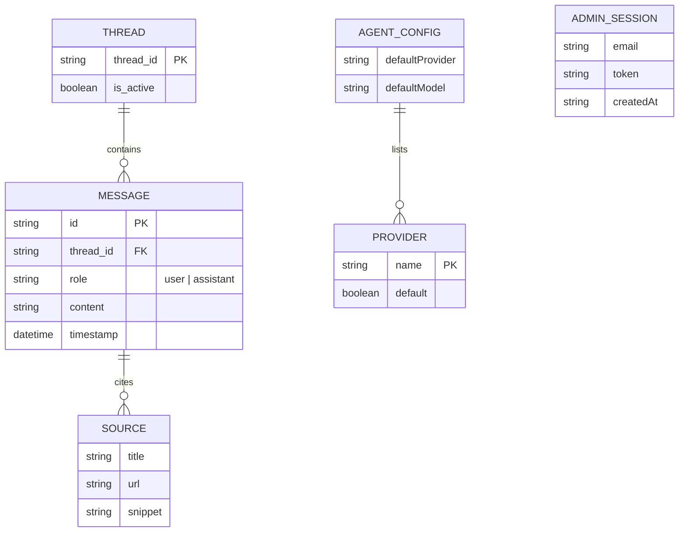

# chat-frontend — Data Model Diagram

> Auto-generated: 2026-05-12

```mermaid
erDiagram
    THREAD {
        string thread_id PK
        boolean is_active
    }
    MESSAGE {
        string id PK
        string thread_id FK
        string role "user | assistant"
        string content
        datetime timestamp
    }
    SOURCE {
        string title
        string url
        string snippet
    }
    AGENT_CONFIG {
        string defaultProvider
        string defaultModel
    }
    PROVIDER {
        string name PK
        boolean default
    }
    ADMIN_SESSION {
        string email
        string token
        string createdAt
    }

    THREAD ||--o{ MESSAGE : "contains"
    MESSAGE ||--o{ SOURCE : "cites"
    AGENT_CONFIG ||--o{ PROVIDER : "lists"
```
