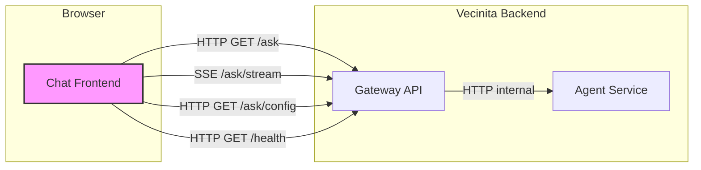
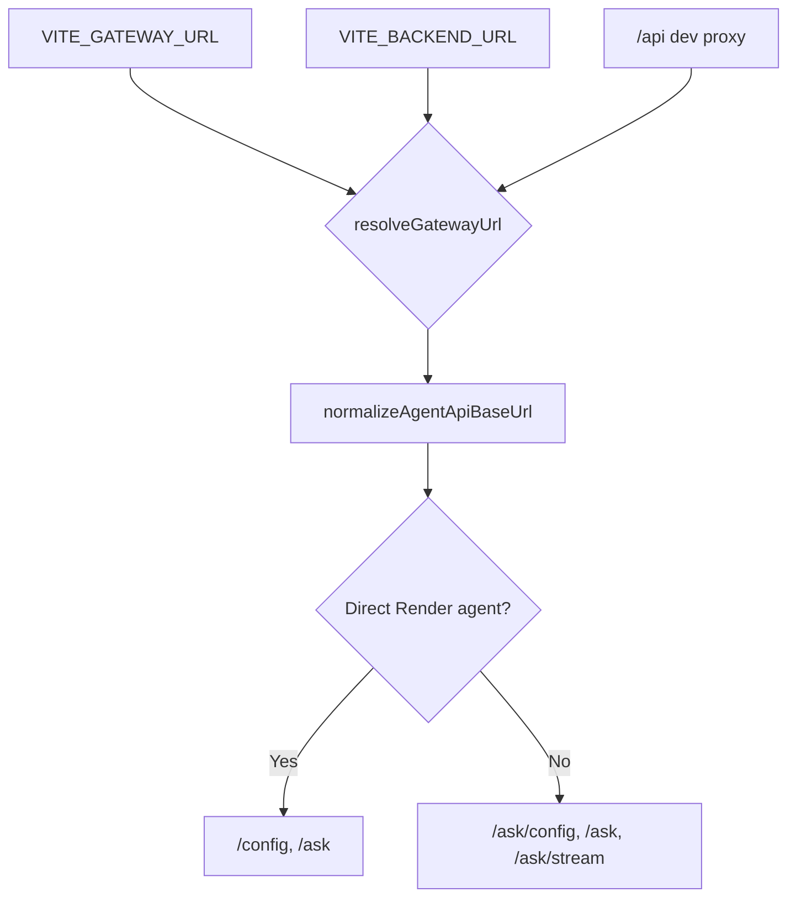

# chat-frontend — Integration Points Diagram

> Auto-generated: 2026-05-12

## Service Connectivity

```mermaid
graph LR
    subgraph "Browser"
        FE[Chat Frontend]
    end

    subgraph "Vecinita Backend"
        GW[Gateway API]
        AG[Agent Service]
    end

    FE -->|"HTTP GET /ask"| GW
    FE -->|"SSE /ask/stream"| GW
    FE -->|"HTTP GET /ask/config"| GW
    FE -->|"HTTP GET /health"| GW
    GW -->|HTTP internal| AG

    style FE fill:#f9f,stroke:#333,stroke-width:2px
```

## URL Resolution Chain

```mermaid
flowchart TD
    Env1[VITE_GATEWAY_URL] --> Resolve{resolveGatewayUrl}
    Env2[VITE_BACKEND_URL] --> Resolve
    DevProxy["/api" dev proxy] --> Resolve
    Resolve --> Normalize[normalizeAgentApiBaseUrl]
    Normalize --> Direct{Direct Render agent?}
    Direct -->|Yes| AgentPaths["/config, /ask"]
    Direct -->|No| GatewayPaths["/ask/config, /ask, /ask/stream"]
```
