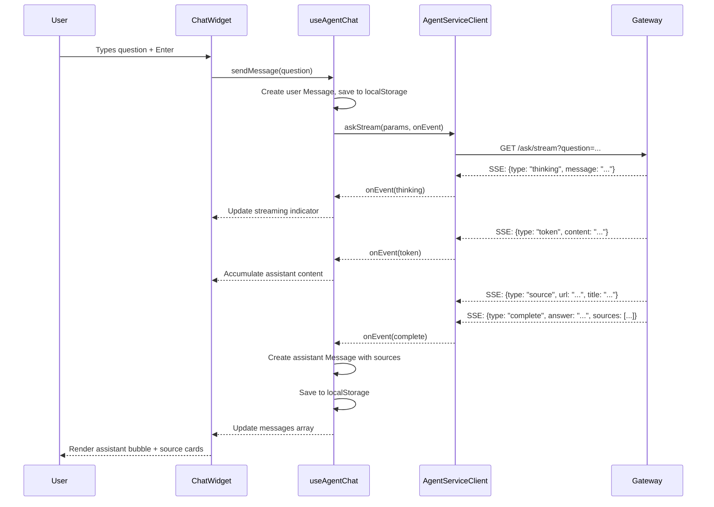
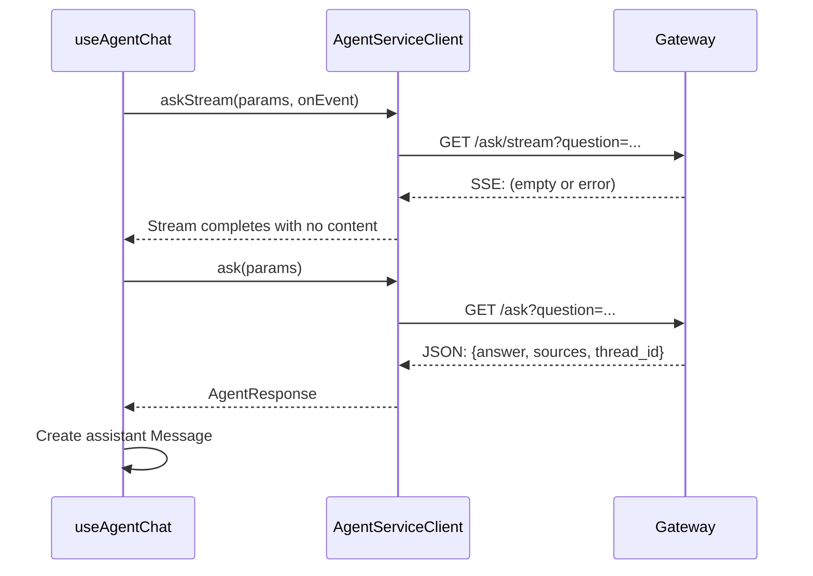
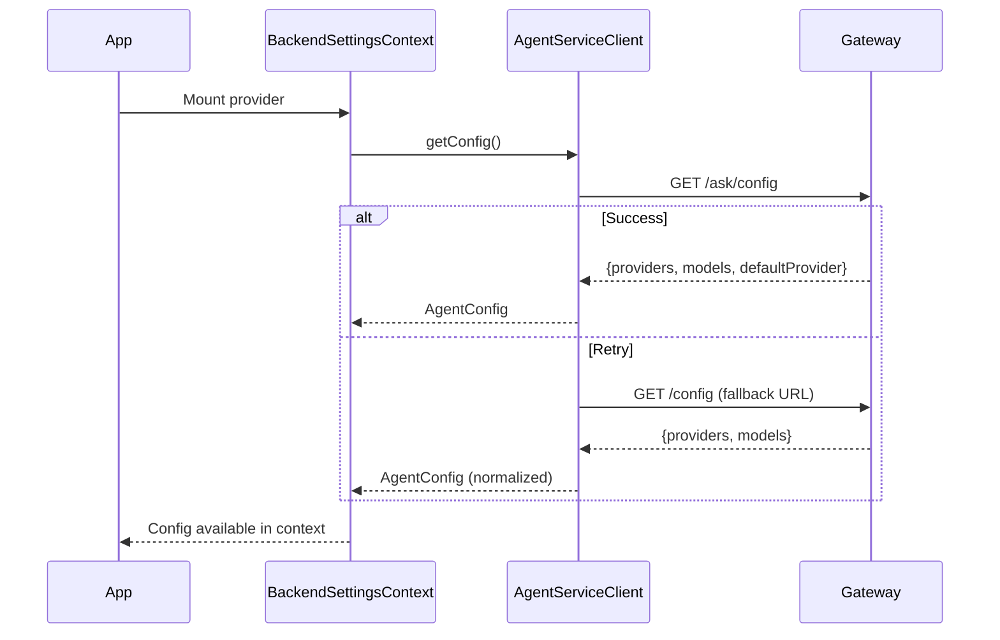

# chat-frontend — Sequence Flow Diagrams

> Auto-generated: 2026-05-12

## Streaming Q&A Flow

```mermaid
sequenceDiagram
    participant User
    participant ChatWidget
    participant useAgentChat
    participant AgentService as AgentServiceClient
    participant Gateway

    User->>ChatWidget: Types question + Enter
    ChatWidget->>useAgentChat: sendMessage(question)
    useAgentChat->>useAgentChat: Create user Message, save to localStorage
    useAgentChat->>AgentService: askStream(params, onEvent)
    AgentService->>Gateway: GET /ask/stream?question=...
    Gateway-->>AgentService: SSE: {type: "thinking", message: "..."}
    AgentService-->>useAgentChat: onEvent(thinking)
    useAgentChat-->>ChatWidget: Update streaming indicator
    Gateway-->>AgentService: SSE: {type: "token", content: "..."}
    AgentService-->>useAgentChat: onEvent(token)
    useAgentChat-->>ChatWidget: Accumulate assistant content
    Gateway-->>AgentService: SSE: {type: "source", url: "...", title: "..."}
    Gateway-->>AgentService: SSE: {type: "complete", answer: "...", sources: [...]}
    AgentService-->>useAgentChat: onEvent(complete)
    useAgentChat->>useAgentChat: Create assistant Message with sources
    useAgentChat->>useAgentChat: Save to localStorage
    useAgentChat-->>ChatWidget: Update messages array
    ChatWidget-->>User: Render assistant bubble + source cards
```

## Stream Fallback Flow

```mermaid
sequenceDiagram
    participant useAgentChat
    participant AgentService as AgentServiceClient
    participant Gateway

    useAgentChat->>AgentService: askStream(params, onEvent)
    AgentService->>Gateway: GET /ask/stream?question=...
    Gateway-->>AgentService: SSE: (empty or error)
    AgentService-->>useAgentChat: Stream completes with no content
    useAgentChat->>AgentService: ask(params)
    AgentService->>Gateway: GET /ask?question=...
    Gateway-->>AgentService: JSON: {answer, sources, thread_id}
    AgentService-->>useAgentChat: AgentResponse
    useAgentChat->>useAgentChat: Create assistant Message
```

## Config Discovery Flow

```mermaid
sequenceDiagram
    participant App
    participant BackendSettings as BackendSettingsContext
    participant AgentService as AgentServiceClient
    participant Gateway

    App->>BackendSettings: Mount provider
    BackendSettings->>AgentService: getConfig()
    AgentService->>Gateway: GET /ask/config
    alt Success
        Gateway-->>AgentService: {providers, models, defaultProvider}
        AgentService-->>BackendSettings: AgentConfig
    else Retry
        AgentService->>Gateway: GET /config (fallback URL)
        Gateway-->>AgentService: {providers, models}
        AgentService-->>BackendSettings: AgentConfig (normalized)
    end
    BackendSettings-->>App: Config available in context
```
