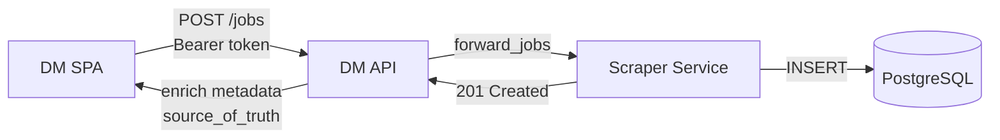
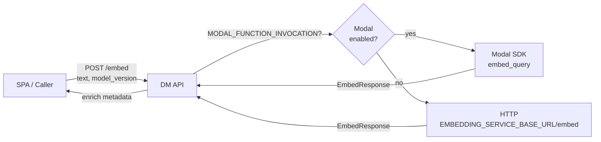
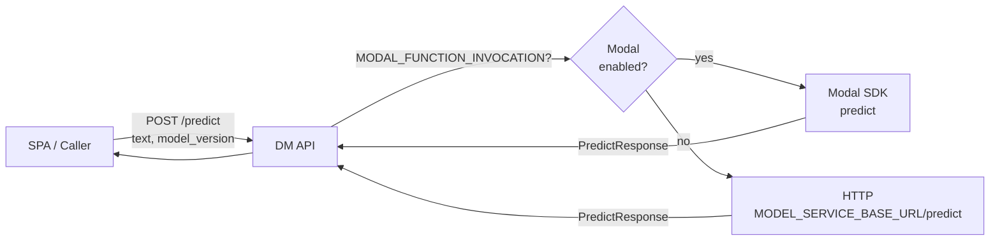
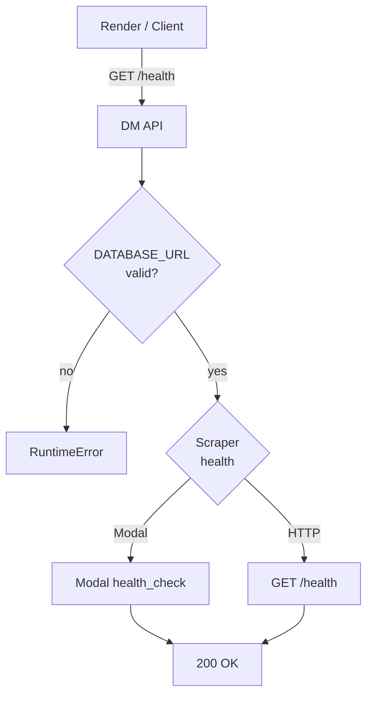
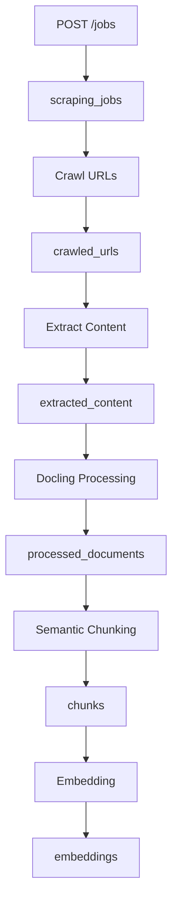

# Data Management API — Data Flow Diagram

> Auto-generated: 2026-05-12

## Primary Data Flow — Job Proxy

## Embed Flow

## Predict Flow

## Health Check Flow

## Scraper Pipeline Data Flow (upstream context)

