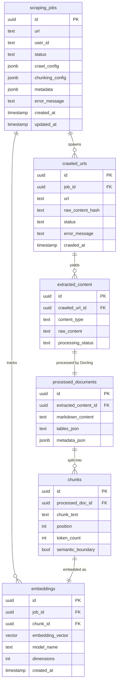
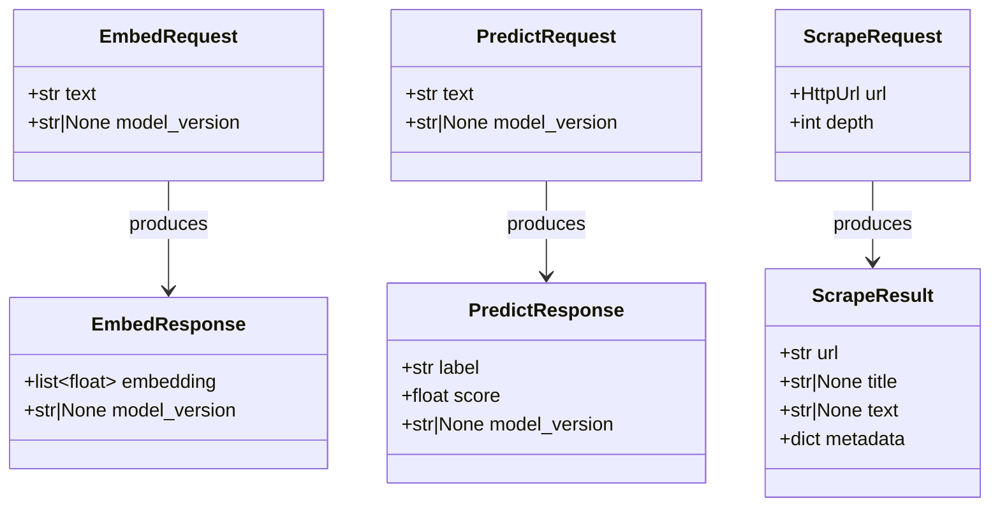

# Data Management API — Data Model Diagram

> Auto-generated: 2026-05-12

## Scraper Pipeline ER Diagram

```mermaid
erDiagram
    scraping_jobs {
        uuid id PK
        text url
        text user_id
        text status
        jsonb crawl_config
        jsonb chunking_config
        jsonb metadata
        text error_message
        timestamp created_at
        timestamp updated_at
    }
    crawled_urls {
        uuid id PK
        uuid job_id FK
        text url
        text raw_content_hash
        text status
        text error_message
        timestamp crawled_at
    }
    extracted_content {
        uuid id PK
        uuid crawled_url_id FK
        text content_type
        text raw_content
        text processing_status
    }
    processed_documents {
        uuid id PK
        uuid extracted_content_id FK
        text markdown_content
        text tables_json
        jsonb metadata_json
    }
    chunks {
        uuid id PK
        uuid processed_doc_id FK
        text chunk_text
        int position
        int token_count
        bool semantic_boundary
    }
    embeddings {
        uuid id PK
        uuid job_id FK
        uuid chunk_id FK
        vector embedding_vector
        text model_name
        int dimensions
        timestamp created_at
    }

    scraping_jobs ||--o{ crawled_urls : "spawns"
    crawled_urls ||--o{ extracted_content : "yields"
    extracted_content ||--|| processed_documents : "processed by Docling"
    processed_documents ||--o{ chunks : "split into"
    scraping_jobs ||--o{ embeddings : "tracks"
    chunks ||--|| embeddings : "embedded as"
```

## API-Layer Schemas (Pydantic)

```mermaid
classDiagram
    class EmbedRequest {
        +str text
        +str|None model_version
    }
    class EmbedResponse {
        +list~float~ embedding
        +str|None model_version
    }
    class PredictRequest {
        +str text
        +str|None model_version
    }
    class PredictResponse {
        +str label
        +float score
        +str|None model_version
    }
    class ScrapeRequest {
        +HttpUrl url
        +int depth
    }
    class ScrapeResult {
        +str url
        +str|None title
        +str|None text
        +dict metadata
    }

    EmbedRequest --> EmbedResponse : produces
    PredictRequest --> PredictResponse : produces
    ScrapeRequest --> ScrapeResult : produces
```
