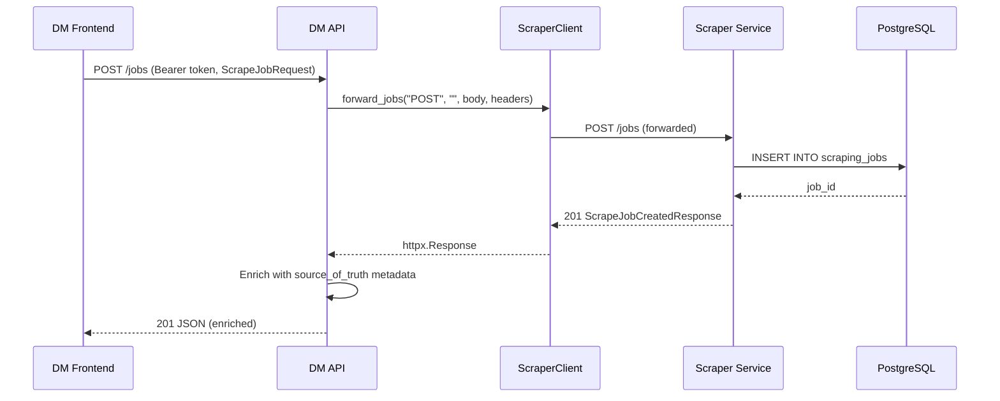
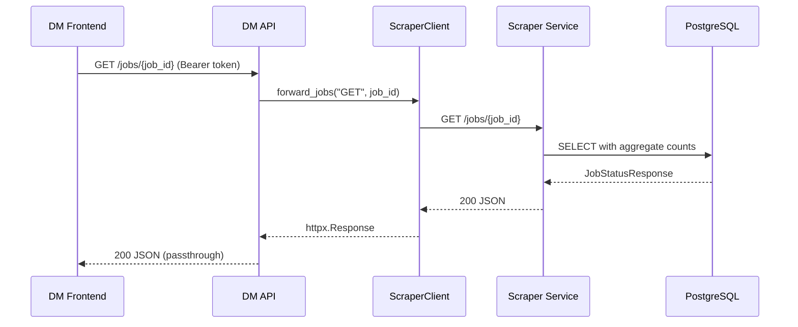
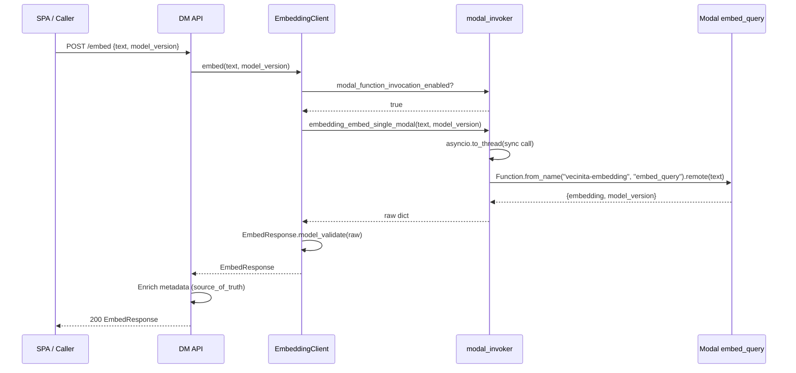
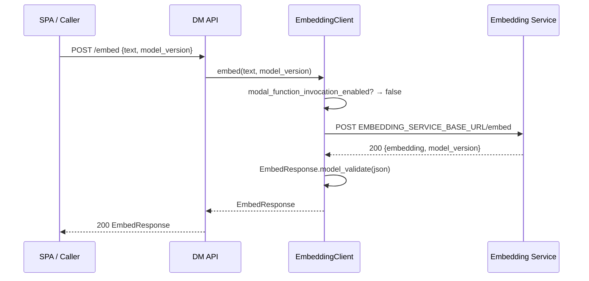
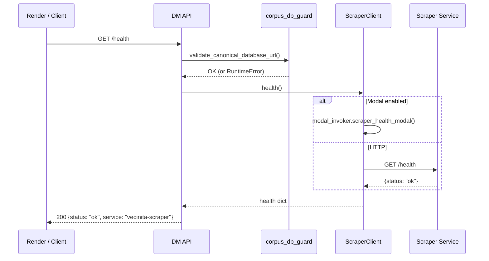
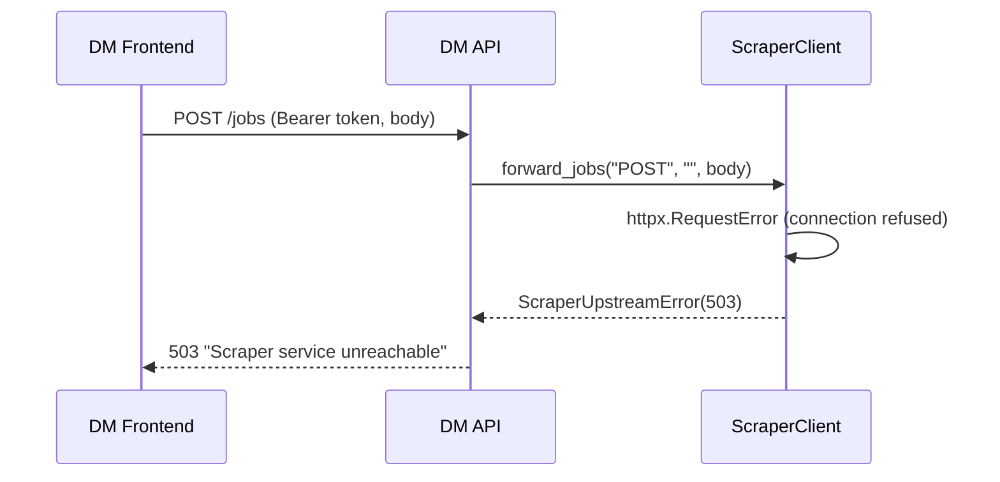

# Data Management API — Sequence Flow Diagrams

> Auto-generated: 2026-05-12

## Job Submission Flow

## Job Status Polling Flow

## Embed Flow (Modal SDK Path)

## Embed Flow (HTTP Path)

## Health Check Flow

## Error Flow — Scraper Unreachable

