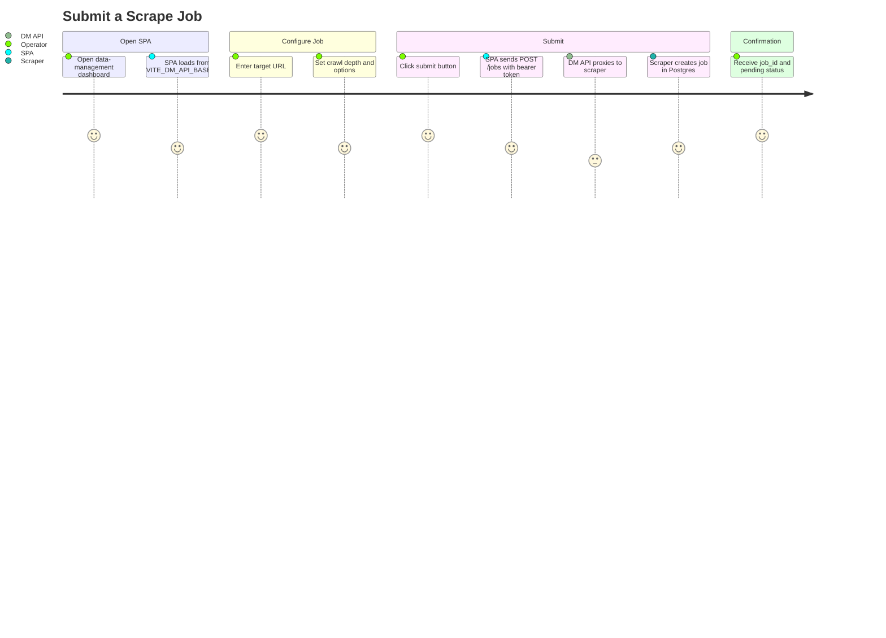
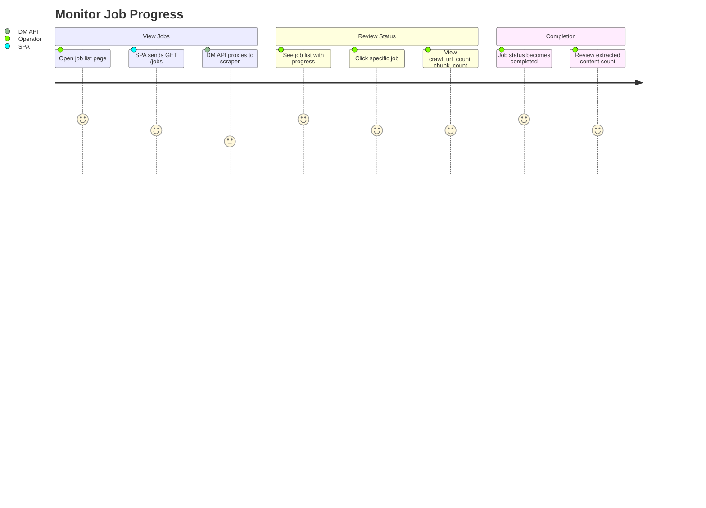
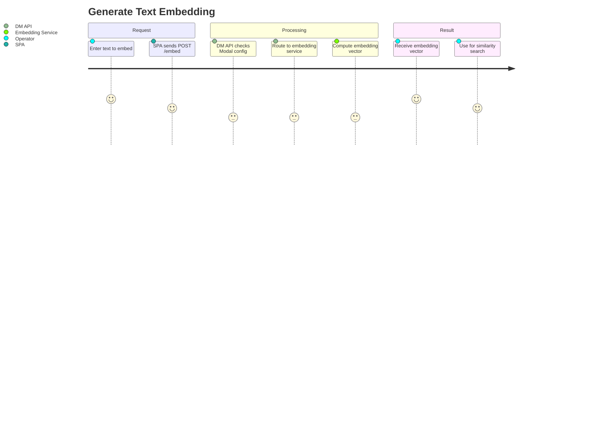

# Data Management API — User Journey Diagrams

> Auto-generated: 2026-05-12

## Submit Scrape Job

```mermaid
journey
    title Submit a Scrape Job
    section Open SPA
        Open data-management dashboard: 5: Operator
        SPA loads from VITE_DM_API_BASE_URL: 4: SPA
    section Configure Job
        Enter target URL: 5: Operator
        Set crawl depth and options: 4: Operator
    section Submit
        Click submit button: 5: Operator
        SPA sends POST /jobs with bearer token: 4: SPA
        DM API proxies to scraper: 3: DM API
        Scraper creates job in Postgres: 4: Scraper
    section Confirmation
        Receive job_id and pending status: 5: Operator
```

## Monitor Job Progress

```mermaid
journey
    title Monitor Job Progress
    section View Jobs
        Open job list page: 5: Operator
        SPA sends GET /jobs: 4: SPA
        DM API proxies to scraper: 3: DM API
    section Review Status
        See job list with progress: 5: Operator
        Click specific job: 4: Operator
        View crawl_url_count, chunk_count: 4: Operator
    section Completion
        Job status becomes completed: 5: Operator
        Review extracted content count: 4: Operator
```

## Generate Embedding

```mermaid
journey
    title Generate Text Embedding
    section Request
        Enter text to embed: 5: Operator
        SPA sends POST /embed: 4: SPA
    section Processing
        DM API checks Modal config: 3: DM API
        Route to embedding service: 3: DM API
        Compute embedding vector: 3: Embedding Service
    section Result
        Receive embedding vector: 5: Operator
        Use for similarity search: 4: Operator
```
