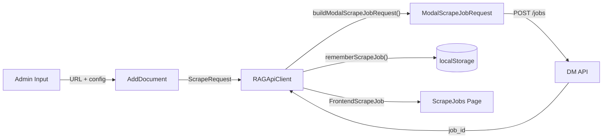
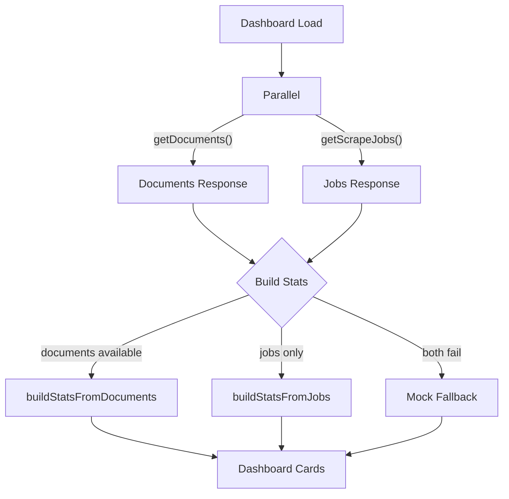
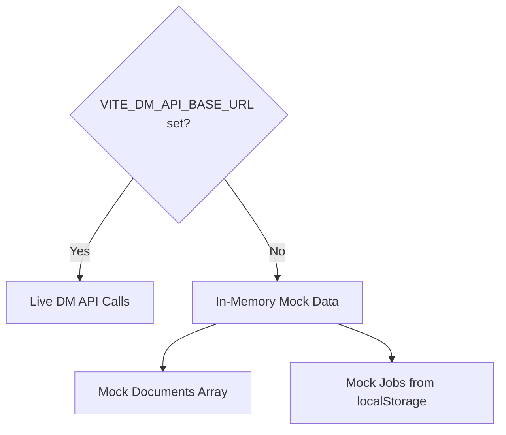

# data-management-frontend — Data Flow Diagram

> Auto-generated: 2026-05-12

## Primary Data Flow — Scrape Job Submission

```mermaid
flowchart LR
    Admin[Admin Input] -->|"URL + config"| Form[AddDocument]
    Form -->|ScrapeRequest| API[RAGApiClient]
    API -->|"buildModalScrapeJobRequest()"| Payload[ModalScrapeJobRequest]
    Payload -->|"POST /jobs"| DMAPI[DM API]
    DMAPI -->|"job_id"| API
    API -->|"rememberScrapeJob()"| LS[(localStorage)]
    API -->|"FrontendScrapeJob"| Jobs[ScrapeJobs Page]
```

## Dashboard Stats Flow

```mermaid
flowchart TD
    Boot[Dashboard Load] --> Parallel
    Parallel -->|"getDocuments()"| Docs[Documents Response]
    Parallel -->|"getScrapeJobs()"| Jobs[Jobs Response]
    Docs --> Stats{Build Stats}
    Jobs --> Stats
    Stats -->|documents available| DocStats[buildStatsFromDocuments]
    Stats -->|jobs only| JobStats[buildStatsFromJobs]
    Stats -->|both fail| Mock[Mock Fallback]
    DocStats --> UI[Dashboard Cards]
    JobStats --> UI
    Mock --> UI
```

## Mock Mode Fallback

```mermaid
flowchart TD
    Check{VITE_DM_API_BASE_URL set?}
    Check -->|Yes| LiveAPI[Live DM API Calls]
    Check -->|No| MockMode[In-Memory Mock Data]
    MockMode --> MockDocs[Mock Documents Array]
    MockMode --> MockJobs[Mock Jobs from localStorage]
```
