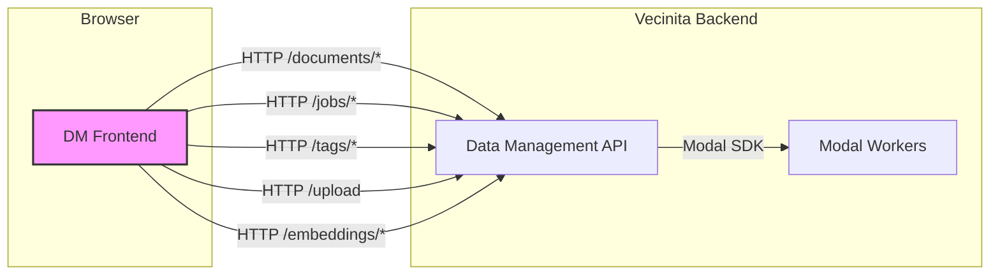
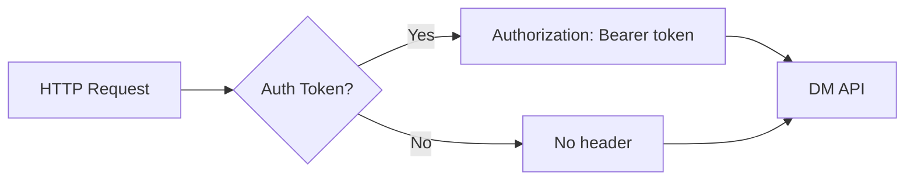

# data-management-frontend — Integration Points Diagram

> Auto-generated: 2026-05-12

## Service Connectivity

```mermaid
graph LR
    subgraph "Browser"
        DMFE[DM Frontend]
    end

    subgraph "Vecinita Backend"
        DMAPI[Data Management API]
        Modal[Modal Workers]
    end

    DMFE -->|"HTTP /documents/*"| DMAPI
    DMFE -->|"HTTP /jobs/*"| DMAPI
    DMFE -->|"HTTP /tags/*"| DMAPI
    DMFE -->|"HTTP /upload"| DMAPI
    DMFE -->|"HTTP /embeddings/*"| DMAPI
    DMAPI -->|"Modal SDK"| Modal

    style DMFE fill:#f9f,stroke:#333,stroke-width:2px
```

## Authentication Flow

```mermaid
flowchart LR
    Request[HTTP Request] --> Auth{Auth Token?}
    Auth -->|Yes| Header["Authorization: Bearer token"]
    Auth -->|No| NoAuth[No header]
    Header --> DMAPI[DM API]
    NoAuth --> DMAPI
```
