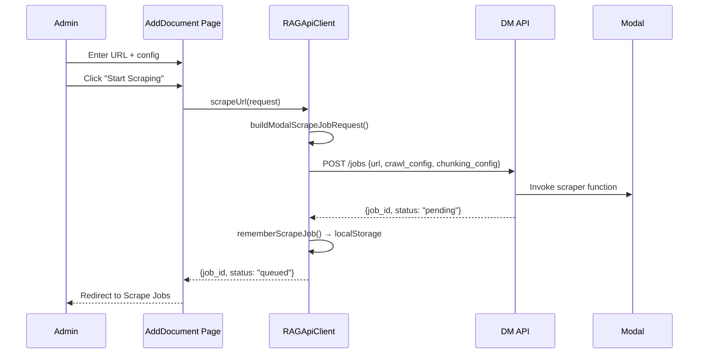
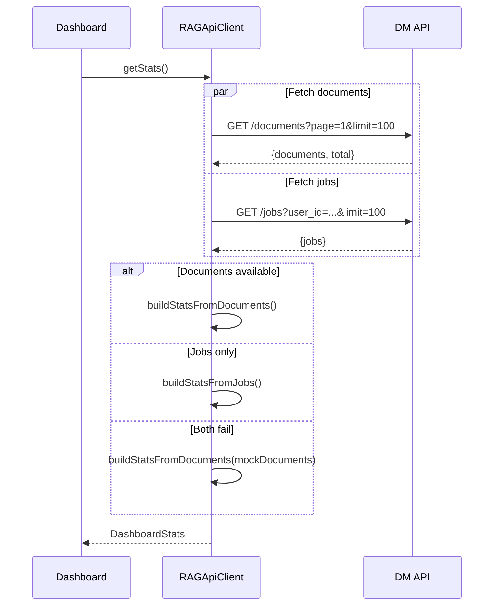
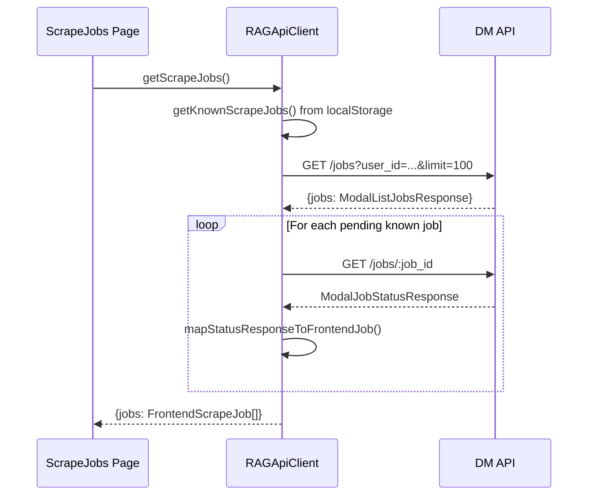

# data-management-frontend — Sequence Flow Diagrams

> Auto-generated: 2026-05-12

## Scrape Job Submission Flow

```mermaid
sequenceDiagram
    participant Admin
    participant AddDoc as AddDocument Page
    participant API as RAGApiClient
    participant DMAPI as DM API
    participant Modal

    Admin->>AddDoc: Enter URL + config
    Admin->>AddDoc: Click "Start Scraping"
    AddDoc->>API: scrapeUrl(request)
    API->>API: buildModalScrapeJobRequest()
    API->>DMAPI: POST /jobs {url, crawl_config, chunking_config}
    DMAPI->>Modal: Invoke scraper function
    DMAPI-->>API: {job_id, status: "pending"}
    API->>API: rememberScrapeJob() → localStorage
    API-->>AddDoc: {job_id, status: "queued"}
    AddDoc-->>Admin: Redirect to Scrape Jobs
```

## Dashboard Stats Loading Flow

```mermaid
sequenceDiagram
    participant Dash as Dashboard
    participant API as RAGApiClient
    participant DMAPI as DM API

    Dash->>API: getStats()
    par Fetch documents
        API->>DMAPI: GET /documents?page=1&limit=100
        DMAPI-->>API: {documents, total}
    and Fetch jobs
        API->>DMAPI: GET /jobs?user_id=...&limit=100
        DMAPI-->>API: {jobs}
    end
    alt Documents available
        API->>API: buildStatsFromDocuments()
    else Jobs only
        API->>API: buildStatsFromJobs()
    else Both fail
        API->>API: buildStatsFromDocuments(mockDocuments)
    end
    API-->>Dash: DashboardStats
```

## Job Status Polling Flow

```mermaid
sequenceDiagram
    participant Jobs as ScrapeJobs Page
    participant API as RAGApiClient
    participant DMAPI as DM API

    Jobs->>API: getScrapeJobs()
    API->>API: getKnownScrapeJobs() from localStorage
    API->>DMAPI: GET /jobs?user_id=...&limit=100
    DMAPI-->>API: {jobs: ModalListJobsResponse}
    loop For each pending known job
        API->>DMAPI: GET /jobs/:job_id
        DMAPI-->>API: ModalJobStatusResponse
        API->>API: mapStatusResponseToFrontendJob()
    end
    API-->>Jobs: {jobs: FrontendScrapeJob[]}
```
