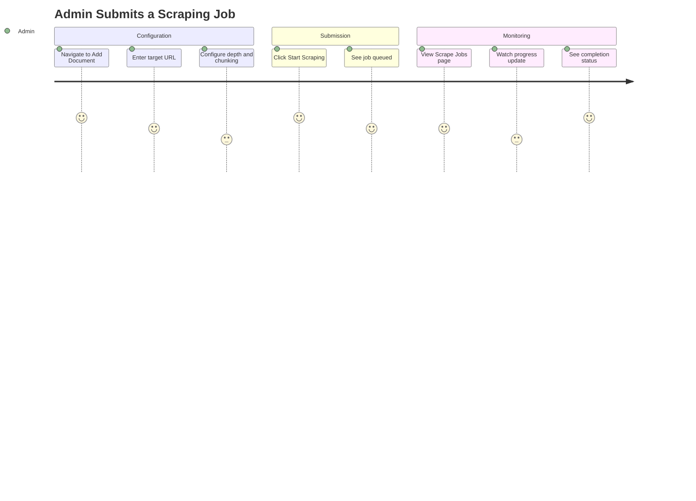
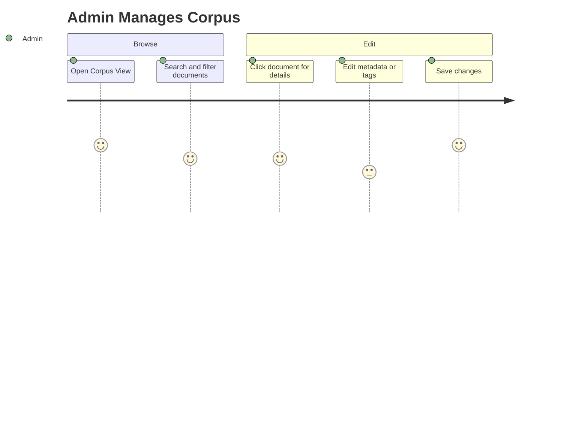

# data-management-frontend — User Journey Diagrams

> Auto-generated: 2026-05-12

## Submit a Scraping Job

```mermaid
journey
    title Admin Submits a Scraping Job
    section Configuration
        Navigate to Add Document: 5: Admin
        Enter target URL: 4: Admin
        Configure depth and chunking: 3: Admin
    section Submission
        Click Start Scraping: 5: Admin
        See job queued: 4: Admin
    section Monitoring
        View Scrape Jobs page: 4: Admin
        Watch progress update: 3: Admin
        See completion status: 5: Admin
```

## Browse and Edit Corpus

```mermaid
journey
    title Admin Manages Corpus
    section Browse
        Open Corpus View: 5: Admin
        Search and filter documents: 4: Admin
    section Edit
        Click document for details: 4: Admin
        Edit metadata or tags: 3: Admin
        Save changes: 5: Admin
```
