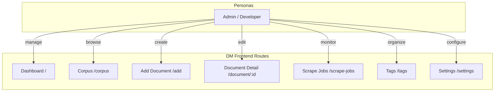

# data-management-frontend — User Personas Diagram

> Auto-generated: 2026-05-12

```mermaid
graph TB
    subgraph Personas
        Admin[Admin / Developer]
    end

    subgraph "DM Frontend Routes"
        Dash[Dashboard /]
        Corpus[Corpus /corpus]
        Add[Add Document /add]
        Detail[Document Detail /document/:id]
        Jobs[Scrape Jobs /scrape-jobs]
        Tags[Tags /tags]
        Settings[Settings /settings]
    end

    Admin -->|"manage"| Dash
    Admin -->|"browse"| Corpus
    Admin -->|"create"| Add
    Admin -->|"edit"| Detail
    Admin -->|"monitor"| Jobs
    Admin -->|"organize"| Tags
    Admin -->|"configure"| Settings
```
