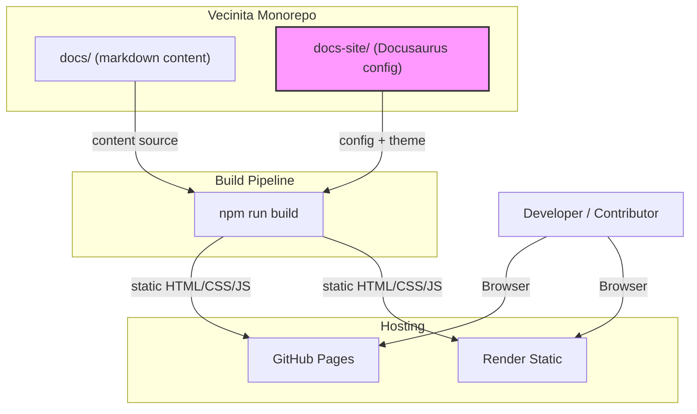
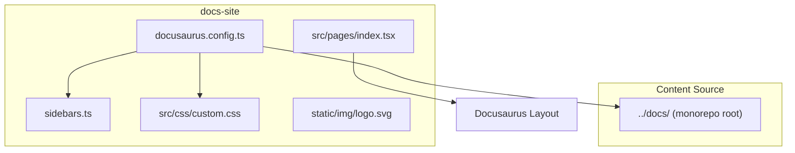

# docs-site — Architecture Diagram

> Auto-generated: 2026-05-12

## System Context

```mermaid
graph TB
    subgraph "Vecinita Monorepo"
        DocsDir["docs/ (markdown content)"]
        DocsSite["docs-site/ (Docusaurus config)"]
    end

    subgraph "Build Pipeline"
        Build["npm run build"]
    end

    subgraph "Hosting"
        GHP[GitHub Pages]
        Render[Render Static]
    end

    User[Developer / Contributor] -->|Browser| GHP
    User -->|Browser| Render
    DocsDir -->|"content source"| Build
    DocsSite -->|"config + theme"| Build
    Build -->|"static HTML/CSS/JS"| GHP
    Build -->|"static HTML/CSS/JS"| Render

    style DocsSite fill:#f9f,stroke:#333,stroke-width:2px
```

## Component View

```mermaid
graph TB
    subgraph "docs-site"
        Config[docusaurus.config.ts]
        Sidebar[sidebars.ts]
        HomePage[src/pages/index.tsx]
        CustomCSS[src/css/custom.css]
        Logo[static/img/logo.svg]
    end

    subgraph "Content Source"
        DocsDir["../docs/ (monorepo root)"]
    end

    Config --> Sidebar
    Config --> DocsDir
    Config --> CustomCSS
    HomePage --> Layout[Docusaurus Layout]
```
