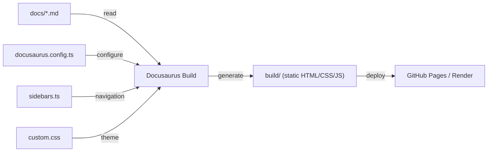

# docs-site — Data Flow Diagram

> Auto-generated: 2026-05-12

## Build-Time Data Flow

```mermaid
flowchart LR
    MD["docs/*.md"] -->|"read"| Docusaurus[Docusaurus Build]
    Config["docusaurus.config.ts"] -->|"configure"| Docusaurus
    Sidebar["sidebars.ts"] -->|"navigation"| Docusaurus
    CSS["custom.css"] -->|"theme"| Docusaurus
    Docusaurus -->|"generate"| HTML["build/ (static HTML/CSS/JS)"]
    HTML -->|"deploy"| Host[GitHub Pages / Render]
```

## Runtime Data Flow

```mermaid
flowchart LR
    User[Developer Browser] -->|"HTTP GET"| Host[Hosting Platform]
    Host -->|"Static HTML"| User
```
