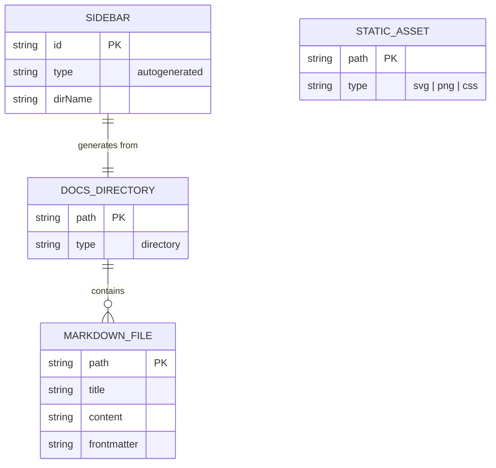

# docs-site — Data Model Diagram

> Auto-generated: 2026-05-12

The docs-site has no application data models. Its "data" is markdown content organized in a directory hierarchy.

```mermaid
erDiagram
    DOCS_DIRECTORY {
        string path PK
        string type "directory"
    }
    MARKDOWN_FILE {
        string path PK
        string title
        string content
        string frontmatter
    }
    SIDEBAR {
        string id PK
        string type "autogenerated"
        string dirName
    }
    STATIC_ASSET {
        string path PK
        string type "svg | png | css"
    }

    DOCS_DIRECTORY ||--o{ MARKDOWN_FILE : "contains"
    SIDEBAR ||--|| DOCS_DIRECTORY : "generates from"
```
